# 使用 CI/CD 和 Azure DevOps 的 Azure 机器学习培训管道

> 原文：<https://medium.com/analytics-vidhya/azure-machine-learning-training-pipeline-using-ci-cd-with-azure-devops-94fd934db107?source=collection_archive---------0----------------------->

# 检查代码时使用 Azure DevOps 触发 CI/CD

# 先决条件

*   Azure 帐户
*   Azure 机器学习
*   创建计算实例
*   创建一个计算集群作为 cpu 集群
*   选择标准 D 系列版本
*   创建训练文件来训练模型
*   创建一个管道文件来运行 as 管道

# 步伐

# 将训练文件创建为 train.py

*   创建一个目录。/train_src
*   创建一列火车. py
*   应该是 python 文件而不是笔记本

```
# Copyright (c) Microsoft. All rights reserved.
# Licensed under the MIT license.

import argparse
import os
import pandas as pd
import numpy as np
from azureml.core import Workspace, Dataset
from azureml.core import Dataset
from azureml.data.dataset_factory import DataType
from sklearn.preprocessing import LabelEncoder, OneHotEncoder

import sklearn as sk
import pandas as pd
# import seaborn as sn
# import matplotlib.pyplot as plt
from sklearn.preprocessing import StandardScaler
from sklearn.linear_model import LogisticRegression
from tqdm import tqdm
from sklearn import preprocessing
from sklearn.model_selection import train_test_split
from sklearn.linear_model import LogisticRegression
from sklearn.metrics import roc_auc_score
from sklearn.metrics import f1_score
from sklearn import metrics
from sklearn.svm import SVC
from sklearn.pipeline import make_pipeline
from sklearn.preprocessing import StandardScaler

print("In train.py")
print("As a data scientist, this is where I use my training code.")

parser = argparse.ArgumentParser("train")

parser.add_argument("--input_data", type=str, help="input data")
parser.add_argument("--output_train", type=str, help="output_train directory")

args = parser.parse_args()

print("Argument 1: %s" % args.input_data)
print("Argument 2: %s" % args.output_train)

if not (args.output_train is None):
    os.makedirs(args.output_train, exist_ok=True)
    print("%s created" % args.output_train)

web_path ='https://dprepdata.blob.core.windows.net/demo/Titanic.csv'
titanic_ds = Dataset.Tabular.from_delimited_files(path=web_path, set_column_types={'Survived': DataType.to_bool()})

# preview the first 3 rows of titanic_ds
#titanic_ds.take(3).to_pandas_dataframe()

#df = args.input_data.to_pandas_dataframe()

df = titanic_ds.to_pandas_dataframe()
df.head()

titanic_features = df.copy()
titanic_labels = titanic_features.pop('Survived')

df1 = pd.get_dummies(df)

y = df1['Survived']
X = df1
X = X.drop(columns=['Survived'])
X['Age'] = X['Age'].fillna(0)
X = X.dropna()

X_train, X_test, y_train, y_test = train_test_split(X, y, test_size=0.33, random_state=42)

LR = LogisticRegression(random_state=0, solver='lbfgs', multi_class='ovr').fit(X, y)
LR.predict(X.iloc[460:,:])
round(LR.score(X,y), 4)

y_pred = LR.predict(X_test)

print(metrics.classification_report(y_test, y_pred))

print("roc_auc_score: ", roc_auc_score(y_test, y_pred))
print("f1 score: ", f1_score(y_test, y_pred))

clf = make_pipeline(StandardScaler(), SVC(gamma='auto'))

clf.fit(X, y)

print(clf.predict(X_test))
```

# 创建管道代码

*   加载工作空间配置

```
import azureml.core
from azureml.core import Workspace, Datastore

ws = Workspace.from_config()
```

*   获取默认商店信息

```
# Default datastore 
def_data_store = ws.get_default_datastore()

# Get the blob storage associated with the workspace
def_blob_store = Datastore(ws, "workspaceblobstore")

# Get file storage associated with the workspace
def_file_store = Datastore(ws, "workspacefilestore")
```

*   创建计算集群

```
from azureml.core.compute import ComputeTarget, AmlCompute

compute_name = "cpu-cluster"
vm_size = "Standard_F16s_v2"
if compute_name in ws.compute_targets:
    compute_target = ws.compute_targets[compute_name]
    if compute_target and type(compute_target) is AmlCompute:
        print('Found compute target: ' + compute_name)
else:
    print('Creating a new compute target...')
    provisioning_config = AmlCompute.provisioning_configuration(vm_size=vm_size,  # Standard_F16s_v2 is CPU-enabled
                                                                min_nodes=0,
                                                                max_nodes=4)
    # create the compute target
    compute_target = ComputeTarget.create(
        ws, compute_name, provisioning_config)

    # Can poll for a minimum number of nodes and for a specific timeout.
    # If no min node count is provided it will use the scale settings for the cluster
    compute_target.wait_for_completion(
        show_output=True, min_node_count=None, timeout_in_minutes=20)

    # For a more detailed view of current cluster status, use the 'status' property
    print(compute_target.status.serialize())
```

*   加载包依赖项

```
from azureml.core.runconfig import RunConfiguration
from azureml.core.conda_dependencies import CondaDependencies
from azureml.core import Environment 

aml_run_config = RunConfiguration()
# `compute_target` as defined in "Azure Machine Learning compute" section above
aml_run_config.target = compute_target

USE_CURATED_ENV = True
if USE_CURATED_ENV :
    curated_environment = Environment.get(workspace=ws, name="AzureML-Tutorial")
    aml_run_config.environment = curated_environment
else:
    aml_run_config.environment.python.user_managed_dependencies = False

    # Add some packages relied on by data prep step
    aml_run_config.environment.python.conda_dependencies = CondaDependencies.create(
        conda_packages=['pandas','scikit-learn','seaborn','tqdm'], 
        pip_packages=['azureml-sdk', 'azureml-dataprep[fuse,pandas]','seaborn','tqdm'], 
        pin_sdk_version=False)
```

*   加载数据集

```
from azureml.core import Dataset
from azureml.data.dataset_factory import DataType

# create a TabularDataset from a delimited file behind a public web url and convert column "Survived" to boolean
web_path ='https://dprepdata.blob.core.windows.net/demo/Titanic.csv'
my_dataset = Dataset.Tabular.from_delimited_files(path=web_path, set_column_types={'Survived': DataType.to_bool()})
```

*   将数据集设置为输入

```
from azureml.pipeline.steps import PythonScriptStep
dataprep_source_dir = "./dataprep_src"
#entry_point = "prepare.py"
# `my_dataset` as defined above
ds_input = my_dataset.as_named_input('input1')
```

*   可选设置输出

```
from azureml.data import OutputFileDatasetConfig
from azureml.core import Workspace, Datastore

datastore = ws.get_default_datastore()

output_data1 = OutputFileDatasetConfig(destination = (datastore, 'outputdataset/{run-id}'))
output_data_dataset = output_data1.register_on_complete(name = 'titanic_output_data')
```

*   我只是创建一个单步

```
train_source_dir = "./train_src"
train_entry_point = "train.py"

training_results = OutputFileDatasetConfig(name = "training_results",
    destination = def_blob_store)

train_step = PythonScriptStep(
    script_name=train_entry_point,
    source_directory=train_source_dir,
    arguments=["--input_data", ds_input],
    compute_target=compute_target, # , "--training_results", training_results
    runconfig=aml_run_config,
    allow_reuse=True
)
```

*   设置管道配置并分配

```
# list of steps to run (`compare_step` definition not shown)
compare_models = [train_step]

from azureml.pipeline.core import Pipeline

# Build the pipeline
pipeline1 = Pipeline(workspace=ws, steps=train_step)
```

*   验证管道

```
pipeline1.validate()
print("Pipeline validation complete")
```

*   现在是提交管道的时候了
*   等待管道完成

```
from azureml.core import Experiment # Submit the pipeline to be run pipeline_run1 = Experiment(ws, 'Titanic_Pipeline_Notebook').submit(pipeline1) pipeline_run1.wait_for_completion()
```

*   现在让我们发布管道
*   每个发布者都将创建一个 REST 端点

```
published_pipeline1 = pipeline_run1.publish_pipeline( name="Published_Titanic_Pipeline_Notebook", description="Titanic_Pipeline_Notebook Published Pipeline Description", version="1.0")
```

*   我登录了 Azure ML Studio
*   转到左侧菜单中的管道

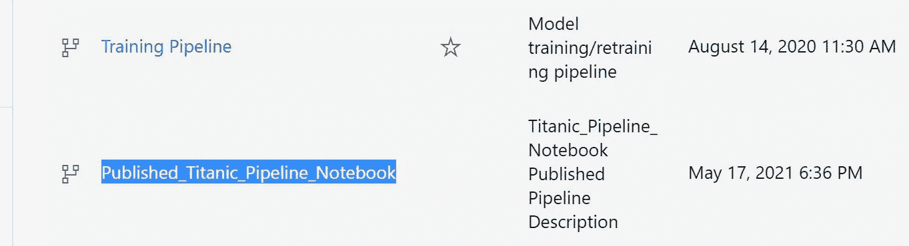

*   单击管道端点
*   应该看到一个管道—已发布 _ 泰坦尼克 _ 管道 _ 笔记本
*   单击提交，查看管线是否运行
*   现在转到 ADF 或 Synapse Integrate
*   创建新管道
*   名字是 AzureMLPipelinetest
*   拖放 Azure 机器学习服务(仅用于运行发布的管道)
*   使用服务主体帐户创建 Azure 机器学习的新来源

```
Make sure you have service principal created and permission provided
```

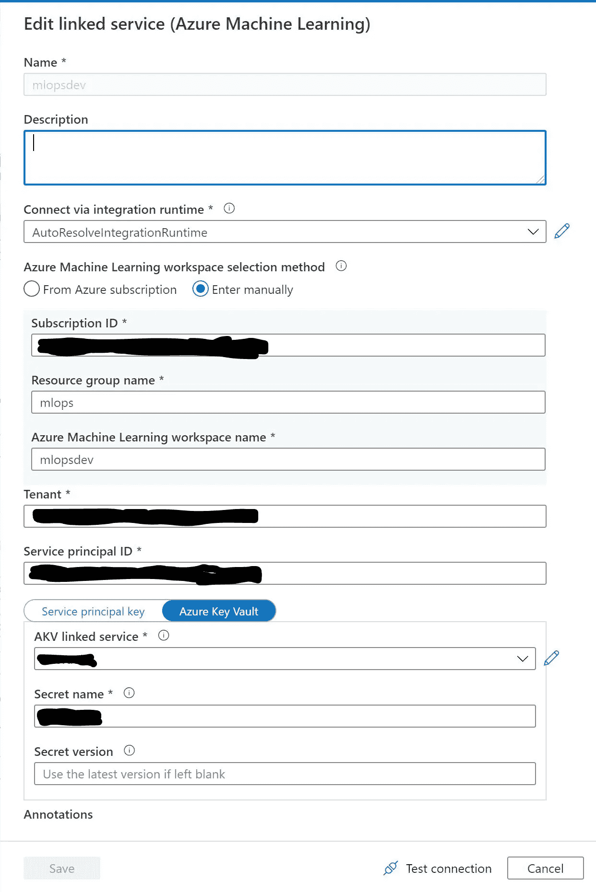

*   现在配置管道
*   您应该在下拉列表中看到这一点
*   选择第一个可用的管道 ID

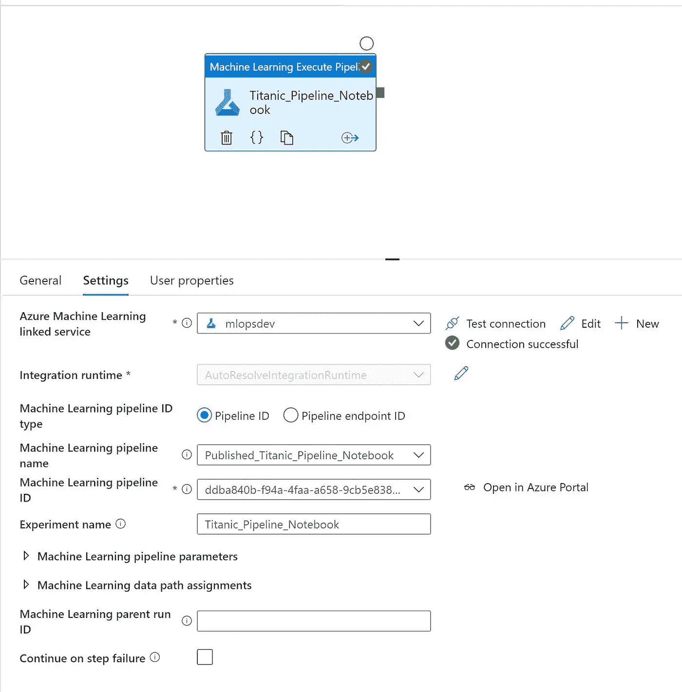

*   提交或保存更改，然后单击调试运行
*   等待调试完成，看看下面的图片

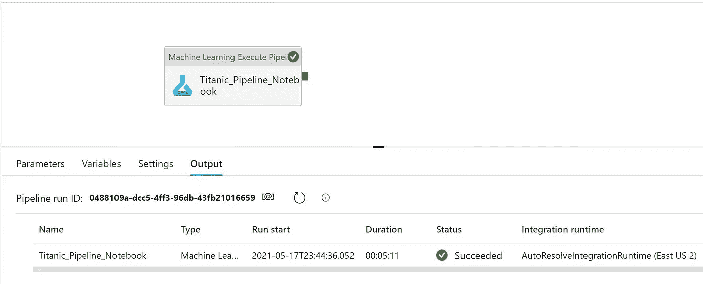

*   现在转到 AzureML studio
*   打开实验，点击泰坦尼克 _ 管道 _ 笔记本
*   应该看到最新的运行

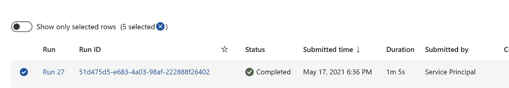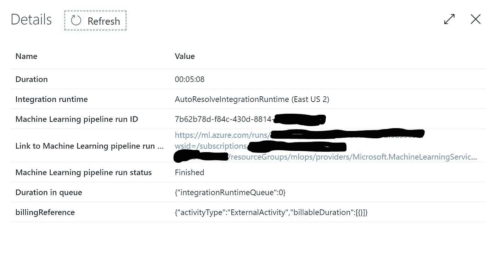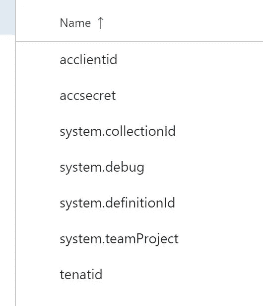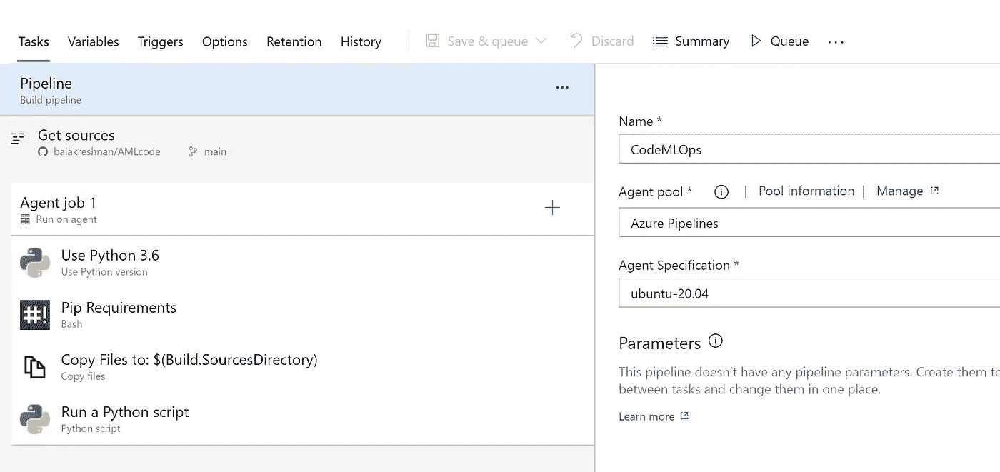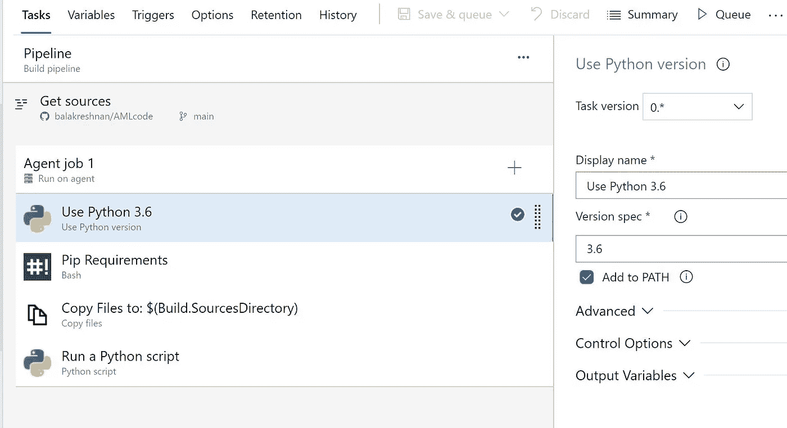

*   将版本设置为 3.6
*   配置 agend 依赖项
*   安装运行实验所需的所有库
*   path—automated ml/agent _ dependcy . sh

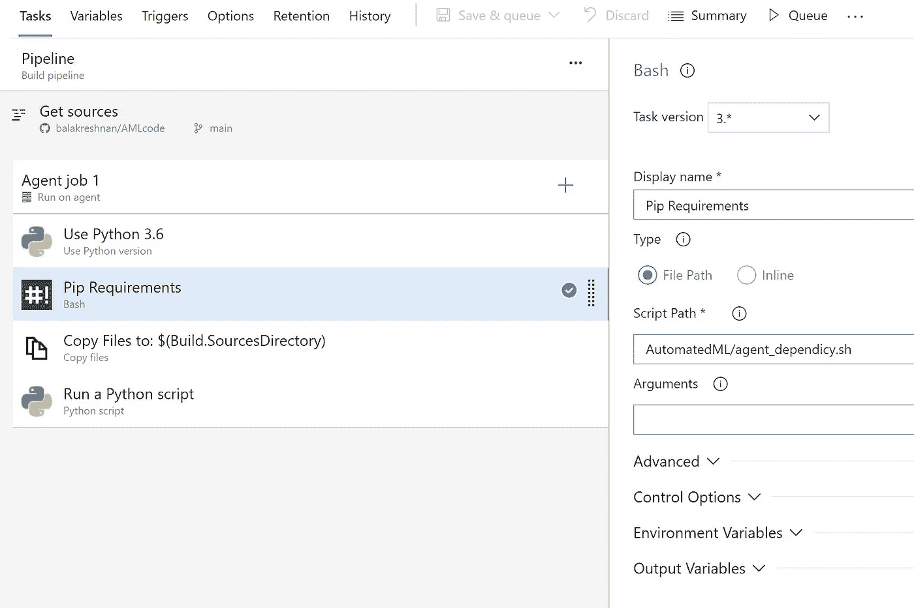

*   将数据复制到构建目录
*   目标:$(构建。SourcesDirectory)

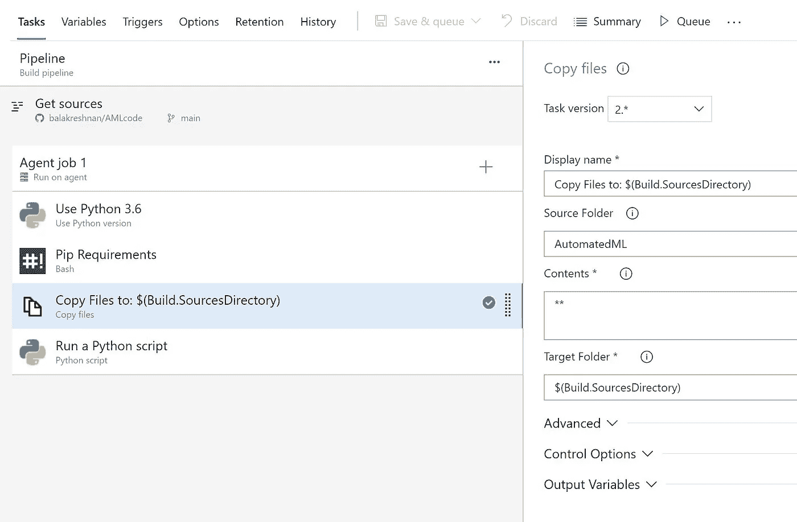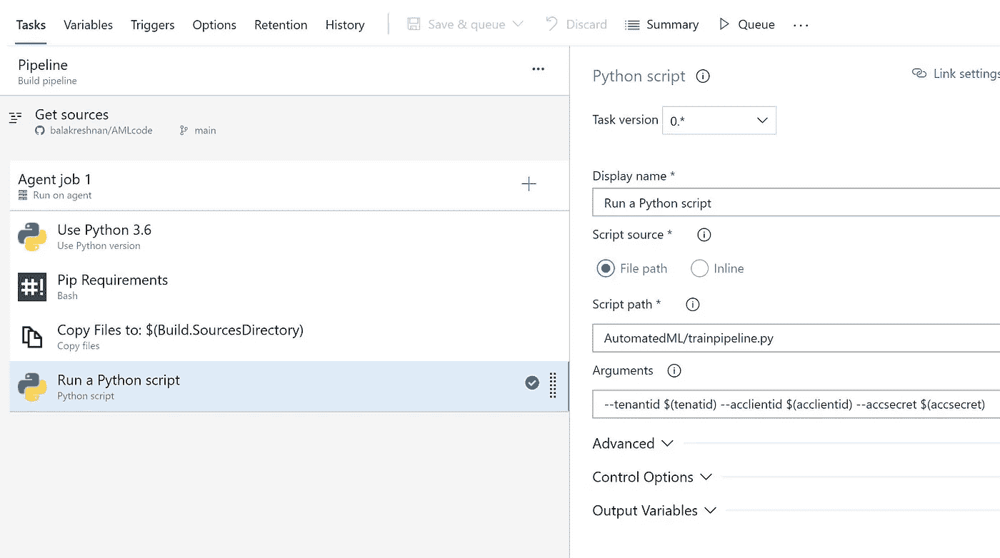

*   脚本路径:AutomatedML/trainpipeline.py
*   参数:—tenantid $(tenatid)-acclientid $(acclientid)-accsecret $(accsecret)
*   一旦一切就绪
*   单击保存并排队
*   等待实验运行完成

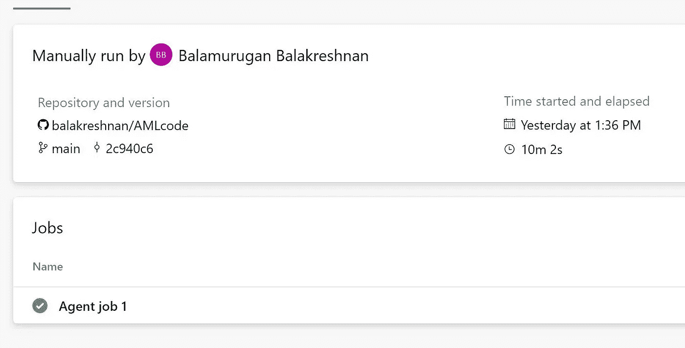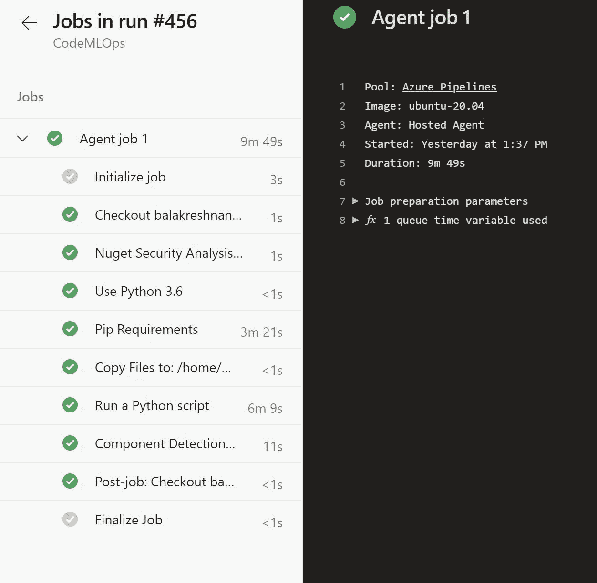

*最初发表于*[*【https://github.com】*](https://github.com/balakreshnan/Samples2021/blob/main/AzureML/trainaml.md)*。*