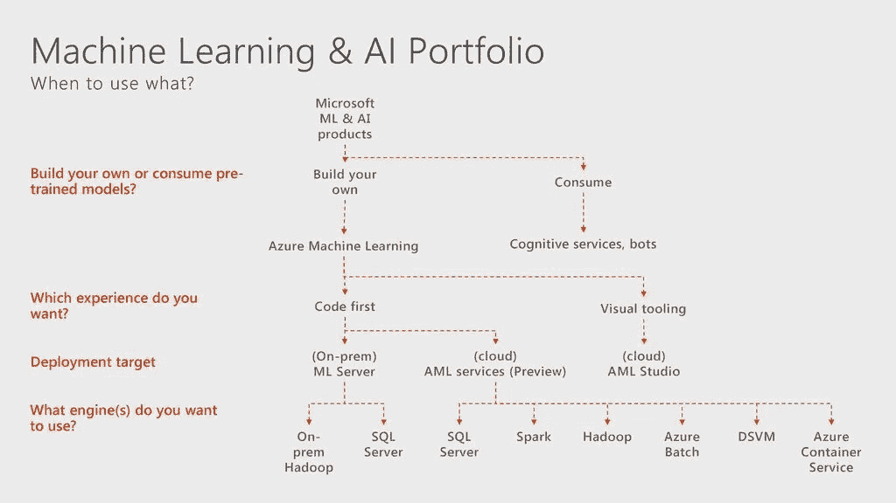

# Azure 机器学习:我学到了什么

> 原文：<https://medium.com/analytics-vidhya/azure-machine-learning-what-i-learned-59a2245b3484?source=collection_archive---------10----------------------->

Azure 机器学习工作室是进行数据科学实验的好地方。我们可以使用可视化设计器或来自 IDE 的代码(如 Visual Studio 代码)来创建实验，并使用带有 python 和 r 等编程语言的 Jupyter 笔记本。让我们先来看看任何数据科学项目的生命周期:

## 数据科学生命周期

数据科学有 3 个主要生命周期阶段:

*   数据获取和理解
*   建模
*   部署
*   模型监控

来源:课程研究

## Azure 机器学习和人工智能组合

根据流程要求，选项后面可以跟问题，**我们想使用什么以及如何使用？**下图非常清晰地展示了我们希望如何构建、开发、部署和使用该模型。

来源:微软

## **接下来，Azure 机器学习工作区:**

我们先来了解一下 Azure 机器学习工作区的一些概念。一旦我们在 Azure 中创建了 Azure ML studio，我们就可以浏览各种选项:

来源:微软

*   **数据存储**:数据存储用于安全地连接和提供抽象层给数据集使用的资源，如共享、数据库或存储。
*   **数据集**:实验中使用的数据集参考数据存储。
*   **计算**:在管理计算中，我们可以为运行 ML 实验创建不同的计算目标。
*   **资产**:资产用于创建、训练、部署和监控机器学习算法。
*   **作者**:本节用于创建笔记本，实验用 Auto ML en 可视化设计器

# 创建一个实验:

一旦创建了数据存储，并且数据存储引用了数据集，就可以将它导入到工作空间来创建实验。

虽然设计者没有提供代码解决方案，但在笔记本中工作有许多显著的优势。首先，过程是可重复的。其他用户可以打开您的笔记本，浏览、修改或重新运行任何单元格。他们可以复制笔记本或简单地保存并检查不同的版本。这使得协作比与设计师一起工作容易得多。此外，您可以用 markdown 单元格来注释代码。这使您可以添加评论、参考其他笔记本或网站，并征求其他用户的反馈或建议。最后，你可以用多种格式分享你的作品。

## 数据流

在设计器中，我们可以通过用户界面管理 azure 机器学习数据源，并建立与 azure blob 存储、SQL 数据库、网站中的文件的连接。然后，我们可以使用用户界面管理和注册数据集，然后我们可以看到管道中的所有数据集，只需将它们拖到工作区即可。

# 清理、规范化和转换原始数据

在这个过程中，我们获取输入数据并对其进行转换，以便我们用于机器学习实验的数据以最佳形式生成我们的模型。这个过程包括清理、规范化和转换我们的数据。

## 局外人

超出预期范围的异常值误差观测值，例如，每小时降雨量为 999，000 毫米。我们必须问的第一个问题是，观察值是测量误差还是数据误差，或者它是否是真正的异常值。

如果出现以下情况，我们可以将观察视为异常值:

*   在标准偏差之外
*   或者在四分位数范围之外。

# 训练、评估和改进机器学习模型

让我们看看机器学习算法的前景。不同类型的机器学习算法用于解决不同类型的问题。

Azure 机器学习算法备忘单帮助您从设计者那里为预测分析模型选择正确的算法。

Azure 机器学习有一个庞大的算法库，来自于*分类*、*推荐系统*、*聚类*、*异常检测*、*回归*和*文本分析*系列。每一个都是为了解决不同类型的机器学习问题。

这里下载小抄:[机器学习算法小抄](https://download.microsoft.com/download/3/5/b/35bb997f-a8c7-485d-8c56-19444dafd757/azure-machine-learning-algorithm-cheat-sheet-nov2019.pdf?WT.mc_id=docs-article-lazzeri)

# 部署和机器学习管道

有许多使用 Azure Machine Learning Studio 进行部署的场景。机器学习模型可以部署到 Azure 机器学习计算实例、Azure kubernetes 服务和 Azure 容器实例，并部署支持 GPU 的模型。

## (向设计师)注册模型

让我们在设计器中打开这个项目，然后向下滚动到**火车模型**模块，点击输出和日志。我可以在数据输出下看到训练好的模型。右边的按钮允许我**注册**这个型号。

## 准备部署

为部署准备 Azure 机器学习模型有四个步骤。

*   首先，定义推理环境。推理环境定义了如何设置包含 Python 模型的 web 服务。
*   接下来，定义评分代码。评分代码或入口脚本接收提交给已部署的 web 服务的数据，并在自动化 ML 实验中再次将其传递给模型。
*   Net 步骤是定义推理配置。推理配置将所有内容放在一起。它定义了这些环境配置、入口脚本和运行模型即服务所需的任何其他组件。
*   准备部署模型的最后一步是对模型进行概要分析，测试模型的服务，并返回诸如 CPU 使用、内存使用和响应等信息。

## 部署模型

使用 Azure Machine Learning Studio 部署模型并选择最新的运行实验，可以在最佳模型摘要中选择模型。部署选项为我们提供了在 Azure Kubernetes 集群或容器实例上部署模型的选项。

在部署模型时，我们可以设置复选框来启用 Application Insights 数据收集诊断

一旦部署了模型，它就可以作为 Web 服务使用，并且可以通过 Azure 机器学习测试服务或 Api 测试工具使用。

在这篇文章中，我已经尽力将 Azure 机器学习的每个主题的信息保持在很高的水平上。在接下来的文章中，我将尝试涵盖关于笔记本、AutoML 和机器学习内部的深入场景。

## 重要参考:

*   [https://docs.microsoft.com/en-us/azure/machine-learning/](https://docs.microsoft.com/en-us/azure/machine-learning/)
*   [https://docs . Microsoft . com/nl-nl/azure/machine-learning/overview-what-is-azure-ml](https://docs.microsoft.com/nl-nl/azure/machine-learning/overview-what-is-azure-ml)

在那之前，继续学习，继续分享。