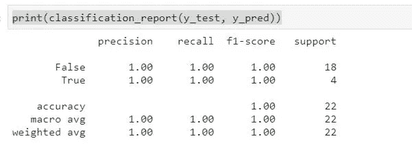
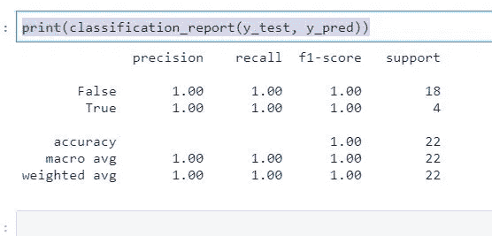

# Azure ML —使用 tsfresh 的时间序列

> 原文：<https://medium.com/analytics-vidhya/azure-ml-timeseries-using-tsfresh-206d5f51105d?source=collection_archive---------12----------------------->

# 如何在 Azure 机器学习中运行 tsfresh

# 先决条件

*   Azure 帐户
*   Azure 机器学习服务

# 如何

*   登录 ml.azure.com
*   选择要使用的工作空间
*   为我的示例创建一个计算集群，我使用 DS14_v2 一个节点
*   一旦登录到 Jupyter 实验室
*   创建一个名为 requirements.txt 的新文本文件
*   复制下面的内容

```
requests>=2.9.1
numpy>=1.15.1
pandas>=0.25.0
scipy>=1.2.0
statsmodels>=0.9.0
patsy>=0.4.1
scikit-learn>=0.22.0
tqdm>=4.10.0
dask[dataframe]>=2.9.0
distributed>=2.11.0
matrixprofile>=1.1.10<2.0.0
stumpy>=1.7.2
```

*   现在创建一个新的 ML 笔记本
*   称之为 install.ipynb
*   本笔记是安装要求和 t 刷新
*   运行此命令以安装要求

```
pip install -r requirements.txt
```

*   现在安装 tsfresh

```
pip install tsfresh
```

*   现在创建一个新笔记本，用 sklearn 测试 tsfresh
*   调用笔记本 sklearn.ipynb
*   开始笔记本编码
*   样品也可在此获得—[https://github.com/blue-yonder/tsfresh](https://github.com/blue-yonder/tsfresh)

```
import pandas as pd
from sklearn.pipeline import Pipeline
from sklearn.model_selection import train_test_split
from sklearn.ensemble import RandomForestClassifier
from sklearn.metrics import classification_report

from tsfresh.examples import load_robot_execution_failures
from tsfresh.transformers import RelevantFeatureAugmenter
from tsfresh.utilities.dataframe_functions import impute
```

*   加载样本数据集

```
from tsfresh.examples.robot_execution_failures import download_robot_execution_failures
download_robot_execution_failures() 
df_ts, y = load_robot_execution_failures()
```

*   分割数据集

```
X = pd.DataFrame(index=y.index)

# Split data into train and test set
X_train, X_test, y_train, y_test = train_test_split(X, y)
```

*   设置 sklearn 管道

```
ppl = Pipeline([
        ('augmenter', RelevantFeatureAugmenter(column_id='id', column_sort='time')),
        ('classifier', RandomForestClassifier())
      ])
ppl.set_params(augmenter__timeseries_container=df_ts);
```

*   管道安装
*   这是训练发生的地方

```
ppl.fit(X_train, y_train)
```

*   现在预测模型

```
ppl.fit(X_train, y_train)
```

*   打印输出

```
y_pred = ppl.predict(X_test)print(classification_report(y_test, y_pred))
```



*   显示功能:

```
ppl.named_steps["augmenter"].feature_selector.relevant_featuresdf_ts_train = df_ts[df_ts["id"].isin(y_train.index)]
df_ts_test = df_ts[df_ts["id"].isin(y_test.index)]
```

*   训练模型

```
ppl.set_params(augmenter__timeseries_container=df_ts_train);
ppl.fit(X_train, y_train);
```

*   现在保存 pickle 文件

```
import pickle
with open("pipeline.pkl", "wb") as f:
    pickle.dump(ppl, f)
```

*   使用 tsfresh 功能进行预测

```
ppl.set_params(augmenter__timeseries_container=df_ts_test);
y_pred = ppl.predict(X_test)
```

*   打印输出

```
print(classification_report(y_test, y_pred))
```



*最初发表于*[T5【https://github.com】](https://github.com/balakreshnan/Samples2021/blob/main/AzureML/tsfresh/sklearnsample.md)*。*