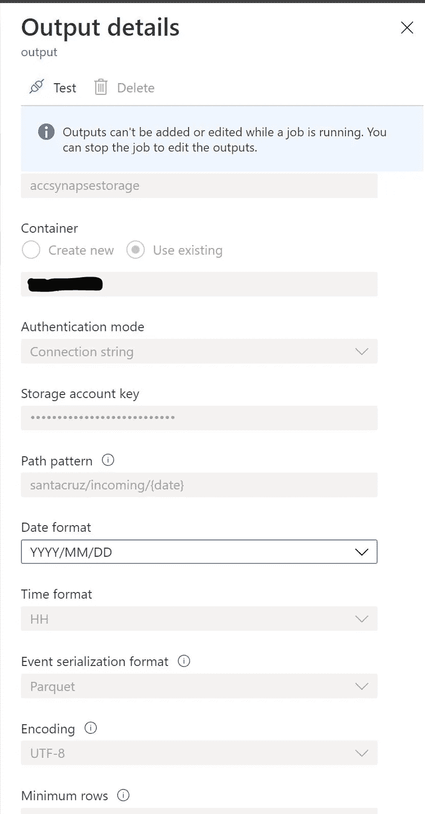

# 带有 Azure Synapse 分析的 Azure percept(智能边缘)

> 原文：<https://medium.com/analytics-vidhya/azure-percept-intelligent-edge-with-azure-synapse-analytics-7d2bb2805445?source=collection_archive---------9----------------------->

# 如何将 Edge AI 与 Azure Synapse Analytics 集成

# 用例

*   人工智能可以在 Edge 中用于评分或检测对象
*   在云中存储检测到的内容及其结果
*   帮助重新培训和帮助数据科学家微调模型
*   帮助报告模型的结果
*   通过分析从智能边缘创造价值

# 体系结构


# 建筑说明

*   将 Azure Percept 用作 AI @ Edge 设备
*   设备将部署模块来检测对象
*   使用情况可能因具体使用案例而异
*   我正在使用 Azure 流分析，它可以在 Edge 和 cloud 中使用
*   流分析将进行输入解析
*   将数据存储在 CSV 或 Parquet 中
*   将数据存储在 Synapse workspace 中—默认存储
*   确保数据湖的唯一真实来源
*   流分析中的代码，以获取模型评分数据

# 设置 Azure 资源

*   创建资源组
*   选择你所选择的地区
*   使用 S1 基础版创建 Azure 物联网中心
*   在云中创建流分析作业
*   创建 Azure Synapse 工作区帐户
*   遵循 azure 文档中的说明。
*   确保您还设置了超级商务智能帐户

# 发展

*   转到流分析，并将输入配置为物联网中心
*   将输出配置为 Azure synapse workspace ADLS 第二代存储
*   如下所示编写查询。
*   测试逻辑并开始流分析

```
Select width, height, position_x, position_y, label, Confidence, timestamp, 
EventEnqueuedUtcTime, IoTHub.ConnectionDeviceId, IoTHub.EnqueuedTime 
into output 
from input
```

*   模型输出标签及其边界框
*   信心也是用来做决定的



*   验证文件是否已生成


*   下面是一个来自 Percept output 的 JSON 数据输出示例

```
{
    "width": "516",
    "height": "260",
    "position_x": "282",
    "position_y": "312",
    "label": "laptop",
    "confidence": "0.549805",
    "timestamp": "1615126558907404099",
    "EventProcessedUtcTime": "2021-03-07T14:17:28.5049562Z",
    "PartitionId": 2,
    "EventEnqueuedUtcTime": "2021-03-07T14:15:58.2040000Z",
    "IoTHub": {
      "MessageId": "MSG_ID",
      "CorrelationId": "CORE_ID",
      "ConnectionDeviceId": "aicamera1",
      "ConnectionDeviceGenerationId": "637504148641820944",
      "EnqueuedTime": "2021-03-07T14:15:58.2150000Z",
      "StreamId": null
    }
}
```

*   现在登录 Azure Synapse Studio
*   创建一个无服务器的 sql 查询来访问数据
*   下面是一个示例查询

```
SELECT
    TOP 100 *
FROM
    OPENROWSET(
        BULK 'https://storageaccount.dfs.core.windows.net/containername/santacruz/incoming/*/*/*/*.parquet',
        FORMAT='PARQUET'
    ) AS [result]
```

*   从上方输出


*   现在，让我们将相同的数据加载到 spark 等大数据平台中
*   火花允许我们进一步加工
*   数据只存在于一个地方
*   我们不会移动数据
*   创建笔记本
*   以下是加载数据框的代码

```
%%pyspark
df = spark.read.load('abfss://containername@storageaccount.dfs.core.windows.net/santacruz/incoming/*/*/*/*.parquet', format='parquet')
display(df.limit(10))
```

*   这是输出


*   从这里我们可以得到任何类型的洞察力
*   现在让我们构建一个简单的报告
*   连接到电源 bi
*   转到 synapse studio workspace 并获取要连接的无服务器端点


*   提供视图
*   在提供视图之前，在 sql 脚本中创建新视图

```
create VIEW percept1 AS 
SELECT
    *
FROM
    OPENROWSET(
        BULK 'https://storageaccountname.dfs.core.windows.net/containername/santacruz/incoming/*/*/*/*.parquet',
        FORMAT='PARQUET'
    ) AS [result]
```

*   然后提供查询

```
Select * from percept1;
```


*   现在应该可以看到数据了


*   加载数据
*   创建一个新报告，拖动几列来创建一个报告


*   根据标签检测到的对象数量


原文—[azure percept/synapseint . MD at main balakreshnan/azure percept(github.com)](https://github.com/balakreshnan/AzurePercept/blob/main/Analytics/synapseint.md)