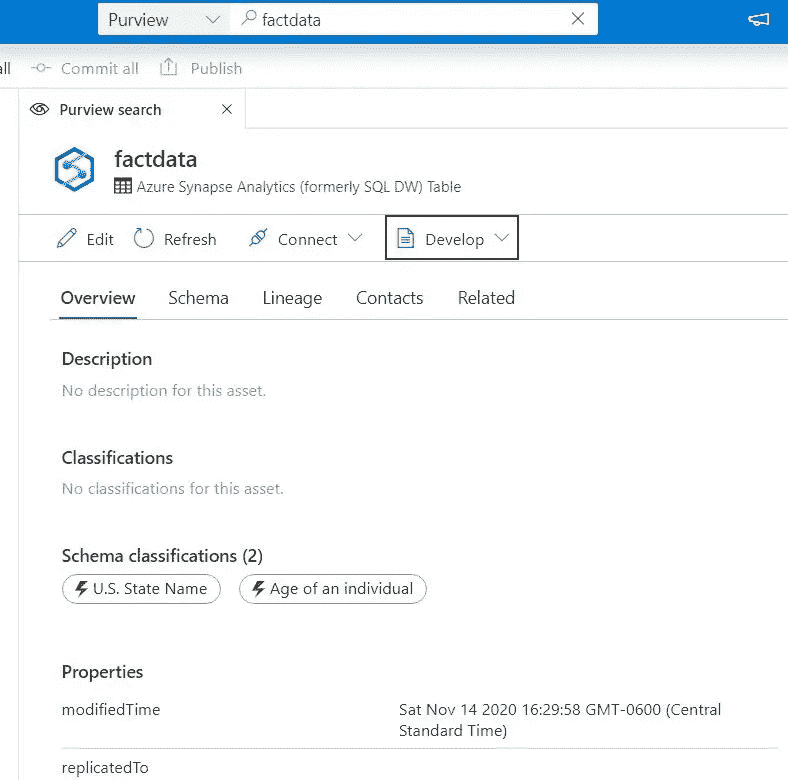
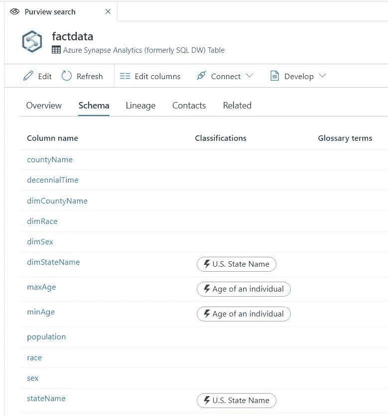
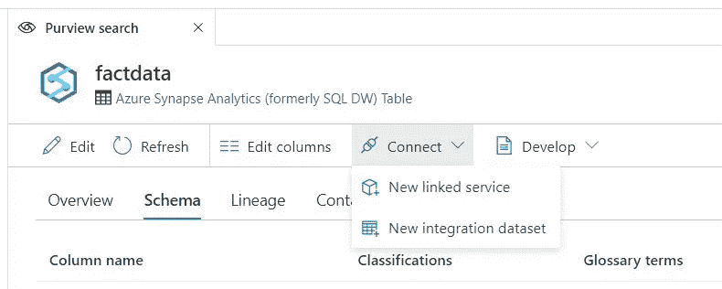
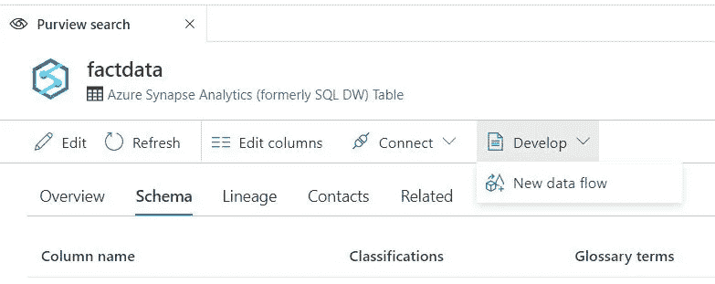

# Azure Synapse Analytics 中的 Azure 权限搜索

> 原文：<https://medium.com/analytics-vidhya/azure-purview-search-inside-azure-synapse-analytics-c7e2a15196b2?source=collection_archive---------32----------------------->

# 在 Azure synapse studio 中搜索目录并构建数据管道

# 用例

*   寻找资产的能力
*   能够创建 ETL/ELT 或数据流数据处理
*   目录综合数据处理

# 先决条件

*   Azure 帐户
*   Azure Synapse 分析帐户
*   蔚蓝视界
*   为 synapse analytics studio 配置扫描
*   向参与者提供对 synapse studio 权限管理身份的访问
*   将 Synapse studio 连接到权限

# 步伐

*   首先，将 synapse studio 连接到 azure 范围
*   [https://docs . Microsoft . com/en-us/azure/synapse-analytics/catalog-and-governance/quick start-connect-azure-without #:~:text = % 20 connect % 20 an % 20 azure % 20 without % 20 account % 20 account % 20 in % 20 tab % 20 azure % 20 without % 20 account。% 20 分钟后](https://docs.microsoft.com/en-us/azure/synapse-analytics/catalog-and-governance/quickstart-connect-azure-purview#:~:text=%20Connect%20an%20Azure%20Purview%20Account%20%201,in%20the%20tab%20Azure%20Purview%20account.%20More)
*   登录 Synapse studio
*   转到数据
*   在顶部搜索栏中搜索您的资产

*   现在您还可以看到模式和沿袭(如果有的话)
*   还显示了分类

*   从这里，我们可以创建一个集成数据处理管道或链接数据集

*   现在我们可以创建一个数据流
*   数据流允许我们对数据进行转换

*   搜索数据湖中的可用内容，然后检查模式，并从一个用户界面创建 ETL/ELT 或数据工程，这真是太棒了

分享您的意见和建议

【synapse analytics/purviewint . MD at master balakreshnan/synapse analytics(github.com)