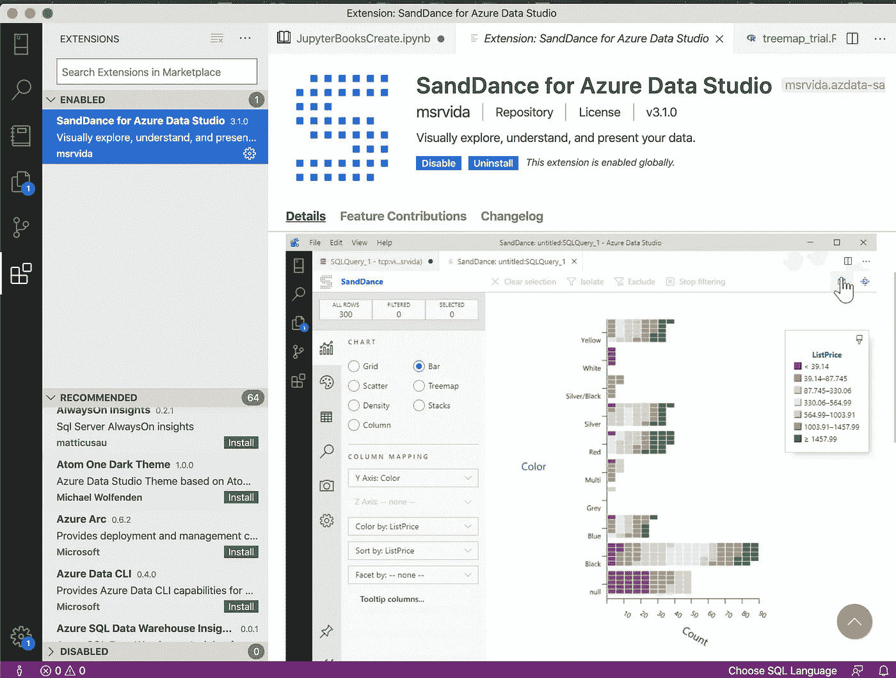

# 微软 SandDance:数据可视化工具的近距离观察

> 原文：<https://medium.com/analytics-vidhya/azure-sanddance-a-closer-look-at-a-data-visualization-tool-5de76206900d?source=collection_archive---------4----------------------->

微软的开源数据可视化工具扩展了其云服务的功能，尤其是 Azure Data Studio

我写了一篇 Azure Data Studio [post](/analytics-vidhya/a-quick-look-at-azure-data-studio-7b34783c7b8a) 的文章，介绍了一些用 IDE 体验的便利来处理数据探索的特性。但是，有时您需要数据可视化来查看数据如何最好地在一个…