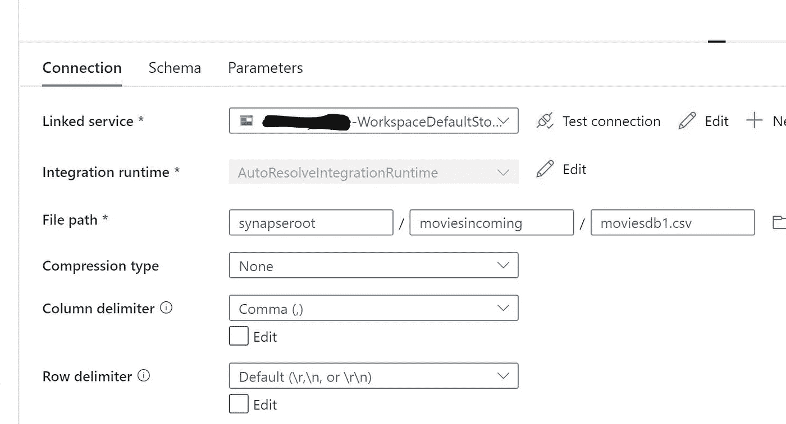

# 用于 delta CRUD 的 Azure 权限中的 Azure Synapse analytics 数据流数据处理沿袭

> 原文：<https://medium.com/analytics-vidhya/azure-synapse-analytics-data-flow-data-processing-lineage-in-azure-purview-for-delta-crud-231fe1681453?source=collection_archive---------2----------------------->

# 使用 delta CRUD 操作的 Azure 权限中的数据流数据处理沿袭

# 注意

# 先决条件

*   Azure 帐户
*   Azure synapse 分析工作区
*   蔚蓝视界
*   把这两者联系起来
*   为 synapse analytics 托管身份提供权限贡献者
*   Azure 存储
*   将此报告中的 movidedb1.csv 从数据文件夹上传到名为 movidedincoming 的文件夹
*   创建一个名为 moviesoutput 的新文件夹

# 数据流活动

*   登录 Azure synapse analytics 工作区或工作室
*   首先上传数据


*   转到开发和创建数据流
*   创建新的数据流
*   这是整个流程


*   将源文件作为 csv 文件



*   现在，我们将选择所需的列


*   接下来，我们将使用 delta 进行 CRUD 操作
*   因此，我们将从数据集中筛选出几年


```
YEAR==1960 || YEAR==1988 || YEAR==1950
```

*   现在我们将应用一些条件并导出列


*   用于评级

```
iif(YEAR==1998,1, toInteger(Rating))
```

*   多年来

```
iif(YEAR==1960, 2021, toInteger(YEAR))
```

*   对于电影

```
iif(YEAR==1998,toInteger(movies)+1000, toInteger(movies))
```

*   现在将 Alter row 用于 delta 的 CRUD 操作


*   应用如上图所示的公式

```
YEAR==2021
YEAR==1998
YEAR==1950
```

*   现在通过插入、更新和删除下沉到增量位置


*   配置设置


*   选择 YEAR 和 movies 作为执行 CRUD 操作的关键字
*   现在创建一个新集成管道
*   拖放数据流活动，并选择上面创建的数据流


*   现在在调试模式下运行管道
*   给几分钟时间启动调试集群并运行上面的数据处理
*   查看输出
*   在发展中


*   等到它完成


*   检查输出


*   检查接收器活动
*   检查接收器活动


*   现在检查 delta 输出


*   现在转到无服务器 sql 查询和增量表，查看输出并进行验证
*   我将检查 2021 年，因为它在实际数据中不存在

```
SELECT TOP 10 *
FROM OPENROWSET(
    BULK 'https://storagename.dfs.core.windows.net/synapseroot/moviesoutgoing1/',
    FORMAT = 'delta') as rows Where YEAR = 2021;
```


*   在工作区内，如果您有链接的权限，则转到搜索栏


*   选择数据流活动
*   点击血统


# 蔚蓝视界

*   登录权限
*   转到浏览资产
*   选择 Azure synapse 分析
*   选择您的实例名称


*   现在选择带有数据流的管道


*最初发表于*[*【https://github.com】*](https://github.com/balakreshnan/Samples2021/blob/main/Synapseworkspace/dataflowlineage.md)*。*