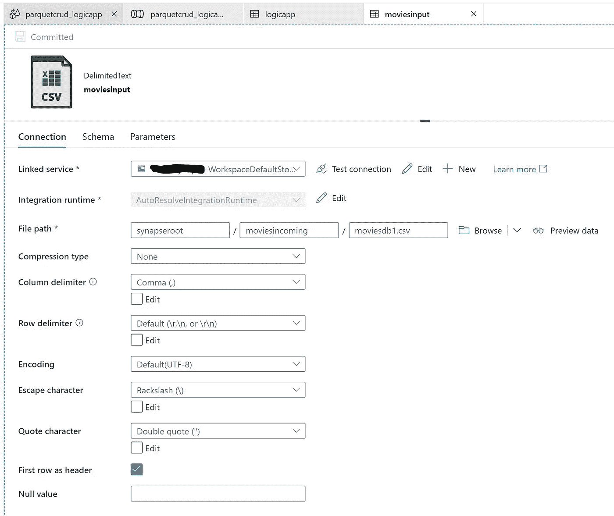

# Azure Synapse analytics 数据流数据处理，将 REST 作为接收器

> 原文：<https://medium.com/analytics-vidhya/azure-synapse-analytics-data-flow-data-processing-with-rest-as-sink-e8d6884fb35e?source=collection_archive---------5----------------------->

# 作为 REST 的数据流数据处理接收器

# 注意

*   本文将展示这一功能

# 先决条件

*   Azure 帐户
*   Azure synapse 分析工作区
*   Azure logic 应用程序
*   Azure 存储
*   将此报告中的 movidedb1.csv 从数据文件夹上传到名为 movidedincoming 的文件夹
*   创建一个名为 moviesoutput 的新文件夹

# 创建逻辑应用程序流

*   创建新的逻辑应用程序
*   创建工作流


*   创建 http 触发器
*   选择何时接收 Http 请求
*   首先删除 blob
*   将请求正文保存为文件

```
containername: output
filename: output.json
```

# 数据流活动

*   登录 Azure synapse analytics 工作区或工作室
*   首先上传数据


*   将源创建为 moviesdb.csv 文件


*   创建一个新的链接服务作为 csv，如下所示



*   立即选择


*   现在拖动过滤器


```
YEAR==1960 || YEAR==1988 || YEAR==1950
```

*   派生列—创建新列

```
Rating = iif(YEAR==1998,1, toInteger(Rating))
YEAR = iif(YEAR==1960, 2021, toInteger(YEAR))
movies = iif(YEAR==1998,toInteger(movies)+1000, toInteger(movies))
```


*   现在引入 alter activity 来创建 CRUD


```
insert if YEAR==2021
update if YEAR==1998
delete if YEAR==1950
```

*   现在下沉到一个休息连接器


*   水槽配置


*   现在配置 REST 设置


*   创建管道并调用数据流，然后单击“调试”


*   转到指标


*   检查逻辑应用程序日志


*   下面是逻辑应用程序流简单的一个


*   转到存储并查看输出

```
{"movies":72104,"Title":"Balance","genresgenregenre":"Animation|Drama|Mystery|Sci-Fi|Thriller","YEAR":1988,"Rating":4}
```

原文—[samples 2021/data flow rest . MD at main balakreshnan/samples 2021(github.com)](https://github.com/balakreshnan/Samples2021/blob/main/Synapseworkspace/dataflowREST.md)