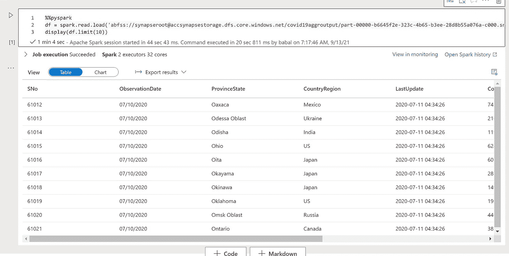

# Azure Synapse Analytics —使用 Azure 机器学习的自动化 ML 的端到端

> 原文：<https://medium.com/analytics-vidhya/azure-synapse-analytics-end-to-end-for-automated-ml-using-azure-machine-learning-aa05e0f1df65?source=collection_archive---------1----------------------->

## 使用 Azure Synapse Analytics Workspace 移动数据、处理数据、训练模型

# 为数据和数据科学生命周期管理提供统一的平台，以提高工作效率

# 注意

*   本文将展示这一功能

# 先决条件

*   Azure 帐户
*   Azure synapse 分析工作区
*   Azure 机器学习工作区
*   Azure SQL 数据库
*   Azure 存储
*   从 kaggel 下载 Covid19 数据，并作为外部源模拟数据导入 Azure SQL
*   创建一个表作为 dbo.covid19data 并上传数据


*   上述架构流程有 3 个组成部分
*   复制活动以从外部源移动数据，并将其带到原始或输入区域
*   接下来是数据流活动，通过拖放 ETL/ELT 来转换或处理数据并最终完成
*   使用 spark 运行机器学习模型来运行自动化 ML sdk 的笔记本电脑
*   我们使用回归来预测 covid 19 导致的死亡
*   登录 Azure Synapse 工作区
*   创建管道/集成
*   拖放复制活动
*   对于源，选择上面的 SQL server —(需要创建链接服务)


*   接下来创建一个数据流来处理数据
*   对于示例，我使用 delta 来简化 CDC
*   创建具有复制活动目标的来源


*   我们可以恢复复制活动目的地链接服务本身
*   现在拖动选择


*   选择所有列
*   启用调试并查看结果。这个数据集是开源的，所以没有 PII


*   选择列
*   查看调试以验证数据已处理


*   现在谈谈机器学习
*   创建笔记本
*   访问上述汇数据集作为建模的输入
*   创建笔记本

# 密码

*   加载数据

```
%%pyspark
df = spark.read.load('abfss://container@storageaccount.dfs.core.windows.net/covid19aggroutput/*.parquet', format='parquet')
display(df.limit(10))
```



*   打印模式

```
df.printSchema
```

*   需要进口

```
from pyspark.sql.functions import *
from pyspark.sql import *
```

*   将日期转换为日期数据类型

```
df1 = df.withColumn("Date", to_date("ObservationDate", "MM/dd/yyyy")) 
display(df1)
```


*   创建新列

```
df2 = df1.withColumn("year", year(col("Date"))).withColumn("month", month(col("Date"))).withColumn("day", dayofmonth(col("Date")))
```


*   接下来是导入 ML 库

```
import azureml.corefrom azureml.core import Experiment, Workspace, Dataset, Datastore
from azureml.train.automl import AutoMLConfig
from azureml.data.dataset_factory import TabularDatasetFactory
```

*   配置 Azure 机器学习工作区
*   设置配置以访问自动机器学习

```
subscription_id = "xxxxxxxx"
resource_group = "xxxxxx"
workspace_name = "workspacename"
experiment_name = "nameofsynapse-covid19aggr-20210913"ws = Workspace(subscription_id = subscription_id, resource_group = resource_group, workspace_name = workspace_name)
experiment = Experiment(ws, experiment_name)
```

*   仅获取必要的列

```
dffinal = df2[["year","month", "day", "Confirmed", "Deaths", "Recovered"]]
```

*   注册数据存储

```
datastore = Datastore.get_default(ws)
dataset = TabularDatasetFactory.register_spark_dataframe(df, datastore, name = experiment_name + "-dataset")
```

*   配置自动化 ml

```
automl_config = AutoMLConfig(spark_context = sc,
                             task = "regression",
                             training_data = dataset,
                             label_column_name = "Deaths",
                             primary_metric = "spearman_correlation",
                             experiment_timeout_hours = 1,
                             max_concurrent_iterations = 4,
                             enable_onnx_compatible_models = False)
```

*   运行实验

```
run = experiment.submit(automl_config)
```

*   等待完成

```
run.wait_for_completion(show_output=False)
```

*   显示输出

```
displayHTML("<a href={} target='_blank'>Your experiment in Azure Machine Learning portal: {}</a>".format(run.get_portal_url(), run.id))
```

*   运行实验并记录输出

```
run.wait_for_completion()# Install required dependency
import pip
pip.main(["install", "azure-storage-blob==12.5.0"])import mlflow# Get best model from automl run
best_run, non_onnx_model = run.get_output()artifact_path = experiment_name + "_artifact"mlflow.set_tracking_uri(ws.get_mlflow_tracking_uri())
mlflow.set_experiment(experiment_name)with mlflow.start_run() as run:
    # Save the model to the outputs directory for capture
    mlflow.sklearn.log_model(non_onnx_model, artifact_path) # Register the model to AML model registry
    mlflow.register_model("runs:/" + run.info.run_id + "/" + artifact_path, "bbaccsynapse-covid19-20201217032226-Best")
```

*   保存管道并运行调试


*最初发表于*[*【https://github.com】*](https://github.com/balakreshnan/Samples2021/blob/main/Synapseworkspace/e2eautoml.md)*。*