# Azure Synapse Analytics —使用 Synapse Spark 进行端到端培训

> 原文：<https://medium.com/analytics-vidhya/azure-synapse-analytics-end-to-end-with-synapse-spark-for-training-b4241d163bd8?source=collection_archive---------1----------------------->

# 使用 Azure Synapse Analytics Workspace 移动数据、处理数据、训练模型

# 为数据和数据科学生命周期管理提供统一的平台，以提高工作效率

# 注意

*   本文将展示这一功能

# 先决条件

*   Azure 帐户
*   Azure synapse 分析工作区
*   Azure SQL 数据库
*   Azure 存储
*   从 kaggel 下载 Covid19 数据，并作为外部源模拟数据导入 Azure SQL
*   创建一个表作为 dbo.covid19data 并上传数据

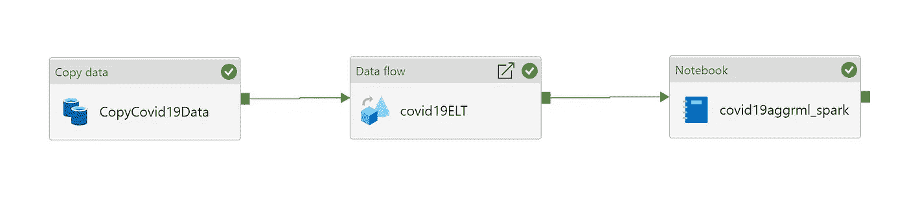

*   上述架构流程有 3 个组成部分
*   复制活动以从外部源移动数据，并将其带到原始或输入区域
*   接下来是数据流活动，通过拖放 ETL/ELT 来转换或处理数据并最终完成
*   使用 spark 运行机器学习模型来运行自动化 ML sdk 的笔记本电脑
*   我们使用回归来预测 covid 19 导致的死亡
*   登录 Azure Synapse 工作区
*   创建管道/集成
*   拖放复制活动
*   对于源，选择上面的 SQL server —(需要创建链接服务)

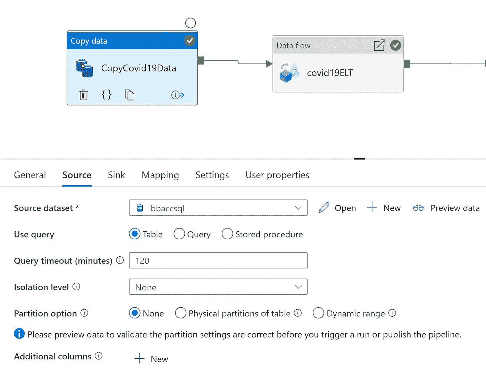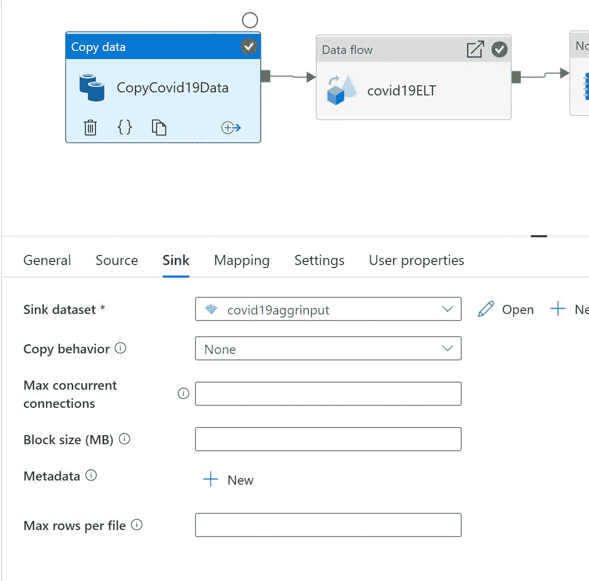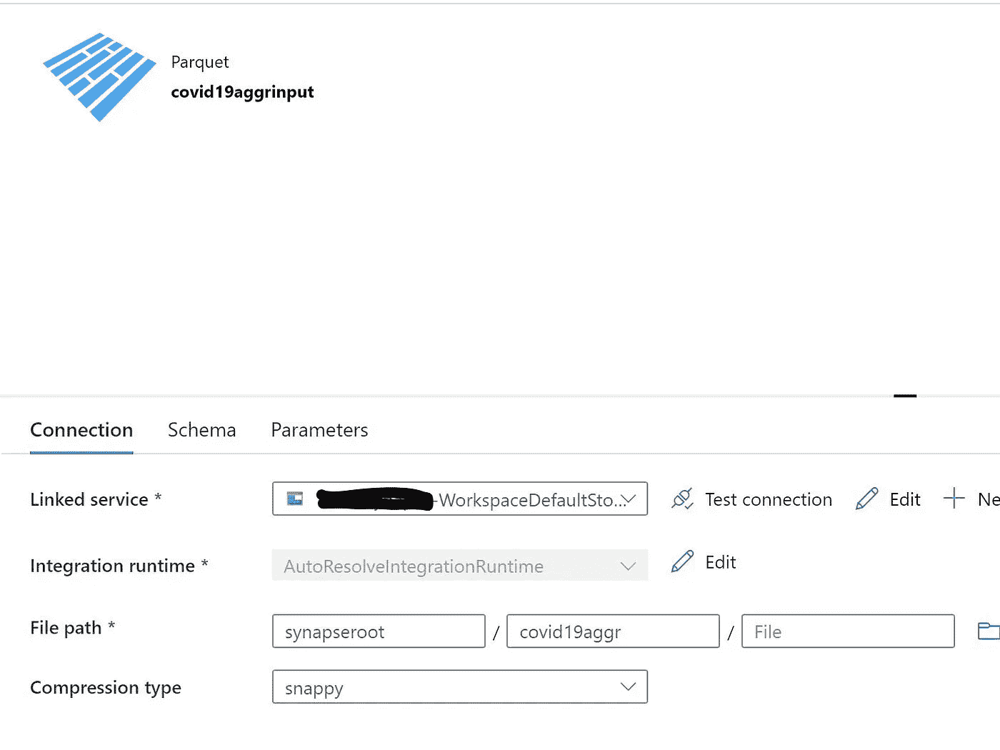

*   接下来创建一个数据流来处理数据
*   对于示例，我使用 delta 来简化 CDC
*   创建具有复制活动目标的来源

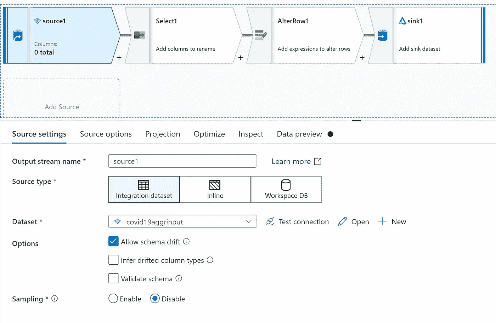

*   我们可以恢复复制活动目标链接服务本身
*   现在拖动选择

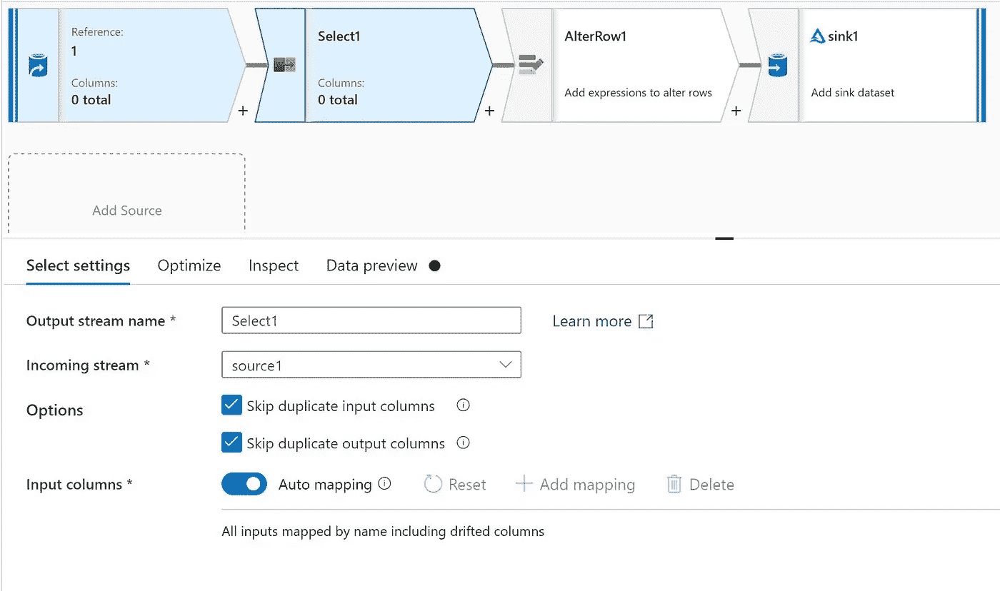

*   选择所有列
*   启用调试并查看结果。这个数据集是开源的，所以没有 PII

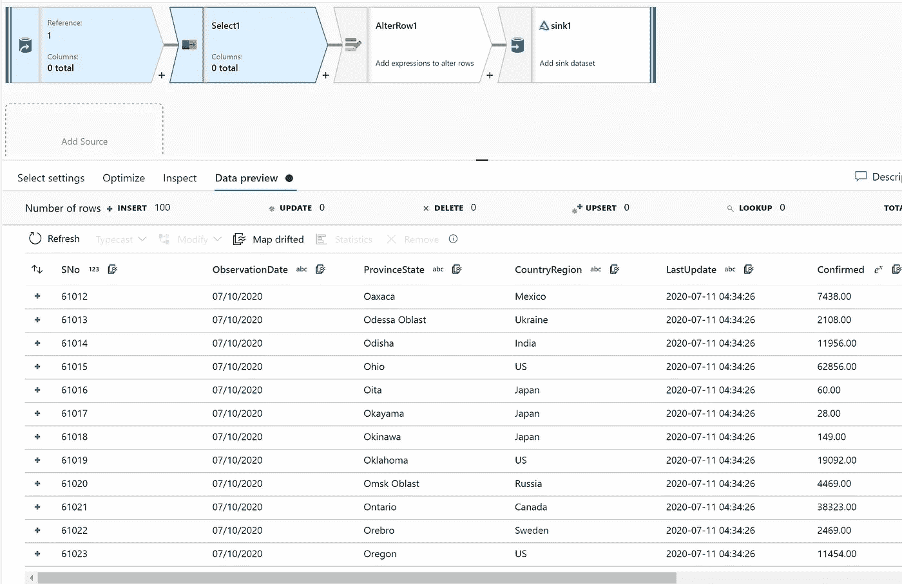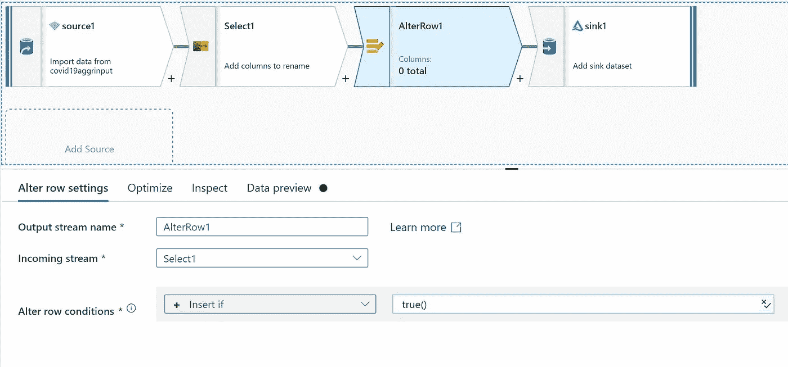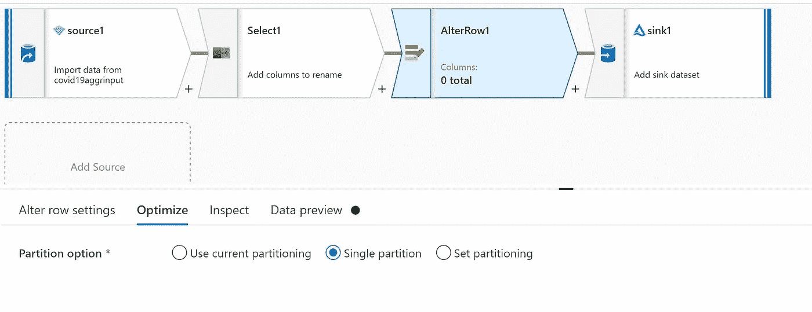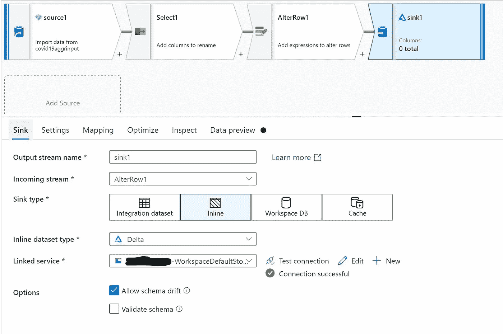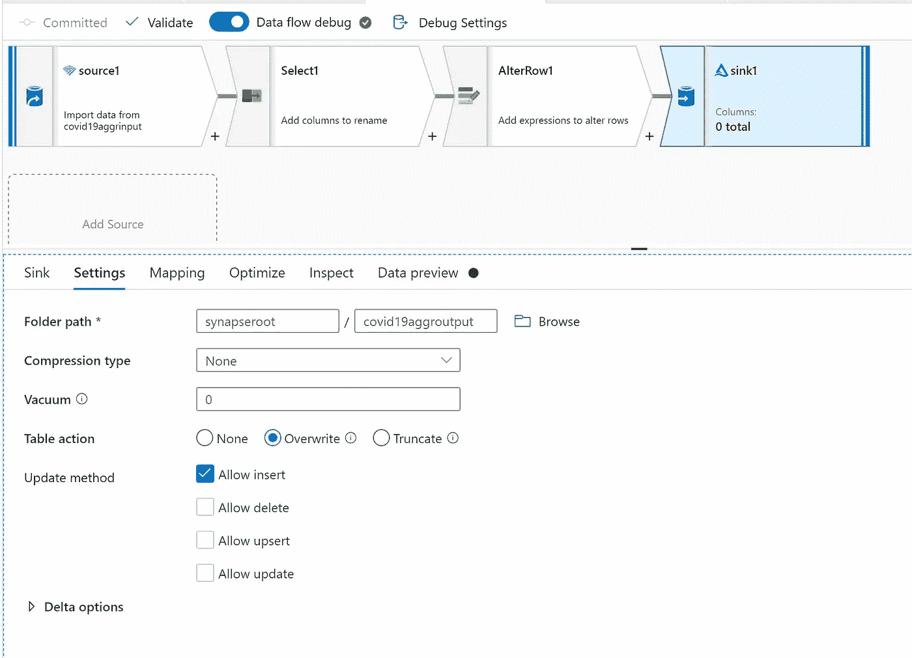

*   选择列
*   查看调试以验证数据已处理

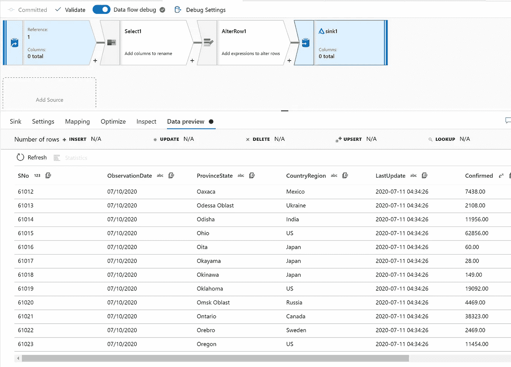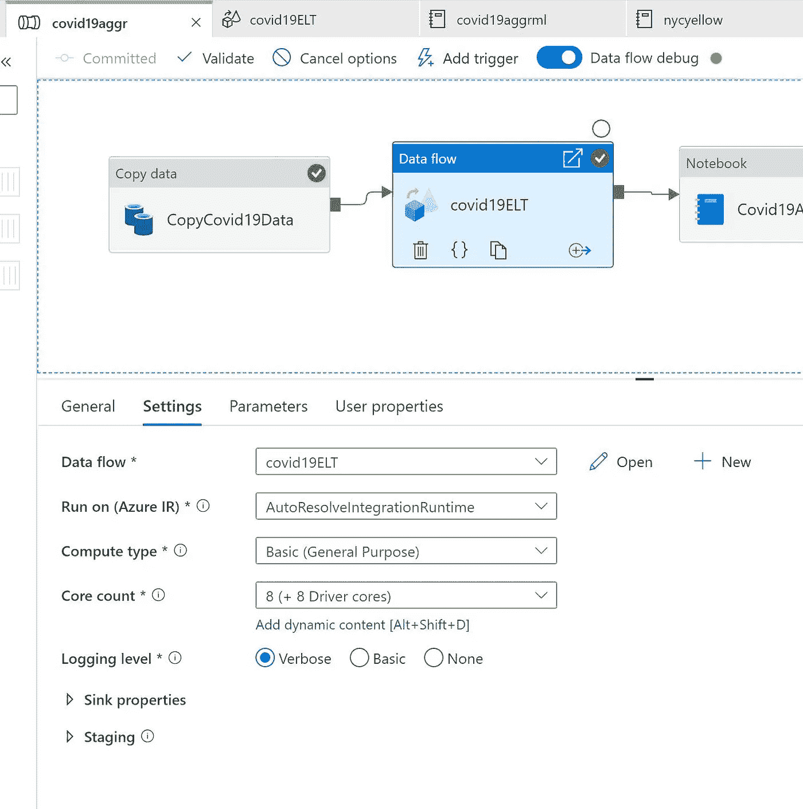

*   现在谈谈机器学习
*   创建笔记本
*   访问上述汇数据集作为建模的输入
*   创建笔记本

# 密码

*   加载数据

```
%%pyspark
df = spark.read.load('abfss://container@storageaccount.dfs.core.windows.net/covid19aggroutput/*.parquet', format='parquet')
display(df.limit(10))
```

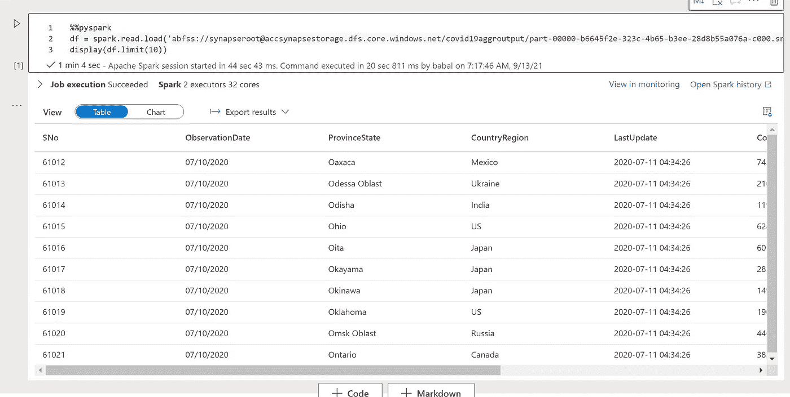

*   打印模式

```
df.printSchema
```

*   需要进口

```
from pyspark.sql.functions import *
from pyspark.sql import *
```

*   将日期转换为日期数据类型

```
df1 = df.withColumn("Date", to_date("ObservationDate", "MM/dd/yyyy")) 
display(df1)
```

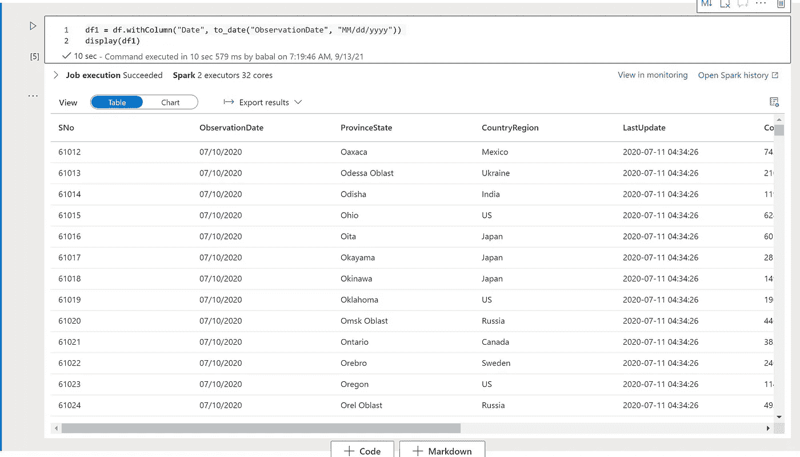

*   创建新列

```
df2 = df1.withColumn("year", year(col("Date"))).withColumn("month", month(col("Date"))).withColumn("day", dayofmonth(col("Date")))
```

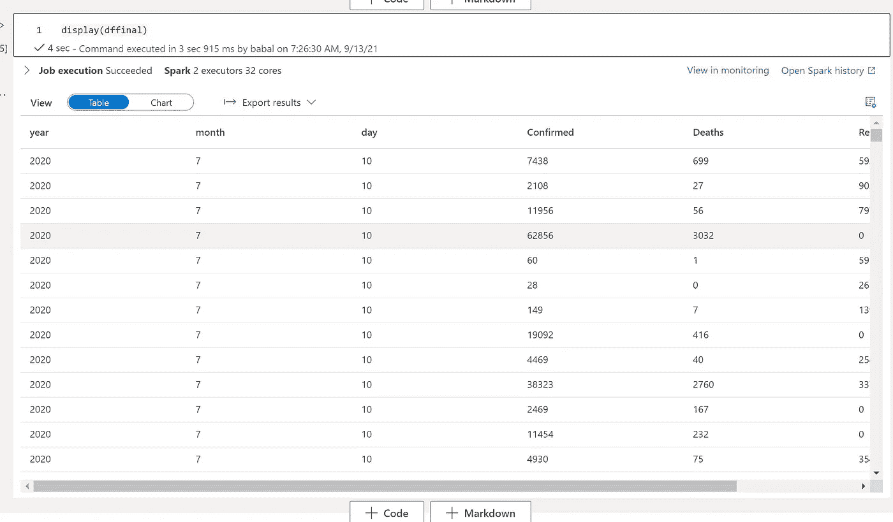

*   接下来是导入 ML 库
*   仅获取必要的列

```
dffinal = df2[["year","month", "day", "Confirmed", "Deaths", "Recovered"]]
```

*   火花 ML 从这里开始

```
from pyspark.ml.regression import LinearRegression
from pyspark.ml.feature import VectorAssembler
vectorAssembler = VectorAssembler(inputCols = ["year","month", "day", "Confirmed", "Recovered"], outputCol = 'features')
mldf = vectorAssembler.transform(dffinal)
mldf = mldf.select(['features', 'Deaths'])
mldf.show(3)
```

*   拆分训练和测试数据集

```
splits = mldf.randomSplit([0.7, 0.3])
train_df = splits[0]
test_df = splits[1]
```

*   配置模型

```
from pyspark.ml.regression import LinearRegression
lr = LinearRegression(featuresCol = 'features', labelCol='Deaths', maxIter=10, regParam=0.3, elasticNetParam=0.8)
lr_model = lr.fit(train_df)
print("Coefficients: " + str(lr_model.coefficients))
print("Intercept: " + str(lr_model.intercept))
```

*   打印模型精度

```
trainingSummary = lr_model.summary
print("RMSE: %f" % trainingSummary.rootMeanSquaredError)
print("r2: %f" % trainingSummary.r2)
```

*   用测试数据评估

```
lr_predictions = lr_model.transform(test_df)
lr_predictions.select("prediction","Deaths","features").show(5)
from pyspark.ml.evaluation import RegressionEvaluator
lr_evaluator = RegressionEvaluator(predictionCol="prediction", \
                 labelCol="Deaths",metricName="r2")
print("R Squared (R2) on test data = %g" % lr_evaluator.evaluate(lr_predictions))
```

*   显示结果

```
test_result = lr_model.evaluate(test_df)
print("Root Mean Squared Error (RMSE) on test data = %g" % test_result.rootMeanSquaredError)
```

*   现在运行预测

```
predictions = lr_model.transform(test_df)
predictions.select("prediction","Deaths","features").show()
```

*   记住模型输出不是我们本教程的目的。只是给大家展示一下过程。
*   保存管道并运行调试

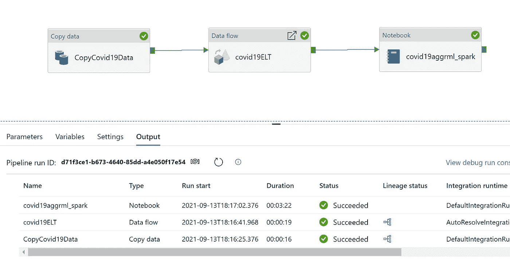

*最初发表于*[*【https://github.com】*](https://github.com/balakreshnan/Samples2021/blob/main/Synapseworkspace/e2esparkml.md)*。*