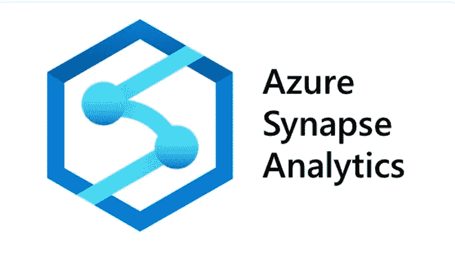

# Azure Synapse 分析

> 原文：<https://medium.com/analytics-vidhya/azure-synapse-analytics-f1c91f3ef141?source=collection_archive---------15----------------------->

Azure Synapse Analytics 是一个新的微软分析引擎，前身是 Azure 数据仓库。这项新服务不仅代表了名称的改变，也代表了 Azure 内部分析方式的演变。我们将在本文中研究细节。

## 什么是 Azure Synapse Analytics？

Azure synapse Analytics 是一个无限的分析服务平台，它汇集了…