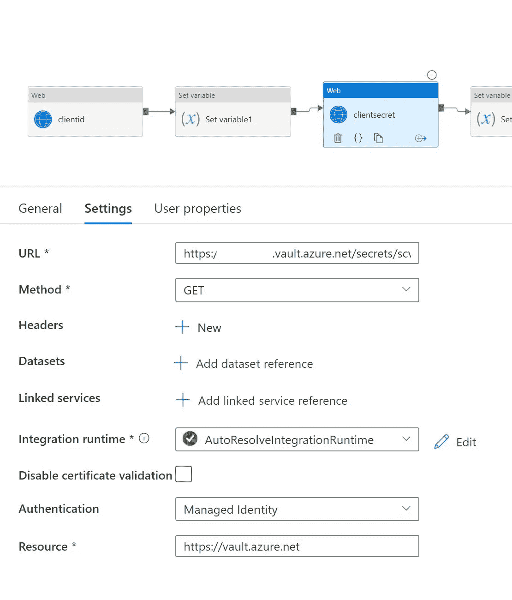

# Azure Synapse Analytics 使用 HTTP/Web 活动调用 Azure ML 批处理端点

> 原文：<https://medium.com/analytics-vidhya/azure-synapse-analytics-invoke-azure-ml-batch-endpoint-using-http-web-activity-4b4e139b8325?source=collection_archive---------0----------------------->

# 如何使用 Synapse Integrate 中的 HTTP/Web 活动调用 Azure ML 批处理端点

# 先决条件

*   Azure 帐户
*   Azure 存储
*   Azure 机器学习服务
*   根据文档创建批处理端点
*   本文没有展示如何部署 batch endpoint。
*   [https://docs . Microsoft . com/en-us/azure/machine-learning/how-to-use-batch-endpoint](https://docs.microsoft.com/en-us/azure/machine-learning/how-to-use-batch-endpoint)
*   上述链接中提供了批处理端点的代码
*   创建 Azure synapse 分析工作区
*   创建 Azure 密钥库
*   将客户端 id、密码和租户存储在 Azure Keyvault 中

```
Note: to show how we can do ETL/ELT and then invoke batch endpoint to score ML model.
```

# 架构/流程


# 流程步骤/活动

*   带来网络活动


*   为存储在 Azure Keyvault 中的客户端 id 配置机密 URL
*   对于 URL

```
[https://keyvaultname.vault.azure.net/secrets/secretname/xxxxxxxxxxxxxxxxxxxxxxxxxxxxxx?api-version=7.0](https://keyvaultname.vault.azure.net/secrets/secretname/xxxxxxxxxxxxxxxxxxxxxxxxxxxxxx?api-version=7.0)
```

*   选择获取
*   对于资源
*   对于安全性，选择受管理的身份

```
[https://vault.azure.net](https://vault.azure.net)
```

*   创建变量


*   现在设置变量


```
@activity('clientid').output.value
```

*   现在让我们再次拖动网络活动的秘密
*   对于 URL



```
[https://keyvaultname.vault.azure.net/secrets/secretname/xxxxxxxxxxxxxxxxxxxxxxxxxxxxxx?api-version=7.0](https://keyvaultname.vault.azure.net/secrets/secretname/xxxxxxxxxxxxxxxxxxxxxxxxxxxxxx?api-version=7.0)
```

*   选择获取
*   对于资源
*   对于安全性，选择受管理的身份

```
[https://vault.azure.net](https://vault.azure.net)
```

*   接下来设置变量


```
@activity('clientsecret').output.value
```

*   现在让我们获取授权令牌


*   对于 URL

```
[https://login.microsoftonline.com/tenantid/oauth2/token](https://login.microsoftonline.com/tenantid/oauth2/token)
```

*   对于身体

```
@concat('grant_type=client_credentials&client_id=',variables('clientid'),'&resource=https://management.core.windows.net/&client_secret=',variables('clienttoken'))
```

*   现在将令牌保存在变量中

```
@activity('Getbearertoken').output.access_token
```


*   现在让我们为批处理端点获取一个计分令牌


```
[https://login.microsoftonline.com/tenantid/oauth2/token](https://login.microsoftonline.com/tenantid/oauth2/token)@concat('grant_type=client_credentials&client_id=',variables('clientid'),'&resource=https://ml.azure.com/&client_secret=',variables('clienttoken'))
```

*   将计分令牌保存在变量中

```
@activity('scoring_token').output.access_token
```


*   现在检索数据集 id
*   对于 URL

```
https://centralus.experiments.azureml.net/dataset/v1.0/subscriptions/<subid>/resourceGroups/<rgname>/providers/Microsoft.MachineLearningServices/workspaces/<workspacename>/saveddatasets/from-data-path
```


*   添加授权标题

```
@concat('Bearer ',variables('tokenml'))
```

*   身体

```
{"DatastoreName":"taxibatch2files","RelativePath":"/example-data/taxibatch.csv"}
```

*   现在调用批处理端点


*   现在使用 Azure ML 服务中的批处理端点
*   在 Azure ML 中，转到端点->批处理端点->选择批处理端点->单击详细信息

```
[https://endpointname.centralus.inference.ml.azure.com/jobs](https://endpointname.centralus.inference.ml.azure.com/jobs)
```

*   为授权和内容类型设置标题

```
Authorization: @concat('Bearer ',variables('tokenml'))Content-Type: application/json
```

*   对于身体变化到

```
{
  "properties": {
    "dataset": {
      "dataInputType": "DatasetVersion",
      "datasetName": "taxibatch2files",
      "datasetVersion": "1"
    }
  }
}
```

*   提交更改
*   单击调试


*   等待流程完成


*   完成的

*最初发表于*[T5【https://github.com】](https://github.com/balakreshnan/Samples2022/blob/main/SynapseIntegrate/batchendpointhttp.md)*。*