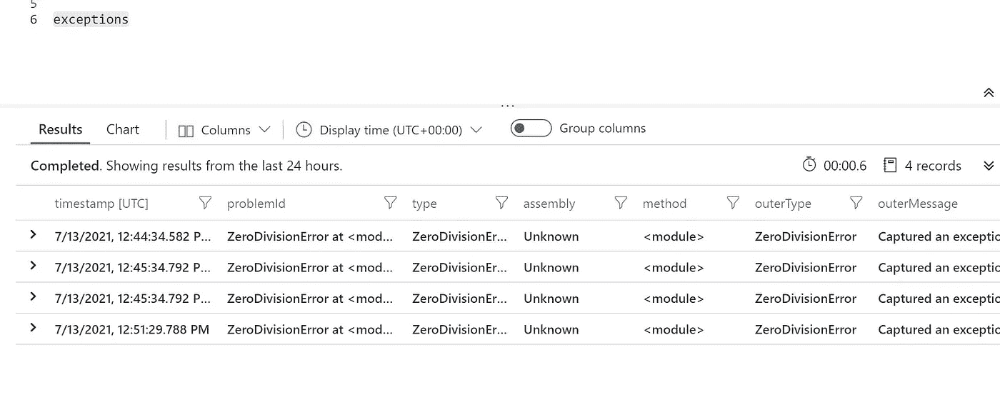
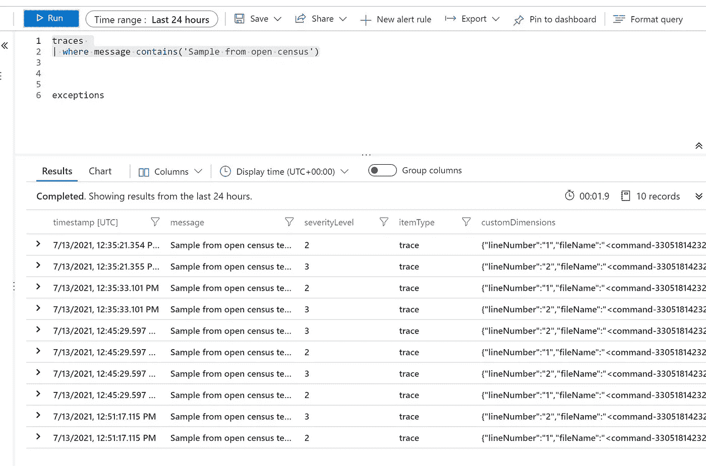

# Azure Synapse Spark 将运行时错误记录到应用洞察中

> 原文：<https://medium.com/analytics-vidhya/azure-synapse-spark-logs-runtime-errors-to-application-insights-b3d438c400b7?source=collection_archive---------6----------------------->

# 使用 open census 库将错误日志推送到 Azure monitor

# 先决条件

*   Azure 帐户
*   Azure Synapse 工作区
*   Azure 存储

# 步伐

*   创建一个火花簇
*   安装库
*   创建一个 conda 文件并上传
*   创造环境. yml

```
name: example-environment
channels:
  - conda-forge
dependencies:
  - python
  - numpy
  - pip
  - pip:
    - opencensus-ext-azure
```

*   上传 yml 文件
*   创建笔记本

# 密码

*   选择 python 作为语言

```
import logging
from opencensus.ext.azure.log_exporter import AzureLogHandlerlogger = logging.getLogger(__name__)# TODO: replace the all-zero GUID with your instrumentation key.
logger.addHandler(AzureLogHandler(
    connection_string='InstrumentationKey=xxxxx-xxxxxx-xxxxxx-xxxxxxx')
)
```

*   现在记录一些示例日志

```
logger.warning("Sample from open census test 01")
logger.error("Sample from open census test 02")
```

*   现在让我们记录一个异常

```
from opencensus.ext.azure.trace_exporter import AzureExporter
from opencensus.trace.samplers import ProbabilitySampler
from opencensus.trace.tracer import Tracerproperties = {'custom_dimensions': {'key_1': 'value_1', 'key_2': 'value_2'}}# Use properties in exception logs
try:
    result = 1 / 0  # generate a ZeroDivisionError
except Exception:
    logger.exception('Captured an exception.', extra=properties)
```

*   登录应用洞察



*   以上测试完成自—[https://docs . Microsoft . com/en-us/azure/azure-monitor/app/open census-python # configure-azure-monitor-exporters](https://docs.microsoft.com/en-us/azure/azure-monitor/app/opencensus-python#configure-azure-monitor-exporters)

【github.com】的 Samples2021/opencensuslog.md