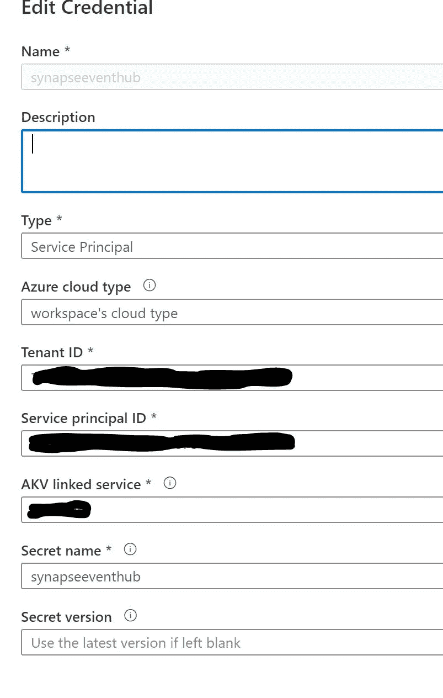
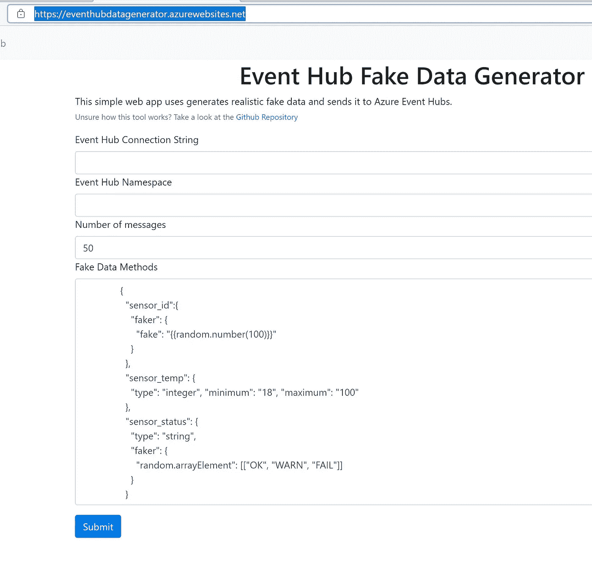
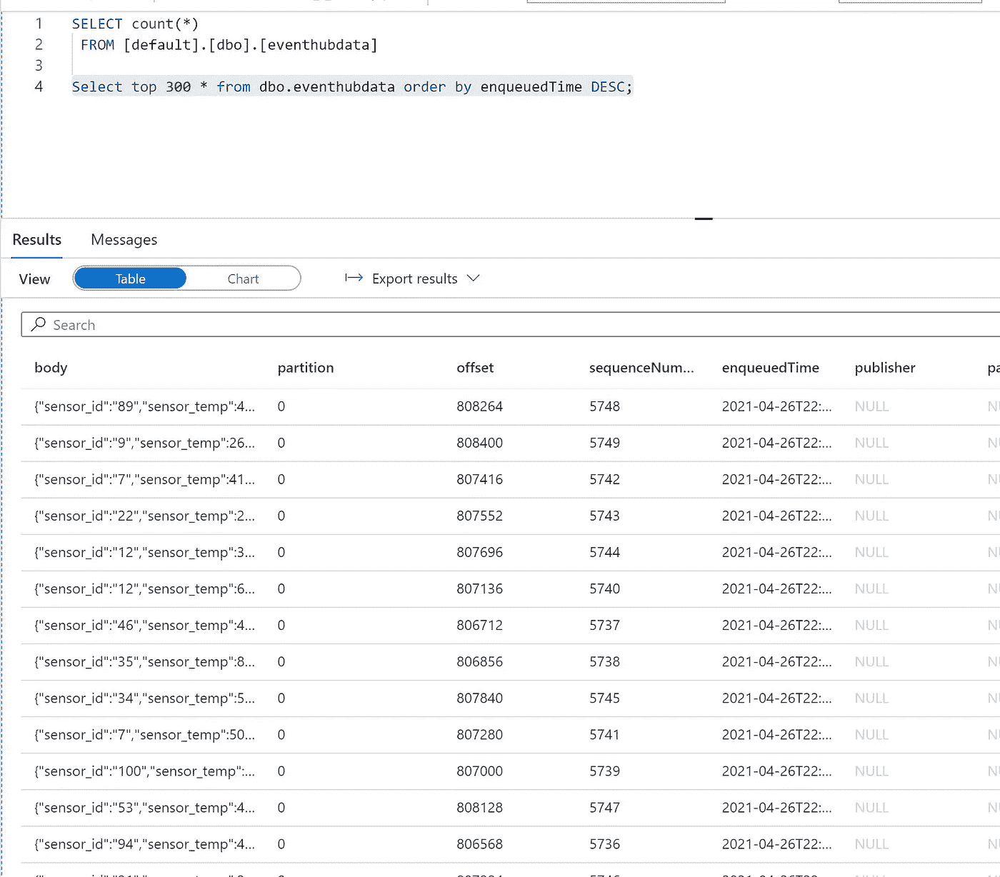

# Azure Synapse Spark 与 Azure 事件中心

> 原文：<https://medium.com/analytics-vidhya/azure-synapse-spark-with-azure-event-hubs-afb7670b2b37?source=collection_archive---------4----------------------->

# 使用事件中心将流或事件驱动的数据处理到 Azure Synapse 分析工作区中

# 先决条件

# 步伐

*   在 Azure Synapse workspace 中创建新的火花池
*   转到 Azure 事件中心创建一个名为 synapseincoming 的新事件中心
*   将分区设置为 1，因为这是为了测试
*   转到共享访问策略并创建一个密钥来写入和复制连接字符串
*   转到 Azure Keyvault 并存储密钥
*   转到 Eventhub 名称空间并复制连接字符串
*   复制事件中心名称
*   以上信息用于数据生成器
*   现在让我们编写代码
*   转到 Azure Synapse 分析工作区
*   转到管理和凭据
*   将新的 eventhub synapseincoming 连接字符串添加到凭据
*   我们正在从上面储存的密钥库中获取密钥



*   现在让我们创建代码，从事件中心读取事件/消息，并写入无服务器 sql 表
*   目标是无服务器 sql 表
*   从凭据中安全地获取连接字符串
*   创建一个新笔记本，并选择 pyspark 作为语言

# 密码

```
keyVaultName = "keyvaultname"; 
secretName = "synapseeventhub";secret = mssparkutils.credentials.getSecret(keyVaultName, secretName)connectionString = secret
ehConf = {
  'eventhubs.connectionString' : sc._jvm.org.apache.spark.eventhubs.EventHubsUtils.encrypt(connectionString)
}def write2table(df2, epoch_id):
    df2.write.mode("append").saveAsTable("default.eventhubdata")df = spark \
    .readStream \
    .format("eventhubs") \
    .options(**ehConf) \
  .load()df1 = df.withColumn("body", df["body"].cast("string"))df1.writeStream \
    .outputMode("update") \
    .trigger(processingTime='5 seconds') \
    .option("checkpointLocation","abfss://eventhubdata@accsynapsestorage.dfs.core.windows.net/evetcheckpoint/") \
    .foreachBatch(write2table) \
    .start() \
    .awaitTermination()
```

*   执行每个单元格
*   一旦运行了写流，现在我们就可以发送数据了

# 事件中心数据生成器



# Azure Synapse 无服务器 SQL

*   转到无服务器 SQL
*   创建新查询
*   让我们数一数

```
SELECT count(*) FROM [default].[dbo].[eventhubdata]Select top 300 * from dbo.eventhubdata order by enqueuedTime DESC;
```



*最初发表于*[*【https://github.com】*](https://github.com/balakreshnan/Samples2021/blob/main/EventHub/evtsynapsespark.md)*。*