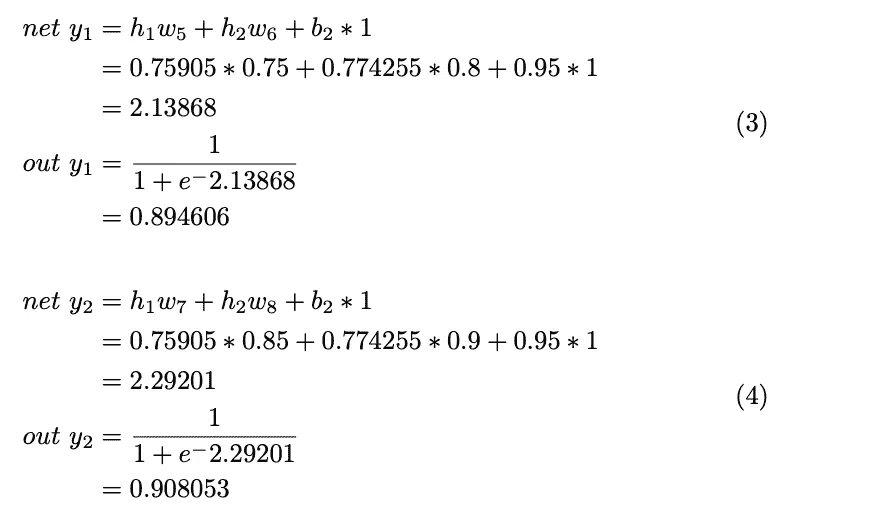

# 反向传播算法背后的数学是如何工作的？数学时间！！！

> 原文：<https://medium.com/analytics-vidhya/back-propagation-algorithm-170b5f16790a?source=collection_archive---------9----------------------->

## 反向传播方法

在本文中，我们将讨论向前传递和向后传播的逐步方法。我将使用背页的数学，因为它被深入讨论。

3 层神经网络将帮助我们以简化的方式理解传播。

三层神经网络

让我们从计算隐藏层和输出层的值开始。

***隐藏层:h1 和 h2***

***输出层:y1 和 y2***

**节点 y1 和 y2 中的误差，相加得到总误差。**

# 反向传播

输出图层的值(y1=0.01 和 y2=1.0)与计算值(y1 = 0.894606 和 y2 = 0.908053)之间存在差异。为了减少误差，我们必须相应地调整权重。

> 考虑重量 w5，应用链式法则。

如果我们同时处理所有的偏导数，事情就变得复杂了。所以，我们会一一解决。

代入方程 7 中的方程 8、9、10

最后，更新权重 w5。这里假设学习率为η=0.4(可以从 0 到 1 变化)。

> 现在，考虑一下 w6。

我们已经有了等式 8 和等式 9 的前两部分的值。求解方程的最后一部分，并代入方程 7。

以类似的方式，我们更新权重 w7 和 w8。

图片网址:[https://sef iks . com/2017/06/21/homer-Simpson-guide-to-back propagation/](https://sefiks.com/2017/06/21/homer-simpson-guide-to-backpropagation/)

在解决了隐藏层和输出层之间的层之后，我们将更新隐藏层和输入层之间的权重。

权重 w1 可以通过一系列等式来更新。因为它可能很复杂，我用箭头来表示方程的连续链。

以相同的方式，计算由于等式 16 中的隐藏节点 h1 而导致的 out 节点 y2 中的误差。

将公式 23 替换为公式 22

现在将等式 24 和 25 代入等式 21

我们现在有了等式的第一部分。通过将等式 26 和 20 代入等式 16

我们通过将等式 27 和 28 代入等式 15 得到最终结果

通过将误差乘以学习率来更新权重 w1。

现在，计算更新后的权重 w2，如下所示。但是它更快，因为我们已经有了方程 27 和 28 的值。唯一的变化是等式的最后一部分。即重量。

按照相同的方法计算更新的权重 w3 和 w4。

这就完成了第一次迭代。并且被迭代直到误差被最小化。

谢谢你的时间。愿 MxA 与你同在:)