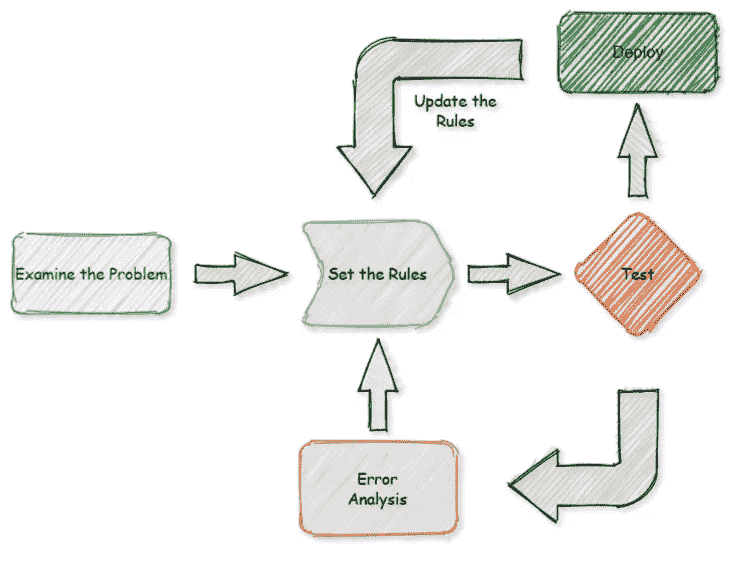
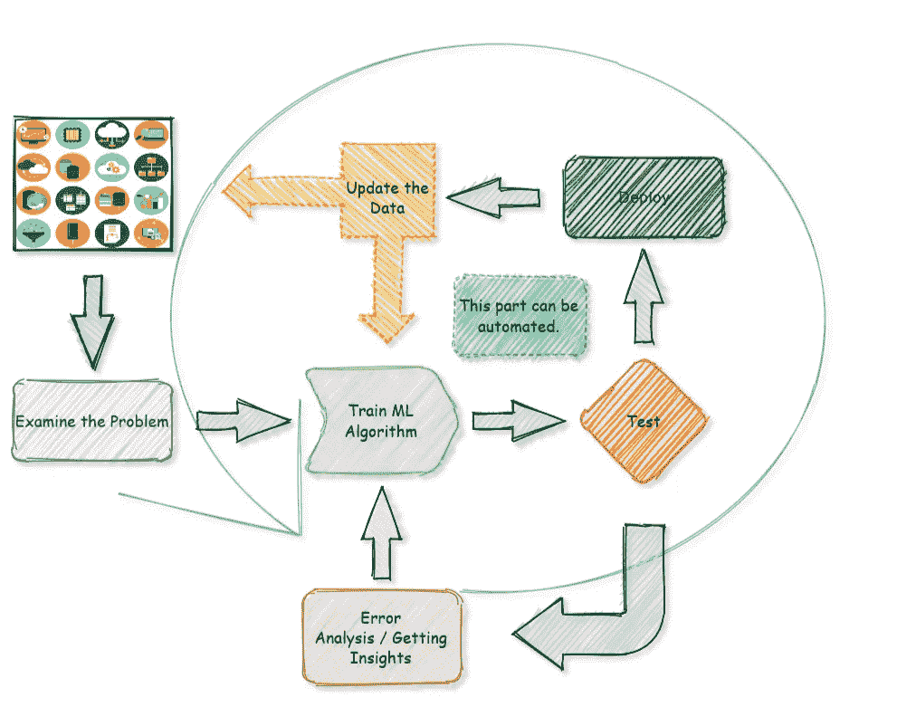
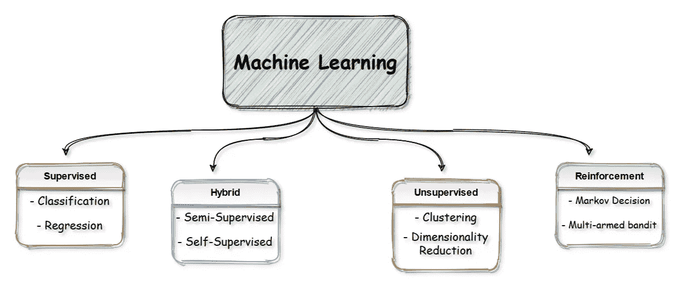
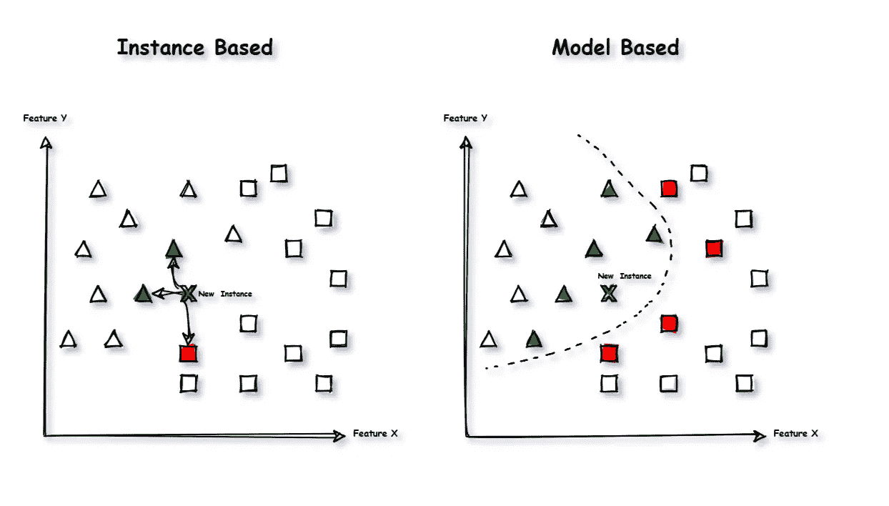
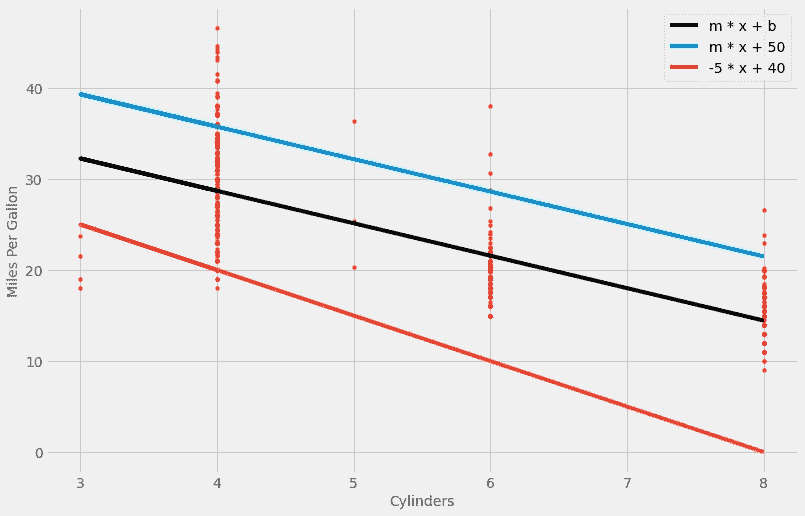
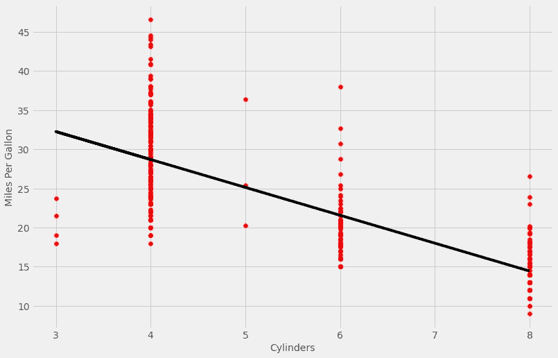

# “回到机器学习的基础”初学者指南

> 原文：<https://medium.com/analytics-vidhya/back-to-the-basics-in-machine-learning-a-beginners-guide-dacdcf9faf9?source=collection_archive---------14----------------------->

## 机器学习的根源以及它们如何帮助我解决更高级的问题。


从 [pixabay](https://pixabay.com/illustrations/imagination-future-car-pedestrian-1522291/) 回到未来

在从事更复杂的项目时，我发现自己有时会脱离机器学习的基础。而且有时候(通常是一般情况下)**最简单的方法就是最好的解决方案**。因此，在这些系列中，我将从头开始，尝试不断更新我的知识，同时向周围的新人介绍一些 ML 基础知识。

**你将从这篇文章中了解到什么:**

*   什么是机器学习，
*   它是如何进化的，
*   你可以用它们解决什么问题，
*   机器学习算法的概观，
*   机器学习的类型，
*   监督、混合、非监督和强化学习，
*   基于实例和模型的学习，
*   一个基本的线性回归，
*   预测汽车每加仑燃料行驶里程的代码示例…

好吧，让我们开始吧…

## 嗯，是很酷的东西，但是…机器学习是关于什么的？

让我们从回答这个问题开始。1959 年，**亚瑟·塞缪尔**将**机器学习**定义为:

> “在没有明确编程的情况下赋予计算机学习能力的研究领域”。

我要说这是非常简单明了的好解释。在 ML 时代之前，一切都是用基于**规则的**方法来完成的。你发现一个问题，检查它，写规则，测试它，如果你对结果满意就启动。只要规则发挥作用，一切都好。但是我们都知道**规则是用来打破**的，对吗？使用传统方法，您必须手动更新您的规则，随着更复杂的问题出现，您将添加大量的规则，因为它们不够灵活。所以，只要问题还在发展，你就要更新你的规则，这是很不理想的…



传统的基于规则的方法

使用传统方法，需要大量的手动更新。幸运的是**我们有更多的数据**可以学习，机器学习算法**可以为我们自动化这个过程**。他们可以简化事情，找到更好的解决方案，可以适应新数据…



在 ML 算法的帮助下，我们可以实现过程的自动化

## 好吧…我们能用这些解决什么？

好了，现在我们看到 ML 方法可以自动化，并且足够灵活地解决问题。但是我们能用它们解决什么问题呢？这是一个庞大的列表，而且每天都在变长。但是我想我可以给你一个提示，告诉你用它们可以实现什么。让我们从虚拟农场开始，假设你有一些生产农产品的田地:

*   你可能在种玉米？但是一些植物疾病有一个问题，它们中很少对你的收成有害。你想收集作物的图像，并自动分析它们以检测潜在的疾病。

> 这是一个图像**分类**任务，通常通过使用 CNN(卷积神经网络)来执行。

*   你想检测作物叶片上的病斑，以及它们造成了多大的损害。同样，你可以分析图像，找出疾病的确切位置和形状。

> 这是图像**分割**任务，你可以再次使用 CNN 的。

*   你想预测你的产品在季末的收获量。你可以收集许多相关数据，然后根据过去的季节数据对未来做出预测。

> 这是一个**回归任务**，你可以在这里预测像吨位这样的连续数据。对于这些，您可以使用许多可用的回归模型，从简单的线性回归到神经网络。

*   你有你收获产品的在线销售页面。还有一个反馈区，人们可以在那里写评论。你需要对它们进行分类，以显示评论是关于哪种产品的，以及对它的看法。积极还是消极？

> 这是一个**自然语言处理**任务。你可以根据评论是关于什么产品的来对评论进行分类，并通过用数字形式表示单词来获得情感。然后你可以使用各种各样的工具，从简单的分类器到 RNN(递归神经网络)甚至是变形金刚。

*   你想在你的网站上有你的产品的相册，但你不想在你的网站上添加图片时写下它是什么产品。你只是想拍照上传然后看结果。

> 这是一个**图像字幕**任务，您可以使用图像模型和 NLP 模型来预测文本形式的图像内容。这次是 CNN 和 RNN 的组合…

*   你有几种类型的玉米。收获后，你不知道如何分组。有些比其他的稍微甜一点，有些比其他的更甜，等等。这里你要把他们分组，姑且以理智的方式根据他们的特点说三组吧。

这是一个**聚类**任务，其中您的模型根据数据的不同特征对数据进行分组。为此，您可以使用 K-Means、层次聚类、DBSCAN 等算法。

*   你想记录你的开销。有一个很长的日常费用清单，你想自动发现一些不寻常的费用。可能是因为错别字或错误的货币类型等造成的。

> 这是一个**异常检测**任务，您可以使用隔离森林之类的算法来自动检测它们。

*   有些鸟类非常喜欢你的庄稼。你想建立一个警报系统，当他们在附近的时候把他们吓跑。你想根据他们的声音来做这件事。

> 这是一个**音频分类**任务。你可以用 RNN 或 CNN 的神经网络来解决这些问题。

这份清单还在继续，但我希望它能让你感觉到你可以处理的问题范围很广。

## 这是一个很长的列表…我们能以更有条理的方式将它们分组吗？

当然了！有许多类型的机器学习系统适合特定的组，但我们可以将它们分成更广泛的类别，如下所示:



一般的机器学习类型

**让我们从监督学习开始:**

监督学习旨在从特征中学习，并将它们映射到称为*标签*的期望解决方案。我们(人类)提供一些标签，并将这些信息输入算法来教授它们。这就是有监督的来源，**计算机需要我们有监督的标签来学习**。这是机器学习中最常见的方法之一。一般来说，有两种类型的监督学习:

*   **分类:**这里我们把类预测成离散值。
*   **回归:**这里我们把值预测成连续值。

**无监督学习:**

与监督学习相反，非监督学习旨在获得未标记数据之间的关系或描述它们**而不使用教师**。是什么让无监督学习变得有趣**因为周围的大多数数据没有标签**而我们有大量的标签……无监督学习的几个用例是:

*   **聚类:**在这里我们把同一类别中的一组对象彼此之间的相似性比其他组中的那些对象更大。
*   **降维:**这里我们简化数据，同时保留尽可能多的信息。
*   **异常检测:**在这里，我们试图通过在训练算法时向算法显示正常实例来发现异常值或异常数据点。

**混合学习:**

这些任务介于两者之间。在保持目标学习需求的同时，这些算法不需要特定的标签集。从数据本身学习，而不是使用人为标记的数据模型。这是一个非常有趣的领域，下面是一些混合学习方法:

*   **半监督学习:**这里我们在训练时使用少量的标记数据(不一定要外部标记)，并将它们与大量的未标记数据相结合。
*   **自我监督学习:**这里我们根本不用人工标注的数据。基本思想是自动生成某种监督信号，使模型从数据本身学习。

**强化学习:**

这和其他的有些不同，也可以用在其他领域。在这些任务中，让一个*代理*做一些动作并从中学习。在开始时，代理人完全随机地做事情，并通过奖励点*或惩罚点*开始学习。随着时间的推移，代理试图收集尽可能多的奖励，同时避免惩罚，所以它学习周围的环境。这个过程称为*策略*，并继续迭代，直到找到最佳策略。

**实例 vs 基于模型的学习:**

机器学习系统的另一种分类方式是通过**它们如何概括。**



基于实例和模型的学习

上面你可以看到两种方法的区别。为了清楚起见:**基于实例的方法将实例之间的相似性度量考虑在内。**在我们的示例中，您可以看到新实例 X 更接近三角形而不是正方形，因此 X 属于三角形类。基于实例的算法的一个简单例子是“k-最近邻”

与此同时，基于实例的方法是进行预测的一种不错的方式，它有它的缺陷，其中之一可能是:*一般化*。这就是基于模型的学习大放异彩的地方，你建立一个模型，从例子中学习，然后使用这些知识进行预测。这种方法的一个简单例子是*“线性回归”*，我们将在下一节中做一个基本的例子。

**一个简单的回归例子:**

总结我们上面解释的，我认为这是做一些基本编码的好方法。我们要用“Auto MPG 数据集”，它取自 [*UC Irvine 机器学习知识库*](http://archive.ics.uci.edu/ml/datasets/Auto+MPG) **。**为简单起见，我们仅将目标和变量的“每加仑里程数”分别作为 **y** 和 **x、**。基本上，我们将创建一个线性函数，根据车辆的缸数来预测每加仑的里程数。

让我们创建一个简单的回归函数，可能大多数人都很熟悉:

> y = m*x + b

**其中**:

*   y =回归方程的因变量，
*   m =回归方程的斜率，
*   x =解释变量，
*   b =方程的常数。

```
# Some package importsimport numpy as np
import pandas as pd 
from sklearn.linear_model import LinearRegression
from numpy.polynomial.polynomial import polyfit
import matplotlib.pyplot as plt# Selecting plotting style
plt.style.use('fivethirtyeight')# Load the data
df = pd.read_csv('../input/autompg-dataset/auto-mpg.csv')# Sample data
x = df['cylinders'].values
y = df['mpg']# Fit with polyfit
b, m = polyfit(x, y, 1)fig, ax = plt.subplots(figsize=(12,8))# Plot the custom linesax.plot(x, y, '.', c='r', label='_nolegend_')
ax.plot(x, b + m * x, '-',color='k')
ax.plot(x, 50 + m * x, '-')
ax.plot(x, 40 + -5 * x, '-')ax.legend(['m * x + b','m * x + 50','-5 * x + 40'])
plt.xlabel('Cylinders', font='bold')
plt.ylabel('Miles Per Gallon', font='bold')plt.show()
```



线性回归线

上面我们尝试了一些斜率和截距的组合，用不同的气缸数和 MPG 值绘制成红点。我们清楚地看到**有一种趋势**通过增加汽车的汽缸数量来减少每加仑燃料的里程数。但问题是，**如果我们想预测一辆新的汽车有不同数量的汽缸**我们的回归从未见过呢？为了预测，我们需要为公式中的 *m* 和 *b* 找到最佳参数。上面你可以看到一些**随机选择的斜率和常数**；基于这些值，我们得到预测。通常尝试随机值不是一个好主意，同时你可以用基本的数学找到一些预测，但那将是一个长期的任务。

幸运的是，我们有先进的计算机和模型来帮我们完成这些任务。在这些的帮助下，我们可以做更多的**概括和可靠的**预测:

```
# We create our model instance
model = LinearRegression()# Setting our features(X) and targets (y)X = df[['cylinders']]
y = df['mpg']# Fitting x and ymodel.fit(X, y)# Plotting the resultsfig = plt.subplots(figsize=(12,8))plt.scatter(X, y, color='r')
plt.plot(X, model.predict(X),color='k')
plt.xlabel('Cylinders', font='bold')
plt.ylabel('Miles Per Gallon', font='bold')plt.show()
```



Sklearn 的线性回归

通过几行代码，我们得到了一个简单而体面的线性回归模型。在拟合时，学习算法试图找到将使训练数据最佳拟合的模型参数。你可能会问模型是如何找到这些参数的，这通常是通过**成本函数**来实现的，你的模型试图**通过更新参数来最小化成本函数**。

最后，我们准备运行我们的模型进行预测。例如，你想知道你买的新车每加仑油能跑多少英里。它有 10 个气缸(我不知道这是否可能，我不擅长汽车)，所以你想为你的下一次公路旅行得到一个燃料消耗的粗略估计。

```
new_car = 10 #  Number of cylinders
print(model.predict([[new_car]])) # output is [7.320]
```

正如你在上面看到的,**模型根据历史数据**为我们预测了这个数字，大约是每加仑 7 英里。这可能不是最好的估计，因为为了简单起见，我们使用了一个小数据集和一个特性。与数据相关的问题将成为我计划添加到这些系列文章中的另一篇文章的主题…

## **结论**

那很有趣…我觉得回归基础对我真的很有用，提醒我即使在复杂的问题上，你仍然需要坚持你的基础知识，相信我，这很有帮助！希望你也觉得有用！