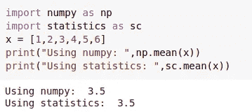
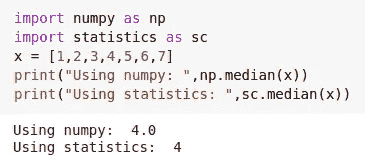
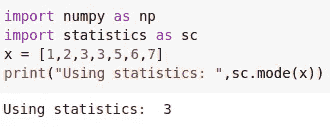
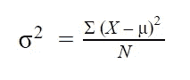
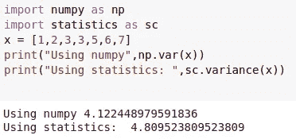
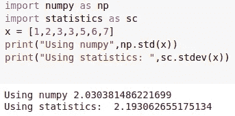
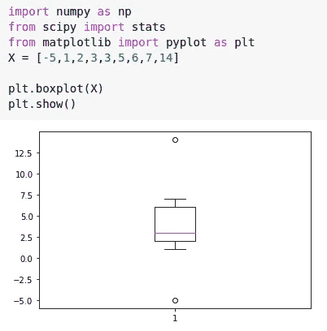

# 回归基础——了解您的数据

> 原文：<https://medium.com/analytics-vidhya/back-to-the-basics-knowing-your-data-4b51c2662385?source=collection_archive---------20----------------------->

布雷特·乔丹在 [Unsplash](https://unsplash.com?utm_source=medium&utm_medium=referral) 上的照片

所以，你有一个数据集，你正试图从它的意义？让我们从最基础的开始，了解您的数据到底由什么组成。

数据集是一组*实体* 的**，例如，对于销售数据集，它将是销售的集合，对于大学数据集，它将是学生信息的集合。**

这些实体由 ***属性表示(也称为列、特征、变量)*** 。这些表示为实体收集的特定信息。例如，如果我们正在查看一个销售数据集。实体将是代表商店销售额的记录，属性可以是商店名称、地区、销售额等。属性的收集值也称为 ***观察值*** 。

**离散属性—** 这些属性有一组有限的值。

**连续属性—** 如果属性不是离散的，那就是连续的(哈哈！).这些没有一组有限的值。

一个属性可以包含不同的值，属性中值的类型可以是

*   **名义**——代表名称或类别的数值。这些没有有意义的顺序。名词性属性也称为范畴属性。比如姓名，城市等。有些情况下，名义属性包含数字，例如，性别(0 —男性/ 1 —女性)、颜色(1 —红色/2 —黑色)等。在这种情况下，对值应用任何数学聚合都不会产生任何合理的结果，应该避免。然而，为了找到中心趋势(下面将详细介绍),可以使用模式。
*   **序数** —值有一个有意义的顺序和等级。然而，这些值的幅度差异是未知的。比如杯子的大小，小/中/大。这些值确实有排名，但可测量的差异不得而知。这些变量的集中趋势可以用中位数或众数来定义。
*   **二进制** —只能有两个可能的值。例如，真/假。如果这些值之间没有任何等级，并且具有相同的权重，则称该变量是对称的。但是，如果有一个权重与这些值相关联，例如，医疗结果为+ve 或-ve，则该属性称为非对称属性。
*   **数字—** 数字！这些值是由实数值或整数值表示的可测量值。这些值表示为分类值收集的实际测量值。例如，商店的销售额。这些也称为连续变量。数字属性的集中趋势可以使用平均值、中值或众数来计算。

现在我们知道了数据集可以包含的变量(属性)的类型。为了更有意义和更深入地理解我们的数据，我们使用集中趋势的度量。这些测量有助于理解数据的分布，以及数据中是否存在任何[异常值](https://saketchaturvedi13.medium.com/outliers-in-your-data-199a4533cff1)。

**集中趋势的度量**

*   **平均值—** 这是找出数据中心的最广泛使用的方法，也称为算术平均值。计算平均值非常简单。只需对值求和，然后除以值的个数:)。在 python 中，我们可以使用 NumPy 或统计库来计算平均值，就像这样—

*   **中值—** 属性的中间值。当我们的数据集中有异常值时，这很有用。平均值可能会受到较高端和较低端的极值的影响，并代表数据的错误图像。首先，要计算中位数，按升序对属性值进行排序，找出中间值。在偶数个值的情况下，它将是中间两个值的平均值。下面是如何使用 python 中的 Numpy 和统计库计算中位数的方法—

*   **模式—** 模式是出现频率最高的值。一个数据集可能有多个模式。在这种情况下，数据集被称为双峰(两种模式)或三峰(三种模式)，或简称为多峰。模式主要用于分类值。这是如何计算模式的—

**分散或扩散的度量**

*   **方差和标准差—** 它们表示数据分布的扩散程度。方差可以计算为观察值和总体平均值之间的平方差的平均值。

标准差是方差的平方根，以属性为单位。较高的值表示数据分布在较大的数值范围内，较低的值表示数值接近平均值。下面是使用 python 计算方差和标准差的一个片段—

差异

标准偏差

*   **分位数和四分位数—分位数**是将数据分布分割成大小相等的连续集合的数据点。这三个数据点将数据分成四个相等的部分，因此每个部分代表 1/4 的数据分布。这些被称为**四分位数**。第一个四分位数(Q1)是第 25 个百分位数，它截掉了数据中较低的 25%。第二个四分位数(Q2)是中间值或第 50 个百分位数，第三个四分位数(Q3)或第 75 个百分位数截掉了最低的 75%的数据。Q1 和 Q3 之间的距离给出了数据中间一半所覆盖范围的信息，称为**四分位间距或 IQR** 。

最小值、最大值、Q1 值、Q3 值和中值合起来也称为数据集属性的五位数摘要**。这些值一起提供了属性的更完整的图像。可以使用 python 中可用的方法计算这些值，也可以使用箱线图以图形方式查看这些值。**

方框的下端和上端代表 Q1 和 Q3 值。盒子下端(Q1)外的线*也称为触须*，是数据集中的最小值，盒子上端(Q3)外的线是最大值。中间的红线是中间值或 Q2。超过最小值和最大值的两个点是异常值。

感谢阅读！

离群值？[数据中的异常值！](https://saketchaturvedi13.medium.com/outliers-in-your-data-199a4533cff1)