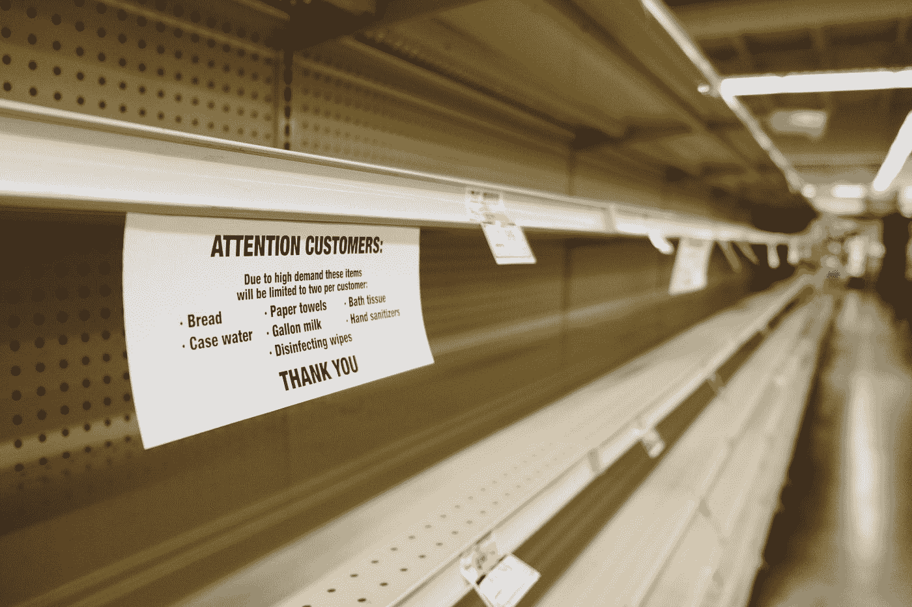
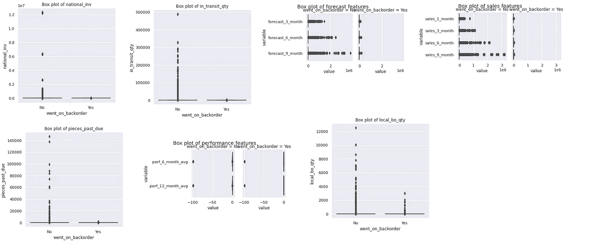
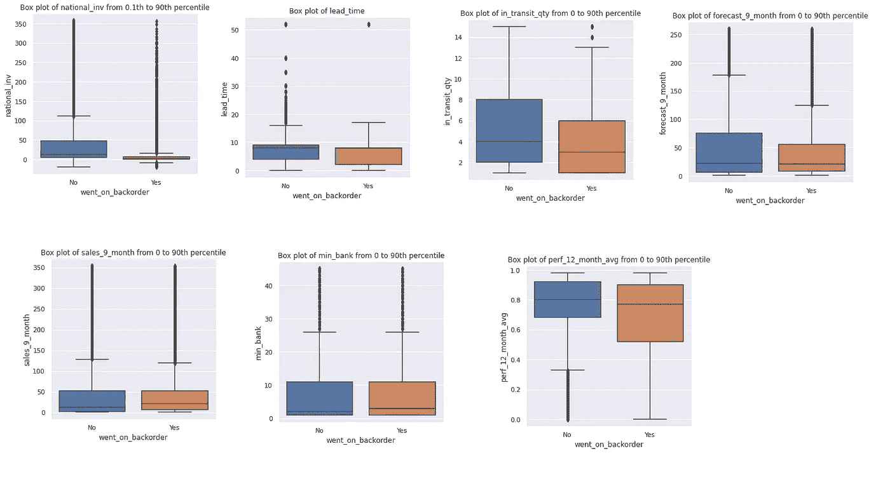
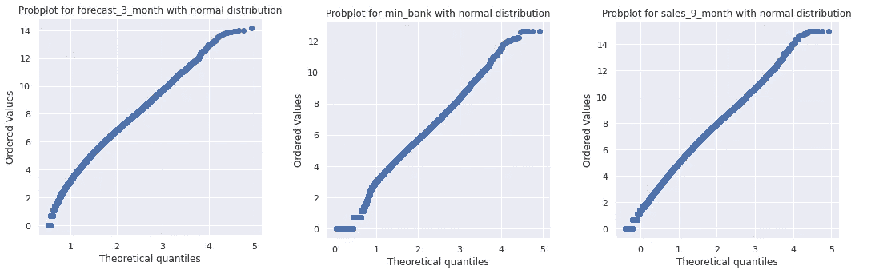
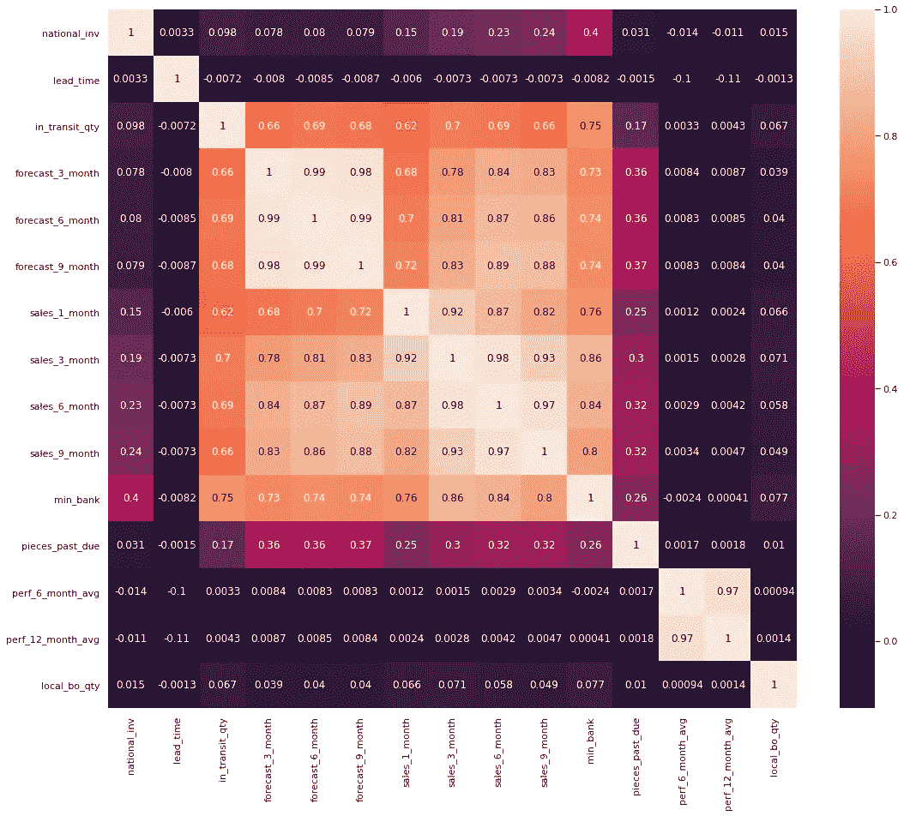
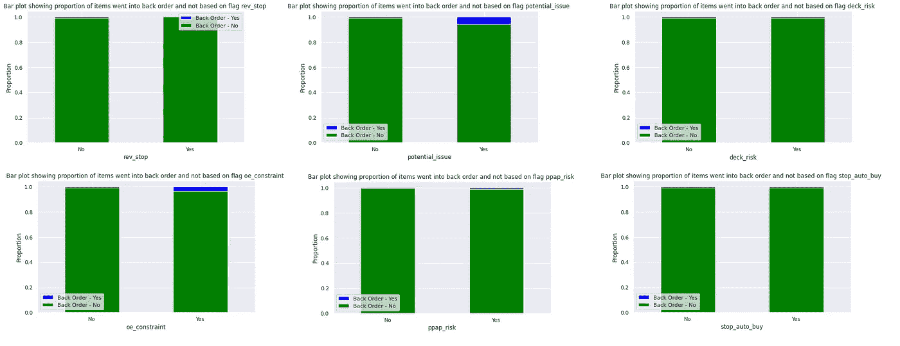
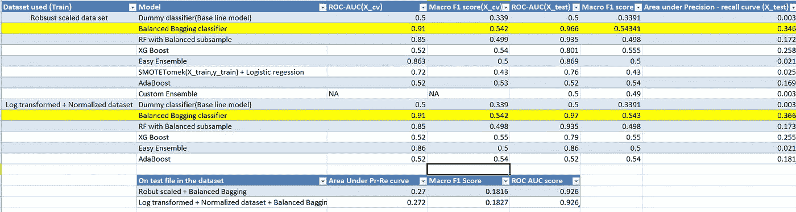
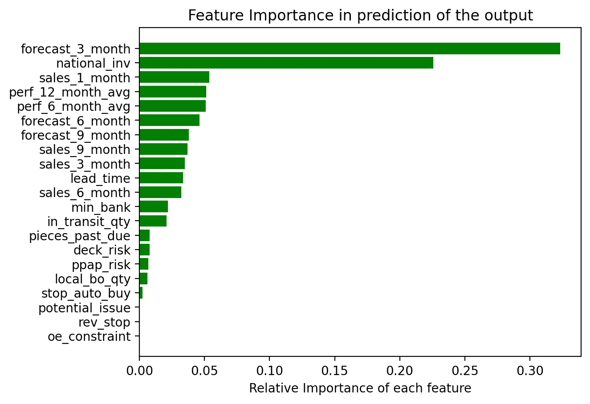
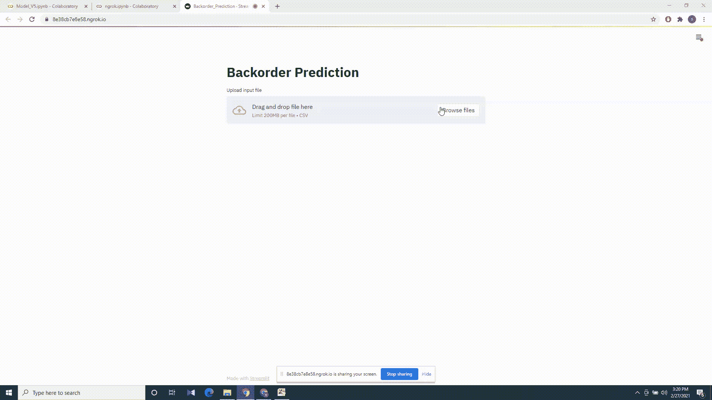

# 延期交货预测

> 原文：<https://medium.com/analytics-vidhya/backorder-prediction-d4f1c5362f18?source=collection_archive---------0----------------------->

## 使用机器学习预测延期交货



韦斯利·廷吉在 [Unsplash](https://unsplash.com?utm_source=medium&utm_medium=referral) 上拍摄的照片

## **目录**

1.  介绍
2.  商业问题
3.  现有解决方案
4.  探索性数据分析
5.  处理阶级不平衡
6.  特征工程
7.  性能指标
8.  建模和评估
9.  参考
10.  链接

## **1。简介:**

延交订单是指由于供应不足或产品目前缺货或不在库存中而无法在给定时间履行，但由于正在生产货物或补充库存，可以保证在未来某个日期交付所要求的货物或服务的订单。与无法承诺交货日期的缺货情况不同，在延期交货情况下，允许客户购买产品并订购。简单地说，延期交货可以被认为是一个延迟交货日期的订单。

**为什么会发生缺货？**

*   **当需求突然增加时:**所有公司的首要目标都是增加对他们所提供产品的需求。销售预测系统不佳可能是无法预测需求的原因之一。尽管有一个很好的销售预测系统，有时这些情况是不可避免的，因为这些因素是不可控制的或不可预测的事件。
*   **供应链管理不善:**如果供应链中的任何一点出现故障，或者由于计划不当，就会出现影响生产的缺货情况。原材料来源选择有限和供应商管理系统不当是延期交货的重要原因之一。
*   **库存管理:**库存运作管理不当和库存存储不透明可能导致缺货。

**延期交货的影响:**

*   如果许多商品持续延期交货，这是公司运营没有合理规划的迹象，也很有可能错过这些产品的业务。
*   此外，如果客户经常遭遇延期交货，他们会转向你的竞争对手。
*   延期交货(不可预测)还会影响生产计划、运输管理和物流管理等。

如何避免延期交货？

*   增加产品的库存或存货不是一个解决方案，因为它增加了存储成本，额外的成本意味着它们必须包含在产品价格中，这可能导致业务被竞争对手抢走。
*   规划良好的供应链管理、仓库管理和库存管理可以在一定程度上避免延期交货。

**拥有延期交货预测系统的需求:**

延期交货是不可避免的，但是通过预测可能延期交货的项目，可以在不同级别优化延期交货计划，从而避免给生产、物流和运输计划带来不可预料的负担。

ERP 系统会产生大量数据(大部分是结构化的),还会有大量历史数据，如果能够正确利用这些数据，就可以开发一个预测模型来预测延期交货并做出相应的计划

## 2.业务问题:

来源:https://www.kaggle.com/[目前该页面不可用](https://www.kaggle.com/)

数据来源:[https://github . com/rodrigos anti S1/back order _ prediction/blob/master/dataset . rar](https://github.com/rodrigosantis1/backorder_prediction/blob/master/dataset.rar)

**问题陈述**:

根据库存、供应链和销售的历史数据，对产品是否会延期交货进行分类(是或否)。

**呈现为 ML 问题:**

手头的任务是在给定输入数据的情况下，对产品是否会延期交货进行分类。

要预测的目标变量由两个值组成:

“是”-如果产品预计会延期交货

“否”-如果产品预计不会延期交货

所以这是一个二元分类问题。

## **3。现有解决方案:**

**使用机器学习预测库存管理中的材料延期交货:**

网址:[https://www . research gate . net/publication/319553365 _ Predicting _ Material _ Backorders _ in _ Inventory _ Management _ using _ Machine _ Learning](https://www.researchgate.net/publication/319553365_Predicting_Material_Backorders_in_Inventory_Management_using_Machine_Learning)

这篇论文的作者解决了手头的问题。作者试图用不同的采样技术(如随机欠采样和过采样技术，如 SMOTE)来克服类不平衡问题。他们还在原始数据上使用了 Blagging 技术(平衡 Bagging 集成分类器)。

模型评估的指标是 AUC 分数和精确-召回曲线下面积。

使用不同的监督机器学习算法，如逻辑回归、决策树、GBDT 和 Blagging 等，并通过 5 重交叉验证调整超参数。

GBDT 和布拉格分类器模型表现良好。当评价标准是精确召回曲线下的面积时，Blagging 分类优于其他模型。

**使用分布式随机森林和梯度推进机器学习技术预测供应链中可能的缺货情况**

网址:

[https://journalofbigdata . springer open . com/articles/10.1186/s 40537-020-00345-2](https://journalofbigdata.springeropen.com/articles/10.1186/s40537-020-00345-2)

在这本杂志中，作者还试图解决我们目前正在研究的数据集上的延期交货预测问题。本文提出了一种预测延期交货的极差方法(宁滨)。使用宁滨方法将数字特征转换成分类特征。由于分类特征与单个数值相比没有显示出特征之间的任何相关性，所以特征中的每个级别(bin)乘以一个特征的 bin 与其他相关数值特征的相应 bin 之间获得的相关系数。

这种方法在计算上非常高效，并且可以用于低延迟系统和可调系统，但是如果没有良好的领域知识，找到正确的 bin 范围是非常困难的。

作者使用随机森林和 GBDT 方法来训练模型，因为这些模型具有高度的可解释性，并且可以根据模型预测轻松地做出管理决策。

在该杂志中，作者声称，与使用原始数据相比，当使用使用上述方法预处理的数据时，性能提高了 20%。

## 4.探索性数据分析:

**数据集分析:**

在训练数据集中，为我们提供了 23 列(特征)数据。

*   Sku(库存单位) :产品 id —对于每一行都是唯一的，因此可以忽略
*   National_inv:产品的当前库存水平
*   提前期:产品的运输时间
*   在途数量:在途产品的数量
*   预测 _ 3 _ 月、预测 _ 6 _ 月、预测 _ 9 _ 月:分别预测未来 3 个月、6 个月和 9 个月的产品销售额
*   Sales_1_month、sales_3_month、sales_6_month、sales_9_month:分别是产品在最近 1、3、6、9 个月的实际销售额
*   Min_bank:推荐的最小股票数量
*   潜在问题:产品/零件中发现的任何问题
*   Pieces_past_due:产品的过期零件数量(如果有)
*   Perf_6_month_avg，perf_12_month_avg:分别是过去 6 个月和 12 个月的产品性能
*   Local_bo_qty:库存逾期金额
*   Deck_risk、oe_constraint、ppap_risk、stop_auto_buy、rev_stop:为产品设置不同的标志(是或否)
*   Went_on_backorder:目标变量

被延期交货(“是”)的产品与未被延期交货(“否”)的产品的分类比率为 1:148。

数据集是高度不均衡的，这应该通过模型的精确预测来解决。

在数据集中给出的 23 个特征中，15 个是数值特征，8 个(包括目标变量)是分类特征。第一列“sku”对应于产品标识符，它对于数据集中的每个数据点都是唯一的。因此，此功能可以删除，因为它在输出预测中没有增加任何价值。

**数字特征统计:**

**观察:**

*   对于大多数特征，平均值大于第 75 百分位值，这表明每个特征的分布都非常右偏。
*   此外，每个特征的第 75 百分位值和最大值之间的差异非常大，这可能是由于异常值的存在。
*   perf_6_month_avg 和 perf_12_month_avg 列具有最大值。值为 1 和最小值。值为-99。似乎缺少的值被替换为-99。

**缺失值:**

*   只有列 lead_time 有几个空值。
*   训练数据集中的最后一行包含应该丢弃的所有 nan 值。

**箱线图:**



箱线图

上面的方框图是针对全部数据绘制的。由于每个特征的尺度(范围)差异很大，所以盒子或 IQR(四分位数范围) (第 25-75 百分位)并不明显。



考虑第 0 和第 90 百分位值之间的值的箱线图

上面的箱线图仅考虑了第 0 和第 90 百分位值之间的值。

请注意，上面包括了预测、销售和绩效列中各一个功能的箱线图，因为每个组都有类似的箱线图。

**观察:**

*   如果我们考虑第 0 和第 90 百分位值之间的数据，则 IQR 是可见的，这巩固了数据极度正偏的观察结果。
*   对于较低的 national_inv(库存)值，与较高的 national_inv 值相比，产品延期交货的几率较高。
*   上述观察结果也适用于提前期和在途数量要素。
*   从 perf_12_month_avg 的箱线图(对于 perf_6_month_avg 也是类似的图)可以注意到，箱线图的整个范围在 0 到 1 之间。考虑到该图仅适用于 0 至 90%的值，并且这些列的最大值为 1，先前观察到的这些列中的-99.0 表示缺失值，因为-99.0 之后的下一个较高值为 0，这是正确的。
*   所有特征在两个盒图中的须状物之后都有大量的数据点，这意味着可能有许多异常值。因为晶须通常代表 1.5 倍 IQR 的范围。
*   对于 98%的数据点，特征 local_bo_qty 和 pieces_past_due 的值为 0。

**QQ 剧情:**

造成极端正偏斜的数据点实际上可能不是异常值。

想一个特定产品的销售在过去 12 个月非常高的例子。这意味着对未来 6 个月和 9 个月的预测将会偏高。如果预测和销售很高，这意味着特定产品的库存和在途数量会很高。此外，与其他产品相比，一些产品的销售额会非常高。考虑到这些，数据中存在的正偏斜度可能并不真正代表异常值。



3 个特征的概率图

**相关矩阵:**



相关矩阵

**观察:**

*   观察到的所有显著相关性都是正的。
*   预测 _ 3 _ 月、预测 _ 6 _ 月和预测 _ 9 _ 月彼此之间的相关性非常强，达到 0.99 的程度。
*   sales_1_month、sales_3_month、sales_6_month 和 sales_9_month 彼此强相关，程度从 0.82 到 0.98 不等。
*   预测和销售列相互关联，最小关联度为 0.62，最大为 0.88。很明显，当某种产品的销售额在过去很高时，对未来几个月的预测也会很高，反之亦然。
*   perf_6_month_avg 和 perf_12_month_avg 之间的相关性非常高，达到了 0.97 的程度。
*   min_bank(推荐的最小库存数量)与销售和预测列高度相关，因为库存中的库存与销售成正比。
*   in_transit_qty 与 sales、forecast 和 min_bank 列高度相关。这是显而易见的，因为产品的高销售额= >更多的产品在运输过程中补充了产品的高销售额= >高预测。
*   pieces_past_due 与 sales 和 forecast 列有很好的相关性。
*   national_inv 与 min_bank 适度相关，而 weekly 与 sale 列相关。
*   由于许多特征是相关的，线性模型如逻辑回归、线性 SVM 和其它线性模型可能不能很好地作为分离平面变化的系数。
*   通过检查相关特征之间的 VIF(方差膨胀因子)值，如果需要，可以移除冗余特征，或者如果模型的特征可解释性不重要，可以使用 PCA 来降低维度

**分类特征柱状图:**



不同旗帜的条形图

上述条形图绘制在分类特征(输入数据中的不同标志)和目标变量之间，X 轴上的标志值为“是”或“否”，X 轴上的值为目标变量分布的比例。

**观察:**

*   如果“rev_stop”标志设置为“是”,则没有产品延期交货。
*   如果 potential_issue 标志为“是”,则与标志设置为“否”的情况相比，产品延期交货的可能性增加了 9 倍。
*   如果 oe_cosntraint 标志设置为“是”,则与设置为“否”的标志相比，产品延期交货的可能性要高 5 倍
*   剩余的标志如果单独与目标变量比较，用处不大，因为两个标志值之间的阳性案例比例几乎相等。

## 5.**处理类别不平衡:**

从 EDA 可以得出结论，数据集是非常右偏，也是高度不平衡的。

阶级失衡可以通过两种方式解决。使用不同的过采样或欠采样技术来平衡数据集，或者在拟合模型本身时，不同的集成可以在平衡的子样本上拟合它们的基础学习器。

[Imblearn](https://imbalanced-learn.org/stable/) 库为解决类别不平衡问题的不同采样技术和不同分类器提供了最佳实现。

**过采样技术:**

*   **重击:**

合成少数过采样技术:它包括找到少数实例的 K 个最近邻，并随机选择一个并产生一个新的数据点 b/w 这两个。

*   **阿达辛:**

自适应合成采样:这类似于 SMOTE。除了 SMOTE 为每个少数样本生成相同数量的样本，而 ADASYN 基于少数样本的密度分布生成，如果密度高，则合成点较少，如果稀疏，则合成点较多。

**欠采样技术:**

**欠采样:**

*   **采样下的接近失误:**在该方法中，算法从计算多数类和少数类的所有实例之间的距离开始。这种方法有 3 种变化。near miss-1:选择平均。到它们的少数类实例的距离最小。侥幸脱险-2:与侥幸脱险-1 相同，但最远而不是最小。near miss-3:从多数类中挑选最接近少数类的给定数量的实例。
*   **使用 Tomek 链接:**移除接近两个类的边界 b/w 的大多数类实例，从而向平衡数据集移动。
*   **在具有聚类质心的采样下:**该方法包括移除多数类的不重要实例。首先，该算法对多数类进行聚类并找到质心。那么远离质心的点被认为是不重要的，并被去除。
*   **在使用邻域清洗规则的采样下:**如果少数实例被 3 个多数类实例包围(最接近)，则多数类实例被移除。如果多数类实例被 3 个少数类实例包围(最近),则多数类实例被移除。

**基于不同模型的类别不平衡处理技术:**

**采用随机欠采样的 Bagging:**这种方法被称为 Blagging，其中我们对多数类进行重新采样，以平衡 bootstrap 样本，然后再对弱学习器进行拟合。实现这种方法的 Imblearn 库为我们提供了选择弱学习者的杠杆，默认情况下，它是一个决策树。

**轻松合奏:**

简单集成包括通过多数类的随机欠采样来创建引导，以创建平衡的引导，然后应用增强的决策树来预测。

此外，sklearn 的随机森林实现提供了不同的选项来解决类不平衡问题，如具有类加权的 RF、具有引导类加权的 RF。

## 6.特征工程:

删除了第一列“sku ”,因为它是一个标识符，并且对于数据集中的所有行都是唯一的。

**处理分类变量:**

由于有许多分类列，onehot 将这些列中的值编码为“是”为 1，“否”为 0。

```
cat = data.select_dtypes(include = ['object']).columnsfor col in cat: data[col].replace({'No': 0, 'Yes': 1}, inplace=True) data[col] = data[col].astype(int)
```

**处理缺失值:**

在 lead_time、perf_6_month_avg 和 perf_12_month_avg 列中发现缺失值。

使用基于模型的插补来估算缺失值。

```
from sklearn.experimental import enable_iterative_imputerfrom sklearn.impute import IterativeImputerimp = IterativeImputer(max_iter=10, random_state=0)imp.fit(X_train)X_train = imp.transform(X_train)X_test = imp.transform(X_test)X_cv = imp.transform(X_cv)
```

**处理数据中的正偏度:**

在这个案例研究中，我以两种方式处理数据中的正偏度(潜在的异常值),从而创建了两个不同的数据集来应用模型。

**使用鲁棒定标器:**

```
from sklearn.preprocessing import RobustScalertransformer = RobustScaler().fit(X_train)X_train = transformer.transform(X_train)X_cv = transformer.transform(X_cv)X_test = transformer.transform(X_test)
```

在应用不同的 ML/DL 模型之前，最好先对数据进行缩放。

在鲁棒缩放中，每个值按如下方式缩放。

值=(值-中值)/(第 75 百分位值-第 25 百分位值)

这种方法在缩放数据时，在不考虑异常值的情况下标准化数据。

Sklearn 提供了相同的实现

**使用对数变换+归一化:**

```
#Lst of columns having right skewed dataskewed_right = ['national_inv' , 'in_transit_qty' , 'forecast_3_month','forecast_6_month','forecast_9_month' , 'sales_1_month','sales_3_month','sales_6_month','sales_9_month' , 'min_bank','pieces_past_due','local_bo_qty']log_columns = []for i in skewed_right:log_columns.append(X_train.columns.get_loc(i))def log_transform(a):"""Applies log transform on input data"""sign = np.sign(a[log_columns])a[log_columns] =  np.log(1.0+abs(a[log_columns]))*signreturn a X_train_log = np.apply_along_axis(log_transform, 1, X_train_log)X_cv_log = np.apply_along_axis(log_transform, 1, X_cv_log)X_test_log = np.apply_along_axis(log_transform, 1, X_test_log)from sklearn.preprocessing import StandardScalersc = StandardScaler().fit(X_train_log)X_train_log = sc.transform(X_train_log)X_cv_log = sc.transform(X_cv_log)X_test_log = sc.transform(X_test_log)
```

对呈现正偏斜的数据集中的列应用对数转换，然后应用标准缩放器。

**应用对数变换的说明:**

```
a[log_columns] =  np.log(1.0+abs(a[log_columns]))*sign
```

取绝对值是为了避免日志中出现负值。

添加了 1.0 以避免日志(0)的情况

乘以符号以在转换后的值中保留原始符号(+或—)。

## 7.绩效指标:

*   ROC AUC 得分:AUC 得分表示模型区分阳性和阴性类别的能力。如果对于模型 1 AUC >模型 2 AUC，那么在大多数阈值下，模型 1 能够比阴性类别更好地识别阳性类别。所以它是这个问题的一个很好的度量。
*   精确度-召回曲线下的面积:Pr-Re 曲线的 AUC 非常重要，因为业务需要根据 b/w 精确度和召回的权衡来选择阈值。低精度= >更多误报(FP) = >未延期交货的项目被归类为延期交货。●召回= >更多的假阴性(FN) = >进行了延期交货的项目被归类为没有进行延期交货。
*   宏观 F1 分数:宏观 F1 分数是正类和负类 F1 分数的平均值。由于存在班级不平衡，评估模型 F1 时需要考虑两个班级的分数。

## 8.建模和评估:

不同的模型使用 GridsearchCV 在不同的超参数上进行调优。下面是模型性能的比较。

与其他模型相比，具有 500 和 1000 个基学习器的平衡 Bagging 分类器分别应用于鲁棒的缩放数据集和对数变换+归一化数据集，表现良好。



不同模型在数据集上的性能

下面是预定义输出时相对特征重要性的快照。



模型预测中的特征重要性

创建了一个简单的 Streamlit webapp，用于使用最佳模型在运行时预测查询点。



用于运行时预测的流点燃 webapp

## 9.参考资料:

[https://www . researchgate . net/publication/319553365 _ Predicting _ Material _ Backorders _ in _ Inventory _ Management _ using _ Machine _ Learning](https://www.researchgate.net/publication/319553365_Predicting_Material_Backorders_in_Inventory_Management_using_Machine_Learning)

[](https://journalofbigdata.springeropen.com/articles/10.1186/s40537-020-00345-2) [## 用分布式随机森林和模糊神经网络预测供应链中可能的缺货情况

### 使用机器学习算法的预测在商业决策过程的许多部分都不太适用，因为…

journalofbigdata.springeropen.com](https://journalofbigdata.springeropen.com/articles/10.1186/s40537-020-00345-2) 

[https://www . researchgate . net/publication/327752791 _ Demand _ Forecasting _ Using _ Artificial _ Neural _ Networks-A _ Case _ Study _ of _ American _ Retail _ Corporation](https://www.researchgate.net/publication/327752791_Demand_Forecasting_Using_Artificial_Neural_Networks-A_Case_Study_of_American_Retail_Corporation)

[](https://machinelearningmastery.com/bagging-and-random-forest-for-imbalanced-classification/) [## 用于不平衡分类的装袋和随机森林-机器学习掌握

### Bagging 是一种集成算法，它在训练数据集的不同子集上拟合多个模型，然后结合…

machinelearningmastery.com](https://machinelearningmastery.com/bagging-and-random-forest-for-imbalanced-classification/) [](https://heartbeat.fritz.ai/resampling-to-properly-handle-imbalanced-datasets-in-machine-learning-64d82c16ceaa) [## 机器学习中正确处理不平衡数据集的重采样

### 回顾欠采样和过采样

heartbeat.fritz.ai](https://heartbeat.fritz.ai/resampling-to-properly-handle-imbalanced-datasets-in-machine-learning-64d82c16ceaa) 

www.appliedaicourse.com

## 10.链接

Github 代码库

【https://github.com/Srinivasa-Raja/Backorder 

[](https://www.linkedin.com/in/srinivasa-raja-yaramati-aba535113/) [## Srinivasa Raja Yaramati -数据科学家- Infosys | LinkedIn

### 查看 Srinivasa Raja Yaramati 在世界上最大的职业社区 LinkedIn 上的个人资料。斯里尼瓦萨拉贾有 1…

www.linkedin.com](https://www.linkedin.com/in/srinivasa-raja-yaramati-aba535113/)