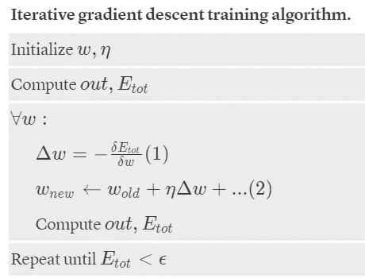
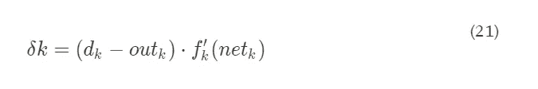

# 假人的反向传播

> 原文：<https://medium.com/analytics-vidhya/backpropagation-for-dummies-e069410fa585?source=collection_archive---------1----------------------->

通过[machine learning knowledge . ai](https://machinelearningknowledge.ai/wp-content/uploads/2019/10/Backpropagation.gif)进行反向传播图解

# 目录:

1.  简介和动机
2.  前提
3.  算法
4.  单个单元的计算
5.  通用单位的计算
6.  总结和解释
7.  结论
8.  代码片段
9.  参考
10.  其他有用的来源

# 1.简介和动机

反向传播算法在 70 年代就已经存在，但是直到大卫·鲁梅尔哈特、罗纳德·威廉姆斯和(猜猜是谁)的一篇[著名论文](https://www.nature.com/articles/323533a0)发表后，它的重要性才被充分认识到。)杰弗里·辛顿于 1986 年出版。

今天，反向传播算法是 ML 中的一个里程碑:它是神经模型中学习的主力。

我强烈认为理解这种算法背后的数学是有用和有趣的，原因有很多:首先，停止将神经网络学习仅仅视为“黑盒”是有用的，不幸的是，这是一种非常常见的方法，因为存在为我们执行计算的快速而简单的库。许多人止步于他们的应用程序，很少有人阅读文档，几乎没有人对背后的微积分感兴趣(除非他们在大学有考试要通过！).另一个原因是“ [*虽然表达有些复杂，但也有一种美，每个元素都有一种自然，直观的解释*](http://static.latexstudio.net/article/2018/0912/neuralnetworksanddeeplearning.pdf) ”。大多数数学步骤都有特定的解释和意义，这对更好地理解神经模型非常有趣和有用:它们实际上让我们详细了解了改变权重和偏差如何改变网络的整体行为。

我希望我提供了足够的动机，但是如果你需要其他的，我建议你阅读 A. Karpathy 的这篇文章。

在这篇文章中，我将回顾反向传播算法背后的数学过程，并以最简单的方式一步一步地展示所有的推导和计算。

> 我希望这能帮助你克服对“反向投影数学地狱”的恐惧，让你相信它根本不存在。

# 2.前提

# 2.1 符号和上下文

多层感知器结构和我们的符号。由 [D 格利亚](https://medium.com/u/c5118da752b?source=post_page-----e069410fa585--------------------------------)手工绘制的草图。

我们考虑一个非常**的基本架构**，所谓的 [**多层感知器**](https://en.wikipedia.org/wiki/Multilayer_perceptron) ，即只有一个隐藏层的前馈全连接神经网络。

*   ***i*** =指一个通用的**输入**单元(这样输入单元就是 ***i_1，…，i_i*** )。
*   ***j*** =指一个通用的**隐藏的**单元(这样隐藏的单元就是 ***h_1，…，h_j*** )。
*   ***k*** =指一个通用的**输出**单元(这样隐藏的单元就是 ***o_1，…，o_k*** )。
*   ***w_ji*** =将输入单元 ***i*** 关联到隐藏单元 ***j*** 的连接的权重。
*   ***w_kj*** =将隐藏单元 ***j*** 关联到输出单元 ***k*** 的连接的权重。
*   ***d*** =与每个输出单元相关的目标值。
*   我们在一个 [**监督学习**](https://en.wikipedia.org/wiki/Supervised_learning) 的设定中。
*   **训练集**被定义为 ***{(x_1，d_1)，…，(x_l，d_l)}*** ，因此它包含从 1 到 *l* 的所有对(输入，目标)。

# 2.2 成本函数

从 [1986 年的论文](https://www.nature.com/articles/323533a0)中出现的是*反向传播旨在通过调整网络的权重和偏差*来最小化 *所谓的* ***代价函数*** *(基本上，我们可以通过改变***和****来控制这个函数相对于这些参数，调整水平由成本函数的* ***梯度*** *确定。**

*因此，反向传播的**目标是计算成本函数**相对于网络中任意权重*或偏差 ***b*** 的**偏导数。****

**为了进行反向传播，我们需要对成本函数的形式做出两个主要假设。然而，在陈述这些假设之前，记住一个示例成本函数以及成本函数本身的定义是有用的。**

> **尽管我们想当然地认为，在本文中，读者对 ML 有一些基本的了解，但我们提供了一个非常快速的成本函数定义(也称为“度量”)。这是一个函数，它(I)测量给定数据的模型性能，(ii)量化预测值和期望值之间的误差(iii)并以单个实数的形式呈现。**

**根据问题的不同，可以用许多不同的方式来形成成本函数。在我们的上下文中，成本函数的目的是**最小化，**即返回值通常被称为**成本、**或**误差、**，目标是找到模型参数的值，函数本身返回尽可能小的数字。因此，当训练我们的网络时，目标将是使这个成本函数的值尽可能低。**

**这里我们将使用一个最常用的指标，即**均方误差**，即预测和预期结果之间的平均平方差(换句话说，是 MAE 的一种变体，不是取差的绝对值，而是取差的平方)。**

**我们为什么选择 MSE？你应该知道用 MAE 做微分学是有问题的。相反，MSE 具有良好的数学特性，这使得其导数的计算更容易，并且这在使用依赖于梯度下降算法的模型时是相关的。**

> **MSE 可以用 Python 在[中这样写](https://www.notion.so/e677359e2e5c2d0cbbda55718afb5f69)。**

**那么为了应用反向传播，我们需要对我们的成本函数做什么样的假设呢？**

***我们需要的第一个假设*是**成本函数可以写成单个训练例子的平均成本函数**，我们称之为“模式” **p** 。有了这个假设，我们就假设模式 ***p*** 已经固定，有时会把 ***p*** 下标去掉，把成本 ***E_p*** 写成 ***E*** 。**

***我们对成本做出的第二个假设*是**它可以写成神经网络**输出的函数。根据 MSE 的定义，它完全满足这个假设。**

**鉴于这些前提，我们将使用的误差函数定义如下:**

*   **每个单一模式的误差**T5 pT7 定义为:****

****

**每个训练示例的 MSE**

**即对于模式 ***p*** 计算实际目标*与产生的输出 ***o*** 、w.r.t 所有的 ***k*** 输出单元(如前所述，为简化符号 ***p*** 最终将被省略)。***

*   **所有模式的(总)误差定义为每个模式的误差之和:**

****

**总误差**

**基于该误差函数值，模型“知道”调整其参数多少，以便更接近预期输出 ***d*** 。这正是使用反向传播算法发生的。**

***如果想对现有的其他常用于神经网络的代价函数有一个大概的了解，我建议阅读* [*这篇文章*](https://stats.stackexchange.com/questions/154879/a-list-of-cost-functions-used-in-neural-networks-alongside-applications) *。此外，对于使用比 MSE 更复杂的成本函数进行的反向传播导数计算，如交叉熵似然，我建议阅读* [*这篇文章*](/@pdquant/all-the-backpropagation-derivatives-d5275f727f60) *以及* [*这篇文章*](http://neuralnetworksanddeeplearning.com/chap3.html) *。***

# **2.3 需要微积分基础**

**这些是我们需要知道的微分规则，以便解决所有下面的计算。**

**如你所见，他们只有三个！它们将有力地帮助我们一步一步地处理梯度计算。**

****

**微分学基本公式**

# **3.算法**

# **3.1 梯度下降**

**我们记得，我们的目标是找到使总误差 ***E_tot*** 最小的 ***w*** 参数值。**

> **剧透！为此，我们使用**最小均方(LMS)方法**，即通过连续迭代最小化均方误差(MSE)。**

**我们如何在训练过程中最小化成本函数，以找到一组最适合我们目标的权重？**

**为了做到这一点，我们来看看一类算法，称为**迭代优化算法**，它们逐步朝着最优解前进。这些算法中最基本的是**梯度下降，**，它跟随导数基本上沿着斜坡“滚动”，直到找到(全局)最小值。**

**一个问题可能会出现:**为什么**计算**梯度**？要回答这个问题，我们首先需要重温一些微积分术语:**

*   **函数在点 *x* 的梯度是函数在 *x* 的[偏导数](https://en.wikipedia.org/wiki/Partial_derivative)的向量。**
*   **[*函数的导数衡量函数值(输出值)相对于其自变量 x(输入值)变化的敏感度*](https://en.wikipedia.org/wiki/Derivative) *。换句话说，导数告诉我们函数的走向。***
*   **梯度显示了参数 *x* 需要改变多少(正向或负向)以最小化函数。**

**因此，我们的目标是计算误差的梯度，然后取其相反值，以使**下降方向在*E _ tot*的表面上(最小化**梯度下降法**)。如果我们重复这个过程足够多(迭代)，我们很快就会发现自己几乎在曲线的底部，更接近我们网络的最佳权重配置。****

****

***例****E _ tot****景观在空间中的两个权重(w1 和 w2)；局部梯度显示在 z 点。沿着(梯度)方向，我们可以到达 Zmin 点。***

***注意:对于依赖梯度下降来优化模型参数的算法，每个函数都必须是可微分的！(而且，一般来说，也应该或多或少是凸的——*[*)现实中，任何网络或代价函数几乎不可能是真正凸的*](https://ayearofai.com/rohan-lenny-1-neural-networks-the-backpropagation-algorithm-explained-abf4609d4f9d)*——)。***

# **3.2 升级规则**

**更正式的说法是，梯度下降看起来像这样:**

****

**权重更新的增量规则**

**这就是梯度下降更新规则(又名 [**delta 规则**](https://en.wikipedia.org/wiki/Delta_rule) )。它告诉我们如何更新我们网络的权重，以使我们更接近我们正在寻找的最小值。**

**我不会在这里详述学习速率、动量、正则化和其他技术以及神经网络的**超参数**。相反，我会在最后参考部分放一些有趣的链接到其他文章，以防你想了解更多！(或者也许我会写另一个关于参数调整的中等故事…谁知道呢？).同样是为了考虑关于反向传播算法的最优性和复杂性，以及选择迭代优化算法的其他选项(Adagrad，Adam，…)。**

**基本原则始终保持不变——逐渐更新权重，使其更接近最小值。但是，无论您使用哪种优化算法，我们仍然需要能够计算成本函数相对于每个权重的梯度。**

**在我们的上下文中，权重的变化被定义为每个模式相对于其权重的误差在所有模式上的总和。**

****

**梯度计算**

# **3.3 伪代码**

**T **何问题:**计算代价函数的梯度，建立所谓的**广义 delta 规则。****

**T **何思路:**计算损失函数( ***E_tot*** ) →计算梯度→更新网络中所有权重 ***w*** 。然后重复直到收敛或直到其它停止标准。**

****

**由格利亚制作的反向传播伪代码。**

****

**比萨大学计算机科学系 A. Micheli 的反向传播伪代码**

***步骤(1)* 表示适当的梯度计算。我们将集中讨论这一点。**

***步骤(2)* 是 ***w*** 的升级规则——参见上面的“delta 规则”。**

# **4.单个单元的计算**

**作为初步练习，我建议我们从一个简单的计算开始，只是为了熟悉我们将在第 5 节中需要的数学步骤和技巧。此外，通过这个练习，我们获得了一个以后需要的结果。如果你对微分学很有信心，你可以跳过这一节，然后回到这里得到你需要的步骤，已经为你计算好了。**

**正如我所说的，作为初步的练习，我建议从考虑单个神经元 ***i*** *开始。***

> **我们要做的是:*计算误差的导数 w.r.t.* ***单个单元******I***，即计算****

******

***我们首先编写如上定义的误差函数，概述输出*作为 ***网*** 的函数的作用:****

******

***这里用粗体突出显示了输入向量和相应权重之间的标量积，即 ***网。******

******

***为了简单起见，正如前面已经提到的，我们只考虑误差 ***E_p*** ，所以 w.r.t .一个单一的模式 ***p*** ，然后我们在最后总结所有的东西。***

***现在我们应用链式法则，因此我们分解 w . r . t .***网*** *。****

******

***其中函数 ***f*** 对应误差，函数 *g* 对应网，两者都是变量 ***x*** *，*的函数，对应与我们正在考虑的单元 *i* 相关联的权重 *w* 。***

***因此我们得到:***

******

***我们将分别求解(4)中的两个分量。***

*   ***首先，**我们关注第二项**，我们用所有分量的和来扩展点积:***

******

***这是因为除了第 I 个**组件之外，每个组件的术语都等于零。为了更好地理解，我们给出了所有可能术语的总和:*****

********

*   ****现在**我们关注(4)中的第一项**:我们再次使用(3)中的链式法则，但是现在我们认为函数 *g* 输出 ***o*** ，为此我们使用符号 ***out*** 。****

******

***其中 ***f*** 为**激活功能。*****

***因此我们得到:***

******

***通过明确定义*和 ***网*** 分别为(2)和(5)，我们得到:****

******

***现在我们再次分别考虑这两个术语。***

*   ***对于(6)中的**第一项**，通过回忆(1)，我们得到:***

******

***这是因为，对于公式***

******

***我们有***

******

***其中***

******

*   ***对于(6)中的第二项,我们有:***

******

***将所有内容放在一起，我们得到(6)的结果:***

******

***并且我们可以写出(4)的**最终结果**:***

******

***在哪里***

******

***所以我们可以这样写结果***

******

***新德尔塔规则***

> ***这就是**新德尔塔法则**。***

# ***5.通用单位的计算。***

> ***你知道链式法则吗？那你就知道神经网络反向传播算法了！***

***现在，与前面的简单情况不同，我们有不止一个单元，而是多个单元，所以我们需要引入索引 ***t*** 来表示多个单元中的一个单元。***

***现在改变的是**我们不知道单元 *t* 在网络架构**中的位置(这就是为什么它是*泛型*)，所以我们必须考虑和区分两种情况**是隐藏单元还是输出单元**。***

***W **我们要做什么** : *假设一个特定的模式* **p** ，*计算误差的导数 w.r.t.* ***一个类属单位* t** *，即计算****

******

***回想 3.2 节中的“梯度计算公式”，我们可以改写为***

******

***其中***t*** 是网络中的一个通用单元 ***i*** 从一个通用单元****out _ I***到单元**【t**。******

***这是因为，如前所述，***

******

***注意:记住，一如既往，为了我们的计算目的，我们考虑一个*单个*模式 ***p*** 。***

***我们首先应用链式法则(3)w . r . t .***网*** 在公式(10)*中，我们得到:****

********

****与第 4 节一样，我们继续分别考虑这两个术语。****

*   ****对于(11)中的第二项,我们有****

********

****这是因为，回想一下*网的定义* (2)和*出* (5)****

******

***其中 *a* 用作内部总和的通用索引。***

***既然我们不知道我们在网络中的什么位置，最好用 ***out*** 来表示它是另一个单元的输出。***

***(12)的所有分量都为零，除了***j****=****I****的情况。*所以我们有***

******

***(这表示从一个通用单元 ***out_i*** 到单元 ***t*** 的输入 ***i*** )。***

*   ***现在我们考虑(11)中的第一项,我们引入一个新变量来表示它。然后我们应用链式法则 w . r . t .***out***来计算这个量***

******

***同时，我们用我们得到的结果重写(10 ),以便总结我们到目前为止所做的工作:***

******

***现在，为了解决(13)中的剩余项，即***

******

***我们必须根据**在网络中的位置来区分案例。*****

1.  ***单元 ***t*** 是**输出单元**吗？***
2.  ***单元 ***t*** 是**隐藏单元**吗？***

***这是因为两者对误差的贡献 *E* 不同。事实上，由于我们正在计算误差 w.r.t .的偏导数，单位 ***t*** *，* 这种影响在情况 1 和情况 2 中呈现出完全不同的形状，因此我们*必须*考虑并区分这两种情况。***

> ****提示:使用下面的网络图来定位每种情况下的单元 t！****

******

***我们的神经网络的结构(MLP 的简单放大)由 D·格利亚[制作](https://medium.com/u/c5118da752b?source=post_page-----e069410fa585--------------------------------)。在接下来的计算过程中关注它，想象我们在两种情况下所处的位置，会非常有帮助。***

***让我们一次深入一个案例。***

## ***案例 1***

***通用单元 ***t*** 是一个**输出**单元 ***k*** *。****

***在这种情况下:***

******

***注意，在下文中，我们区分索引 ***k*** 和***k’****。*特别是，****k’***是我们仅用于内部求和的值，而 ***k*** 是一个固定值，表示我们正在推导的*w . r . t。*****

****因此，通过应用公式(8)和(14)，我们得到****

********

****这是因为，在做求和显式时，除了***k’****=****k***中的一项外，所有项都为零。于是 **∑** 符号消失了。****

******

***最后的结果是:***

******

***通过将(13)和(15)放在一起，我们得到输出单位 ***k*** 的导数:***

******

***这恰恰是一个**误差信号**，因为它包含了产生的输出和期望目标之间的**差异(记住我们是在监督学习设置中)**。*******

***(*现在你可以体会到初步练习的效用了！*)***

## ***案例 2***

***通用单元 ***t*** 是一个**隐藏**单元 ***j*** 。***

> ****提示:*作为进一步的帮助，利用上面的图片，尝试找出我们在计算的每一步在网络结构中的位置。***

***这是一个更有趣的情况，因为这正是定义 MLP 学习算法的问题出现的地方:模型不容易将相应的信用分配给隐藏单元(*信用分配问题——CAP*)，因为**误差信号不可直接测量**。我们不知道隐藏单元的误差或期望的答案(更新它们的权重绝对需要的信息！).因此，正是从这种背景下，需要反向传播算法出现。***

******

***信用分配问题(CAP):如何调整隐藏层中单元的权重？***

***于是我们有了***t = j****现在我们重点解决这个术语:****

********

****我们再次应用链式法则，但是**利用我们所知道的关于我们网络**的结构的知识:我们知道隐藏单元与所有的输出单元相连接(即对于每个 ***k*** 存在与 ***j*** 的连接)。所以我们将**对输出层**中所有单元 *k* 的贡献进行求和，因为我们不知道它们中的哪一个会感兴趣，而**隐藏单元 *j* 的影响是在整个输出层上。******

> ***考虑隐藏单元对所有输出单元的所有这些贡献(并将它们相加)是反向传播算法的关键点。***

******

****这种形式表达了误差 E w r t 的变化。所有输出单元 k。每个 out_k(和 net_k)取决于 out_j，因此我们在 k 上引入一个和。****

***这样我们已经分解考虑了 ***网*** 对输出层 ***k*** 的影响，以及所有输出单元 ***j*** 对****k****的影响。*****

***特别要注意的是,( 17)中的第一项之前已经求解过了！解决方法正好是**情况 1** 中的(16)。***

***所以我们只专注于求解(17)的第二项。***

******

***和前面的例子一样，所有的偏导数都为零，除了当***‘****=****j****。*所以我们把(16)和(18)放在一起，(17)的最终解是***

******

***因此，对于**情况 2** ，我们可以为隐藏单元写入**错误信号。*****

******

***注意，如果你愿意，你也可以直接导出(19)，如下图所示。***

******

***[Federico Errica](https://medium.com/u/e42f64a3e15?source=post_page-----e069410fa585--------------------------------) 对案例 2 推导的替代版本(直接)***

***现在我们有了输出(16)和隐藏(20)单元的偏导数，我们终于可以**升级权重**(如果需要，回到 3.2 节)。***

****网络中的任何*权重都有一个一般化的 delta 规则(10)，其中***∏t***项采用(16)或(20)的形式，这取决于所考虑的是哪种单元(分别为输出或隐藏——情况 1 或 2)。***

***(20)中值得注意的是权重 ***w_kj*** 的存在。这意味着**我们正在将*∏k*从输出层反向传播到隐藏层**，正好通过连接它们的权重。所以我们是**通过整个网络反向传播错误信号**(因此得名**)，以一种与输出和隐藏单元之间的连接权重成比例的方式。*****

***注意:当然我们总是要考虑到网络的形状。在这种情况下，我们假设在单元*和 ***k*** 之间存在连接(我们认为参考模型 a *完全连接的前馈神经网络)*。****

***一般来说，**根据您网络架构上的连接，您可以通过修改之前偏导数计算中的相应数学步骤来改变增量**的传播。***

> ***数学遵循网络的架构。***

# ***6.总结和解释***

***对于一个通用单元 ***t*** ，用来自 ***out_i*** 的输入，我们推导出:***

******

*   ***如果 ***t = k*** (即 ***t*** 为输出单位)***

******

*   ***如果 ***t = j*** (即 ***t*** 是一个隐藏单元)***

******

> ****实施提示:*对于每种模式 **p** 该计算可直接用于在线表单或对批量表单求和。***

***为了更好地理解和可视化来自输出层的误差信号的**反向传播(这是算法的关键部分)，由连接 ***w_kj*** 表示，我们关注(22)中的和，并在下图中给出其图形表示。*****

******

***从输出层反推增量值，以获得隐藏层的误差信号(通过 [D 格利亚](https://medium.com/u/c5118da752b?source=post_page-----e069410fa585--------------------------------))。基于δk 和相关的权重 w_kj，它表示单位 j 对误差的影响。***

***图像显示了 delta 在每个输出单元 ***k*** 的贡献，求和，用各自的连接权重 ***w_kj*** 加权，传递给隐藏单元 ***j*** 。当然这个过程代表每个隐藏单元***j****。在某种意义上，我们可以说关联权重 ***w_kj*** 代表单元 ***k*** 对其误差负责的程度。在这种情况下，总误差的一般**责任将根据权重*w _ kj*通过网络进行分配(这里我们只计算了局部值:但是权重的变化对网络具有全局影响)。******

> ***反向传播的美妙之处在于，通过这种“delta 思想”,它能够在整个网络结构上分解误差的影响，以及每个权重对误差的影响。***

***这种逆向传播的过程可以**推广并应用于具有许多隐藏层的更深层次的模型**。在这种情况下，增量不仅来自输出层，还来自当前层之上的*任何通用层(通用上层 K)。****

***因此，对于每个图案 ***p*** :***

******

***其中 ***δt*** 为单位 ***t*** *，***o _ I**为单位 ***i*** 到单位***t*** 通过连接 ***w_ti*** 的输入。***

***因此，反向传播算法**不仅适用于 MLP，而且通常适用于任何神经模型**(对模型本身的结构进行适当的修改和调整)。它是训练递归神经网络、深度学习模型等的基础***

******

***[machine learning knowledge . ai](https://machinelearningknowledge.ai/wp-content/uploads/2019/10/Backpropagation.gif)反向传播插图***

***回到本文开头的图像，我们可以再次观察这个过程，但现在已经完全理解它了。动画中的后箭头显示了误差如何反向传播到前层，直到最后，同时网络中的神经元开始调整其权重。***

# ***7.结论***

***算法运行的“秘密”是，一旦我们选择了激活和误差函数，我们计算的每个导数都可以被简化，这样整个结果将代表一个数值。在这一点上，任何抽象已经被移除，并且网络中的任何权重的误差导数 w.r.t .可以在**梯度下降** **方法**(如前所述)中使用，以迭代地改进权重。***

***T [*他这是反向传播！简单地计算导数，这些导数被提供给凸优化算法。在现实中，反向传播只是链规则的一个相当乏味的应用(但同样，对于一个一般化的实现，计算机会处理这个)。*](https://ayearofai.com/rohan-lenny-1-neural-networks-the-backpropagation-algorithm-explained-abf4609d4f9d)***

> ****学习提示:*阅读 3 个层次的推导:(i) 奇异数学步骤(ii)解释一个量相对于其它量的(局部)变化(由于偏导数)(iii)所提供的分解的含义的一般框架，即找到分解手头网络上的δ误差的每个层次的δ值。***

# ***8.代码片段***

***如果您需要一些现成的代码作为您实现的起点或作为参考来完全理解本文的范围，请查看 [***这个 GitHub 库***](https://github.com/dilettagoglia/impl-NN-from-scratch) 。***

****我强烈建议尝试您自己的不同实现，作为进一步掌握反向传播功能的手段，探索不同的行为，并从该算法中获得乐趣！****

# ***9.参考***

1.  ***Rumelhart，D. E .、Hinton，G. E .和 Williams，R. J .,“并行分布式处理”麻省理工学院出版社，剑桥，MA (1986) [第 8 章](https://web.stanford.edu/class/psych209a/ReadingsByDate/02_06/PDPVolIChapter8.pdf)。***
2.  ***汤姆·米契尔，《机器学习》。麦格劳·希尔(1996)第 4 章。***
3.  ***Haykin，s，“神经网络”，第二版。普伦蒂斯霍尔(1998 年)。***
4.  ***“基于反向传播的学习算法的推导”， [A. Micheli](http://pages.di.unipi.it/micheli/) ，比萨大学计算机科学系，(乳胶版，作者 [F. Errica](http://pages.di.unipi.it/errica/) )***
5.  ***《神经网络和深度学习》，第二章，网址:[neuralnetworksanddeeplearning.com](http://neuralnetworksanddeeplearning.com/)***
6.  ***Kamil Krzyk，“初学者的[编码深度学习—线性回归(第二部分):成本函数](https://towardsdatascience.com/coding-deep-learning-for-beginners-linear-regression-part-2-cost-function-49545303d29f)”，载于[medium.com](/)***
7.  ***Simeon Kostadinov，[理解反向传播算法](https://towardsdatascience.com/understanding-backpropagation-algorithm-7bb3aa2f95fd)，2019，在[towardsdatascience.com](http://towardsdatascience.com)***
8.  ***[machine learning knowledge . ai](https://machinelearningknowledge.ai/)中的[前馈神经网络架构](https://machinelearningknowledge.ai/animated-explanation-of-feed-forward-neural-network-architecture/)动画讲解***
9.  ***Kapur，r .“[神经网络&反向传播算法，在](https://ayearofai.com/rohan-lenny-1-neural-networks-the-backpropagation-algorithm-explained-abf4609d4f9d)[medium.com](/)发表于 2016 年***

# ***10.其他有用的来源***

***我希望这篇文章能够揭示反向传播背后的数学原理。为了进一步提高你的知识，我在这里推荐一些其他有用的资源来阅读。*尽情享受吧！****

*   ***我的 [Youtube 播放列表](https://youtube.com/playlist?list=PLVQpN6IRSo6mXO6LzzlIRLdb2VSf9mgZL)关于反向传播***
*   ***[《机器学习](https://machinelearningknowledge.ai/cost-functions-in-machine-learning/#MSE_Vs_MAE_8211_Which_one_to_choose)中成本函数的傻瓜指南》，载于[machinelengknowledge . ai](https://machinelearningknowledge.ai/)***
*   ***Prakash Jay，"[反向传播非常简单。谁让它变得复杂了？](/@14prakash/back-propagation-is-very-simple-who-made-it-complicated-97b794c97e5c)、[medium.com](/)***
*   ***图沙尔·古普塔，“[深度学习:反向传播](https://towardsdatascience.com/back-propagation-414ec0043d7#.tje3h7wi0)”，[towardsdatascience.com](https://towardsdatascience.com/)***
*   ***Bernard Widrow 和 Eugene Walach，“[自适应神经网络三十年:感知器、Madaline 和反向传播](https://onlinelibrary.wiley.com/doi/pdf/10.1002/9780470231616.app7)”，载于《自适应逆控制:信号处理方法》，2008 年再版***

****如果你喜欢这篇文章，请推荐分享。谢谢你。****