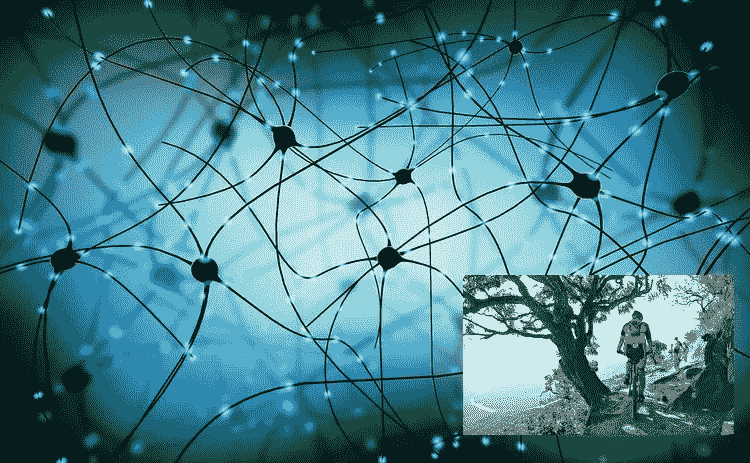
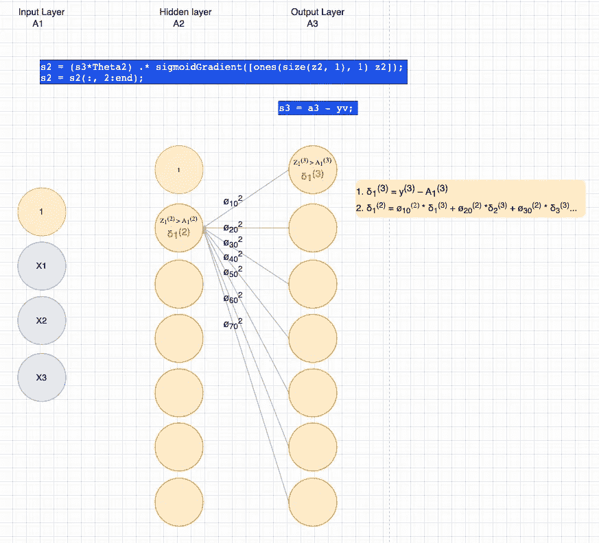
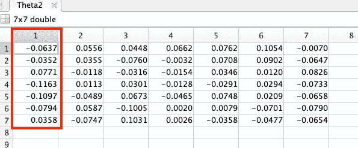
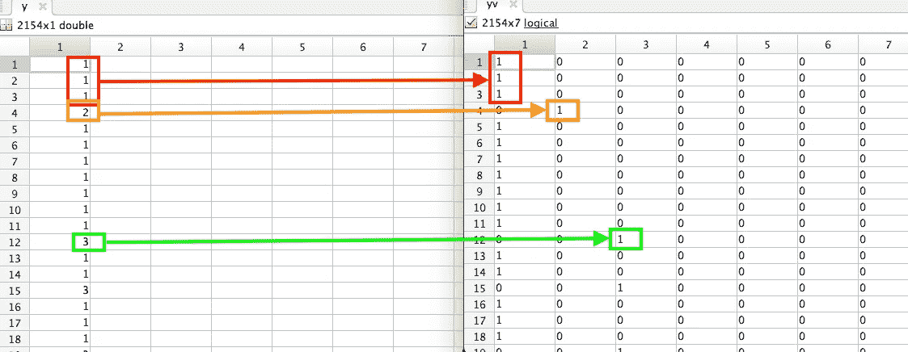
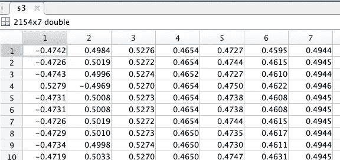
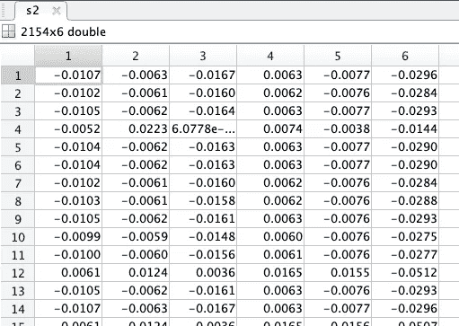

# 神经网络反向传播深潜 103

> 原文：<https://medium.com/analytics-vidhya/backward-propagation-deep-dive-103-60390714d2b0?source=collection_archive---------12----------------------->



反向传播是一个很难解释的问题。让我们在这里试一试，展示代码和输出数据。

这是我的神经网络系列的第 3 部分。如果你只是想要代码，欢迎从第一部分的开始，或者跳到第五部分的。

因此，为了执行梯度下降或成本优化，我们需要编写一个成本函数，它执行:

1.  [正向传播](https://shaun-enslin.medium.com/forward-propagation-deep-dive-102-bbeabe4d2fb2)
2.  [反向传播](https://shaun-enslin.medium.com/backward-propagation-deep-dive-103-60390714d2b0)
3.  [计算成本&坡度](https://shaun-enslin.medium.com/cost-and-gradient-calculation-in-neural-networks-deep-dive-104-2e16f26ce3f3)

**本文关注于(2)反向传播。**

因此，我们在图 1 中简化了我们的神经网络，仅显示了在每层的一个单元(圆)中计算 S3 和 S2 的细节。



图 1

# 砝码

从[第 2 部分](https://shaun-enslin.medium.com/forward-propagation-deep-dive-102-bbeabe4d2fb2)中，我们了解了我们的权重(θs)是如何初始化的，所以为了直观显示图 1 所指的权重(φ),请参见图 2。



图 2

# 重新格式化 Y

在我们继续之前，如果您理解([第 1 部分](https://shaun-enslin.medium.com/explaining-neural-networks-101-a36356113cbd))我们的 Y 列，其中包含用于对客户进行分类的标签。然后，为了继续反向传播，我们需要将 Y 重新格式化为一个对应于标签数量的矩阵。在我们的案例中，我们的客户有 7 个类别。

图 3 显示了如何将 **Y** 转换为矩阵 **yv** 并且标签现在在适当的列中显示为二进制。

```
yv = [1:num_labels] == y;
```



图 3

# 正向传播

计算图 1 中的 S3 相当容易，是一个相当简单的成本函数，将我们在 A3 中的假设与我们在 yv 中的实际类别进行比较。您将在图 4 中看到结果。

```
s3 = a3 — yv;
```



图 4

S3 结束后，我们可以转移到 S2，这是一个更棘手的问题。我们将θ应用于 S3，并乘以这一层的梯度。这就是我们把 Z2 放在前进档的原因。

> 请注意，我们删除了 back prop 中的偏置列

```
s2 = (s3*Theta2).*sigmoidGradient([ones(size(z2, 1), 1) z2]); 
s2 = s2(:, 2:end); 
```

下面可以看到 sigmoid 函数，它计算 sigmoid 函数的梯度。

```
function g = sigmoidGradient(z)
 g = sigmoid(z).*(1-sigmoid(z));
end
```

图 5 显示了 S2 的输出。



图 5

# 结论

这篇关于反向传播的文章到此结束。如果您继续阅读本系列的第一篇文章，那么我们仍然需要计算成本和梯度。[点击这里进入本系列关于神经网络的第四篇文章](https://shaun-enslin.medium.com/cost-and-gradient-calculation-in-neural-networks-deep-dive-104-2e16f26ce3f3)。

接下来，我们计算向前/向后道具的成本和梯度。

如果你需要一门很棒的机器学习课程，那么[这个](https://www.coursera.org/learn/machine-learning)就是为你准备的课程。