# 基于快速人工智能的后院鸟类分类

> 原文：<https://medium.com/analytics-vidhya/backyard-bird-classification-with-fast-ai-280dd140e32f?source=collection_archive---------9----------------------->

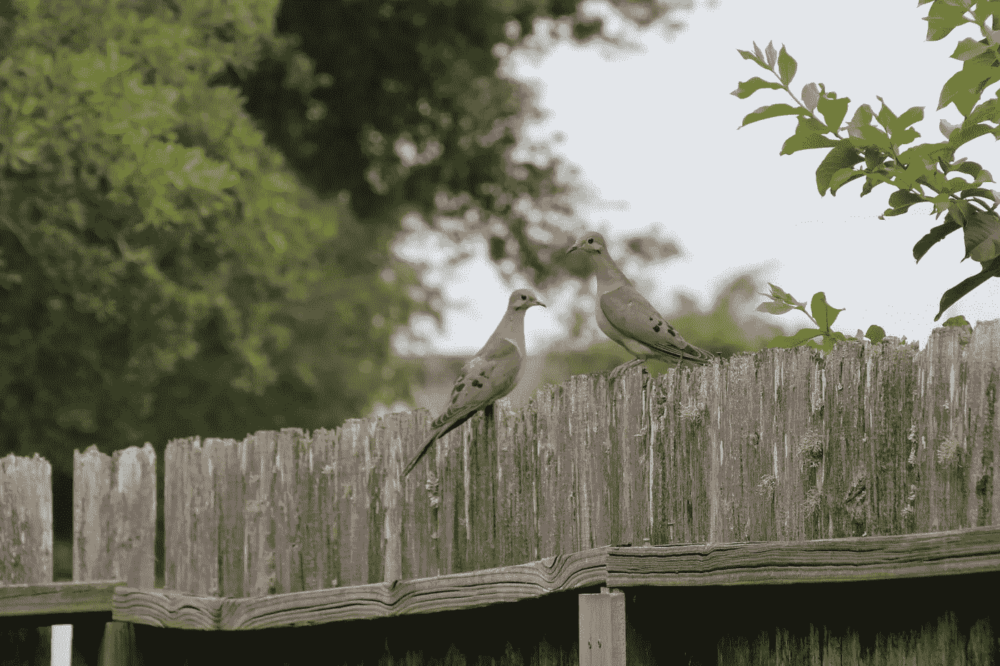

两只哀悼的鸽子出去吃早餐

每天早上，在我家，我们把食物放在后院的鸟窝里。在过去的几个星期里，我注意到许多新的鸟类来这里觅食，我认为这将是一个有趣的项目，可以确切地看到哪些类型的鸟类正在来访。

为此，我使用 Fast AI 的库训练了一个神经网络。这是我第一次用神经网络做实验，我玩得很开心。我强烈建议有兴趣的人尝试一下。我们现在可以轻而易举地训练神经网络来完成细粒度的分类，这是令人震惊的。我将在下面详细介绍我使用的整个过程和我的发现，以供任何想自己尝试或根据自己的用例修改它们的人参考。

# 快速人工智能

在我深入研究代码和流程之前，我想回顾一下我们将在整个项目中使用的主要工具。第一个是快速人工智能。Fast AI 是一个深度学习库，它简化了精确快速神经网络的训练。在这篇文章的过程中，有许多实例表明该库在加速训练高度精确的神经网络的过程中大放异彩。在制作模型的每一步，开发人员似乎都广泛考虑了用户的体验。结果用上了 Fast AI 也是一件乐事。

# 残差神经网络

残差神经网络是 2015 年由、何、、、任和在论文[中介绍的一种特定类型的神经网络。](https://arxiv.org/abs/1512.03385)

残差神经网络被创建来解决消失梯度和爆炸梯度的问题。消失和爆炸渐变的问题如下。神经网络由层组成，层数代表网络的深度。因此，深度成为影响性能的重要参数。在寻求创造更好的网络的过程中，出现了一个问题:创造更好的网络的解决方案是否增加了更多的层，从而增加了更多的深度？

当这个想法被测试时，神经网络经常会到达停滞点(消失梯度)或不稳定点，在那里模型不能收敛到最优解(爆炸梯度)。

为了解决这个问题，该论文描述了一种神经网络的体系结构，其中在层间使用跳跃连接。这些跳过连接允许模型中的较深层了解很少。通常，如果保持层不变是有益的，则通过跳过连接学习的函数将类似于相同函数的概念。identity 函数返回与作为输入接收的值相同的值。这将导致更深层次的变化最小或没有变化，从而解决消失和爆炸梯度的问题。Yannic Kilcher 的一个[视频很好地描述了这种架构背后的深入解释。总的来说，跳过连接允许通过不强迫后面的层继续学习来训练更深的网络。](https://www.youtube.com/watch?v=GWt6Fu05voI)

# 迁移学习

快速人工智能提供的神经网络训练速度部分是由于迁移学习的概念。在迁移学习中，预先训练的模型被用来解决一个新的但相关的问题。

传统的学习模式如下。我们有可能是但不限于图像像素、数字数据或分类数据的特征。我们也有一个目标，对应于我们试图预测的一些特征。例如，目标是图像中显示的动物的猫和狗的图像。使用这些特征和目标，可以为手头的任务从头开始训练模型。

迁移学习允许使用预先训练好的神经网络作为新任务的起点。以上面的狗和猫为例，假设有一个用许多动物作为其特征训练的模型，而不管特征空间中是否包括狗和猫。然后，我们将能够使用这个预训练的模型，并重新训练一些最后的层，以完成识别狗和猫的新任务。

当没有足够的标记数据来训练特定任务的模型时，以及当模型需要快速训练时，迁移学习特别有用。考虑到这一点，使用迁移学习可以达到最先进的结果是非同寻常的。

# 构建数据集

在训练我的神经网络之前，我首先必须建立一个数据集，以便神经网络可以学习不同种类的鸟类。这个数据集将由两个主要部分组成:一幅鸟的图像和图像中鸟的种类的文本标签。

为了决定我应该让我的神经网络意识到什么物种，我首先必须获得一些关于我居住的城市的当地鸟类的知识。为了做到这一点，我去了几个当地的观鸟网站，并开始收集我所在城市常见的鸟类物种。通过这种方式，我可以缩小鸟类的范围，并选择哪些种类来训练我的模型。

现在我有了物种清单，我准备开始收集一些图片。创建基于图像的数据集的一种快速简单的方法是使用 Google Images。从 Google Images 下载图片的方法有很多:Python 脚本、浏览器 JavaScript 控制台和浏览器扩展。我收集图像的过程如下:

1.  为您的浏览器下载一个扩展，允许您从 Google Images 下载图像。
2.  搜索您想要查找图像的特定主题。在我们的情况下，这将是一个特殊的物种，如“蓝鸟”。
3.  滚动到屏幕上图像的一个好的部分。值得注意的是，您选择的图像越好，您以后必须手动删除的图像就越少。
4.  使用扩展下载图像。我为每个物种下载了 25 到 30 张图片，但是根据你的应用和结果，你可能想增加这个数字。我第一次尝试使用 10 到 15 张图片时，效果并不好。图像的增加极大地帮助了我的模型。
5.  按主题对图片进行分类。在本例中，我为数据集创建了一个文件夹，并为鸟类创建了子文件夹。
6.  对每个主题重复此过程。在我的案例中，我为我所有的物种重复了这一点。
7.  使用 Fast AI 中的“验证图像”命令来确保每个图像都可以打开。

在此过程结束时，数据集应该类似于下图中的结构。

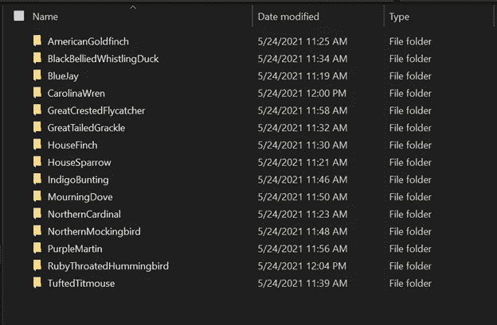

查看主数据集文件内部——按物种排序，每个文件夹包含物种的图像

# 训练模型

随着数据集的建立，是时候训练模型了。我们将从读入上面创建的数据集开始。

快速 AI 读取数据集中的 ImageDataLoaders 函数。由于数据集是按物种而不是训练测试分割的，我提供了一个验证百分比。这个百分比是应该保留下来用于检查模型性能的数据部分。以下命令调整图像的大小，使每个图像的大小一致。最后，图像数据被归一化。

```
data = ImageDataLoaders.from_folder(path, valid_pct=0.2,item_tfms=[Resize(460)], batch_tfms=[*aug_transforms(size=224), Normalize.from_stats(*imagenet_stats)])
```

为了确保我们的数据集被正确读入，可以使用 show_batch 命令来显示带标签的数据集的一部分。

```
data.show_batch()
```

确认数据集看起来不错后，就该初始化和训练模型了。我们将使用 ResNet34 来训练我们的模型，resnet 34 是由 34 层组成的残差神经网络。下面的第一行代码通过接收我们在上面创建的数据对象、模型类型和度量类型来初始化我们的模型，以评估模型的执行情况。第二行代码训练我们的模型，并接受参数 n_epoch，它告诉模型要执行多少次训练迭代，或者更具体地说是随机梯度过程。第三行代码简单地保存了我们的模型，这样，如果我们想在代码中进一步恢复或调用这个特定的模型，我们可以这样做。

```
learn = cnn_learner(data, models.resnet34, metrics = error_rate) learn.fit_one_cycle(n_epoch=4)
learn.save('stage1')
```

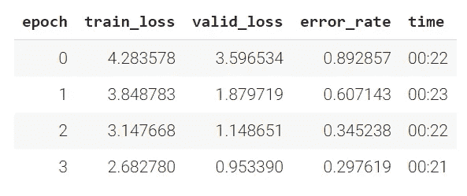

第一轮培训的结果

我们前 4 次迭代的结果如上所示。在 4 个时期之后，我能够降低到大约 0.29 的错误率。尽管结果模型在 4 个时期内有了显著改善，但错误率仍然很高。为了更好地判断我的模型所处的位置，我查看了 Fast AI 社区中一些与我的相似的图像分类项目。

为了降低错误率，我试图优化学习率。学习率过高或过低都会损害模型。大的学习率会阻止模型收敛到最优解，而小的学习率会导致训练过早停止。因此，找到最佳学习速度的解决方案通常是尝试不同的速度。幸运的是，Fast AI 有一个函数可以做到这一点，如下面的代码所示。

```
learn.unfreeze()
learn.lr_find()
```

第一行代码“解冻”了初始化的模型。当模型被“冻结”时，除了神经网络的最后一层之外，禁止对每一层进行修改。这背后的动机可以追溯到上面提到的迁移学习。为了利用预训练的模型，我们不想篡改早期层的学习。第二行代码以非常低的学习率开始训练一个模型。然后，学习率在许多时间间隔内增加，直到非常高。在每个时间间隔，记录损失并绘制在下图中。执行这一图表背后的直觉是，为了找到更优的学习率，要进行一些猜测。看这张图时，找到一个有陡峭下坡的区域是很重要的。如果图形有多个，尝试两个区域会有帮助。

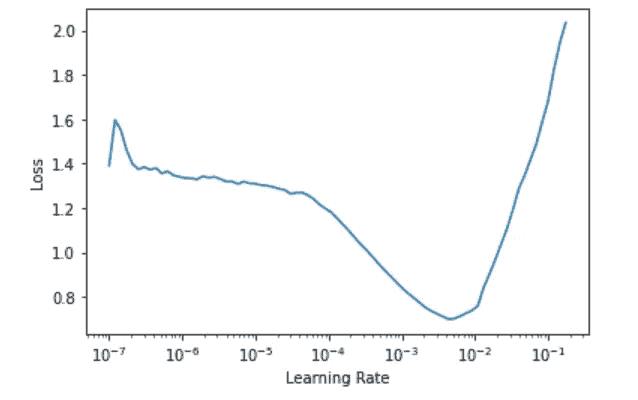

损失对学习率图，以找到学习率的最佳切片

如上所示，我的特定模型的图表在 1e-4 和 1e-3 之间有一个明显的向下陡峭斜坡区域。使用这个范围，我现在指定最大学习率来训练我的模型。切片函数允许模型将 1e-4 用作第一层的速率，将 1e-3 用作最后一层的速率。然后，中间的每一层将在所提供的范围之间等距分布学习速率。

```
learn.fit_one_cycle(4, lr_max=slice(1e-4,1e-3))
learn.save('stage2')
```

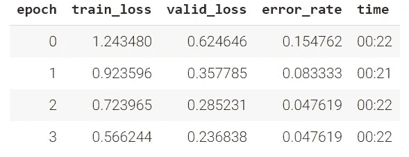

第二轮培训的结果

在优化学习率之后，我们的 4 个时期的结果对模型的错误率有显著影响。我可以将错误率从之前的 0.29 降低到 0.04。同样令人惊奇的是我们能够训练这个模型的时间。在几分钟之内，我们就能够创建一个精度约为 0.95 的模型。

# 洞察力

我主要通过两种方式进一步改进我的模型:混淆矩阵和顶部损失。

混淆矩阵是一种很好的方法，可以用来查看模型的表现如何，以及模型在哪些地方可能总是分类错误。在某些情况下，混淆矩阵也可以显示可容忍的误差。如果两只鸟非常相似，这可能揭示出模型中的误差源不是一个更大的缺陷。在我的案例中，蓝松鸦和靛蓝彩旗从某些角度来看非常相似，因此，我可以证明为什么模型会出错。所以，矩阵让我在某种意义上更深入地挖掘模型的错误率。

我们可以使用下面的命令集来输出混淆矩阵。

```
interp = ClassificationInterpretation.from_learner(learn)
fig = interp.plot_confusion_matrix(figsize=(10,15))
```

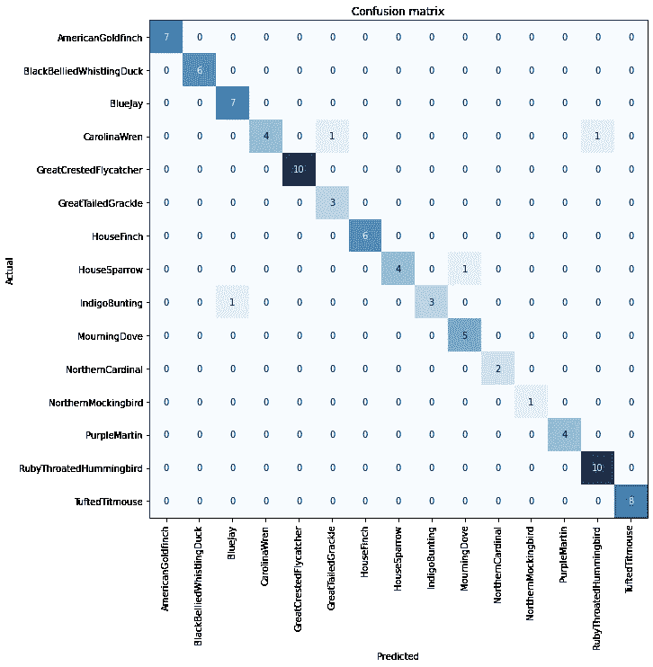

最终模型的混淆矩阵

为了更清楚地了解情况，我们可以展示模型的最高损失。模型的最高亏损代表了模型最有信心同时也是错误的地方。

```
interp.plot_top_losses(9, figsize=(15,11))
```

在我的案例中，看着最大的损失，向我展示了一些模型最明显的错误是由于给它的图像。例如，我放了一张包含两种不同鸟类的图片。这导致我的模型识别出图片中不正确的鸟。我继续从数据集中删除了这些图像。

# 观鸟

现在是有趣的部分！我花了一上午的时间给所有吃早餐的鸟拍照，并且能够很有把握地识别出每一只鸟的种类。

为了对我拍摄的照片进行预测，我首先必须导出模型。导出模型会创建一个 pickle 文件，该文件可以部署到其他地方，也可以在以后加载回来。我加载回导出的模型，因为我仍然在我的笔记本上工作。这允许我调用 predict 方法，并将预测标签的图像路径提供给模型。下面的第二个代码块只是根据输入到模型中的图片来创建预测标签的可视化。

```
learn.export()
model_inf = load_learner('path_to_export/export.pkl')
pred_class = model_inf.predict('path_to_img/img_name.JPG')testimg1 = Image.open('path_to_img/img_name.JPG')
print(pred_class[0])
plt.imshow(testimg1)
plt.axis('off')
plt.show()
```

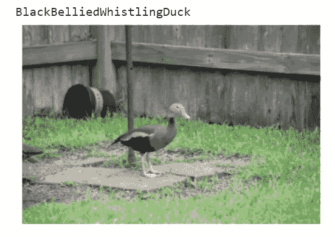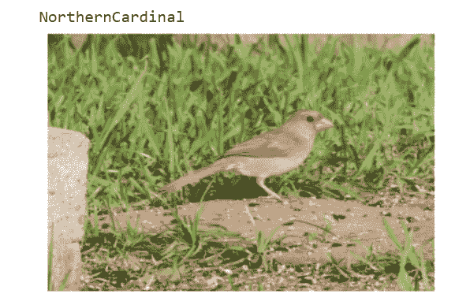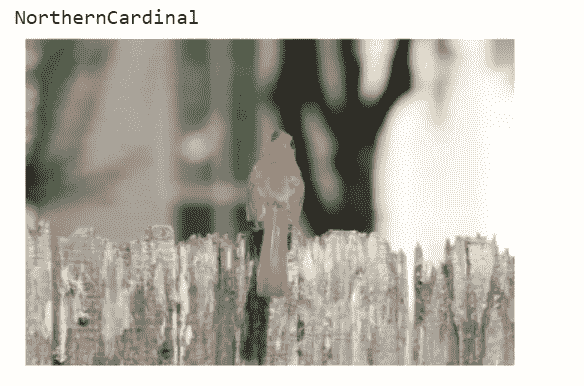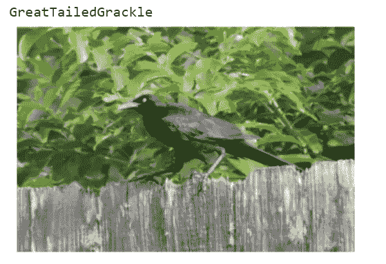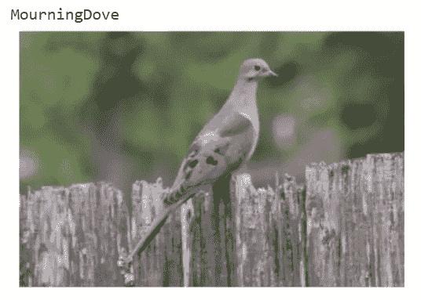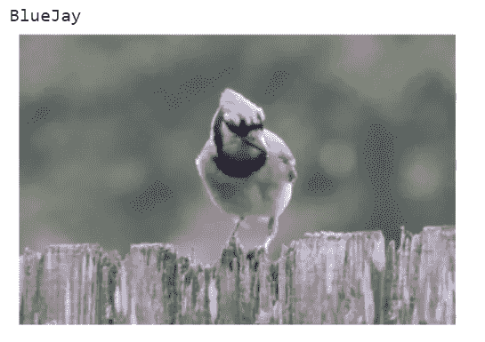

使用训练好的模型预测在我家后院发现的鸟类种类

**我发现有用的链接:**

*   【休斯顿最佳鸟类——鸟类友好社区(birdfriendlyhouston.org)
*   [迁移学习——机器学习的下一个前沿(ruder.io)](https://ruder.io/transfer-learning/index.html#whatistransferlearning)
*   [深度学习课程论坛(fast.ai)](https://forums.fast.ai/)
*   [深度学习教程——如何用 fast . ai(freecodecamp.org)训练和部署深度学习模型](https://www.freecodecamp.org/news/deep-learning-with-fastai/)
*   [即使 learn.fit_one_cycle()没有 learn.unfreeze() —第一部分(2019) —深度学习课程论坛(fast.ai)](https://forums.fast.ai/t/why-do-we-need-to-unfreeze-the-learner-everytime-before-retarining-even-if-learn-fit-one-cycle-works-fine-without-learn-unfreeze/41614/5) 为什么每次重新训练前我们都需要解冻学习者
*   [使用 Colab |面向编码人员的实用深度学习(fast.ai)](https://course.fast.ai/start_colab)
*   [【经典】图像识别的深度残差学习(论文讲解)——YouTube](https://www.youtube.com/watch?v=GWt6Fu05voI)