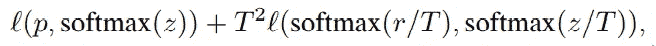
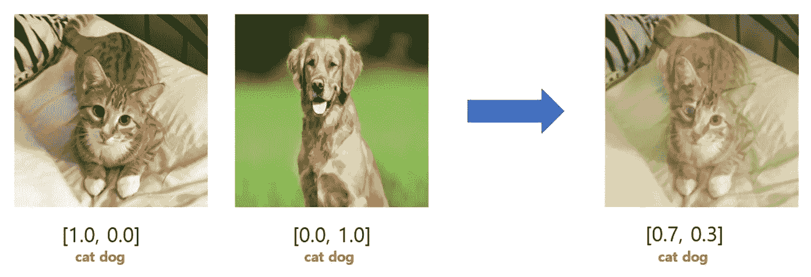
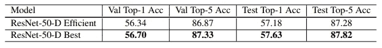

# 卷积神经网络用于图像分类的技巧包

> 原文：<https://medium.com/analytics-vidhya/bag-of-tricks-for-image-classification-with-convolutional-neural-networks-99f00a9b9565?source=collection_archive---------9----------------------->

原文：<https://arxiv.org/abs/1812.01187>

# 概述

我们将总结上述论文提出的技术。本文提出了各种“技巧”来轻松地提高 CNN 图像分类的性能。本文讨论了对现代硬件训练有用的技巧，回顾了改进剩余模型结构的想法，以及训练程序的变化。

每种方法都与基线 ResNet50 模型进行了经验比较，所提出的方法最终在 ImageNet 上将准确率从 75.3%提高到 79.29%。本文还展示了所提出的技巧在应用于迁移学习时的优越性。

图片由乔丹·怀特在 [Unsplash](https://unsplash.com/photos/AjT_T5J8aH0) 拍摄

本文提出的“锦囊妙计”由以下技术组成。

# 基线模型

本文首先提出了一个基线模型，该模型使用了以下步骤的数据扩充管道。

1.  随机采样图像并将其解码为[0，255]中的 32 位浮点原始像素值。
2.  随机裁剪一个矩形区域，其纵横比以[3/4，4/3]随机采样，面积以[8%，100%]随机采样，然后将裁剪区域调整为 224 x 224 的正方形图像。
3.  以 0.5 的概率水平翻转。
4.  使用从[0.6，1.4]中统一提取的系数缩放色调、饱和度和亮度。
5.  用从正态分布 N (0，0.1)采样的系数添加 PCA 噪声。
6.  通过分别减去 123.68、116.779、103.939 并除以 58.393、57.12、57.375 来归一化 RGB 通道。
7.  在验证过程中，我们将每个图像的短边调整为 256 像素，同时保持其纵横比。接下来，我们在中心裁剪出 224 乘 224 的区域，并像训练一样标准化 RGB 通道。

权重通过从[a，a]中得出的 Xavier 算法进行初始化，其中 a = sqrt(6/(din + dout))。其中 din 和 dout 为输入和输出通道尺寸。

基线模型的结果

经过训练的基线模型的结果略低于原始论文的结果，主要是由于不同的训练程序。

# 增加批量

用增加的批量大小进行训练有助于收敛，并且它降低了整体计算速度，但是由于每个时期较少的训练迭代，可能减慢训练过程。此外，经验结果表明，较大批量的训练将导致验证准确性下降。尽管如此，我们仍然可以使用多篇论文提出的技术，从更大的批量中获益，同时避免潜在的问题。

*   ***线性缩放学习率:*** 与增加的批量成比例地线性增加学习率，会平衡因批量较大而造成的训练迭代中的损失。例如，如果我们使用 2 倍的批量大小，我们也将学习速率提高 2 倍。
*   ***学习率热身*** *:* 我们在开始时使用一个小的学习率，然后在训练过程稳定时切换回初始学习率。这是因为，在训练初期，所有参数都离最终解很远。
*   **BN 的零γ:**当γ和β是分别初始化为 1 和 0 的可学习参数时，批规范化执行γxˇ+β的计算。我们对所有 BN 层初始化γ = 0，并在训练的初始阶段假装层数较少。
*   ***无偏差衰减:*** 权重衰减用于防止过拟合，但在避免过拟合方面，偏差不必衰减。因此，我们仅对卷积和全连接层中的权重应用权重衰减。
*   ***低精度训练:*** 常用的 32 位浮点表示对于现代硬件来说效率不高。根据该论文，Nvidia V100 GPU 在 FP32 中提供 14 TFLOPS，但在 FP16 中超过 100 TFLOPS。

左侧的图表描述了每种技术分别应用于 ResNet50 模型时的验证准确性。下一个图表比较了在多个模型架构上应用所提出的方法的性能优势。

# **模型架构调整(ResNet50)**

正如论文中所述:“模型调整是对网络架构的微小调整，例如改变特定卷积层的步幅。这种调整通常几乎不会改变计算复杂性，但可能会对模型精度产生不可忽略的影响。”模型架构中简单的概念变化显示了性能的惊人提高。

上图描述了最初的 ResNet50 模型架构和应用于该模型的三个调整，并显示了性能的提高。每个调整都可以解释如下

*   ResNet-B:修改 ResNet 的下采样块，以在第二层应用步长卷积，因为原始模型通过第一个 1x1 卷积层丢失了 3/4 的图像。
*   ResNet-C:通过替换 7x7 卷积来修改输入级。7 × 7 卷积比 3 × 3 卷积贵 5.4 倍。因此，用三个 3 × 3 卷积替换输入干中的 7 × 7 卷积将提高性能，同时保持原始模型的复杂性。
*   ResNet-D:修改下采样块的第二条路径。我们注意到，下采样块的第二路径中的 1 × 1 卷积也忽略了 3/4 的输入特征图，并且用平均池来代替步进卷积。

在各种实现和论文中提出了 ResNet-B，C，并且在本文中提出了 ResNet-D 的修改。每种方法都优于上面的一种方法，通过这三种方法，观察到总精度提高了 1%。

# 训练改进

先前的方法改进了正向传播阶段的训练。本节中的方法将着重于改进培训过程。

**余弦学习率衰减**

我们可以用各种方式来衰减学习速率，例如步长衰减，其中权重不连续减少，或者指数衰减，其中在时段 n 的学习速率是 k 的指数，常数(例如 lr=0.94^n).本文展示了余弦学习率衰减的有效性，其中学习率由下面的三角公式计算。T 是总迭代次数，η是初始学习率。学习率按余弦函数衰减，精度在训练过程中逐渐增加。

**标签平滑**

标签平滑“平滑”答案标签，并指导模型预测平滑的标签，而不是像 0，1 这样的极值。确切的公式描述如下。例如，如果ε=0.1，则对于真实类，模型必须预测(1-ε)=0.9，当有 K=10 个类时，模型必须预测ε/(K-1)=0.0111。标注平滑通过防止输出分数过于明显，具有防止过度拟合的效果。

**知识蒸馏**

知识升华使用预先训练的教师模型来指导模型。除了常规的交叉熵损失 *l* (p，softmax(z))，我们添加第二项来惩罚教师模型和学习者模型的 softmax 输出之间的差异。T 是一个超参数，T = 20 用于本文的训练。

尽管如此，我也不明白这个模型如何从这项技术中获益。在这篇文章中没有更多关于这种技术的解释。根据[这一点，](https://towardsdatascience.com/knowledge-distillation-simplified-dd4973dbc764)“较小的网络然后被训练来学习较大网络的确切行为，方法是尝试在每个级别复制其输出(而不仅仅是最终损失)”知识提取用于将较大模型的特征转移到较小的模型，以获得更快的推理速度和移动能力。

**混搭训练**

Mixup 是另一种数据扩充方法，它通过混合图片和类标签来工作。下图描述了这种方法。

图片来自[本博客](/swlh/paper-mixup-beyond-empirical-risk-minimization-image-classification-6ee40a45ad17)作者[曾锡浩](https://sh-tsang.medium.com/?source=post_page-----6ee40a45ad17--------------------------------)

# **实验结果**

上图显示了每种方法的性能改进。“有效”模型表示由前面讨论的技巧和模型调整组成的模型。对于 ResNet50 模型，我们实现了大约 2%的性能提升。知识提炼未能提高 InceptionV3 和 MobileNet 模型的性能。

麻省理工学院 Places 365 数据集验证集/测试集上的迁移学习结果

左:在 Pascal VOC(对象检测)上的更快 RCNN 性能，右:在 ADE20K(语义分割)上的 FCN 性能

上图描述了对象检测和语义分割等其他任务的技术性能提升。它还在麻省理工学院 places 365 数据集上显示了更好的迁移学习性能。尽管性能有所提高，但这可能是一个明显的结果。

# 我的看法

本文回顾了通过简单的技巧显著提高 CNN 性能的“锦囊妙计”。我觉得专注于深度学习的最基本基础对于提高性能至关重要。有些论文采用非常复杂的方法只是为了提高 1~2%的精度，但是通过本文中的方法以及其他技巧，我相信这些技巧可以对实际应用产生非常大的影响。