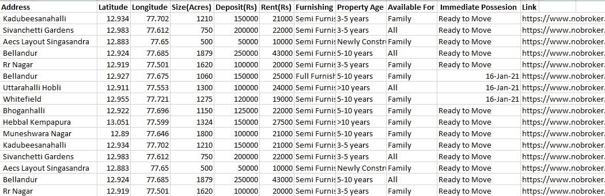
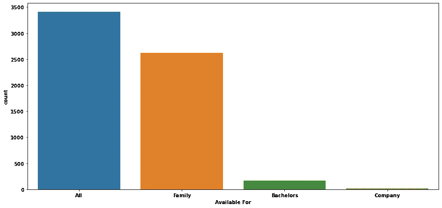

# 使用 Beautiful Soup 和 Django 进行班加罗尔房租预测

> 原文：<https://medium.com/analytics-vidhya/bangalore-house-rent-prediction-using-beautiful-soup-and-django-141eb6421763?source=collection_archive---------8----------------------->

由于房价每年都在上涨，所以确定房子的租金是非常重要的。所以我们的下一代需要一种简单的技术来预测未来的房租。几个因素影响着房子的价格，如物理条件、位置、房产大小等。这个项目使用 web scrapping 技术从网站上抓取数据，并使用这些数据进行分析和预测。

> ***注意:我将使用屏幕截图来解释代码。您可以在本节的末尾或者 GitHub 的链接中找到完整的代码，您可以复制这些代码。***

# 1.数据收集

我已经使用了 [**美汤**](https://www.crummy.com/software/BeautifulSoup/bs4/doc/) 库从 nobroker.com 抓取数据。

我已经刮了 BHK，地址，财产大小，租金，家具，财产年龄，为，可用性，纬度，经度，和网页的链接。

上面的代码将请求一个 URL，并将其转换成一个漂亮的 Soup 对象。然后，我遍历每个 div 标签，收集单个元素，并将其存储在一个列表中，该列表后来被转换为 pandas dataframe。

这是我的数据的样子。现在我们可以开始清洁过程了。

# 2.数据清理

大部分数据清理我都是边刮边做的。
例如:-

BHK 和地址在一起。我用 python 切片把它们分开。

在 **DataCleaning.py** 文件中，我处理了丢失的值，并删除了一些我无法收集租金的文本格式的行。

# 3.电子设计自动化(Electronic Design Automation)

我已经通过导入基本模块和一个 CSV 文件开始了我的分析。

我再次检查了每一列的数据类型，以确保万无一失。

我做了每一列的**单变量分析**。

我注意到有一个空白地址，两个 Indira Nagar 一个有空格，另一个没有，还有一个地址叫 India。我会用其他人代替他们。

因为这篇专栏文章很有偏见，所以我在稍后阶段把它删除了。

这个专栏也有偏颇。

它是右倾的。有些值是零，我已经在下面的代码中删除了。

我们来看看对数变换后的分布。

它也是右倾的。

让我们开始**双变量分析**。

我们可以看到地址和房租是相依的。 **Bellandur** 租金最高，sunkadakate**租金较低。**

我觉得新建的房子租金会比旧的贵。但是数据清楚地表明事实并非如此。这是展示 EDA 在数据科学项目中的重要性的最佳例子。

因为所有值几乎相同。房龄不是预测的重要因素。

许多离群值需要剔除。因为数据不是高斯分布形式。我已经使用 iqr 方法来消除异常值。

我针对两个特征处理异常值，一个是租金，另一个是大小。

我再次绘制了我的图表。

好多了。

因为 BHK 和大小是相关的，所以没有必要同时使用这两列。

在导出数据时，我注意到地址栏中有空白，我已经在上面的代码中删除了。

[**点击此处**](https://github.com/anurodhmohapatra/Bengaluru-House-Rent-Prediction/blob/main/EDA.ipynb) 获取该笔记本的链接。

# 4.模型创建和预测

我在以下步骤中创建了我的模型:-

*   导入我的数据并将特征分配给 X，将目标分配给 y。

*   将地址特征改为数字并存储在字典中。

*   将我的数据分成训练集和测试集。

*   训练模型并进行超参数调整。

我尝试了使用 minmaxscallar、standardscallar 和 log 转换的 [**线性回归**](https://scikit-learn.org/stable/modules/generated/sklearn.linear_model.LinearRegression.html) ，但得到的训练分数为 0.66，测试分数为 0.63*。*

在使用 [**XGBoost**](https://xgboost.readthedocs.io/en/latest/) 进行超参数调整后，我能够将训练分数提高到 0.71，测试分数提高到 0.70，rmse 为 4693。

*   最后，我为我的模型和字典创建了一个 pickle 和 JSON 文件。

# 5.部署

我使用了 [**Django**](https://www.djangoproject.com/) 进行部署。我用这个是因为我在学 Django。你们可以试试[烧瓶](https://flask.palletsprojects.com/en/1.1.x/)或者[流线型](https://www.streamlit.io/)。

可以看 Django 的 YouTube 教程，也可以在 GitHub 上找到 [**我的代码**](https://github.com/anurodhmohapatra/Bengaluru-House-Rent-Prediction/tree/main/Website/HouseRentSite) 。

这是它看起来的一个例子。

这是我的 web 应用程序的外观。

我们可以从下拉列表中选择地址。

和字体大小。之后点击预测。

这是我们输出的样子。

我在 [**Heroku**](https://www.heroku.com/free) 托管过我的 app。我用这个的唯一原因是因为它是免费的。

在本文中，我向您展示了端到端数据科学项目的整个生命周期。你可以在下面找到这个项目的 GitHub 链接。如果你喜欢这篇文章，请鼓掌，如果你有任何疑问，可以在下面的评论区联系我。

## **App**

 [## 班加罗尔房屋租金预测器

bengaluru-house-rent-predict.herokuapp.com](https://bengaluru-house-rent-predict.herokuapp.com/) 

## 开源代码库

 [## anurodhmohapatra/Bengal uru-房屋租金预测

### 由于房价每年都在上涨，所以确定房子的租金是非常重要的。所以我们的未来…

github.com](https://github.com/anurodhmohapatra/Bengaluru-House-Rent-Prediction) 

## **投资组合**

 [## 阿努罗德·莫哈帕特拉

www.anurodhmohapatra.com](https://www.anurodhmohapatra.com/)