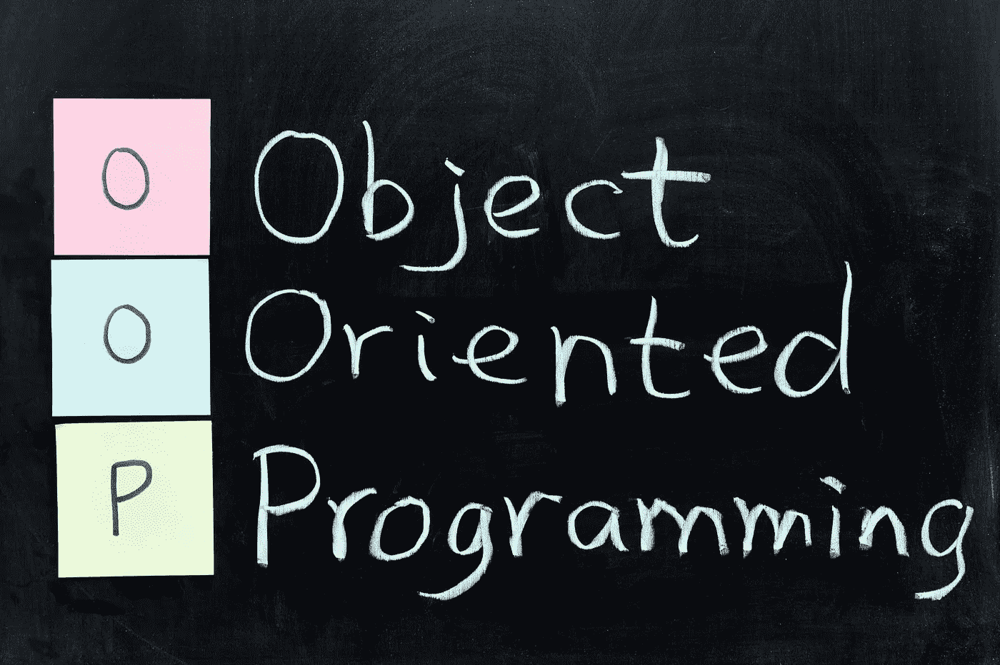
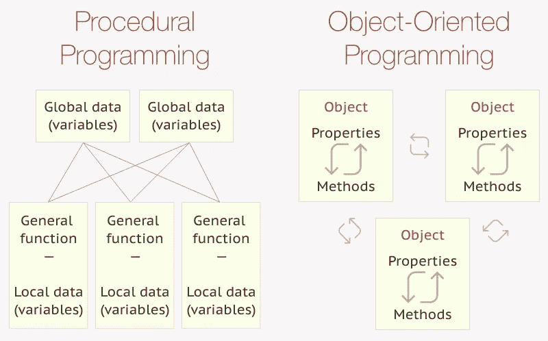
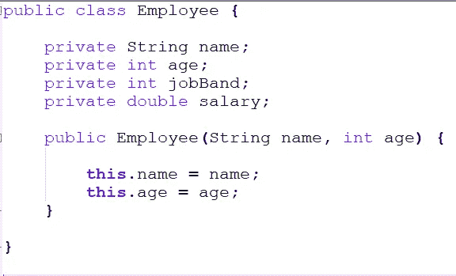
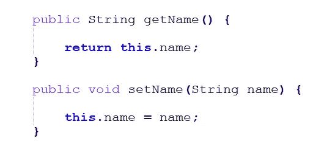
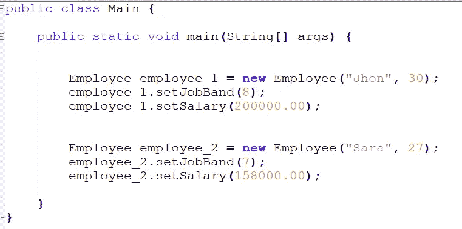
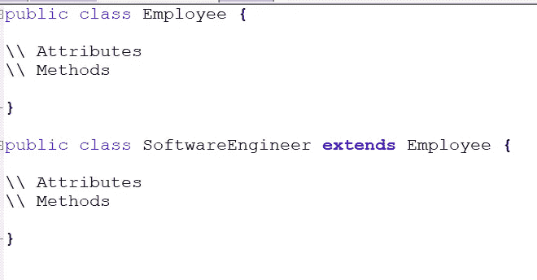
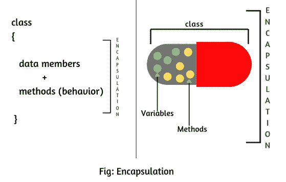
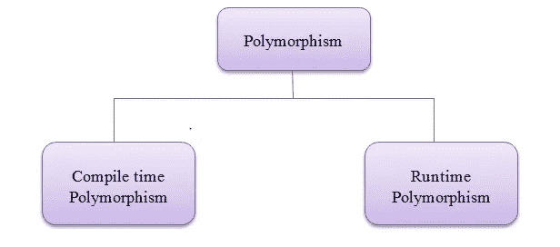
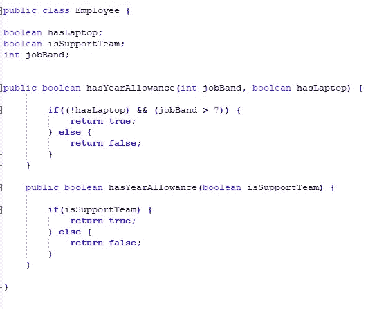
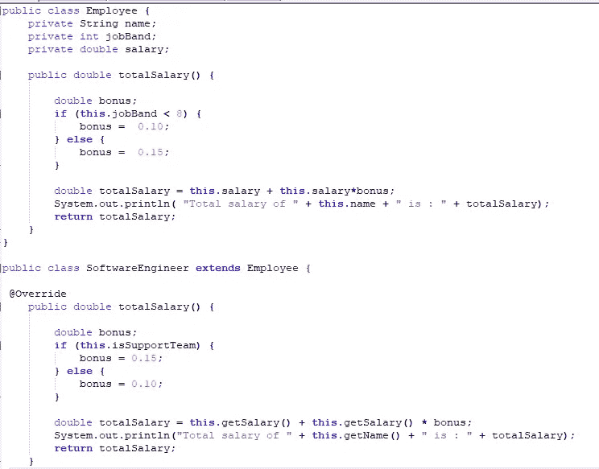

# 面向对象编程(JAVA)的基本概念

> 原文：<https://medium.com/analytics-vidhya/basic-concepts-of-object-oriented-programming-java-db67a4ead3a4?source=collection_archive---------14----------------------->

众所周知，计算机只能理解二进制数 0 和 1。但是人类不能用二进制编码，因为很难记住每个单词的二进制格式。因此，程序员使用高级语言与计算机交流。使用编译器将这些高级语言翻译成机器语言。

高级语言主要分为三类。例如过程语言、函数语言和面向对象语言。

**过程编程 Vs 面向对象编程**

过程编程与面向对象编程

> 过程化编程使用语句、函数和命令的系统顺序来对数据执行操作。另一方面，面向对象编程使用由属性和方法组成的类和对象来执行操作。

在本文中，我们将讨论使用 java 的面向对象编程(OOP)的基本概念。

类和对象被认为是 OOP 的主要方面。类是创建对象的蓝图。属性和方法是在类中定义的。

定义属性和构造函数

仲裁者(Getter)和访问器(Setter)方法用于在如下所示的行业中出于安全目的访问私有属性。这是本文后面将讨论的数据隐藏(封装)的一个很好的例子。

仲裁者(Getter)和访问器(Setter)方法

使用“New”关键字从类中创建对象，并使用 getter 和 setter 方法为定义的属性赋值。

从类创建对象

到目前为止，我们已经了解了 OOP 的基本概念，现在我们可以更深入地了解 OOP 了。面向对象编程建立在四个支柱之上。比如继承、抽象、封装和多态。

***传承***

继承是一个类(子类)从另一个类(父类)继承而来。子类可以访问父类中的所有属性和方法。“extends”关键字用于从父类继承子类，如下所示。

Extends 关键字在继承中的用法

***封装***

封装就是将数据和方法包装在一个单元中。类是封装的一个最简单的例子。

包装

***抽象***

抽象是向用户隐藏复杂的实现，并向用户提供简单的接口来执行他们的操作。

**抽象 Vs 封装**

抽象和封装之间的区别总是令人困惑。抽象用于向用户隐藏程序的复杂性，封装用于通过使用访问修饰符限制对属性和方法的访问来部分或全部隐藏数据成员。访问修饰符控制对数据成员的访问。

在类中私有地定义变量，并使用公共的 getter 和 setter 方法来访问这些变量就是封装的一个例子。

***多态性***

多态是采用不同形式或形状对象。有两种类型的多态性，即静态多态性和动态多态性。

多态性的类型

> 静态多态性也称为编译时多态性。在这种类型的多态性中，java 在编译时通过检查方法的签名来调用方法。动态多态被称为运行时多态，即在运行时而不是编译时调用被覆盖的方法。

*方法重载(静态多态性)*

方法重载意味着不同的方法在同一个类中有相同的方法名和不同的参数。此处显示了示例代码段。

过载示例

*方法覆盖(动态多态)*

方法重写意味着不同的方法在不同的类中具有相同的方法签名和不同的逻辑。父类方法被子类覆盖。此处显示了使用 totalSalary 方法的示例代码段，该方法在两个类中包含不同的逻辑。

在本文中，我们讨论了使用 Java 的 OOP 的基本概念。

下次见，编码快乐…