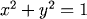
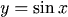

# 数据科学的基本图形和图形统计

> 原文：<https://medium.com/analytics-vidhya/basic-graphs-and-their-statistics-for-data-science-enthusiasts-c0928706c4d8?source=collection_archive---------16----------------------->

为了让您的数据科学之旅变得轻松，您必须学习一些常见的图表和图表统计数据

Img 参考:Imgflip

本博客涵盖的主题:

描述性图形的统计:正态分布，集中趋势，可变性测量，标准差和方差，模态，偏斜度

常见图表

# 图表的描述性统计:

## 正态分布

正态分布是统计学中最重要的概念之一，因为几乎所有的统计测试都需要正态分布的数据。它基本上描述了**多大的数据样本在绘制时的样子。**它有时被称为“**钟形曲线**或“**高斯曲线**”。

推理统计和概率计算要求给出正态分布。这基本上意味着，如果你的数据不是正态分布的，你需要非常小心你应用的统计测试，因为它们可能导致错误的结论。

在完美的正态分布中，每一边都是另一边的精确镜像。它应该看起来像下图中的分布:

完美正态分布

单峰意味着只有一个峰值。

## 集中趋势

在统计学中，均值、众数和中位数被称为集中趋势。这只是三种不同的平均值，当然是最受欢迎的一种。

**平均值就是平均值**由所有值的总和除以值的个数计算得出。

众数是数据**中最常出现的**值或类别**。**一个数据集可能有多个模式

**中位数是数据**的“中间”值或中点，也称为**第 50 百分位**。

**注:**中位数比平均值受离群值和偏斜数据的影响小得多。

*在完全正态分布中，这些测量值* ***都落在同一条中线的*** *点上。这意味着平均值、众数和中位数都相等。*

## 差异量数

最常见的变异性度量是**极差、四分位差(IQR)、方差和标准差。**所有这些都用于衡量数据中的差异或可变性。

****范围描述数据中最大和最小点之间的差异。****

**四分位数间距(IQR)是上四分位数(第 75 个)和下四分位数(第 25 个)之间的统计离差的度量。**

****

**范围衡量的是数据点的开始和结束位置，而四分位范围衡量的是大多数值的位置。**

## **方差和标准差**

**标准差和方差也衡量，像范围和 IQR，如何分散我们的数据(如分散)。因此，它们都是由平均值派生出来的。**

**方差的计算方法是**找出每个数据点和平均值之间的差异，将它们平方，求和，然后取这些数字的平均值。****

****

**方差公式**

**在计算过程中使用正方形，因为它们**对异常值(**位于异常距离的观察值)**的加权**大于接近平均值的点。这可以防止平均值以上的差异抵消平均值以下的差异。**

**方差的问题在于，由于平方，它与原始数据的度量单位不同。**

**这也是为什么**标准差用得比较多的原因**因为是原单位。它只是方差的平方根，正因为如此，它被返回到原始的度量单位。**

****

**标准差公式**

## **形式**

****分布的形态由其包含的峰值数量决定。**大多数分布只有一个峰值，但您可能会遇到具有两个、三个或更多峰值的分布。**

**下图显示了三种形态的视觉示例:**

****

**单峰意味着分布只有一个峰值，这意味着它只有一个频繁出现的分数，聚集在顶部。双峰分布有两个频繁出现的值(两个峰值)，多峰分布有两个或几个频繁出现的值。**

## **歪斜**

****偏斜度是对分布对称性的度量。****

**它描述了分布**与正态分布**在左侧或右侧的差异程度。偏斜值可以是正数、负数或零。请注意，完美的正态分布的偏斜度为零，因为平均值等于中位数。**

**下面你可以看到不同类型的偏斜度:**

****

****如果数据堆积在左边**，使得尾部指向右边，我们称之为正偏斜。**

****如果数据向右堆积**，则出现负偏斜，使尾部指向左侧。注意，正偏斜比负偏斜更频繁。**

**测量分布偏斜度的一个好方法是**皮尔逊偏斜度**系数，它可以快速估计分布的对称性。要计算熊猫的偏斜度，你可以使用 [skew()函数](https://pandas.pydata.org/pandas-docs/stable/generated/pandas.DataFrame.skew.html)。**

# **峭度**

**峰度衡量的是**与正态分布相比，你的数据集**是**重尾**还是**轻尾**。**

*   **峰度**高的数据集**尾部重，离群值**多。****
*   **峰度低的数据集往往尾部较轻，离群值较少。**

**注意:**直方图是显示数据集的偏度和峰度的有效方法**，因为您可以很容易地发现数据是否有问题。概率图也是一个很好的工具，因为正态分布是沿着直线的。**

**在下图中，您可以看到正倾斜数据集的两种情况:**

****

**图片参考: [Niklas Donges，走向数据科学](https://towardsdatascience.com/intro-to-descriptive-statistics-252e9c464ac9)**

**用数学方法测量分布的峰度的一个好方法是**fisher 的峰度测量。****

**现在我们将讨论三种最常见的峰度。**

1.  **一个正态分布叫做**中峰度**，峰度= 0。**

**2.与正态分布相比，**宽峰**分布具有**负峰态**并且尾部非常细。**

****3。尖峰值**分布具有大于 3 的峰度**，并且具有相对较小的标准偏差。****

**如果你已经认识到分布是偏斜的，你不需要计算它的峰度，因为分布已经不正常了。在 pandas 中，只需调用[峰度()函数](https://pandas.pydata.org/pandas-docs/stable/generated/pandas.DataFrame.kurtosis.html)即可查看峰度。**

# ****常见图形****

**自从我开始我的数据科学之旅以来，有时我会为了记住哪怕是最基本的图表而与自己的记忆做斗争！**

**这里我提到一些基本的图表，记住它们，我觉得会让你的数据科学之旅变得容易。**

****

**y = log x**

************************************************************************************************************

**乙状结肠函数:1/1+ e^(-z)**

****参考文献:****

1.  **[https://towards data science . com/intro-to-descriptive-statistics-252 e9c 464 ac9](https://towardsdatascience.com/intro-to-descriptive-statistics-252e9c464ac9)**
2.  **[https://pandas . pydata . org/pandas-docs/stable/generated/pandas。DataFrame.skew.html](https://pandas.pydata.org/pandas-docs/stable/generated/pandas.DataFrame.skew.html)**