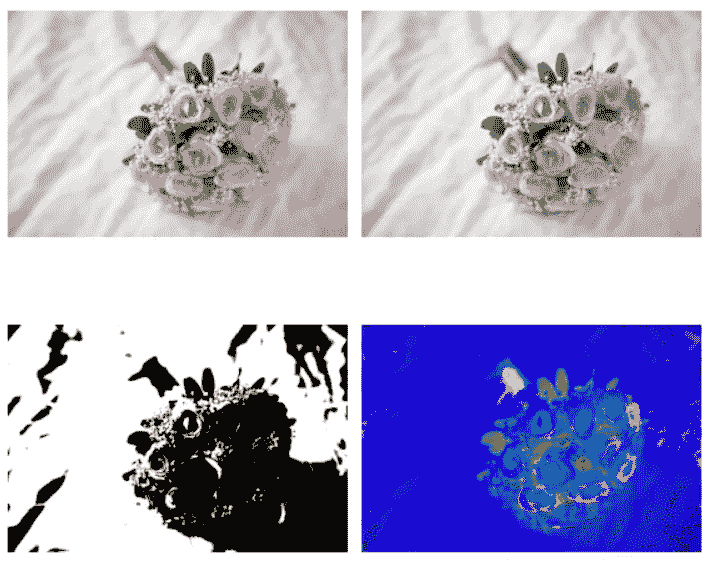
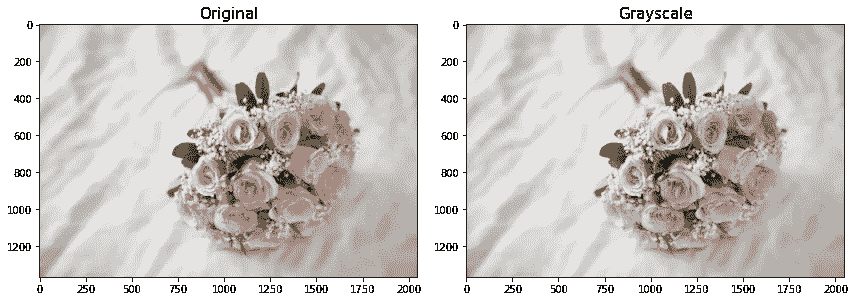
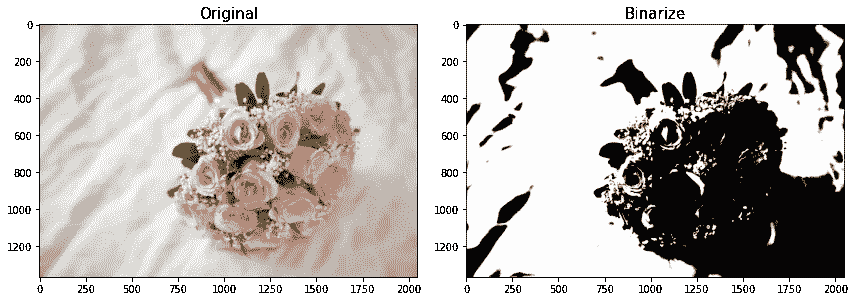
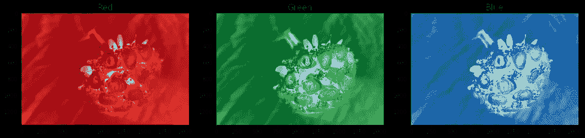
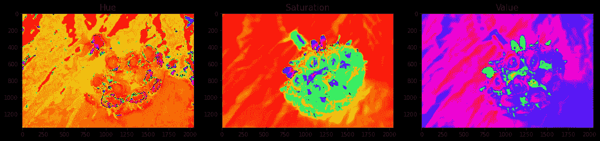
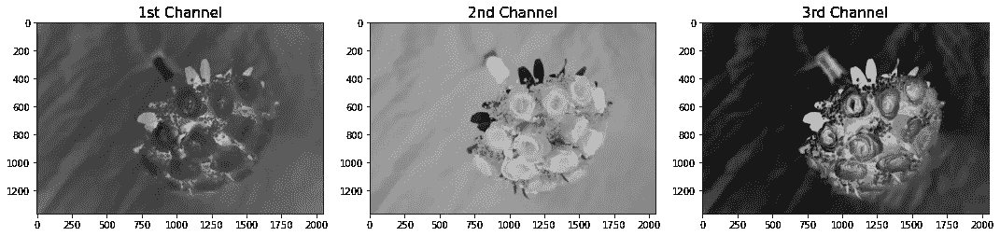
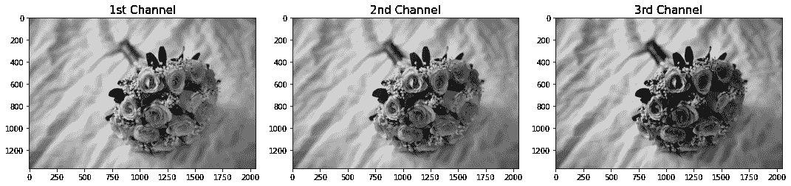
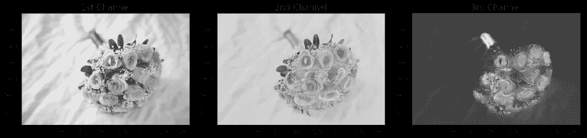

# 基本图像转换技术

> 原文：<https://medium.com/analytics-vidhya/basic-image-conversion-techniques-76d9f34cb998?source=collection_archive---------20----------------------->

加工才是王道！



作者图片

正如我在文章《图像处理导论》中所描述的，当我们进入数字图像世界时，最需要理解和学习的是如何使用基本的图像处理技术。

在上下文中，图像处理是对图像进行不同方法、动作或变换的艺术，通过增强图像、操作图像或改变图像内容来满足我们的需要。

在某种意义上，图像处理的核心操作是对图像本身执行不同的数学方程，其中图像将根据我们定义的数学函数而改变。

由于我们将图像视为 NumPy 数组，因此在处理数组和矩阵时，可以使用不同的线性代数技术对其进行转换和增强。

在本文中，我们将尝试展示基本的图像处理技术，重点介绍 scikit-image 库中预定义的不同转换技术。

我们从阅读和展示之前的花束示例开始:

```
from skimage.io import imread, imshowsample = imread('flower.jpg')
imshow(sample);
```


图 1:样本图像(作者提供的图像)

我们现在将开始尝试不同的基本图像转换！

## **显示灰度**

我们可以使用 rgb2gray 函数来显示图像的灰度。我们还可以使用我们选择的绘图/图形的 cmap = 'gray '版本来显示灰度。

```
from skimage.color import rgb2gray
import matplotlib.pyplot as pltsample_g = rgb2gray(sample)fig, ax = plt.subplots(1,2,figsize=(12,12))
ax[0].imshow(sample)
ax[0].set_title('Original',fontsize=15)
ax[1].imshow(sample_g,cmap='gray')
ax[1].set_title('Grayscale',fontsize=15)
plt.tight_layout()
plt.show()
```



图 2:灰度(图片由作者提供)

## **显示单色或二值化图像**

如果设置阈值，我们还可以显示图像的二值化表示。请记住，二值化图像意味着我们将使数组中的像素值为 1 或 0。为此，我们可以设置像素值平均值的阈值，并确定像素值是高于还是低于该特定平均值。使用这个阈值，我们可以创建一个 true 或 false 的数组，然后使用 img_as_uint 函数将它转换成一个整数数组，这将把阈值数组转换成一个浮点型数组，现在可以使用 imshow 显示它。

```
from skimage import img_as_uint#use the mean of pixel values as the threshold
mean1 = sample_g.mean()sample_b = img_as_uint(sample_g > mean1)fig, ax = plt.subplots(1,2,figsize=(12,12))
ax[0].imshow(sample)
ax[0].set_title('Original',fontsize=15)
ax[1].imshow(sample_b,cmap='gray')
ax[1].set_title('Binarize',fontsize=15)
plt.tight_layout()
plt.show()
```



图 3:二值化(图片由作者提供)

注意，为了显示图 3，我们使用像素值的平均值作为二值化图像的阈值。当我们知道大多数像素值时，通常选择平均值作为阈值。对于这个样本，我们知道平均值将主要是最白的值，因为样本中的大多数像素值由于背景是白色的。这在得到的二值化图像中可以清楚地看到。

## **显示色彩空间**

我们可以显示图像的不同颜色空间。还记得这个图像在 NumPy 数组形状上有 3 维或 4 维吗？

其中之一是颜色通道的数量。正常情况下，一幅图像有 3 个颜色通道，即红色、绿色和蓝色。我们可以使用 imshow 函数的 cmap 参数来显示图像的不同颜色值通道。

```
fig, ax = plt.subplots(1, 3, figsize=(15,5))
ax[0].imshow(sample[:,:,0], cmap='Reds')
ax[0].set_title('Red',fontsize=15)
ax[1].imshow(sample[:,:,1], cmap='Greens')
ax[1].set_title('Green',fontsize=15)
ax[2].imshow(sample[:,:,2], cmap='Blues')
ax[2].set_title('Blue',fontsize=15);
plt.tight_layout()
plt.show()
```



图 4:颜色通道(图片由作者提供)

正如你所看到的，我们对每个通道的 NumPy 数组进行了分段，这就是为什么我们能够获得每个颜色空间的特定像素值。

## **显示 HSV 值**

我们还可以使用 scikit-image 函数和 cmap 参数显示 HSV 值。HSV 指的是像素的色调、饱和度和值。这些不同种类的参数可用于分割对象中的不同项目，这对于对象检测模型和许多其他模型是重要的。我们可以使用 skimage 的 rgb2hsv 函数。

```
from skimage.color import rgb2hsv
sample_hsv = rgb2hsv(sample)fig, ax = plt.subplots(1, 3, figsize=(15,5))
ax[0].imshow(sample_hsv[:,:,0], cmap='hsv')
ax[0].set_title('Hue',fontsize=15)
ax[1].imshow(sample_hsv[:,:,1], cmap='hsv')
ax[1].set_title('Saturation',fontsize=15)
ax[2].imshow(sample_hsv[:,:,2], cmap='hsv')
ax[2].set_title('Value',fontsize=15);
plt.tight_layout()
plt.show()
```



图 5: HSV 频道(图片由作者提供)

灰度、二值化、颜色通道和 HSV 通道是许多机器学习模型通常使用的一些图像转换技术。在 scikit-image 中还有其他的转换变体，下面是一些进一步的例子。

## **使用 HED 通道或苏木精-伊红-DAB (HED)色彩空间**

```
from skimage.color import rgb2hedsample_hed = rgb2hed(sample)fig, ax = plt.subplots(1, 3, figsize=(15,5))
ax[0].imshow(sample_hed[:,:,0],cmap='gray')
ax[0].set_title('1st Channel',fontsize=15)
ax[1].imshow(sample_hed[:,:,1],cmap='gray')
ax[1].set_title('2nd Channel',fontsize=15)
ax[2].imshow(sample_hed[:,:,2],cmap='gray')
ax[2].set_title('3rd Channel',fontsize=15);
plt.tight_layout()
plt.show()
```



图 6: HED 色彩空间(图片由作者提供)

## **使用 XYZ 色彩空间**

```
from skimage.color import rgb2xyzsample_xyz = rgb2xyz(sample)fig, ax = plt.subplots(1, 3, figsize=(15,5))
ax[0].imshow(sample_xyz[:,:,0],cmap='gray')
ax[0].set_title('1st Channel',fontsize=15)
ax[1].imshow(sample_xyz[:,:,1],cmap='gray')
ax[1].set_title('2nd Channel',fontsize=15)
ax[2].imshow(sample_xyz[:,:,2],cmap='gray')
ax[2].set_title('3rd Channel',fontsize=15);
plt.tight_layout()
plt.show()
```



图 7: XYZ 色彩空间(图片由作者提供)

## **使用 YUV 色彩空间**

```
from skimage.color import rgb2yuvsample_yuv = rgb2yuv(sample)fig, ax = plt.subplots(1, 3, figsize=(15,5))
ax[0].imshow(sample_yuv[:,:,0],cmap='gray')
ax[0].set_title('1st Channel',fontsize=15)
ax[1].imshow(sample_yuv[:,:,1],cmap='gray')
ax[1].set_title('2nd Channel',fontsize=15)
ax[2].imshow(sample_yuv[:,:,2],cmap='gray')
ax[2].set_title('3rd Channel',fontsize=15);
plt.tight_layout()
plt.show()
```



图 8: YUV 颜色空间(图片由作者提供)

# 摘要

我们能够展示不同的基本图像处理技术，处理图像的不同转换。我们还能够显示每个颜色通道、二值化、灰度和其他转换技术之间的差异。知道如何使用这样的技术来增加我们进一步清理数据和进一步处理数据的机会是非常重要的。通常，这些转换技术是其他图像预处理技术之前的主要步骤。


结果摘要(图片由作者提供)

既然我们可以转换图像，让我们尝试使用不同的图像处理来增强图像。敬请期待下一篇文章！