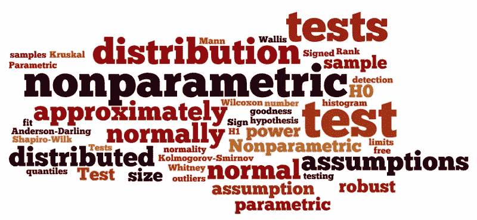
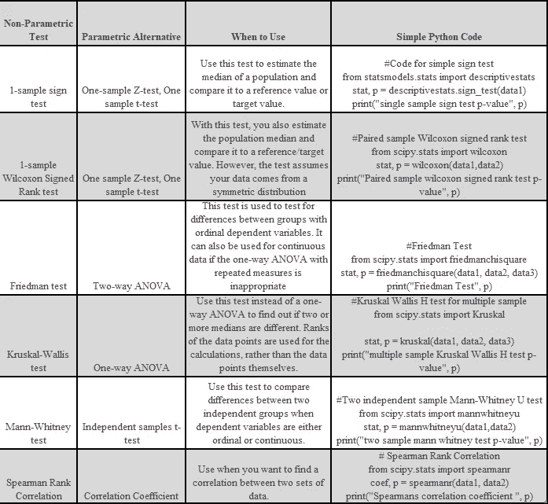

# 非参数测试的基本介绍

> 原文：<https://medium.com/analytics-vidhya/basic-introduction-to-non-parametric-tests-997414d303ae?source=collection_archive---------4----------------------->

摘自 [BU](https://sphweb.bumc.bu.edu/otlt/mph-modules/bs/bs704_nonparametric/bs704_nonparametric_print.html)

参数检验是基于分布假设的统计检验之一。在科学分析中，基本上检查人口统计因素和变量之间的关系是否具有统计显著性。
参数检验一般用于本科统计学课程。必须始终坚持一个假设。我们都记得 T 检验、Z 检验、方差分析等概念。然而，在现实问题中，数据并不总是正态分布，或者不符合参数检验的假设，即独立性或同方差性。在这种情况下，我们使用非参数测试。

我获得了经济学学士学位，我们过去几乎做任何事情都是基于假设。在我的硕士论文中，我不得不大量参与非参数测试。当然，我在本文中使用的表格不包含细节。但是，它可以成为你理解这个概念的指南。

非参数检验是不做任何假设的检验。在无法应用参数测试的情况下，可以很容易地使用它们，甚至可以在非常有问题的数据集中进行分析。

我们应该什么时候使用它？
-当数据不符合必要的假设(如正态性)时。
——当样本量太小时。因为数据越小，就越难遵循假设。
-数据是名义数据或顺序数据。比如“强烈不同意、不同意、中立、同意、强烈同意”等调查。
-数据被排序。例如，产品的有序列表。
-如果数据包含离群值。

根据我的经验，我的结论是，对于大样本，这种方法的计算代价很高。但这将有助于在最少假设的情况下分析各种样本。明智选择！