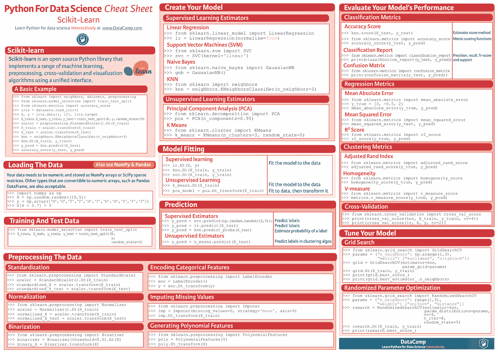
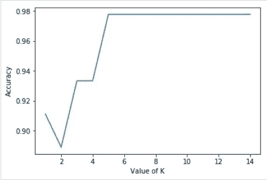

# Scikit 学习的基本介绍

> 原文：<https://medium.com/analytics-vidhya/basic-introduction-to-scikit-learn-fa610f14e40d?source=collection_archive---------11----------------------->


马里乌斯·马萨拉尔在 [Unsplash](https://unsplash.com?utm_source=medium&utm_medium=referral) 上的照片

Scikit-learn 构建在 NumPy、SciPy 和 Matplotlib 之上，是用于机器学习的强大库。

# **为什么要学 Scikit？**

*   为机器学习提供高效的工具。
*   提供统计模型，包括分类、回归、聚类。
*   涵盖大多数机器学习任务，并扩展到大多数数据问题。

# 装置

## 使用画中画

```
pip install -U scikit-learn
```

## 使用 conda

```
conda install scikit-learn
```

# **特性**

Scikit-learn library 更侧重于数据建模，而不是加载、操作和汇总数据。Sklearn 提供的一些受欢迎的模型组有:

1.  监督学习算法:线性回归，支持向量机(SVM)，决策树等。
2.  无监督学习算法:聚类、因子分析、主成分分析、无监督神经网络等。
3.  交叉验证:检查监督模型的准确性
4.  降维:用于减少数据中的属性数量，以进行汇总、可视化和特征选择。
5.  集合方法:用于组合多个监督模型的预测和许多更多的预测。

# 小抄



www.datacamp.com 摄

# 数据集加载

输入:

```
from sklearn.datasets import load_iris   *#imports the library* 
iris = load_iris()   *#import the dataset 'iris' to the variable iris*
X = iris.data   *#store the features into the variable X*
y = iris.target   *#stores the label into the variable Y*
feature_names = iris.feature_names  *#stores the feature attributes* 
target_names = iris.target_names  * #stores the label attributes*
print("Feature names:", feature_names)   *#print feature name*
print("Target names:", target_names)   *#print label name*
print("\nFirst 10 rows of X:\n", X[:5])   *#print first 5 entry*
```

**特征名称**—它是所有特征名称的列表(输入)。

**目标名称**——是所有标签名称的列表(输出)。

输出:

```
Feature names: ['sepal length (cm)', 'sepal width (cm)', 'petal length (cm)', 'petal width (cm)']
Target names: ['setosa' 'versicolor' 'virginica']
First 10 rows of X:
[
   [5.1 3.5 1.4 0.2]
   [4.9 3\. 1.4 0.2]
   [4.7 3.2 1.3 0.2]
   [4.6 3.1 1.5 0.2]
   [5\. 3.6 1.4 0.2]
]
```

# 分割数据集

输入:

```
from sklearn.model_selection import train_test_split  *#import the library* 
X_train, X_test, y_train, y_test = train_test_split(X, y, test_size = 0.3, random_state = 1)   *#divide 70% data for training & 30% data for testing purpose with same data given all the time by random state*

print(X_train.shape)   *#print the shape of input train data*
print(X_test.shape)  * #print the shape of input test data*
print(y_train.shape)  * #print the shape of output train data*
print(y_test.shape)   *#print the shape of output test data*
```

**random _ size**—保证分割始终相同。

输出:

```
(105, 4)  * #row * column*
(45, 4)   *#row * column*   
(105,)   *#row * column(0)*
(45,)   *#row * column(0)*
```

# 训练模型

输入:

```
from sklearn.neighbors import KNeighborsClassifier   *#import the function*
from sklearn import metrics  *#import the function*
classifier_knn = KNeighborsClassifier(n_neighbors = 3)
classifier_knn.fit(X_train, y_train)
y_pred = classifier_knn.predict(X_test)

print("Accuracy:", metrics.accuracy_score(y_test, y_pred))   *# Finds the accuracy by comparing actual response values(y_test)with predicted response value(y_pred)*

sample = [[5, 5, 3, 2], [2, 4, 3, 5]]   *# Providing sample data and the model will make prediction out of that data*
preds = classifier_knn.predict(sample)
pred_species = [iris.target_names[p] for p in preds] print("Predictions:", pred_species)
```

输出:

```
Accuracy: 0.9833333333333333
Predictions: ['versicolor', 'virginica']
```

**KNeighborsClassifier** :该分类器基于 k 个最近邻实现学习，其中 k 为用户指定的整数值。k 值的选择取决于数据



上述数据的粗略图表

上面的情节是由我的以下代码获得的:

```
scores_list = []
for k in range(1,15):
   classifier = KNeighborsClassifier(n_neighbors=k)
   classifier.fit(X_train, y_train)
   y_pred = classifier.predict(X_test)
   scores_list.append(metrics.accuracy_score(y_test,y_pred))
```

**度量**:实现为特定目的评估预测误差的功能，如准确度分数(此处)。

# 模型持久性/保存模型

一旦我们训练了这个模型，这个模型应该持续到将来使用，这样我们就不需要一次又一次地重新训练它。借助 ***joblib*** 包的 **dump** 和 **load** 特性完成。

输入:

```
from sklearn.externals import joblib
joblib.dump(classifier_knn, 'iris_classifier_knn.joblib')   #save the model into file named iris_classifier_knn.joblib
```

现在，在下面代码的帮助下，可以从文件中重新加载对象

```
joblib.load('iris_classifier_knn.joblib')
```

现在，你可以用 sklearn 做基础项目了。
所有最好的❤️