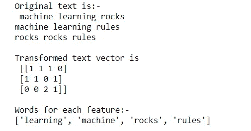
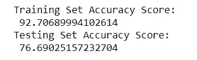
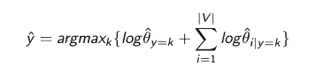
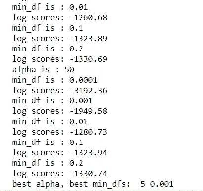
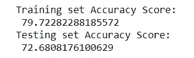
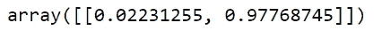

# 30 分钟基本自然语言处理(无学士学位)

> 原文：<https://medium.com/analytics-vidhya/basic-natural-language-processing-in-30-min-no-bs-38046abd919d?source=collection_archive---------8----------------------->


由[马库斯·斯皮斯克](https://unsplash.com/@markusspiske?utm_source=medium&utm_medium=referral)在 [Unsplash](https://unsplash.com?utm_source=medium&utm_medium=referral) 拍摄的照片

**数据来源:** IMDB 烂番茄数据集

[IMDb 数据集| Kaggle](https://www.kaggle.com/ashirwadsangwan/imdb-dataset)

**任务:**开发一个分类器，根据给电影的评论判断电影是新鲜的还是烂片。

**预测模型:**朴素贝叶斯

这里最重要的支持功能之一是 ***计数矢量器*** ，它将原始文本转换成‘单词包’矢量。

根据定义，“BOW”向量是一种数据结构，它告诉你一个特定的单词在广告中出现了多少次。

```
#demonstration on CountVectorizer and BOW output 
from sklearn.feature_extraction.text import CountVectorizertext = ['machine learning rocks', 'machine learning rules', 'rocks rocks rules']print("Original text is:-\n", '\n'.join(text))
print()vectorizer = CountVectorizer(min_df=0)# call `fit` to build the vocabulary
vectorizer.fit(text)# call `transform` to convert text to a bag of words
x = vectorizer.transform(text)# CountVectorizer uses a sparse array to save memory, but it's easier in this assignment to 
# convert back to a "normal" numpy array
x = x.toarray()print("Transformed text vector is \n", x)
print()
# `get_feature_names` tracks which word is associated with each column of the transformed x
print("Words for each feature:-")
print(vectorizer.get_feature_names())
```

运行上面的函数，预期的输出是:



“一袋单词”

现在，假设我们有 X 矩阵(nreview，nwords)和 y 向量(nreview)输入，两者都是数组:

*   x:每行对应于一个评论(输入)的一个单词包
*   y:编码评论是新的(1)还是坏的(0)(输出)

***注意*** *:确保 X 和 y 在行上有相同的尺寸(nreview)*

下一步是像这样执行**测试列车分割** (80%/20%):

```
X_train, X_test, y_train, y_test= train_test_split(X, Y, test_size= .2, random_state = 42, stratify= Y)
```

实现 ***多项式的时间*** (只使用训练集训练你的模型)，这里我们使用`accuracy_score`作为目标函数。

```
from sklearn.metrics import accuracy_scoreclf = MultinomialNB()
clf.fit(X_train, y_train)#predictions
y_train_pred = clf.predict(X_train)
y_test_pred = clf.predict(X_test)#accuracy score 
train_pred_score = accuracy_score(y_train, y_train_pred)
test_pred_score = accuracy_score(y_test, y_test_pred)print('Training Set Accuracy Score: \n', (100 * train_pred_score))
print('Testing Set Accuracy Score: \n', (100 * test_pred_score))
```



clf 模型的输出

瞧，这简直太简单了，不是吗！

但是，我们希望优化模型。我们的方法有几个**超参数**，这些是我们想要使用**交叉验证**来调整的值。

1.  `min_df`在*计数矢量器中，*忽略出现在少于 *min_df* 部分评论中的单词。
2.  `alpha` 在*多项式*中，被称为“平滑参数”——增加该值会降低对任何单个特征的敏感度，并倾向于将预测概率拉近 50%

在我们进行交叉验证之前，我们需要理解什么定义了一个“更好”的参数值。

**目标:**找出使我们的数据的对数似然最大化的值。



最大后验估计

在这种情况下，我们有目标函数:

**L = Sum _ fresh(logP(fresh))+Sum _ rotate(logP(rotate))**

> 其中`Sum_fresh`表示所有新评论的总和，
> 和`Sum_rotten`表示所有烂评论的总和

**为什么使用 log_likelihood:**

因为我们计算的是一堆非常小的数字(又名。概率)，我们假设所有的事件都是相互独立的(乘法)；**对数转换将使计算更容易，并避免最终结果过于接近 0。**

有了这种直觉，我们需要一个类似 log _ 的函数，它就在这里！

```
def log_likelihood(model, x, y):
    prob = model.predict_log_proba(x)
    rotten = y == 0
    fresh = ~rotten
    return prob[rotten, 0].sum() + prob[fresh, 1].sum()# output the likelihood of test data 
log_likelihood(clf, X_test, y_test)
```

现在你有了所有的部分，是时候给你看一些代码了！

```
#potential tuning values for hyper parameters
alphas = [0, 1, 5, 10, 50]
min_dfs = [0.0001,0.001,0.01, 0.1, 0.2]#Find the best value for alpha and min_df, and the best classifier
best_alpha = None
best_min_df = None
max_loglike = -np.inffor alpha in alphas:

    print('alpha is : ' + str(alpha))

    for min_df in min_dfs:

        print('min_df is : ' + str(min_df))

        #initialize vecotizer 
        vectorizer = CountVectorizer(min_df = min_df)
        X = vectorizer.fit_transform(x)

        X = X.toarray()
        Y = y.to_numpy()       

        #train test split
        X_train, X_test, y_train, y_test= train_test_split(X, Y, test_size= .2, random_state = 42, stratify= Y)

        #initialize NB model
        clf = MultinomialNB(alpha = alpha) #cross validating the NB model using 5 cv
        score = cross_val_score(clf, X_train, y_train, cv=5, scoring = log_likelihood)

        print('log scores: {:.2f}'.format(np.mean(score)))

        #updating the best parameters
        if np.mean(score) > max_loglike:
            max_loglike = np.mean(score)
            best_alpha = alpha
            best_min_df = min_dfprint("best alpha, best min_dfs: ",best_alpha, best_min_df)
```



部分输出

现在，我们可以使用`best_alpha`、`best_min_df`、*、*训练最终模型，并重新评估训练集和测试集的准确性。

```
best_alpha = 5
best_min_df = 0.001#final vectorizer model and X, Y data
vectorizer_final = CountVectorizer(min_df = best_min_df)X = vectorizer_final.fit_transform(X)
X = X.toarray()
Y = y.to_numpy()#train-test split
X_train_final, X_test_final, y_train_final, y_test_final = train_test_split(X, Y, test_size= .2, random_state = 42, stratify= Y_final)#fit NB model on the training datasets
clf_final = MultinomialNB(alpha = best_alpha)
clf_final.fit(X_train_final, y_train_final)#predict y on training data
y_train_pred = clf_final.predict(X_train_final)#predict y on testing data
y_test_pred = clf_final.predict(X_test_final)#accuracy score for training and testing predictions
test_pred_score = accuracy_score(y_test_final, y_test_pred)
train_pred_score = accuracy_score(y_train_final, y_train_pred)print('Training set Accuracy Score: \n', (100 * train_pred_score))
print('Testing set Accuracy Score: \n', (100 * test_pred_score))
```



现在，我们有了基本的朴素贝叶斯模型，这是一个简单但有效的模型。

> 寓意是，总是先尝试简单的事情。

我们可以尝试传入一个评论，并要求模型预测电影是“烂”还是“新”。

在这个例子中，我们使用的测试评论是:*“这部电影在任何方面都不显著、不感人或不精彩”*

```
#predict the probability of a given reviewdef predict_prob(s, model=clf_final):
 s_tf = vectorizer_final.transform([s]).toarray()
 proba_s = model.predict_proba(s_t)

 return proba_spredict_prob("This movie is not remarkable, touching, or superb in any way")
```



输出概率

给定概率通讯员【烂，鲜】，这个模型实际上输出了一个错误的答案；因为正面词的情绪压倒了负面关键词‘不’。像“但是”、“不是”等词语。行动起来否定文字的情绪。

然而，因为朴素贝叶斯将每个单词分开处理，所以它不能捕捉这种单词交互。

> 属性之间的依赖不可避免地降低了朴素贝叶斯辨别正在发生什么的能力。