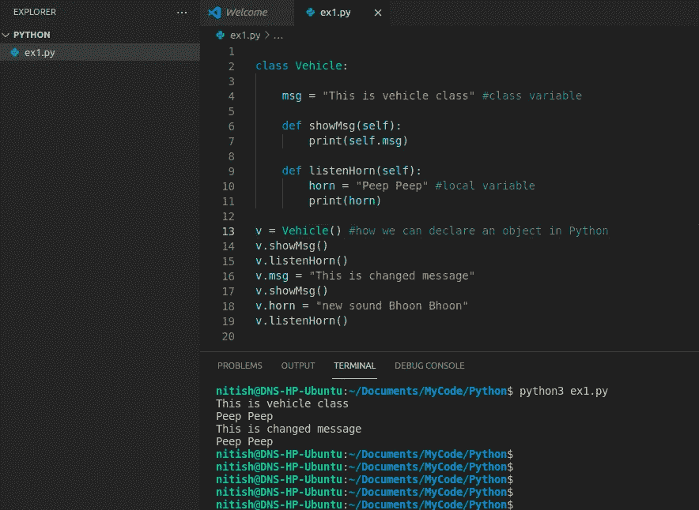

# Python 基础— 2:类

> 原文：<https://medium.com/analytics-vidhya/basic-of-python-2-classes-a1ce5ddb529c?source=collection_archive---------13----------------------->

如今，Python 是 IT 行业最有需求的语言。每个人都想学习 Python 并以此为职业。

在前一篇文章中，我们已经看到了 Python 的一些基础，所以你可以开始自学了。今天，我们将学习类及其成员，如构造函数、类变量、局部变量和类函数。我们还将检查一些类的内置属性。

我之前的 Python 文章:[https://ntsh-vicky.medium.com/basic-of-python-edd5ec6845e5](https://ntsh-vicky.medium.com/basic-of-python-edd5ec6845e5)

**面向对象编程概念(OOPs)**

在学习类和对象之前，你应该了解 OOP 的概念。你可以在 OOP 的概念中找到很多文章，只是你需要在谷歌上搜索。

面向对象的编程旨在实现编程中真实世界实体的逻辑，如类、对象、继承、隐藏、多态等。

1.  **类**:类是一个蓝图或者原型。这不是物理上的东西。在现实生活的例子中，人是一个类，车辆是一个类，汽车是一个类。在这里，人、车、车不是代表一个具体的东西，而是代表一个整体。如果你想到人类，那么这里的男孩，女孩，女人，男人，你的父亲，你的母亲，你，我；每个人都是人。没有具体的。车辆，无论你看到的是什么，公路，汽车，卡车，自行车等等。

它表示所有对象共有的一组属性或方法。

在 Python 中，我们使用 class 关键字声明一个类，后跟类名。

*语法:class <类名这里>*

*示例:车辆类别*

**2。对象**:对象是面向对象编程的基本单位，指定了一个特定的类。作为类人，你是客体，我是客体。你的自行车是一件物品。无论你在看什么都是一个物体。所以一个对象总是有状态、行为和身份。

像我，状态:种族，肤色，身材；行为:生气、高兴、吃东西等；身份:我叫 e.i. Nitish Srivastava。

就像你的自行车，状态:跑步，站立，如果你是特技演员，可能还会飞；行为:喇叭、刹车等。身份:它的车辆号码…

一个名为 Vehicle 的类的例子

上图包含一个名为 Vehicle 的类。这里你可以看到，Vehicle 类是由关键字 *class* 声明的，其中包含一些成员。在第 4 行中， *msg* 是一个类变量，用默认字符串消息“这是车辆类”初始化。

在下面的第 6 行和第 9 行，类 *Vehicle* 分别包含两个成员函数 *showMsg* 和 *listenHorn* 。 *showMsg* 有一个语句，打印 whatever*msg*contain its(行号 7)和 listenHorn，首先初始化一个局部变量 Horn(行号 10)然后打印它(行号 11)。而且你可以看到，两个函数都有一个参数 *self* 。

在 Python 中默认情况下，每个成员函数都有第一个参数 self。所以在创建这些函数时，你需要在函数中至少写一个参数。在这里，我将这个参数命名为 self。你可以起任何名字，但自我是有意义的。

一个类的函数的第一个参数，它的类的引用对象。它与 Java 中的 *this* 关键字相同。你可以给它起任何名字。如果您必须调用任何类成员，您需要使用此参数的给定名称来调用。如下图，我已经将函数参数 *self* 的名称改为 *hhh。*

你可以看到，在第 7 行，我用参数(hhh.msg)调用了 *msg* 变量，而不是第 11 行的 *horn* 。永远记住，你需要用函数的第一个参数调用一个类成员，或者用类的对象名调用类外的成员(比如第 16 行)。但是，因为 *horn* 不是类成员，而是函数 *listenHorn* 的局部成员，所以不需要用它写 *hhh* (或者 *self* )。你也不能用第 18 行给出的对象调用变量 *horn* (或任何局部变量)。

现在来看看 13 号线发生了什么。

v = Vehicle()，这是在 Python 中初始化对象的方法(在 Java 或 C++中，与 new 关键字相同)。这里对象的名称是 v，它是 Vehicle 类的对象。所以如果你想使用类的成员，比如它的类变量或函数，你需要通过 object 来调用它。

你可以看到，在第 16 行，我已经重新初始化了变量 *msg* 。在第 17 行的输出中，它发生了变化。但是我也尝试过重新初始化第 18 行中的变量 *horn* ，但是它在第 19 行的输出中没有改变。它仍然是窥视。

让我们举另一个例子:

程序经过一些修改

在上面的图片中，我创建了一个带有两个参数的新函数 showName。相同的第一个参数引用了该类的对象，第二个参数必须传递。在第 14 行和第 19 行，你可以看到我在函数 showName 中传递了一个字符串值。在第 14 行，**子弹 400** 带对象名 *v* ，在第 19 行，**经典 350** 带新对象 *v1* 。无论何处，都有两个参数 showName contains，所以我只传递一个字符串参数，而第 10 行语句显示第二个参数变量。因为正如我们已经讨论过的，第一个参数引用了类的对象，所以你必须处理第二个或下一个参数。

你也可以看到，两个不同的物体并不互相影响。因为第 23 行没有因为第 20 行而改变。

self 参数的示例以及如何使用它。它也有一个构造函数的例子。

在上图中，检查第 22，23，25，26 行，看看自我是如何工作的。

**3。构造函数:**在上图中，第 7 行是构造函数的一个例子。在另一种编程语言中，如 C++或 Java，你已经了解了构造函数是类成员函数，与类名同名，没有定义任何返回类型，并且在创建该类的对象时调用。

在 Python 中，我们使用 *__init__(self)* 函数声明构造函数。这是一个预定义的名称。用法是一样的，它在你创建它的类的对象时被调用。就像上图中的第 17 行和第 19 行一样，构造函数在初始化一个对象时被直接调用。在上面的例子中，我也用类传递了一个字符串参数，它是通过构造函数中的 *name* 变量传递的。您可以在函数中传递任意数量的参数，但第一个参数默认引用该类的对象。

如何使用函数及其参数你可以在我以前的文章[https://ntsh-vicky.medium.com/basic-of-python-edd5ec6845e5](https://ntsh-vicky.medium.com/basic-of-python-edd5ec6845e5)# 66be 中学习。您可以使用*args 或*kargs 来表示参数数量。

**4。继承:**继承是面向对象编程的另一个特点。它提供了代码的可重用性。

在现实生活中的例子，人类，它可以走，跑，说话，吃东西等。如果有人类的子类，像男孩和女孩，两者都有相同的属性或行为，但有一些子类有自己的属性。就像男孩会特技一样(现在女孩也很正常)。女孩可以生育，但男孩不行。所以走路、跑步、说话、吃饭是一个超类人类的基本属性，但是一个子类可能有一些特定的属性，比如类女孩的出生。同样，如果超类是 Vehicle，子类是 FourWheeler 和 TwoWheeler，那么两者都包含超类的所有特征，但有它们自己的特定特征。

继承是基于另一个现有类的特性构建一个新类的过程。检查车辆及其输出的以下示例。

在这个例子中，你可以看到，类 FourWheeler 和 TwoWheeler 都在初始化 Vehicle 类的构造函数，在初始化的时候都用自己的构造函数。

如果数据库配置对所有文件都相同，则可以在调用另一个文件上的数据库配置文件时使用继承。

**5。多态性:**多态性这个词的意思是有多种形式。在一些程序设计语言中，多态性也被描述为相同的函数名但不同的参数签名，这被称为重载。有时基类和超类有相同的函数名和相同的签名，这叫做覆盖。

在 Python 中不能使用相同的函数名和不同的参数逻辑。如下图所示，你会看到这样的错误…

像其他编程语言一样，它不会在调用 showMsg 函数时单独输出不带参数和带参数的函数。

但是，您可以在继承中使用多态，同时在基类中重写函数，如下图所示。

多态性的一个例子

你可以在上面的例子中看到，有两个子类扩展了一个超类*车辆*。两个子类都有一个功能 *showMsg* ，与超类 *Vehicle* 中定义的名称相同。在打印时，两者都是打印构造函数(self。__class__。__name__ 返回对象的类名)的类 *Vehicle* ，但具有自己的函数 *showMsg* 。因为这里他们用自己的函数覆盖了 vehicle 类的 *showMsg* 。

如果要打印类 Vehicle 的 *showMsg* ，就得创建自己的对象， ***v3 = Vehicle()*** ，然后像 ***v3.showMsg()*** 一样调用 *showMsg* 。

6。访问修饰符:它用于限制对类的变量和方法的访问。

有三种类型的访问修饰符:

1.  公共访问修饰符
2.  受保护的访问修饰符
3.  私有访问修饰符
4.  公共访问修饰符:被声明为公共的类的成员很容易从程序的任何部分被访问。默认情况下，类的所有数据成员和成员函数都是公共的。
5.  Protected 访问修饰符:声明为 protected 的类的成员只能被从它派生的类访问。类的数据成员通过在该类的数据成员前添加一个下划线“_”符号来声明受保护。
6.  私有访问修饰符:声明为私有的类成员只能在类内部访问，私有访问修饰符是最安全的访问修饰符。类的数据成员通过在该类的数据成员前添加双下划线“__”符号来声明为私有。

公共访问修饰符的例子:msg = "Hello World "

受保护访问修饰符的示例:_msg = "Hello World "

私有访问修饰符的示例:__msg = "Hello World "

在这个例子中，所有的变量都起作用，因为它们是类 Vehicle 的成员

在这个例子中，除了私有变量 __msg3 之外，所有变量都起作用，因为它是类 Vehicle only 的成员，而 _msg 是子类中调用的受保护变量，因为它是超类的一部分。

在 python 中，受保护的成员也可以被另一个类中该类的对象使用，如下面第 19 行中的例子…

另一个类使用的受保护变量的示例

Python 中的一些基本命令你可以尝试学习 Python 中的任何类、对象或关键字

1.  知道班级名称:- <objectname>。__class__。__name__，喜欢上面的例子。__class__。__name__ 或 v.__class__。__ 姓名 _ _</objectname>
2.  了解用于对象的内置属性:- dir(objectname)或 dir(keywords)。like dir(list)将返回列表中所有内置函数或属性的名称。
3.  查看任何关键字的详细信息和帮助文档:- help(keywordname)，like help(list)

dir 命令的一些示例

帮助(dict)命令的输出

谢了。因为封装性和可重用性，所以总是尽量编写带有 OOPs 功能的代码。

*(抱歉语法错误)*