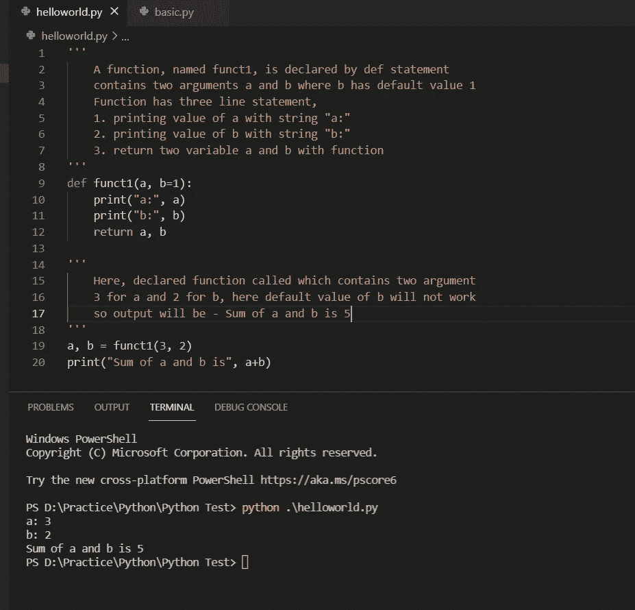

# Python 基础

> 原文：<https://medium.com/analytics-vidhya/basic-of-python-edd5ec6845e5?source=collection_archive---------18----------------------->

如今，Python 是 IT 行业最有需求的语言。每个人都想学习 Python 并以此为职业。

如果你已经开始学习 python，那么这是给你的。在这篇文章中，我将告诉你一些 Python 的基础知识。

Python 官网:[https://www.python.org/](https://www.python.org/)

**Python 的基本可用 IDE**

1.  https://www.anaconda.com/products/individual[蟒蛇](https://www.anaconda.com/products/individual)
2.  朱庇特笔记本—[https://jupyter.org/](https://jupyter.org/)
3.  spyder—[https://www.spyder-ide.org](https://www.spyder-ide.org/?__cf_chl_managed_tk__=dc7f6d76645d7b40423442cdbf82208693551e82-1624780739-0-AUlemzI1dioDM8EUGWaM7voV51ftdeFf6osr63Qo5A0egrBhQgx9Rf0wNUCsmVKm1RamTpxL62iMAsCtXqfzEzMBekimjiHuZzp4l_ggG5HoQnhV21ERA9yOpWPloSv-7uyKQxwhF6vTBHRziBaRrO7W7wYPXBw2ZQX5NSyqPZmzGZLBgdkfFWC-8XAs3S47fF9CT6UDHeR6igXbXUHKTLXdDV7qqYw4sFt3k5W0sgRbPkFTJaG7REdEp9keFU0pAFzW2g50QPkP0rJcCPwUD3cRRrxu6oRpiOUrdL3fSvW8n4rFy98Gu0f4acOf0jP4KDkvOiidKThWPChoykA441YLvLLIeIz584krQWmMTxYJjQ_NjDW6uJzYLtNI4wDjZXbkEn_KUJ0wayNP1vwe2nxFuWtoGM8Ub43lJhIJ21kniVCon73VkstsOovli4Da1PAuEcBukDyexxpOFhW73Dk4Mn1xL_COiwNMgrQvJqGa4u5AJruvK7LSI76JIWh9s8jF-rHar0x-C9FkcNLkoZRMPtZBkUQowu1HaHfjKxsykOoiUIMHDd9580P1_Wan3zeGz0tRFRW5dEOszUvTNmL6Z4Piajdk10VpnRBEBSn7)
4.  闲置—[https://www.python.org/downloads/](https://www.python.org/downloads/)
5.  皮查姆—[https://www.jetbrains.com/pycharm/](https://www.jetbrains.com/pycharm/)
6.  Visual Studio 代码—[https://visualstudio.microsoft.com/](https://visualstudio.microsoft.com/)
7.  原子——[https://atom.io/](https://atom.io/)

如果你已经开始学习 Python，我会建议你学习 Visual Studio 代码。但如果你是一名机器学习开发人员，需要使用 Python 进行研究，请使用 Jupyter Notebook 或 Spyder。也可以从 Anaconda IDE 安装 Jupyter Notebook、Spyder 和 Visual Studio 代码。

**如何启动**

像每一种编程语言(C 或 Java)一样，在 Python 中你需要学习的东西很少。

1.  如何安装
2.  检查 Python 是否已安装并正在运行
3.  设置环境变量以访问 Python
4.  基本 Python 命令以及如何执行代码
5.  你好世界
6.  理解编码的一些基本语句
7.  变量
8.  经营者
9.  功能
10.  条件语句
11.  环
12.  班级

**如何安装**

像所有软件一样，你必须下载一个 IDE(如果你是初学者，我建议你使用 Visual Studio 代码)。使用上面给定的 URL 并下载您的 IDE。有些 IDE 需要单独安装 Python，可以从[https://www.python.org/downloads/](https://www.python.org/downloads/)下载。

下载时，如果您看到将 Python 添加到环境变量的选项，请选择它，这样您就不需要为您的 Python 单独设置环境变量，并且您可以使用控制台从系统中的任何位置访问 Python。

**检查 Python 是否安装并运行**

要检查你的 Python 是否安装了，需要打开命令提示符(Windows 中)或终端(Linux 或 Mac 中)，输入 ***python —版本*** (带双破折号的版本)。如果你已经安装了 python 第三版，那么你需要输入***Python 3—version***，来检查 Python 版本。所以尝试两个命令，如果其中任何一个出错。

在这张图片中，默认情况下，我的系统已经安装了 Python 3，因此 Python 命令正在工作。如果我安装了多个版本的 Python，我需要键入 python3 — version 来了解 python3 版本和 python2 版本。我在这里不需要 Python3 命令。我的系统已经安装了 Python 3.9.5 作为默认 Python。

**设置环境变量以访问 Python**

如果你已经安装了 Python，但是上面给定的命令返回空白，你需要在你的 PC 中为 Python 设置环境变量。

在 windows 中，右键点击 ***电脑或*** ，然后进入 ***高级系统设置*** 。它将打开一个 ***系统属性窗口*** 。在这里选择 ***前进*** 选项卡(如果尚未选择)，并点击 ***环境变量*** 按钮。这将打开另一个窗口，在 ***系统变量*** 部分，搜索并选择路径，点击编辑。它将打开另一个名为编辑环境变量的窗口。点击新建按钮**和*在列表*和**中添加 Python 和 Python 脚本文件夹。

根据我的电脑，这是我的 Python 路径:

c:\ Users \ ntshv \ AppData \ Local \ Programs \ Python \ Python 39

c:\ Users \ ntshv \ AppData \ Local \ Programs \ Python \ Python 39 \ Scripts

windows 10 中的环境变量

如果你是学 Java 的，同样可以设置 JDK 环境变量。只是你需要在这里添加 JDK 的 bin 路径。

**基本的 Python 命令以及如何执行代码**

从基础开始，现在不用做钢铁侠套装。

控制台是开始的正确工具。打开命令提示符(终端)。输入 python 并按回车键。下一秒，你将处于 python 环境中。它将看起来像下面的图片，

Python 控制台

现在试着写一些基本命令，比如把两个数相加。不要想着编程。就用基本的。

>>> 2+2

4

要在控制台中打印东西，可以使用 ***print()*** 功能；要从键盘输入，可以使用 ***input()*** 功能。见下图。

在您的控制台中尝试这些命令

**你好世界**

现在，如果你是一个开发者，控制台不是一个写程序的好方法。因此，我们将使用任何 IDE 来学习下一步。在我的例子中，我将使用 Visual Studio 代码。它是当今最常用的 IDE。

现在，你知道什么是 Hello World 了。每个人的第一个程序。因此，开始学习代码的好方法是用有意义的名称保存文件。在驱动器中创建一个文件夹，并在该文件夹中打开 Visual studio 代码。在当前的 Windows 操作系统中，你可以在空白处右击找到 Visual studio 代码。或者在文件夹的地址栏中输入 ***cmd*** ，当该文件夹上将打开命令提示符时，输入 ***代码。*** (点号)打开 Visual Studio 代码。

在 linux 终端，你可以正常打开 Visual Studio 代码，通过输入**代码。** 或 ***须藤码。—用户数据目录*** 。

接下来，当编辑器打开时，创建一个扩展名为 ***的文件。py*** 。在我的例子中，我创建了***hello world . py***。你想叫什么都可以。并在该文件中编写一条普通语句。在这里，我写了 print(“Hello World”)。保存文件并从主菜单打开终端(或者您也可以使用您的控制台)。

在终端中，编写命令 python，然后是空格，最后是文件名。py 扩展名。在这里，***python hello world . py .***

在这里，你可以看到，我是如何打印 Hello World 的

现在，试着用正确的方法使用函数来写代码，请看下图。

您可以在下面看到该语句的输出

现在，用 __name__ 试试。

在终端下面检查此代码的输出

**了解编码的一些基本语句**

当你写代码时，你需要了解编码的基本原理，比如如何打印输出，输出中打印什么，如何从键盘输入，如何存储和打印输入数据，什么是函数以及如何使用函数。我们以后会谈到函数，所以现在谈谈输入和输出。

在 python 中，可以使用 ***print()*** 函数打印控制台中的任何文本。在实际项目中，print()仅用于在控制台中打印调试消息。现在，只进行控制台编程，而不是真正的项目。

在上图中。我用很多方法印了 Hello World。print("Hello World ")或 print("Hello "，" World ")或 print("Hello "，" World "，3)。Print 语句可以包含多个不同数据类型的参数。像在 statement、print("很高兴见到你"，name)或 print(name)中一样，也可以打印变量包含的任何内容。但是下面两个语句不是打印控制台，而是说我输入了什么。它只能在控制台上工作，不能在文件中工作。如果不在 python 文件中编写 print()，它就不能打印消息，如下所示。

名称“Nitish”没有显示在终端中

现在，在下图中使用 print()后，相同的代码正在打印消息。

存储在名称变量中的消息 Nitish 显示在终端上

您还可以使用三个单引号将输出打印成多行，如下例所示。

您也可以使用 input()语句输入键盘输入，并将您输入的内容存储在一个变量中，如下图所示。

在这张图片中。程序首先要求输入你的名字，然后我输入了我的名字，即 Nitish，当我按下 Enter 按钮时，它存储在 name 变量中，如下所示，终端输出并使用 print 语句，我打印了 Nice to meet you，Nitish。其中 nitish 存储在名称变量中。

在上面的例子中，我写了，print(“幸会”，名字)。用空格命名变量，为什么？

您可以使用+号连接两个字符串。如果我没有在逗号(，)后提供空格，名称应该像这样，并附加逗号(，Nitish)。在输入语句中也一样，所以我可以用空格分开写我的名字。*不留余地的尝试。*

**变量**

python 中不存在声明变量的数据类型问题。

声明一个变量:f = 0

重新声明同一个变量:f = "abc "，你不会得到错误。

对于十进制变量，您不需要编写像 int f =0 或 string f = "abc "这样的数据类型。Python 可以自己管理它们的内存。

是的，你不能把字符串和整型连接起来。喜欢打印(“我的年龄是”，33)。您将得到一个类型错误，即，字符串只能连接字符串。所以同样的语句你可以这样写，print("我的年龄是"+ str(年龄))，如果年龄= 33。

*   您可以使用 int("33 ")将 string 转换为 int
*   您可以使用 str(33)将 int 转换为 string，对于 float 和其他类型也是如此

你可以用 del 语句从内存中删除一个变量。像 ***德尔年龄*** 。在此声明之后，如果你试图再次读取 ***年龄*** ，你将面临错误。

**操作员**

Python 中的运算符与 C 或 Java 中的相同。就我所知，没有递增/递减运算符。代替++或——你可以使用 x = x+1 或 x=+1，同样用于带负号的减法(与算术运算符相同)。

而对于三元运算符(条件？true: false)，可以使用单行条件语句。Will 将在下一节讨论这一点。

局部变量:Can 的边界外访问

全局变量:可以在任何地方访问

**功能**

Python 中的函数可以用 def 语句声明。它可能有参数，也可能没有，可能返回值，也可能不返回值。所以我们都要去。

如红色文本所示，您也可以在多个注释中描述您的功能

'' :三个单引号用于多个注释。您还可以在 print()上多行打印某些内容，如上所述，请参阅。

#:用于 python 中的单行注释

在上面的例子中，

*   def 用于声明函数
*   funct1 是函数的名称
*   a 和 b 是两个参数，其中 b 具有默认值 1。如果非修正用户有机会为某个参数输入值，您可以使用默认值。
*   return a+b 是返回 a 和 b 之和的返回语句

*返回多值:*

在 Python 中，你也可以从一个函数中返回多个值。你只需要用 return 语句写这些变量，在调用时你还需要调用所有这些变量(在我的例子中，第 12 行和第 19 行有两个变量 a 和 b)。

*带参数个数的函数:*

您可以使用*来定义多个使用一个变量的参数，例如在 image 中。

这里我只调用了参数中两个值，所以如果你改变参数数目，它将只从 arraya 中读取前两个参数，如果只有一个参数，你将面临错误。尝试 funct(3，2，2，2)或 funct(3)。所以最好使用循环，如下例所示。

具有不同参数的相同函数

上面的示例带有关键字:

你也可以使用上面的例子，用键名在函数中调用它们。你只需要用**(双 astrik)。

**条件语句**

在 Python 中，可以使用 if else 语句编写条件。有两种类型的 if else 语句，多行或单行。

多行:

多行条件语句

单行中的相同代码

单行条件语句

**循环**

循环用于根据给定的条件多次迭代一些语句，因此您不需要多次编写相同的语句。甚至当你不知道你需要迭代多少次你的语句时，这也是非常困难的。就像从数据库中读取数据一样，您不知道表/集合包含多少行。可能在你的公司，你有 500 名员工，在另一家公司他们有不同数量的员工，你不能写静态代码。在这种情况下，我们可以使用循环。

编程语言中有许多类型的循环，如 while、do-while、for、foreach。但是，Python 只有两种循环，即 while 和 for 循环。

*while 的例子:*

记住，Python 中没有递增/递减运算符。所以使用赋值操作符

*For 循环的例子:*

For 循环可以用来迭代列表、集合、字典等。

没有索引的示例

名为 I 的索引示例

范围:

Range 语句可以用来执行一些范围之间的数字。它包含三个整数参数 start、stop 和 step，其中 step 的默认值为 1。

范围(开始、停止、步进=1)

所以，如果你的语句是 range(1，10)，那么输出将是 1，2，3，4，5，6，7，8，9(10 之前)。如果您的语句是 range(1，10，2)，那么输出将是 1，3，5，7，9。

如果要以逆序写 range，就写 range(10，0，-1)。这里输出将是 10 比 1 的反序。只需管理步长值并进行检查。

不同顺序的范围示例

用不同的值尝试一下，看看会发生什么。

*突围:*

与 java 和 C 一样，在 Python 中也使用 *break* 关键字来中断正在运行的循环，如果给定的条件为真。

在本例中，当条件为真时，循环中断

继续:

*继续*关键字用于当条件为真时，将运行步骤传递到循环的下一步。

在本例中，当 i == 3 时，continue 语句将循环传递到下一步，而不打印 3。像 break 一样，它并不中断循环，而是传递给下一步。

**数组的子串**

你可以考虑任何类型的数组，字符串数组，列表，字典等等。在 Python 中，有一种简单的方法可以使用[:]对列表或字符串进行子串化。逻辑与范围相同。

str = "这是一个字符串"

print( str[0:4] ) #输出' this '

print( str[0:4:2] ) # outputs 'ti '

a = [1，2，3，4，5，6]

print( a[0:4] ) # outputs [1，2，3，4]

print( a[1:4] ) # outputs [2，3，4]

print( a[6:0:-1] ) # outputs [6，5，4，3，2]

尽你所能去尝试。

**类**

类是一个很难理解的东西，直到你不明白为什么、在哪里以及如何使用它。我将在另一篇文章中详细介绍 python 中的类。这里只是 python 中 class 的一个小例子。

类别示例

以上是一个类的基本例子。你可以初始化一个对象，就像我在第 8 行中做的那样，并使用该对象调用类成员，就像我在第 9 行中做的那样。

如你所见，在第 3 行，我传递了一个参数 self。永远记住，类函数的第一个参数总是它的实例。同样在第 5 行，我用 self 调用了 continue _ contrl 变量。没有自我，你不能访问类成员。

(作为极客 forgeeks)

**代表该类的实例。通过使用“self”关键字，我们可以访问 python 中的类的属性和方法。它将属性与给定的参数绑定在一起。
你需要使用自我的理由。是因为 Python 不使用@语法来引用实例属性。Python 决定以这样一种方式实现方法，即自动传递方法所属的实例，而不是自动接收:方法的第一个参数是调用方法的实例。**

**自我始终指向当前对象。**

*我们将在另一篇文章中讨论类。如果你觉得这里有什么不对，或者我需要描述的更多，你可以在这里评论。但是我写这篇文章只是为了了解一些基本情况。在这之后你可以在很多 Python 电子书中找到细节，所以你可以很容易理解。*

**(抱歉语法错误)**