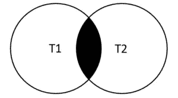
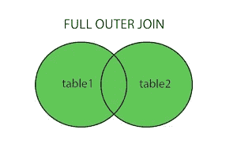
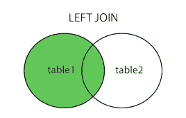
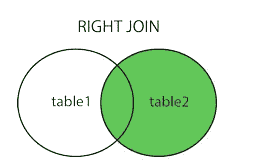

# SQL(结构化查询语言)基础

> 原文：<https://medium.com/analytics-vidhya/basic-of-sql-structured-query-language-eff8c0dfec2d?source=collection_archive---------29----------------------->


[法托斯 Bytyqi](https://unsplash.com/@fatosi?utm_source=medium&utm_medium=referral) 在 [Unsplash](https://unsplash.com?utm_source=medium&utm_medium=referral) 上的照片

*   **SELECT:** SELECT 是最常用的语句，它允许我们从表中检索信息。

SELECT 的语法:

```
SELECT column_name FROM table_name
```

如果需要表中的所有列:

```
SELECT * FROM table_name
```

*   **SELECT DISTINCT :** 有时一个表包含一个有重复值的列。 **DISTINCT** 关键字可用于仅返回列中的不同值。

语法:

```
SELECT DISTINCT column FROM table_name
```

*   **COUNT:** 返回表格中的行数。

语法:

```
SELECT COUNT(name) FROM table_name;
```

与众不同:

```
SELECT COUNT(DISTINCT(name)) FROM table_name;
```

*   **SELECT WHERE:**WHERE 语句允许我们为要返回的行指定列条件。

语法:

```
SELECT column1,column2 FROM table WHERE conditions;
```

*   **排序依据:**使用该选项，您可以根据列值按升序或降序对行进行排序。

语法:

```
SELECT column1,column2 FROM table ORDER BY column1 ASC/DESC;
```

*   **LIMIT:**LIMIT 命令允许我们限制查询返回的行数。

语法:

```
SELECT column1,column2 FROM table LIMIT 10;
```

*   **BETWEEN:**BETWEEN 运算符可用于将一个值与一系列值进行匹配。

语法:

```
SELECT column1 FROM table WHERE column1 BETWEEN 1 AND 10;
```

*   **IN :** 我们使用 IN 操作符来创建一个条件，检查包含在可用选项列表中的值。

语法:

```
SELECT column1 FROM table WHERE column1 IN (options)
```

*   **LIKE 和 I LIKE:****LIKE**操作符允许我们使用通配符对字符串数据执行模式匹配:

1.  Percent %:匹配任何字符序列
2.  下划线 _:匹配任何单个字符

注意:LIKE**区分大小写**其中 as I LIKE**不区分大小写**

示例:

```
SELECT * FROM customer WHERE first_name LIKE ‘A%’;SELECT * FROM customer WHERE first_name ILIKE 'a%' and last_name ILIKE 's%';SELECT * FROM customer WHERE first_name LIKE '_her%'
```

**最常见的聚合函数:**

*   AVG() —返回一个浮点值
*   COUNT()-返回行数
*   MAX()-返回最大值
*   MIN()-返回最小值
*   SUM()-返回所有值的总和

示例:

```
SELECT Min(replacement_cost),MAX(replacement_cost),ROUND(AVG(replacement_cost),2) from film;
```

**分组依据:**它允许我们根据某个类别聚集列。

常规语法:

```
SELECT category_col, AVG(data_col) FROM table GROUP BY category_col
```

*   **HAVING:** HAVING 允许我们将聚合结果与 GROUP By 一起用作过滤器。

示例:

```
SELECT customer_id, SUM(amount) FROM payment GROUP BY customer_id HAVING SUM(amount)<100;
```

*   **AS 语句:**它允许我们为列或结果创建“别名”。

```
SELECT column as new_name FROM table;
```

*   **联接:**它允许我们组合来自多个表的信息。
*   **连接类型:**

1.  **内部连接:**内部连接将产生一组在两个表中都匹配的记录。

```
SELECT * FROM Table B INNER JOIN Table A ON TableA.col_match = TableB.col_match
```



内部连接

2.**完全外连接(FULL JOIN) :** 完全外连接将产生左表或右表记录中匹配的所有记录。

```
SELECT * FROM TableB FULL OUTER JOIN TableA ON TableA.col_match = TableB.col_match
```



完全外部连接

3.**左外连接:**左外连接产生左表中的记录集，如果与右表不匹配，则结果为空。

```
SELECT * FROM TableA LEFT OUTER JOIN TableB ON TableA.col_match = TableB.col_match
```

注意:在这个连接中，顺序很重要。



左外部连接

4 .**右连接:**右连接与左连接相同，只是表被交换了。

```
SELECT * FROM TableA RIGHT OUTER JOIN TableB ON TableA.col_match = TableB.col_match
```



右连接

*   **Union:**Union 操作符用于组合两个或多个 SELECT 语句的结果集。

```
SELECT column_name(s) FROM table1 
UNION
SELECT column_name(s) FROM table2;
```

感谢您的阅读。我希望这篇博客对你有所帮助。我将很快发表另一篇关于高级 SQL 查询的博客。

快乐编码:)