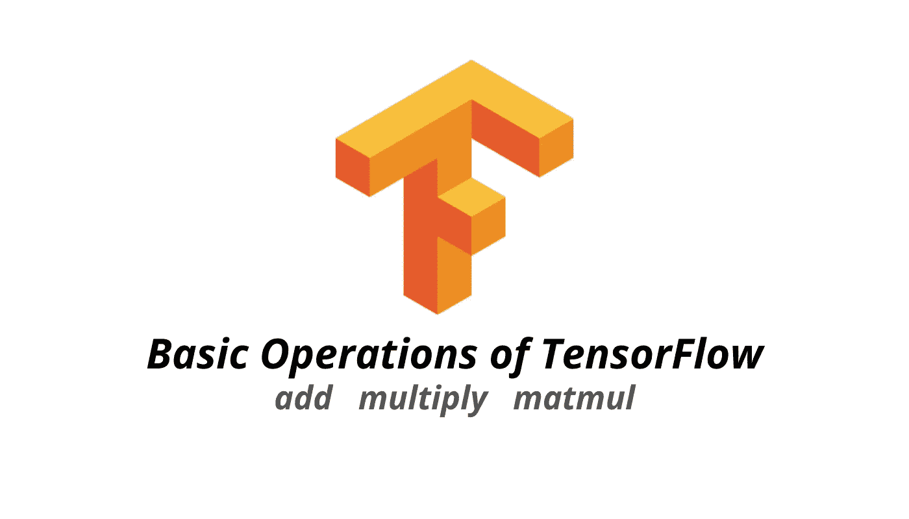

# 张量流的基本运算

> 原文：<https://medium.com/analytics-vidhya/basic-operations-of-tensorflow-e6311e2eb8a0?source=collection_archive---------10----------------------->

## 张量流简介第 2 部分



# 什么是张量流运算？

TensorFlow 有一个围绕图形使用的计算模型。张量流图包含边和节点，其中边是张量，节点是操作。

> 如果你错过了张量介绍的第一部分，看看这篇我介绍张量流基础的文章。

[](/analytics-vidhya/introduction-to-tensorflow-8f2dbaba8844) [## 张量流简介

### 在这篇文章中，我将介绍张量流的基础知识，在深入研究之前，你需要了解这些知识…

medium.com](/analytics-vidhya/introduction-to-tensorflow-8f2dbaba8844) 

# 应用加法运算符

```
add( tensor,tensor ) 
```

加法运算用两个张量执行元素相加。两个张量必须有相同的形状才能使用加法。

# 应用乘法运算符

```
multiply (tensor , tensor  )
```

要使用乘法，所涉及的张量必须具有相同的形状。

# 矩阵乘法

```
matmul( A , B ) 
```

Matmul 是用来乘矩阵的。要使用 matmul，A 的列数必须等于 B 的行数。

乘法与乘法

当我们试图执行张量之间的乘法时，我们使用乘法，如果你试图执行矩阵之间的乘法，那么使用 matmul。

# 张量维数上的求和

我们可以用 reduce_sum 对一个张量或一个你选择的数的所有维度求和，我们可以用下面的代码来实现

```
#if we did not specify the second argument it will sum across all dimension and give your a number 
reduce_sum(tensor)#in this case it will sum all number in the second dimension ( 1 ) reduce_sum(tensor,1)
```

这就是 TensorFlow 介绍的第二部分，你可以关注我的灵媒或在我的 Linkedin 中与我联系，以保持对灵媒的关注。

 [## Swee Liang Chua — NYP 信息技术学院(SIT) —新加坡，新加坡| LinkedIn

### 查看 Swee Liang Chua 在全球最大的职业社区 LinkedIn 上的个人资料。瑞良的教育是…

www.linkedin.com](https://www.linkedin.com/in/sweeliang/)