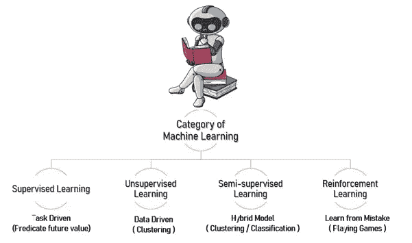

# 对机器学习和工具有基本的了解

> 原文：<https://medium.com/analytics-vidhya/basic-understanding-of-machine-learning-and-tools-17aa753774fb?source=collection_archive---------3----------------------->

在当今的数字世界中，机器学习不可否认是简化人类生活和解决复杂问题的最有影响力和最强大的技术之一。即使是那些每天都在快速增长的应用，也需要几年的时间才能看到全部的潜在用途。没有这项关键技术，人类就无法解决高度复杂的问题，避免和优化资源浪费。

本文旨在让外行了解机器学习的基本知识和支持工具。

21 世纪，**数据是新黄金，石油是新石油**。最近的一篇文章说，“T2，随着我们许多联网设备跟踪、产生和存储信息，每天产生 2.6 万亿字节的数据(来源)。甚至那些所有的机器(应用程序)就像任何东西一样产生数据。除非我们分析数据并从中发现隐藏的模式，否则存储数据是没有用的。

机器学习是一种将数据、信息转化为知识的**工具。**这些技术用于在复杂的数据中自动发现有价值的潜在模式，而这是人类需要几天或几个月，甚至几年才能完成的。隐藏的模式和关于问题的知识可以用来预测未来的事件和执行各种复杂的决策。

什么是机器学习？

机器学习的类型有哪些？

机器学习工具

**什么是机器学习(ML)？**

机器学习是人工智能(AI)的一个**应用，其中计算机从历史(过去)数据中学习，并在没有任何用户交互的情况下自主做出决策。**

ML 帮助我们做出正确的商业决策，提高生产力，自动检测疾病，预测天气，等等。

简单地说，**机器从经验中学习(给定过去的数据)并预测未来**。

下面给出了一些最好的机器学习实时示例:

网飞——电影推荐

脸书—建议朋友的请求

语音识别

医疗诊断

图像识别

欺诈检测

无人驾驶汽车

**机器学习有哪些类别？**

机器学习的范畴

监督学习:计算机应用程序通过给定的样本输入(数据集)及其期望的输出进行学习。

*监督学习中的著名技术*

***a)回归:* —** 线性回归用于预测、预报和寻找定量数据之间的关系。预测房价、分数等。

***b)分类:* —** 分类用于通过分析数据并识别其中的模式来预测定性结果。隔离某人是否拖欠贷款？

**无监督学习:**计算机应用程序自己学习(像有监督学习一样没有样本输入和期望的输出，发现给定数据中隐藏的模式)或达到目的的一种手段。这有助于从数据中找到有用的见解。

*无监督学习中的著名技术*

**a)聚类:—** 聚类用于将数据分组到相似的簇中，以便提取信息或使其更容易处理。将产品销售给合适的客户群

**半监督学习:**监督和非监督学习的混合模型。例如语音分析、文本文档分类器

**强化学习:**计算机应用程序与动态环境交互并执行某个目标/任务。我的意思是，学会在没有任何监督的动态环境中工作。例如自动驾驶汽车

**少数机器学习工具:**

**TensorFlow —** TensorFlow 是一个人工智能库，用于数值计算、数据流图来构建模型。它允许开发人员创建具有许多层的大规模神经网络。

**Jupyter Notebook 或 Google Colab 的—** 这是一个允许我们以笔记本的形式存储、执行和分享实时代码的环境

**Pandas —** Pandas 用于数据清理和分析。主要用于从不同来源的系统中提取和转换数据。

**Numpy —** Numpy 用于科学计算。

**sci kit-Learn—**sci kit-Learn(sk Learn)是一个健壮的库，提供统计建模。

MatPlotLib — Matplotlib 是一个图形绘制库，用于绘制直方图、条形图、饼图..

**Seaborn —** Seaborn 是一个运行在流行的 Matplotlib 数据可视化库之上的数据可视化库，尽管它提供了一个简单的界面和美观的图形...

**结论:**市面上有那么多流行的机器学习工具。但这些是开始我们机器学习编程之旅的一些关键工具。