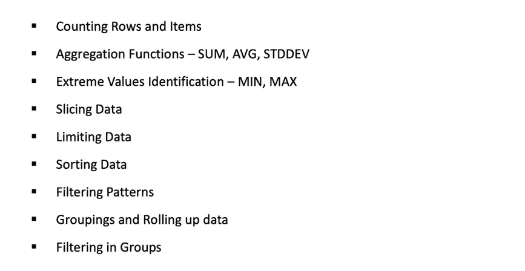

# 数据科学所需的基础 MySQL 知识。

> 原文：<https://medium.com/analytics-vidhya/basics-mysql-knowledge-required-for-data-science-98530539076a?source=collection_archive---------3----------------------->

来源:互联网

在这个博客中，我们将讨论 SQL 的基础课程，它对所有专业人士都很有用，无论是数据分析师、业务分析师还是数据科学家，都可以从存储在 SQL 数据库中的数据中提取、操作或得出见解。我们将从介绍、安装和实践课程开始学习 MySQL 数据库。

## 简介:

> 1.我们为什么需要数据库？

数据的快速爆炸产生了高效存储和检索数据的需求。我们实际上正在离开数据时代。

各种数据来源|来源:分析 Vidhya

我们需要的数据库主要用于 4 种操作，即*存储、更新、删除和搜索。*我们真的需要快速搜索，正如我们将在博客中看到的，这是使用专业化数据库的主要原因之一。

从数据科学家的角度来看，我们需要数据来知道如何检索、操作和保存处理过的数据。

> 2.什么是数据库？

*这是一个有组织的数据集合，通常通过计算机系统以电子方式存储和访问。*

> 3.数据库有哪些好的属性？

食物食谱博客。

数据库的属性|来源:分析 Vidhya

> 4.什么是不同类型的数据库？

不同类型的数据库|来源:分析 Vidhya

> 5.数据是如何存储在数据库中的？

数据存储|来源:分析 Vidhya

正如我们在非 SQL 类型的数据库中看到的那样，这种数据库没有模式，所有内容都存储为 JSON 对象。我们可以看到，我们有键值类型的通知。我们可以在许多层次上嵌套事物，这在关系数据库中是不可能的，因此非 SQL 的定义表的方式更加简单和灵活，并且最近更加流行。

> 6.使用 MySQL 的公司有哪些？

***全球 80 %的公司使用 MySQL*** *。下面是使用 MySQL 的公司列表。*

使用 MySQL 的公司列表|来源:Analytics Vidhya

## 安装 MySQL / MariaDB

在这一部分，我们将学习如何安装 MySQL。安装 MySQL / MariaDB 请参考以下链接(MariaDB 是 Oracle 收购的 MySQL 的 fork 版本)。

我们将为这个博客安装 MySQL 5.7(Windows)

安装链接:

 [## MySQL::下载 MySQL 安装程序

### MySQL 的安装

dev.mysql.com](https://dev.mysql.com/downloads/windows/installer/5.7.html) 

## 入门指南

在这一部分中，我们将学习什么是查询类型，并开始编写大多数常用的查询，如 SELECT & INSERT。我们还将了解 MySQL 的数据类型。

> 1.什么是 SQL？

SQL 代表'*结构化查询语言*'。它是一种与数据库交流的语言。它是标准的，这意味着它不依赖于任何硬件。我们可以使用这种语言来创建、维护和检索与数据库及其数据相关的信息。

> 2.SQL 的历史？

SQL 的历史|来源:Analytics Vidhya。

> 3.SQL 中的命令类型有哪些？

我们有以下类型的 SQL 语句:

*   数据定义语言

*   数据操作语言

*   数据控制语言

> 4.探索数据库。

在这一部分中，我们将了解如何创建一个数据库，连接到该数据库并将其用于我们的业务目的。

创建数据库的执行步骤|来源:Analytics Vidhya

在创建表和探索更多内容之前，让我们看看 MySQL 的数据类型。下面给出了参考链接。

MySQL 中的数据类型|来源:Analytics Vidhya

 [## MySQL :: MySQL 8.0 参考手册::11 种数据类型

### MySQL 支持几种类型的 SQL 数据类型:数字类型、日期和时间类型、字符串(字符和字节)…

dev.mysql.com](https://dev.mysql.com/doc/refman/8.0/en/data-types.html) 

> 5.创建表格。

这里我们将看到如何在 MySQL 中创建表的结构。

在 MySQL 中创建表|来源:Analytics Vidhya

> 6.在表格中插入记录。

在这里，我们将看到如何在新创建的表 User Details 中插入记录。

在表格中插入记录|来源:Analytics Vidhya。

> 7.NULL &非 NULL。

Null 和 Not Null 的区别|来源:Analytics Vidhya

## 修改数据库结构

在这一部分中，我们将了解如何使用删除和更新命令。我们还将看到如何使用 DESCRIBE 来查看表的结构，最后我们将使用 ALTER 命令来改变表的结构。

> 1.更新命令。

*UPDATE* 命令用于更新数据库中表格中的数据。

**注:**

*   一次只能更新一列。
*   在更新中使用 where 子句有助于我们更新感兴趣的行。
*   如果没有提到 where 子句，它将把提到的 ***列名*** 的所有行设置为 ***新值。***

更新命令演示|来源:Analytics Vidhya。

> 2.删除命令。

*删除*命令用于从表格中删除记录。

**注:**

*   对应于 where 子句的所有匹配行将从表中删除。
*   如果不使用 where 子句，将删除所有行。

删除命令演示|来源:Analytics Vidhya。

> 3.描述命令。

*描述*或*显示创建表格*基本上都是用来显示表格的结构。两者的区别在于，DESCRIBE 给了我们结构，而另一个给了我们创建表的语法，可以进一步使用。

DESCRIBE 命令演示|来源:Analytics Vidhya

> 4.*改变*的命令。

使用 *ALTER* 命令，我们可以在表中添加一列，更改它的名称以及数据类型。

演示用于添加列并更改其名称的 ALTER 命令|来源:Analytics Vidhya

我们还可以使用 ALTER 命令更改列的数据类型。

用于修改数据类型的 ALTER 命令演示|来源:Analytics Vidhya。

## 导入和导出数据

在这一部分中，我们将了解如何在 MySQL 中导入和导出数据，这些数据可以是平面文件、csv 或 excel 格式。我们还将了解如何备份数据库及其对象，并在另一台服务器上恢复它。

> 1.将数据从 CSV 导入 MySQL。

将 csv 文件内容加载到 MySQL 表中的演示|来源:Analytics Vidhya

> 2.从 MySQL 导出数据到 CSV。

将数据从 MySQL 导出到 CSV 文件的演示|来源:Analytics Vidhya

> 3.在 MySQL 中备份数据库。

在这一部分中，我们将学习如何将数据库备份到 SQL 文件中。

MySQL 数据库备份演示|来源:Analytics Vidhya

> 4.在 MySQL 中恢复数据库。

在这里，我们将看到如何恢复被用户意外删除的数据库。

为了恢复数据库，我们首先需要创建一个空数据库，然后重定向备份阶段生成的输出 SQL 文件。

MySQL 中恢复数据库的步骤|来源:Analytics Vidhya

## 使用 MySQL 进行数据分析

这个模块起着重要的作用，我们将使用 MySQL 来查看数据分析部分。作为一名数据科学家，我们需要从数据中获取真知灼见，这就是本模块的内容。

数据分析模块下涵盖的模块列表|来源:Analytics Vidhya

> 1.计数行和项目。

行和项目计数演示|来源:Analytics Vidhya

> 2.聚合函数(求和、AVG、标准差、最小值、最大值)

聚合函数演示|来源:Analytics Vidhya

> 3.在 MySQL 中切片所需的数据。

在这一部分我们将看到 In、OR、NOT 运算符。我们还将看到 where 子句的 AND 和 BETWEEN 运算符。

***在***

在我的 SQL 中演示 IN 运算符|来源:Analytics Vidhya

**不在操作员:**

MySQL 中 NOT IN 运算符的演示|来源:Analytics Vidhya

**间符:**

MySQL 中 BETWEEN 的演示|来源:Analytics Vidhya

> 4.限制 MySQL 中的数据。

在这一部分中，我们将了解如何限制表中要查看的行数。

我们可以使用 limit 关键字来限制行数。

MySQL 中的行数演示|来源:Analytics Vidhya

> 5.MySQL 中的数据排序。

**升序:**

演示如何按升序对工资进行排序并获得第二低的工资|来源:Analytics Vidhya

**降序:**

演示如何按降序对薪金进行排序并获得第二大薪金|来源:Analytics Vidhya

> 6.在 MySQL 中使用 LIKE 和通配符过滤模式。

MySQL 中的过滤操作演示|来源:Analytics Vidhya

> 7.MySQL 中的分组、汇总和分组过滤。

获取独特部门的数量|来源:分析 Vidhya

MySQL 中过滤汇总数据的示例|来源:Analytics Vidhya

## **描述性分析:FIFA 2019**

 [## grajpal 123/Descriptive-analysis-using-MySQL-FIFA-2019

国际足联球员使用 MySQL 的描述性分析](https://github.com/grajpal123/Descriptive-Analaysis-using-MySQL-FIFA-2019) 

上面的链接由一个使用 MySQL 查询的项目组成。我们对 FIFA 2019 球员数据集做了描述性分析。

## 在 MySQL 中处理连接。

在实际场景中，数据不是存储在单个表中。它存储在多个表中。在本模块中，我们将了解如何使用连接和子查询从多个表中获取数据。

## 连接的类型。

MySQL 中的连接类型|来源:Analytics Vidhya

> 1.左接合。

关于左连接的描述|来源:分析 Vidhya

实践考试左连接|来源:分析 Vidhya

> 2.内部联接。

关于内部联接的描述|来源:Analytics Vidhya

> 3.交叉连接/笛卡尔连接。

我们必须注意，这种类型的连接在实践中很少使用。

关于交叉连接的描述|来源:Analytics Vidhya

> 4.向右加入。

关于右连接的描述|来源:Analytics Vidhya

> 5.自我联结。

自连接是我们将一个表连接到自身的场景。它调试起来很复杂，只有当我们需要成对列表时才能使用。例如，FIFA_2019 数据集中属于同一俱乐部的成对球员或年龄差小于 10 岁的成对球员分布。

关于自连接的描述|来源:分析 Vidhya

## 索引简介

索引帮助我们在数据库中快速查询和搜索。

关于指数的描述|来源:Analytics Vidhya

> 1.索引是如何工作的？

让我们考虑图书馆的例子，并理解索引将帮助我们更快搜索的场景。

情况 1:如果有一个场景，有一本新书进来，随之而来的是很少有其他书需要更新或删除或已经过时。因此，如果一个图书管理员随意保存了一本新书，那么下次要找到这本书就要花很多时间。

案例 2:如果一个聪明的图书管理员已经根据主题和作者按字母顺序对所有的书进行了分类，那么为 XYZ 作者保存一本属于 XYZ 主题的新书就变得更容易了。

因此，考虑到第二种情况，我们可以说，根据作者的主题进行索引将使我们的搜索更快，也将帮助我们插入，更新自我，然后毫无困难地删除过时的书籍。

> 2.关系。

关系类型|来源:分析 Vidhya

> 3.表约束。

表约束对插入表中的数据施加约束。如果我们试图插入违反该约束的数据，MySQL 将不允许我们插入该数据。

关于表约束的描述|来源:Analytics Vidhya

## MySQL 内置函数。

在这一节中，我们将讨论 MySQL 中使用的一些内置函数，它们可以帮助我们进行报告。

> 1.字符串函数:CONCAT

该函数用于连接数据中的字符串。例如，如果我们需要从数据中连接人的名和姓。我们使用 MySQL 中的 ***concat*** 关键字来实现这一点。

CONCAT 操作示例|来源:Analytics Vidhya

> 2.字符串函数:大小写

这个函数用于将字符串转换成小写或大写。我们在 MySQL 中使用 ***ucase*** ***(上)*** 或 ***lcase(下)*** 关键字来实现这一点。

案例操作示例|来源:Analytics Vidhya

> 3.字符串功能:修剪字符串

这个函数用于删除字符串中前导和尾随空格。我们使用 MySQL 的 ***ltrim*** ， ***rtrim*** 和 ***trim*** 函数来实现这一点。

修剪字符串的示例|来源:Analytics Vidhya

> 4.字符串函数:提取/分割字符串

这用于提取字符串某些部分。我们使用 ***左、*** 右、 ***子串*** 关键字提取字符串的开头、结尾和部分字符。

字符串切片示例|来源:Analytics Vidhya。

> 5.日期时间函数:当前日期和时间。

我们使用 ***now()*** 函数获取当前日期和时间戳。除此之外，我们还可以使用 ***curdate()*** ， ***curtime()*** ，***UNIX _ timestamp()***来观察下面的结果。

使用 MySQL 函数获取当前日期和时间的示例|来源:Analytics Vidhya

> 6.日期时间函数:提取日期和时间。

从 MySQL 中的特定列提取日期和时间的示例

> 7.日期时间函数:提取月/日/年

从 MySQL 中的特定列提取月/日/年的示例|来源:Analytics Vidhya

> 8.日期时间函数:格式化日期时间

使用所需日期格式格式化日期列的示例|来源:Analytics Vidhya

> 9.数字函数

MySQL 中使用了各种数值函数。我们将看到以下功能:

1.  ***【round()】***用于将数字四舍五入到最接近的整数的函数。

MySQL 中的 ROUND 函数示例|来源:Analytics Vidhya

**2。floor()** 函数，用来向下舍入数值。

MySQL 中的 FLOOR 函数示例|来源:Analytics Vidhya

***3.ceil()*** 用来对数值进行上舍入的函数。

MySQL 中的 CEIL 函数示例|来源:Analytics Vidhya

***4.truncate()*** 函数帮助我们显示所需的小数点位数。

MySQL 中的截断函数示例|来源:Analytics Vidhya

***5。abs()*** 的作用是去掉数字的负号。

MySQL 中的 ABS 函数示例|来源:Analytics Vidhya

## MySQL WINDOWS 函数

使用 MySQL windows 函数可以更方便地进行数据分析计算。如果要使用 windows 函数，我们会经常使用由 分割的 ***OVER()*** 和 ***。***

OVER():它决定了窗口(行的集合)

PARTITIONED BY:它将结果分成应用窗口函数的分区。

 [## MySQL :: MySQL 8.0 参考手册::12.20.1 聚合函数描述

### 可用作 windows 函数的集合函数列表。

dev.mysql.com](https://dev.mysql.com/doc/refman/8.0/en/aggregate-functions.html) 

为了演示 windows 功能，我们将创建名为 **SALES 的演示数据库。**考虑以下数据库/表格的模式。

销售数据库的模式|资料来源:YouTube (SQL 教程—horsed Dev 的窗口函数)

> 1.得到总额/销售额。

要获得 ***每笔销售额的总额*** ，然后填充回主表，我们需要使用 CTE(通用表表达式)。查询和输出如下所示。

MySQL 中的 CTE 函数演示|来源:YouTube (SQL 教程—胡德夫的窗口函数)

现在要调试和掌握上面的查询有点困难。它也不容易阅读。因此，windows 函数将我们从这个问题中解救出来，我们将使用 ***而不是*** 子句来帮助我们在 windows 中划分数据，并使用 ***分区和*** 子句来进一步分解数据。

Windows 函数演示|来源:YouTube (SQL 教程 Bearded Dev 的窗口函数)

> 2.获取行金额/销售额以及总销售额的数量。

Windows 函数演示|来源:YouTube (SQL 教程 Bearded Dev 的窗口函数)

> 3.来获得每日销售额。

Windows 函数演示|来源:YouTube (SQL 教程 Bearded Dev 的窗口函数)

结论

因此，在这个博客中，我们学习了任何数据科学家都需要的基本 MySQL 知识。我们从介绍和了解历史开始。我们定义了什么是 DDL、DML 和 DCL 命令。我们对它们进行了详细的研究，并用实例进行了探索。我们了解如何通过编写 SQL 查询来进行分析，并对 FIFA_2019 球员项目进行了描述性分析。我们还了解了各种类型的连接和内置函数。最后但并非最不重要的一点是，我们了解了有助于报告目的的窗口功能。

希望你理解了这篇博客背后的基本直觉。

请务必在 LinkedIn 上与我联系:[https://www.linkedin.com/in/gaurav-rajpal/](https://www.linkedin.com/in/gaurav-rajpal/)

如果你喜欢，请给 50 个掌声。

