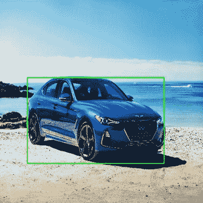
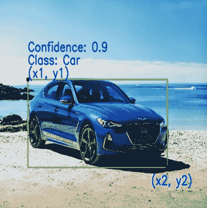
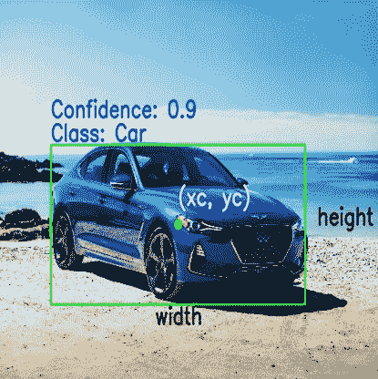

# 边界框的基础

> 原文：<https://medium.com/analytics-vidhya/basics-of-bounding-boxes-94e583b5e16c?source=collection_archive---------4----------------------->

什么是边界框？

本质上，边界框是一个围绕着一个对象的矩形，它指定了它的**位置**、**类别**(例如:汽车、人)和**置信度**(它在那个位置的可能性有多大)。包围盒主要用于目标检测任务，其目的是识别图像中多个目标的位置和类型。例如，如果你看下面的图像，绿色矩形是一个边界框，它描述了汽车在图像中的位置。

包围盒

**用于指定边界框的惯例:**

表示边界框时有两个主要的约定:

1.  根据其左上角和右下角的坐标指定该框。
2.  指定相对于其中心、宽度和高度的框。

根据左上角和右下角指定的边界框

相对于其中心坐标指定的边界框

**用于定义边界框的参数:**

根据遵循的惯例，以下是指定边界框的主要参数:

1.  盒子里面的物体是什么？如汽车、卡车、人等
2.  **(x1，y1):** 对应矩形左上角的 x，y 坐标。
3.  **(x2，y2):** 对应矩形右下角的 x，y 坐标。
4.  **(xc，yc):** 对应包围盒中心的 x，y 坐标。
5.  **宽度:**代表边界框的宽度。
6.  **高度:**代表边框的高度。
7.  **置信度:**表示该物体实际存在于该盒子中的可能性。例如，置信度为 0.9 表示有 90%的可能性该对象确实存在于该盒子中。

**在约定之间转换:**

根据我们的用例，我们可以在表示边界框的不同形式之间转换。

1.  **xc** = ( x1 + x2 ) / 2
2.  **yc** = ( y1 + y2 ) / 2
3.  **宽度** = ( x2 — x1)
4.  **高度** = (y2 — y1)