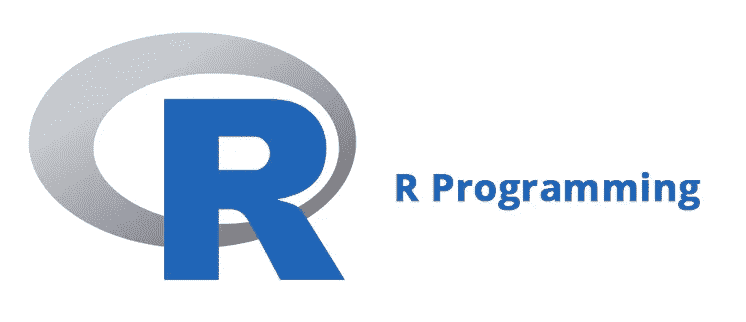

# 学习 R —第 1 部分

> 原文：<https://medium.com/analytics-vidhya/basics-of-r-23b34d491dd8?source=collection_archive---------23----------------------->



在这篇文章中，我将讨论以下话题，这些话题将帮助我们迈出学习 R 语言的第一步。

1.  背景
2.  装置
3.  安装软件包和加载库

# 背景

r 由统计学家和数据分析师开发，作为数据分析的交互环境。

# 装置

我们需要在本地计算机上安装 R and R 工作室，我推荐使用集成开发环境(IDE)r studio 来编辑和测试我们的代码。

R 和 RStudio 都可以免费下载安装。

## 安装 R

你可以从综合 R 档案网( [CRAN](https://cran.r-project.org) )下载 R，或者在浏览器上搜索 CRAN。

1.  在 CRAN 页面上，选择您的操作系统版本——Linux、Mac OS X 或 Windows。
2.  一旦进入 CRAN 下载页面，你将有几个选择。你要安装*基*子目录。这将安装您需要开始使用的基本软件包。
3.  单击最新版本的链接开始下载。

## 安装 RStudio

1.  您可以从在浏览器上搜索 [RStudio](https://rstudio.com/products/rstudio/download/) 并点击网站下载开始。
2.  选择 RStudio 桌面免费版。
3.  选择此选项后，您将进入提供操作系统选项的页面。单击显示您的操作系统的链接。
4.  单击下载的文件开始安装过程。

# **安装软件包和加载库**

1.  [**install . packages**](https://www.rdocumentation.org/packages/utils/versions/3.6.2/topics/install.packages)**—从类似 CRAN 的存储库或本地文件下载并安装软件包。从 R 控制台使用`*install.packages("pkg_name")*` 安装软件包或从 RStudio 界面:工具>安装软件包(允许自动完成)**

```
# To install a single package named dslabs
install.packages("dslabs")# To install two packages at the same time
install.packages(c("tidyverse", "dslabs") # To see the list of all installed packages
installed.packages()
```

***(****ds Labs****代表* ***数据科学实验室*** *)。它包含数据集和函数，可用于数据科学课程和研讨会中的数据分析实践、作业和项目。26 个数据集可用于数据可视化、统计推断、建模、线性回归、数据争论和机器学习方面的案例研究。)***

**其他包的列表可以在这里找到([https://cran . r-project . org/web/packages/available _ packages _ by _ name . html](https://cran.r-project.org/web/packages/available_packages_by_name.html))**

**2.**库** —将包加载到 R 会话中**

```
library(dslabs)
```

## **从这里去哪里？**

**要继续学习 R 语言，请访问( [Learning R —第 2 部分](https://hanoor-sharma.medium.com/learning-r-part-2-fb9ff130c51f))，这是本系列的第二篇文章。**