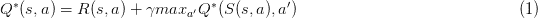

# 强化学习基础(举例)

> 原文：<https://medium.com/analytics-vidhya/basics-of-reinforcement-learning-with-example-fe3c0fb0fd60?source=collection_archive---------22----------------------->

DeepMind 的 AlphaGo 利用强化学习赢了围棋

机器学习提供了各种公式来解决问题。强化学习是继监督学习和非监督学习之后的第三种机器学习范式。这里的目标是从错误中发展和学习，与其他两个范例不同，这里的数据主要是在遇到错误时开发的。引用 Kaelbling，L.P .在他 1996 年的评论论文(强化学习:调查)中的话:

> 强化学习是通过与环境互动来学习

它的应用主要在于机器人甚至游戏。利用 RL，2015 年，谷歌的 [AlphaGo](https://deepmind.com/research/case-studies/alphago-the-story-so-far) 击败了拥有无限可能性的围棋世界冠军。这篇文章用一个如何训练山地车到达山顶的例子来描述 RL 的基础知识(我在最后添加了 GitHub 代码链接)。

# 背景

强化学习的基本组成部分是为给定的状态创建一个奖励系统，并采取相应的行动。以下是主要组件:

*   状态空间
*   答:一组可能的行动
*   R(s，a):基于状态和行为的奖励
*   p(s'|s，a):从状态 s 到 s '的转移概率

现在，有两个范例来解决这些问题:

1.  **值迭代:**我们创建一个策略 P(s)，基于它我们返回下一个值。该递归函数可用于确定起始点(s0)处的最佳值 V(s0)。
2.  **Q-learning:** 这种方法用在我们对环境一无所知的时候。基本上，理想的 Q*(s，a)取决于下一步 Q 的贴现未来值。

当前的场景示例是一辆山地汽车，目标是将汽车开到山顶(参见下面的图 1)。因此，这类似于后者，其中不存在关于状态空间的任何信息。

**图一。**山地车问题演示

从数学上来说，我们的目标是找到最优 Q*

其中 a '是未来行动，γ是未来的贴现因子

# q 学习

如前所述，我们可以有探索性和开发性的移动(例如，对下一步移动应用贪婪的方法，或者尝试通过做出新的移动来学习)。因此，更新后的等式为:

其中α是学习率。第一部分是开发，第二部分是模式探索。更新后的权重计算如下:

在这个场景中，我们有 3 组动作:停留、向左移动或向右移动。为了通过 Q-learning 进行学习，我们将状态更新应用为:

我们行动的选择可以是随机的，也可以是根据情况计算出来的。对于渲染，代码使用了 **MountainCar** 类。通过等式(2)对模型的训练在我们将探索的剧集数中进行。在每集中，我们基于状态空间中的运动迭代地更新权重。

下面可以看到上面代码的运行演示。

一个显而易见的疑问出现了，探索与开发如何影响结果。如果汽车不动，我们可以提高学习率，而如果汽车的行为非常随机，我们可能需要降低学习率。

# 结论

强化学习领域是一个在没有任何数据的情况下寻找最优解的迭代过程。除了 Deep Mind 在 Atari 游戏中的成功之外，RL 的进步，包括深度学习的使用，无疑有助于机器人技术、自动驾驶汽车和无人机的发展。

你可以在谷歌上找到许多关于这方面的高级主题的链接，但是主要的基本原理是一样的。

你可以在这里找到 GitHub 代码！

**注意:**交叉张贴在我的[博客](https://kanishkmair.com/ml/basics-of-q-learning/)中，在那里你可以关注我关于人工智能和人工智能的文章