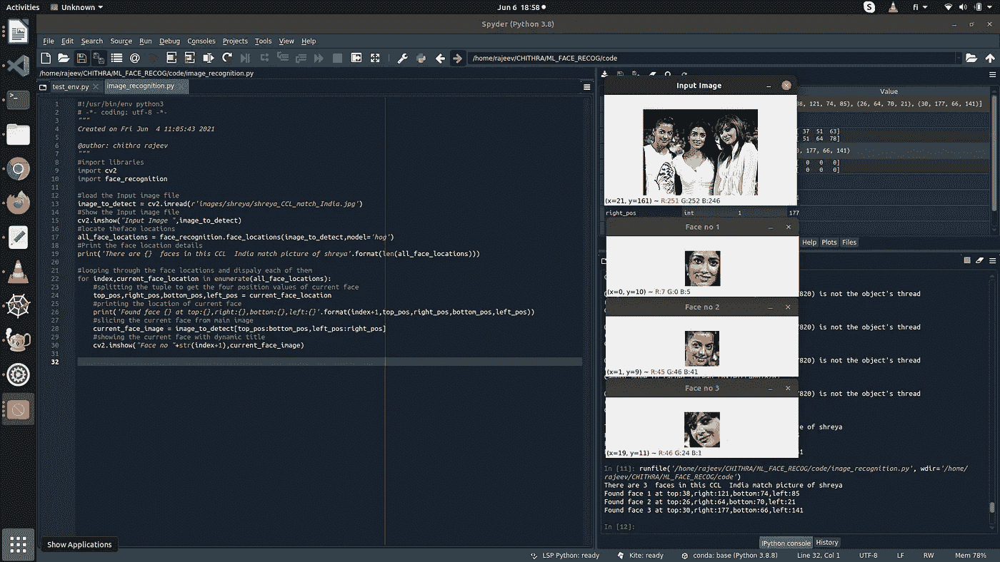

# 使用 Python 人脸识别库所需的基本设置

> 原文：<https://medium.com/analytics-vidhya/basics-of-setup-required-for-using-python-face-recognition-library-ae96bf29acca?source=collection_archive---------8----------------------->

**在 Python 中设置人脸检测和人脸编辑技术编程环境的快速指南。**

在这个博客中，我们将看到如何设置环境来编写程序，进行人脸识别，人脸检测和人脸化妆，年龄和性别识别。我们将使用位于 https://pypi.org/project/face-recognition/[的用于人脸识别的 python 库](https://pypi.org/project/face-recognition/)，为此，我们将学习 Linux 操作系统中 Tensorflow 和 Keras 深度学习库的安装和使用。

# 环境设置

首先我们需要安装 Anaconda，它包含 conda、Anaconda Navigator、Python 和许多用于机器学习的科学包。Anaconda Navigator 是一个 GUI，允许您启动像 Spyder IDE 这样的应用程序，用于以最佳方式进行深度学习编程，还可以轻松管理 conda 包。

```
#Prepare build environment with below packages ,
sudo apt-get update
sudo apt-get install build-essential cmake
sudo apt-get install libopenblas-dev liblapack-dev
sudo apt-get install libx11-dev libgtk-3-dev’
sudo apt-get install python python-dev python-pip

#Install the following extended dependencies for Qt required for the GUI packages of Anaconda
apt-get install libgl1-mesa-glx libegl1-mesa libxrandr2 libxrandr2 libxss1 libxcursor1 libxcomposite1 libasound2 libxi6 libxtst6
#Download Anaconda installer script from the link below,
#[https://repo.anaconda.com/archive/Anaconda3-2021.05-Linux-x86_64.sh](https://repo.anaconda.com/archive/Anaconda3-2021.05-Linux-x86_64.sh)
sudo sh ./Anaconda3–2021.05-Linux-x86_64.sh -u
#Check the installed version is ok
conda info
source ~/.bashrc
python — version
#Try launching Spyder IDE 
spyder
```

现在我们已经准备好编程的 IDE，接下来让我们安装从 https://pypi.org/project/face-recognition/的[网站编写人脸识别程序所需的 python 库，我们可以使用 conda 命令来安装下面列出的库](https://pypi.org/project/face-recognition/)

```
#create a environment for face recognition project 
conda create -n env_facerecog python==3.7.9 anaconda
conda activate env_facerecog
#Install dlib library
conda install -c conda-forge dlib
#Install opencv library
```

现在我们已经准备好编程的 IDE，接下来让我们安装从网站[https://pypi.org/project/face-recognition/](https://pypi.org/project/face-recognition/)编写人脸识别程序所需的 python 库，我们可以使用 conda 命令来安装下面列出的库

```
#create a environment for face recognition project 
conda create -n env_facerecog python==3.7.9 anaconda
conda activate env_facerecog
#Install dlib library
conda install -c conda-forge dlib
#Install opencv library
conda install -c conda-forge opencv
#Install face_recognition library
conda install -c conda-forge face_recognition
```

现在我们需要安装程序从环境中打开 spyder IDE
(env _ facerecog)chithrarajeev @ rk Lenovo:spyder
创建一个测试文件 test_env.py 并尝试打印我们安装的库的版本，如下所示

```
(env_facerecog) chithrarajeev@rklenovo:spyder
#import the libraries
import cv2
import dlib
import face_recognition
#printing the versions of libraries required
print(“Version of OpenCV is” ,cv2.__version__)
print(“Version of Dlib C++ toolkit for ML is” ,dlib.__version__)
print(“Version of face_recognition is” ,face_recognition.__version__)
```

> #输出如下
> OpenCV 版本为 4 . 5 . 2
> Dlib c++ toolkit for ML 版本为 19 . 22 . 0
> face _ recognition 版本为 1.2.3

有时 conda 安装可能会出现以下错误，如果您遇到以下任何错误，请尝试安装库的 pip

> 导入错误:没有名为“dlib
> 的模块导入错误:没有名为“cv2”的模块

```
(env_facerecog) chithrarajeev@rklenovo:pip install opencv-contrib-python
(env_facerecog) chithrarajeev@rklenovo:pip install dlib
(env_facerecog) chithrarajeev@rklenovo:pip install face_recognition
```

如果 pip 安装有问题，尝试添加所需的软件包的正确通道，也尝试使用选项'-c conda-forge '重新安装 conda，如下所示

```
conda create -n env_facerecog python matplotlib opencv scipy anaconda -c conda-forge
conda config — set channel_priority false
conda activate env_facerecog
```

使用下面显示的程序，我们可以检测图像中的人脸，并分别显示出来

```
#!/usr/bin/env python3
#import libraries
import cv2
import face_recognition#load the Input image file
image_to_detect = cv2.imread(r'images/shreya/shreya_CCL_match_India.jpg')
#Show the Input image file
cv2.imshow("Input Image ",image_to_detect)
#locate theface locations
all_face_locations = face_recognition.face_locations(image_to_detect,model='hog')
#Print the face location details
print('There are {}  faces in this CCL  India match picture of shreya'.format(len(all_face_locations)))#looping through the face locations and dispaly each of them
for index,current_face_location in enumerate(all_face_locations):
    #splitting the tuple to get the four position values of current face
    top_pos,right_pos,bottom_pos,left_pos = current_face_location
    #printing the location of current face
    print('Found face {} at top:{},right:{},bottom:{},left:{}'.format(index+1,top_pos,right_pos,bottom_pos,left_pos))
    #slicing the current face from main image
    current_face_image = image_to_detect[top_pos:bottom_pos,left_pos:right_pos]
    #showing the current face with dynamic title cv2.imshow("Face no "+str(index+1),current_face_image)
```



同样，我们可以使用图像帧识别录制的视频或直播视频中的人脸。

在识别了图像中的人脸后，我们可以使用这些人脸数据来识别图像中的人，找到人脸图像的年龄和性别，还可以识别人脸中的情绪，如愤怒、悲伤、快乐、厌恶、恐惧、惊讶、中立和蔑视，使用深度学习算法，这些算法在 Tensonflow 框架[https://www.tensorflow.org/tutorials](https://www.tensorflow.org/tutorials)中可供我们使用，可以在 Keras 库[https://Keras . io/getting _ started/intro _ to _ Keras _ for _ engineers/【中提供的包装器的帮助下使用在这里，我们将看到安装张量流和 Keras 深度学习库的步骤。](https://keras.io/getting_started/intro_to_keras_for_engineers/)

```
#install tensor flow library
(env_facerecog) chithrarajeev@rklenovo:sudo pip install tensorflow
```

*注意，安装 tensor flow 库需要很长时间，并显示消息“正在下载 tensor flow-2 . 5 . 0-cp37-cp37m-many Linux 2010 _ x86 _ 64 . whl(454.3 MB)”“*

```
#install keras library
(env_facerecog) chithrarajeev@rklenovo:~$ sudo pip install keras
```

现在，我们有了环境设置来编写程序，使用识别的人脸进行人脸识别、人脸情感检测、年龄和性别检测。