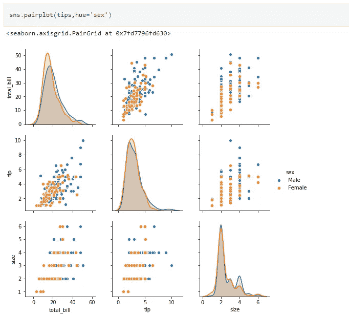

# 开始探索性数据分析(EDA)之前需要了解的基础知识

> 原文：<https://medium.com/analytics-vidhya/basics-to-know-before-even-you-start-exploratory-data-analysis-eda-cbd434add655?source=collection_archive---------0----------------------->

数据爱好者就是爱 EDA。我敢肯定，那些浏览了大量数据的人现在已经创建了他们的路径或模板，这为他们节省了大量时间并得出了结论。

但对于刚刚开始 EDA 的数据爱好者来说，如果你不在脑海中一遍又一遍地重复问题，以免迷失自我，有时会令人疲惫不堪。

在这篇文章中，我将列出一些对指导 EDA 有帮助的东西。

## 主要做 EDA 有以下目标:

1.  最大化洞察力
2.  揭开底层结构
3.  提取重要变量
4.  检测异常
5.  测试基本假设

目标可以不同于我所列出的，但是在开始之前我们必须有一个目标。

 [## ML(机器学习)模型，根据机器人的序列对其进行分类。

### 目标:开发一个最大似然模型，从机器人的序列中准确预测机器人

medium.com](/analytics-vidhya/ml-machine-learning-model-that-classify-the-robot-from-their-sequence-3383bfa71a18)  [## 分析 twitter 上客户推文的观点和主题模型

### 以下是我在这篇文章中要解决的问题:

medium.com](/analytics-vidhya/analyzing-sentiments-and-topic-modelling-for-customer-tweets-on-twitter-df9a121aae9d) 

EDA 流程图

## **单变量分析**

> 这意味着在一个时间内观察每个变量。在此分析中，通常会计算五点汇总。

**集中趋势的度量:**均值、中值和众数

**分散度的度量:**标准差，方差

**尾部(峰度)的度量:**右偏，左偏

## 双变量分析

> 这意味着查看两个变量之间的关系。需要注意的是，在分析时，我们应该始终考虑平均值或比例，而不是绝对的行数。

**变量类型:**

**连续变量**:连续变量是统计学中使用的一种特定的定量变量，用来描述以某种方式可以测量的数据。如果您的数据涉及测量身高、体重或时间，那么您就有一个连续变量。

**分类变量:**分类变量包含有限数量的类别或不同的组。分类数据可能没有逻辑顺序。例如，分类预测包括性别、材料类型和支付方式。

## **单变量可视化**

现在，让我们来看看 step by step EDA 的一些实际代码:

以下代码片段将为我们提供所有连续变量的五点总结:

五点总结

可视化均值、中值和众数

集中趋势的度量

## 双变量可视化

变量之间的相关性

关联的可视化

接合图

小提琴情节

比较平均值的箱线图

箱线图

谢谢！