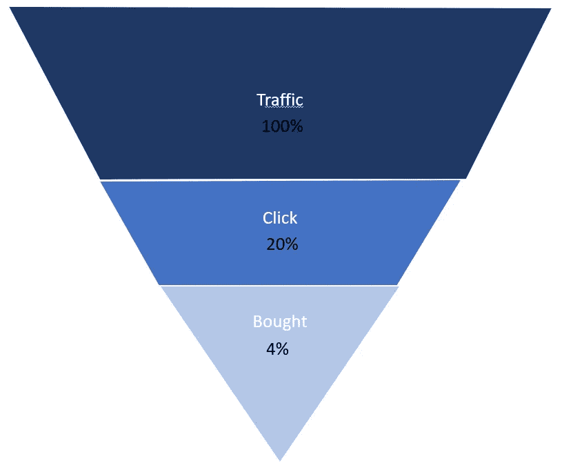

# 使用 MaxCompute 进行批处理

> 原文：<https://medium.com/analytics-vidhya/batch-processing-using-maxcompute-9f5755fb0d0d?source=collection_archive---------23----------------------->

## MaxCompute 如何在电商场景下进行漏斗模型分析？

漏斗模型其实是通过各种产品数据的转化率来判断产品运营的工具。转化漏斗就是利用每个阶段数据的转化来确定产品哪里有问题，然后不断优化产品。在电子商务中，漏斗模型是用户购买商品的路径，是从浏览商品到支付订单的每个环节的转换。本文将从用户的“浏览-点击-购买”链接展示漏斗分析和展示。

利用阿里云的日志服务、MaxCompute、DataWorks 和 Quick BI，可以实现批量处理实时电子商务数据以进行漏斗分析的快速管道。

1.  通过阿里云日志服务收集日志数据。
2.  日志服务的数据同步到大数据计算服务 MaxCompute。在 MaxCompute 中创建 ods_user_trace_data.db。

```
CREATE TABLE IF NOT EXISTS ods_user_trace_data 
(    
     md5                     STRING,
     uid                     STRING,
     ts                      BIGINT,
     ip                      STRING,
     status                  BIGINT,
     bytes                   BIGINT,
     device_brand            STRING,
     device                  STRING,
     system_type             STRING,
     customize_event         STRING,
     use_time                BIGINT,
     customize_event_content STRING
)  
PARTITIONED BY 
(     dt STRING  
);
```

将日志服务收集的增量数据同步到 MaxCompute 分区表。

3.MaxCompute 做离线计算。

并通过 Dataworks，设置定时调度执行，每天凌晨定时取前一天的数据，计算出以天为单位的转化率漏斗图。在 DataWorks 中创建 dw_user_trace_data.db。

```
CREATE TABLE IF NOT EXISTS dw_user_trace_data 
(    
     uid                     STRING,
     device_brand            STRING,
     device                  STRING,
     system_type             STRING,
     customize_event         STRING,
     use_time                BIGINT,
     customize_event_content STRING
)  
PARTITIONED BY 
(     dt STRING  
);
```

此外，创建一个应用程序数据服务

```
CREATE TABLE IF NOT EXISTS rpt_user_trace_data 
(    
     browse      STRING,
     click       STRING,
     purchase    STRING,
     browse_rate STRING,
     click_rate  STRING
)
PARTITIONED BY 
(
     dt STRING 
);
```

4.通过阿里云 Quick BI 可视化数据展示。使用 Quick BI，创建一个查询来获取关键营销指标、客户流失和相关统计数据。

客户旅程如下:

> 浏览->点击->购买，每个链接的转化率(转化率=从一个页面进入下一个页面的人数之比)。

```
INSERT OVERWRITE table rpt_user_trace_data PARTITION (dt=${bdp.system.bizdate}) 
SELECT browse as Traffic,
       click as ClickVolume,
       purchase as BuyVolume,
       concat(round((click/browse)*100,2),'%') as ClickRate,
       concat(round((purchase/click)*100,2),'%') as ConversionRate
FROM
(SELECT dt,count(1) browse from dw_user_trace_data where customize_event='browse'   and dt = ${bdp.system.bizdate} group by dt) a 
LEFT JOIN (select dt,count(1) click from dw_user_trace_data where customize_event='click'   and dt = ${bdp.system.bizdate} group by dt) b 
ON a.dt=b.dt 
LEFT JOIN (select dt,count(1) purchase from dw_user_trace_data where customize_event='purchase'  and dt = ${bdp.system.bizdate} group by dt)c  
ON a.dt=c.dt  ;#Select to view a particular date conversion funnel from rpt_user_trace_data that is overwritten
SELECT * FROM rpt_user_trace_data WHERE dt='20210303';
```



特定日期客户群的漏斗分析

通过 Quick BI 创建网站用户分析画像仪表盘，实现数据表可视化。从上图我们发现，浏览到点击的业务量呈现出明显的萎缩趋势，转化率较低。分析当前业务流程中哪个环节是薄弱环节，可以帮助人们更加关注薄弱环节，提高整个流程的产出。进而提高整个流程的效率。