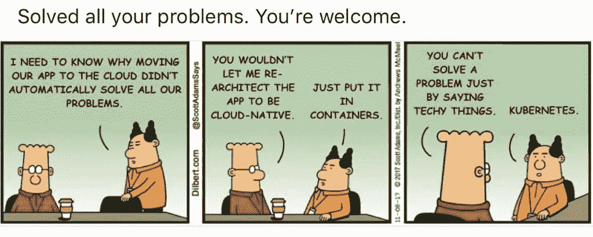

# Kubernetes 中的批处理工作负载

> 原文：<https://medium.com/analytics-vidhya/batch-workloads-in-kubernetes-1dd06bd36056?source=collection_archive---------0----------------------->

## 80%准备数据，20%抱怨准备数据！

众所周知，数字革命就是收集数据，并利用这些数据来扩大客户群。大数据和分析是做出明智决策的核心，而干净的数据是获得有价值洞察力的关键。获得洞察力的第一步是收集和处理数据…