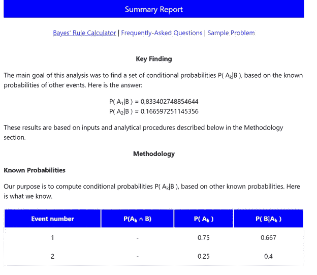

# 贝叶斯规则

> 原文：<https://medium.com/analytics-vidhya/bayes-rule-4026a1a27f34?source=collection_archive---------5----------------------->

贝叶斯定理是一个简单的数学公式，用于计算条件概率。它在*主观主义*或*贝叶斯*的认识论、统计学和归纳逻辑方法中占有显著地位。主观主义者认为理性信念受概率法则支配，他们在证据理论和经验学习模型中严重依赖条件概率。

贝叶斯定理对这些企业至关重要，因为它简化了条件概率的计算，也因为它阐明了主观主义立场的重要特征。事实上，该定理的核心观点——一个假设被任何一组数据证实，其真实性使其成为可能——是所有主观主义方法论的基石。

下面是贝叶斯定理的公式，可以实现这些值来计算它。

让我们将公式解释如下:

我们可以解决一个例子来获得更多的理解。

一支印度足球队在新赛季获得了一名新球员。该队打了 20 场比赛，结果如下:

新玩家在比赛中得分，无论他的团队是赢还是输，情况如下:

**问题:**

在新玩家得分的情况下，找出该队获胜的概率。

让我们根据上面的详细信息创建表格:

在进入条件概率之前，我们需要计算下面给定的概率:

现在，我们必须在给定的公式中输入值，其中团队获胜，球员得分。

因此，球队获胜的概率和球员在比赛中得分的概率是

其概率为 83.34%。

# 让我们遵循技术方法来解决给定的问题。

网址:[https://stat trek . com/online-calculator/Bayes-rule-calculator . aspx](https://stattrek.com/online-calculator/bayes-rule-calculator.aspx)

步骤:

1.  转到上面给出的链接。
2.  通过概率计算的输入值。
3.  计算结果并检查总结报告。

这是给定问题的总结报告。

因此，球队获胜的概率和球员在比赛中得分的概率是

其概率为 83.34%。

**参考:** [**Stattrek**](https://stattrek.com/online-calculator/bayes-rule-calculator.aspx) ，[**plato.stanford.edu**](https://plato.stanford.edu/entries/bayes-theorem/)