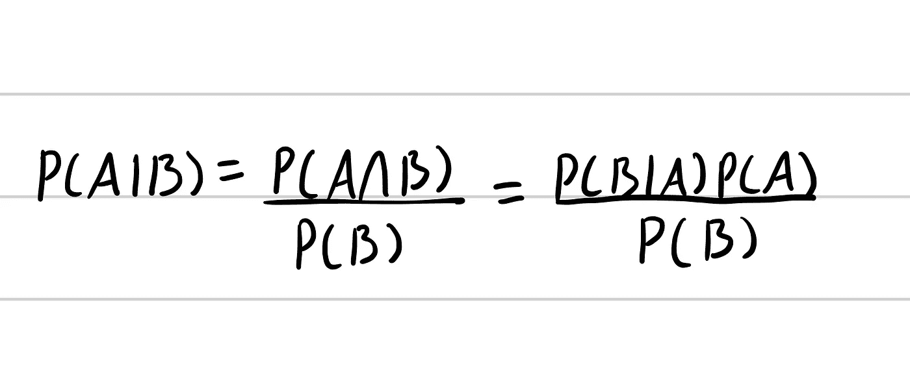
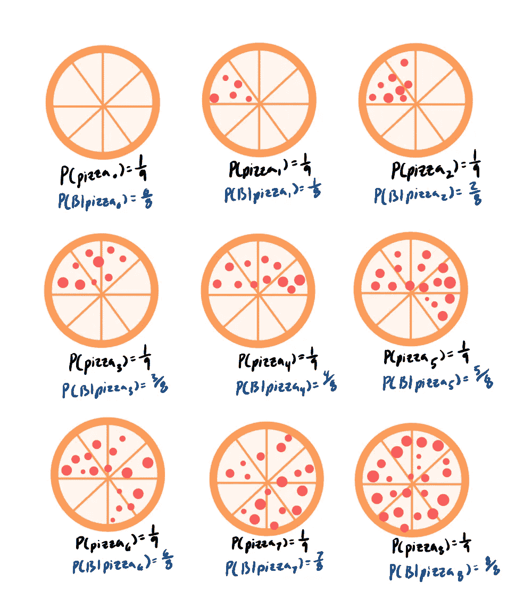
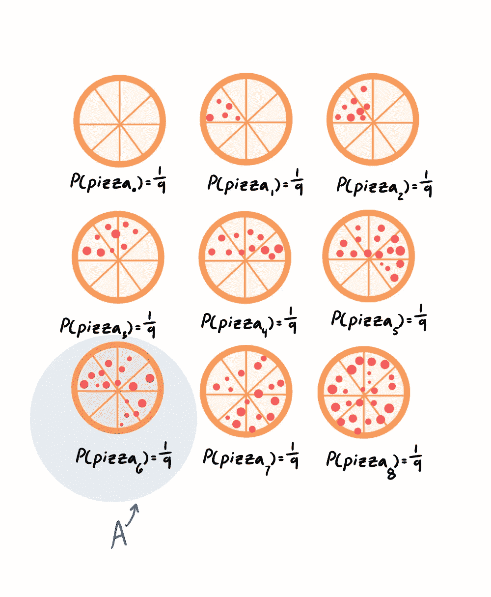
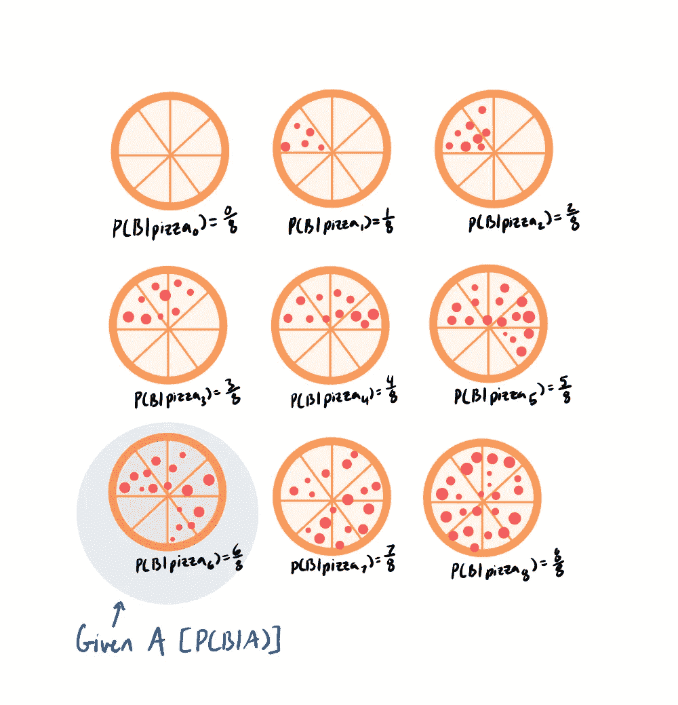
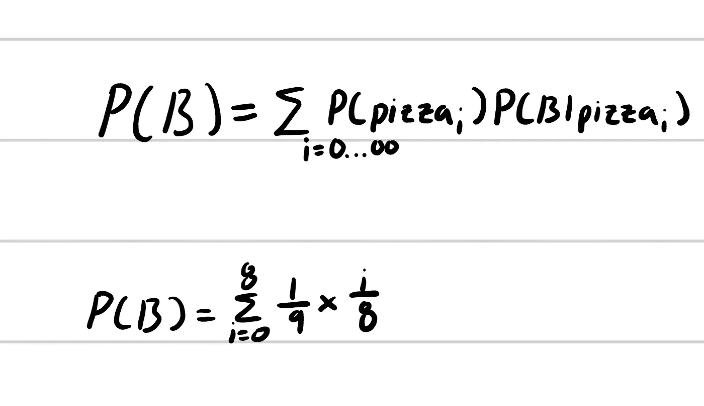
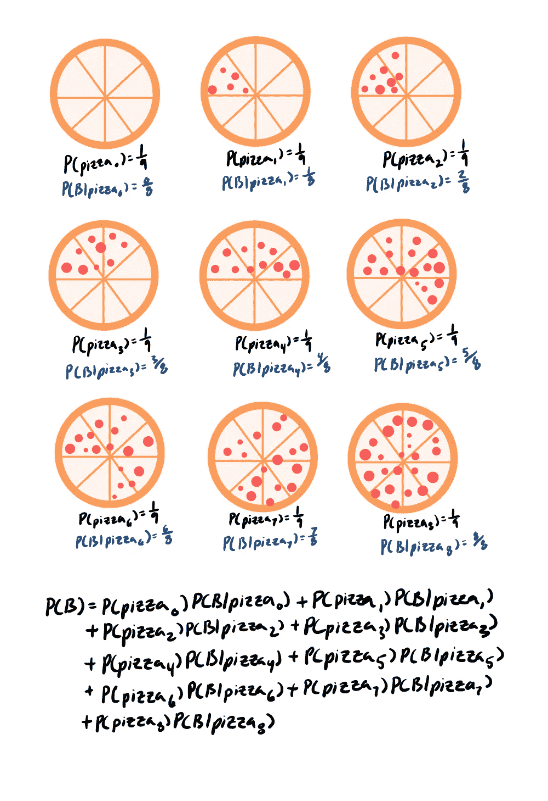

# 贝叶斯定理变得简单

> 原文：<https://medium.com/analytics-vidhya/bayes-theorem-made-simple-b1b403bf5ffb?source=collection_archive---------18----------------------->

[https://unsplash.com/photos/uKlneQRwaxY](https://unsplash.com/photos/uKlneQRwaxY)

# 贝叶斯定理

条件概率在机器学习中是不可避免的，但它并不经常以上一篇博文中的条件概率公式的形式出现。通常我们要求 P(A|B)就知道怎么算 P(B|A)了。那么…怎样才能从 P(B|A)得到 P(A|B)？这就是贝叶斯定理的用武之地。

贝叶斯定理

这是贝叶斯定理。如你所见，这只是条件概率公式的不同写法。无需深入探究证明我们设置 p(a⋂b = p(b | a)p(a)的概率定律，让我们深入一个例子来展示这个新公式。

# 贝叶斯定理示例

这里我们有 9 个比萨饼，每个比萨饼上有不同数量的意大利香肠片。我们来做几个事件。设 A 是这样一个事件:比萨饼有 6 片意大利香肠(pizza_6)。让我们假设一个随机选择的比萨饼是意大利辣香肠。我们需要求解 P(A|B)。

我们知道，要解决这个问题，我们可以使用条件概率公式或贝叶斯定理。计算 P(B|A)非常直观，因为它只是从一个有 6 片香肠和 2 片奶酪的比萨饼中得到一片香肠的概率，所以我们将使用贝叶斯定理。我们需要用贝叶斯定理求解 3 个概率:P(A)，P(B)，P(B|A)

P(A) = 1/9(所有比萨饼中有一个比萨饼有 6 片意大利香肠)

P(B|A) = 6/8(总共 8 片香肠中有 6 片是可能的)

P(B) =？(这是一个很难解决的问题)

这个方程就是我们求解 P(B)的方法。我知道这看起来很吓人，但其实也没那么糟。我们将获得 pizza_i 的概率乘以从 pizza_i 获得意大利香肠片的概率，并将所有“I”值的结果相加。所以，如果上式中 i = 1，我们需要求 P(pizza_1)是 1/9。然后我们需要找到 P(B | pizza_1) = 1/8。我们需要求解所有可能的比萨饼的这些概率的乘积，并将所有结果相加。结果应该是这样的:

求解 P(B)

p(B)= 1/9 * 0/8+1/9 * 1/8+1/9 * 2/8+1/9 * 3/8+1/9 * 4/8+1/9 * 5/8+1/9 * 6/8+1/9 * 7/8+1/9 * 8/8 = 1/9 *(36/8)= 1/2

所以，P(A|B) = ((6/8)*(1/9))/(1/2) = 1/6

# **结论**

我们将在博客中更多地实践贝叶斯定理。我希望这是对贝叶斯定理的一个有帮助的介绍，并且像往常一样，如果你喜欢这篇文章，一定要按下拍手按钮！在下一篇文章中，我们将讨论可能性/对数可能性。