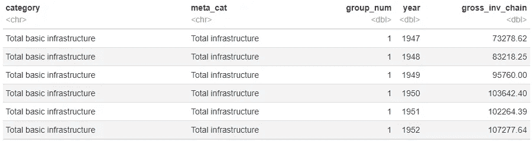
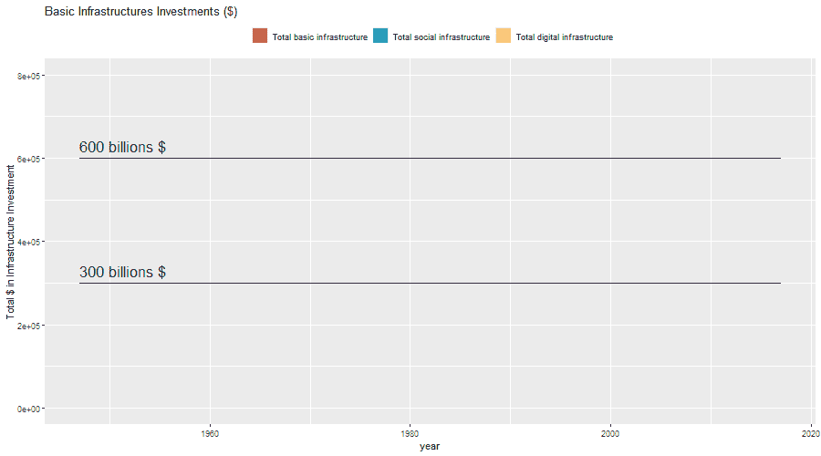
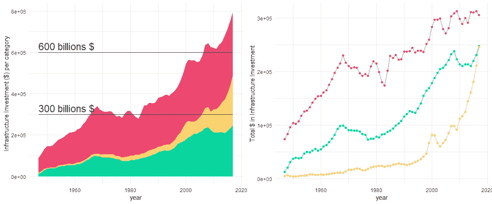
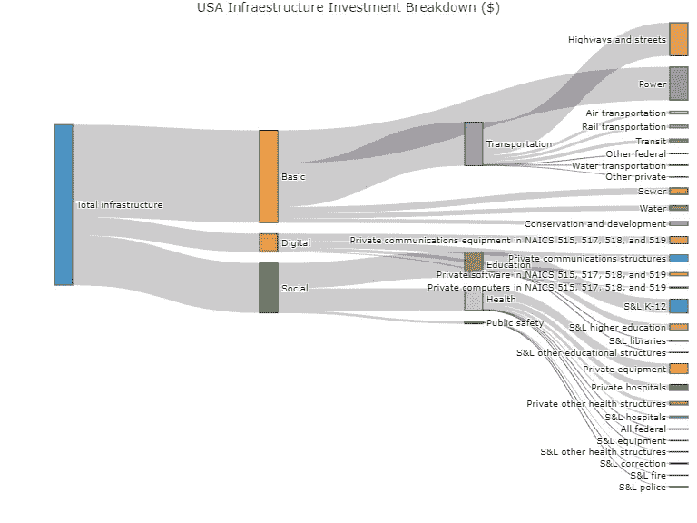

# 东亚银行基础设施投资

> 原文：<https://medium.com/analytics-vidhya/bea-infrastructure-investment-r-viz-fba3d433960b?source=collection_archive---------5----------------------->

这个笔记本是关于*在经济分析局国民经济账户*中测量基础设施的。

基础设施为经济活动提供重要支持。因此，它在很大程度上提高了我们的生活水平。本笔记本将使用美国国民经济账户(NEAs)中基础设施数据的测量值，分析多年(几十年)基础设施投资的趋势。

对于这个笔记本，我将使用 chain_investment.csv 数据集。我认为使用[连锁美元](https://en.wikipedia.org/wiki/Chained_dollars)可以让我们更好地了解当年(十年)的投资与现在的基础设施投资相比有多重要。

**为什么重要？**

这项研究是一项挑战，将为理解周围基础设施的性质及其作为连接的多网络的行为提供巨大的价值。

## 数据一瞥

根据经济分析局的论文，**，基础设施有三个主要类别:基础、社会和数字**。

*   **基础设施**:主要由交通和电力趋势决定。水、下水道、保护和开发(大坝、防洪堤、海堤和相关资产)在基础设施中所占份额相对较小。
*   **社会基础设施**:由健康、教育和公共安全趋势决定。就社会基础设施而言，私有净存量的份额随着时间的推移而增长，而国有净存量的份额随着时间的推移而增长。
*   **数字基础设施**:通信、软件等。

chain_investment 数据集中的前 6 行

## r 整齐的周二进球

通过这个项目，我的目标是尝试新的和酷的图表，可以给我们从数据中获得深刻的价值。为此，我将使用:

*   绘制主要投资类别的动画面积图和折线图。
*   绘制基础设施投资明细的桑基图。

# 主要类别的基础设施投资

面积图显示了每年以美元计的投资总额，并按类别对每个区域进行了着色。面积图显示了每年以美元计的投资总额，并按类别对每个区域进行了着色。值得一提的是，自 2000 年以来，虽然数字投资增加了，但社会投资却放缓了。

基础设施投资总额(动画面积图)

基础设施投资总额(面积图和折线图之间的比较)

# 基础设施投资明细(桑基)

我们已经知道资金是如何投入到三个主要类别(基本、社交和数字)中的，所以让我们来分解一下，看看每个子类别中投入了多少资金。

为了做到这一点，桑基图表是一个可行的选择。

> 根据谷歌图表的定义，*桑基图是用来描述从一组值到另一组值的流动的可视化图形。被连接的事物称为节点，连接称为链接。当您想要显示两个域之间的多对多映射时，最好使用 Sankeys。*

将数据集划分为不同的级别对于生成 Sankey 图表是必要的(剧透:关于投资有三个不同的级别)。为了做到这一点:

*   **级别 1:** 当类别是三个主要类别之一:基本、社交或数字时，我们将开始从 meta_cat 到类别进行分析。这是因为整体基础设施将是我们的根节点。
*   **从第二层到第三层:**我们将使用 meta_cat，使用前一层的类别来获得新的节点，等等。

基础设施投资明细(桑基)

该代码包含在:

*   Rpubs:笔记本+代码[https://rpubs.com/juaancabsou/799207](https://rpubs.com/juaancabsou/799207)
*   github:[https://github.com/juaancabsou/r-tidy-tuesday](https://github.com/juaancabsou/r-tidy-tuesday)

这就是这个整洁的星期二的全部内容。感谢阅读！如果您有任何反馈，我们将非常欢迎和感谢。

联系信息

*   📱领英:[胡安安东尼奥卡贝萨索萨](https://www.linkedin.com/in/juan-antonio-cabeza-sousa-5b954968/)
*   📬电子邮件:juaancabsou@gmail.com
*   🖥️推特:@Aceconhielo