# 用基于树的机器学习算法击败庄家

> 原文：<https://medium.com/analytics-vidhya/beat-the-bookmakers-with-tree-based-machine-learning-algorithms-1d349335b54?source=collection_archive---------6----------------------->

[来源](http://www.circledgame.com/mlb-stats.php?id=errors-per-game&name=Errors%20Per%20Game)

[简介](#ccf6) [机器学习算法基础知识](#1e2a) [决策树](#1eb6) [基于树的算法](#c7a1) [数据采集与预处理](#01c5) [特征工程](#32e9)
[机器学习基础设施](#8c39)
[初始结果与优化](#2327) [最终结果与测试投注策略](#1462) [结论](#84e9)

> 所有的编程都是在 MATLAB 中完成的，但是本文不会讨论任何编码语法，也不会讨论如何在编程解释器中实现这些思想的任何细节。这就是创建模型的步骤背后的方法论。从这里的[和这里的](https://www.baseball-reference.com/)和[收集数据。](https://www.sportsbookreviewsonline.com/scoresoddsarchives/mlb/mlboddsarchives.htm)

# 介绍

港口是少数几种在全人类几乎每种文化中都存在的娱乐形式之一。他们之间的竞争、团队合作和看似不可预测的特点在世界各地培养了大量的粉丝，并成为许多人的顶级消遣之一。然而，通过现代机器学习的出现，我们将尝试做不可能的事情，并解开这种不确定性。具体来说，本文将尝试使用各种基于树的算法来预测棒球比赛的主队是赢还是输。

为什么是棒球，为什么是基于树的算法？前者的答案是**棒球是一项相对受欢迎的运动，拥有** **大量的历史数据**。也是一项**涉及众多玩家**的运动；如果一名球员在某场比赛中感觉不太好，团队的其他成员将有望弥补他的不足，这与网球等个人运动不同(尽管人们当然有可能使用模型来预测网球分数，甚至获得很好的结果)。这将有望使预测获胜者变得更容易。至于后一个问题，**基于树的算法是分类机器学习中使用的最流行的算法类型之一**，所以这篇文章将有望教会读者一种从头到尾应用基于树的算法的可能方式。

# 机器学习算法基础

机器学习算法有两种主要形式:**监督学习**和**非监督学习**(也有强化学习，但我们现在忽略这一点)。监督学习是当你给一个模型一个**输入*和一个*输出**时，这样模型可以学习如何估计给定输入的输出。监督学习有两个主要的子类:**分类和回归**。分类问题的输出是**离散类**，比如赢或输，而回归问题的输出是**连续**，比如价格。另一方面，无监督学习 ***只有*使用输入**并尝试使用各种度量将它们聚类在一起。

例如，假设我想根据某人的体重和身高来预测其性别。模型的**输入**(也称为**特征、预测因子、协变量、独立变量或回归变量**)将是体重和身高，而**输出**(也称为**目标、因变量或响应**)将是生物性别。这个特殊的问题将被监督，因为你给了模型一个输入和一个输出。更具体地说，这将是监督分类问题，因为生物性别只有两类。如果我们预测体重，这将是一个监督回归问题，因为体重是连续的。

# 决策树

有许多不同的机器学习技术用于分类，但最流行的一些是基于树的算法。基于树的算法使用决策树的**集合来进行预测。决策树本身就是一种可用于回归和分类的算法。本质上，决策树是一系列问题，通过询问某些特征是否低于或高于特定值来划分数据，然后通过利用划分来预测目标。决策树的标准配置如图 1 所示。**

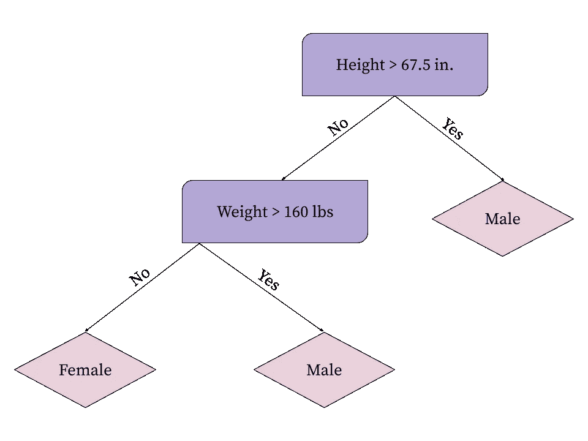

图 1:具有身高和体重特征以及生物性别目标的决策树

决策树有三个组成部分:

*   **根节点:**树中的第一个决策拆分
*   **内部节点:**所有后续决策拆分
*   **叶节点:**将组分类到目标变量的树的最后一层

在上面的树中，根节点是包含分割高度> 67.5 英寸的节点。，唯一的内部节点是包含分割权重> 160 lbs 的节点，叶节点是包含目标变量的节点(在本例中为粉色菱形)。

## 分裂标准

但是，决策树如何决定使用什么样的拆分呢？为了探索这一点，让我们使用上面的例子，想象我们正试图用决策树预测给定某人的体重和身高的生物性别。如图 1 所示，大多数决策树将一组数据分成两个独立的组，这两个组根据某种度量标准对数据进行最佳分割。对于分类，使用的两个主要指标是**基尼系数**和**交叉熵**。交叉熵类似于基尼杂质，但它涉及到使用信息论中熵的概念。本文不会对此进行深入探讨，但本质上，随着交叉熵的减少，组内的同质性会增加。因此，我们希望**最小化交叉熵**。这两种决策树分裂方法都被广泛使用，因为它们是可微分的，但基尼系数通常是首选的，因为它的计算成本较低，因此将在本项目中使用。一旦决策树对数据进行了拆分，它**继续进行拆分，直到满足某个标准**。该标准可以是叶节点的数量、每个叶的最小分裂标准值、分裂的数量等。

## **基尼杂质**

基尼系数衡量的是**根据类别分布对分区中的随机元素进行错误分类的可能性**。具体公式如上，其中 K 为类数。

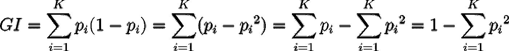

基尼杂质定义

图像我们有一组 100 个人，其中 60 个是男性，另外 40 个是女性。挑到男性的概率是 0.6，把他分类错的概率是 1-0.6。相反，选择女性的概率是 0.4，错误分类的概率是 1–0.4。因此，这一群体的基尼系数为 0.6*(1-0.6)+0.4*(1-0.4)=0.48。如果我们使用最后一种简化，等式将是 1–0.6-0.4 = 0.48。这个替代公式也可以被认为是正确分类每个样本的概率的补充。基尼杂质越高，对群体成员进行错误分类的概率就越高，这就是为什么**我们要*最小化*这个值**的原因。使用基尼系数作为分裂标准的决策树将找到哪个特征分裂最小化两个新组基尼系数的加权和，其中权重是每个叶中观察值的百分比。

# 基于树的算法

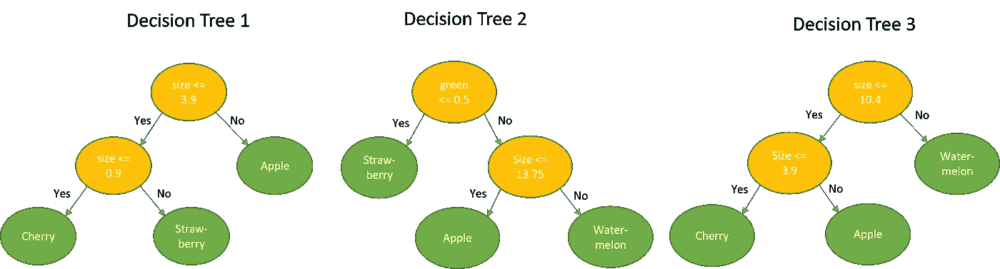

图 2:决策树集合([来源](https://www.google.com/url?sa=i&url=https%3A%2F%2Fmedium.com%2Frapids-ai%2Faccelerating-random-forests-up-to-45x-using-cuml-dfb782a31bea&psig=AOvVaw1yixGzkRRKrl4NRwCmj0z2&ust=1618445771511000&source=images&cd=vfe&ved=0CA0QjhxqFwoTCOjmuc26_O8CFQAAAAAdAAAAABAD))

一个简单的决策树可以对它所训练的数据单独产生非常精确的结果。然而，该数据通常**过度拟合其训练数据**，因此在未用于训练它的后续样本上不会有如此低的误差。这就是为什么决策树单独被称为**弱学习者**的原因。有两个主要的想法来防止过度拟合:限制一棵树上的分裂数和平均许多棵树的决策。如果我们将一棵树上的分裂数量限制为，比如说，4，那么这棵树肯定不会过度拟合，但是**数据之间的许多复杂关系将被忽略**，因为最多只会使用 4 个特征。因此，通常倾向于创建许多过拟合的决策树，并找到某种方法将所有这些决策树合并在一起以做出一个决策。这就是基于树的算法发挥作用的地方。基于树的算法被归类为集成，其中许多弱学习(在这种情况下是决策树)被组合成一个强学习器。不同的算法有不同的方式来构建这些树并组合它们。使用的两个主要算法是依赖于**引导聚合**的算法和依赖于**升压**的算法。

## 制袋材料

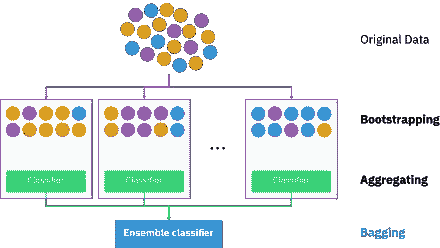

图 3:标准装袋配置([来源](https://www.google.com/url?sa=i&url=https%3A%2F%2Fen.wikipedia.org%2Fwiki%2FBootstrap_aggregating&psig=AOvVaw1W11n7f5ku5zfG-6m5T6dz&ust=1618445901480000&source=images&cd=vfe&ved=0CA0QjhxqFwoTCMCY_P26_O8CFQAAAAAdAAAAABAJ)

**Bootstrap aggregation，也称为** **bagging，从我们的原始数据集中选择随机样本进行替换，以符合**的预测。想象一下，我们有从我们的各种特征预测生物性别的原始数据集。如果我们在所有的数据上安装一个决策树，好吧，就是这样。我们没有更多的数据，所以这是唯一可以做的决策树。然而，如果我们使用 bagging，我们将从原始数据集中采样 M 个数据点并替换，然后在新的样本上拟合一个决策树。m 通常等于 N，其中 N 是原始数据点的数量。如果 M 等于 N，则可以表明平均而言，1/e 或 **36.8%的原始数据点没有被使用**。这是因为我们用替换进行了采样，所以多次选择了许多点。现在，**多次重复这个过程，并选择一些标准来预测输出**，例如所有决策树的多数投票。这个过程已经被证明可以**减少模型中的方差**，并且通常是一些算法的首选，比如**随机森林**。

## **随机森林**

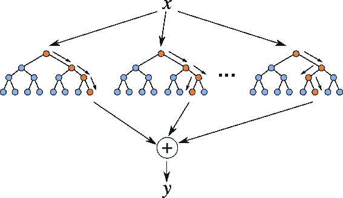

图 4:随机森林示意图([来源](https://www.google.com/url?sa=i&url=https%3A%2F%2Flevelup.gitconnected.com%2Frandom-forest-regression-209c0f354c84&psig=AOvVaw0GY9syzsiCNJwXGEqozPDD&ust=1618446099570000&source=images&cd=vfe&ved=0CA0QjhxqFwoTCKjcpOe7_O8CFQAAAAAdAAAAABAD))

**随机森林**是一种机器学习算法，可用于分类和回归。该算法本质上使用 bagging 构建了许多不同的决策树，或者**平均出每棵树的回归预测，或者采用大多数树的投票进行分类**。它被广泛用于决策树，因为它可以减少**过度拟合**。与以前的多数投票 bagging 算法不同的是，它只在每次树分裂时选择一个随机的特征子集。通常，对于分类问题，使用 sqrt(p)预测器，对于回归问题，使用 p/3 预测器，其中 p 是特征的总数。如果有几个强预测值，它们将被用于每棵树，使树强相关。这使得利用多个树更加无用，因为它们都将具有相似的预测。通过在每次分裂时选择预测器的子集，树不能总是使用最强的预测器，并且被迫尝试在其他特征中寻找模式。这创建了较少相关的树，并且通常导致测试数据准确性的增加。

## **助推**

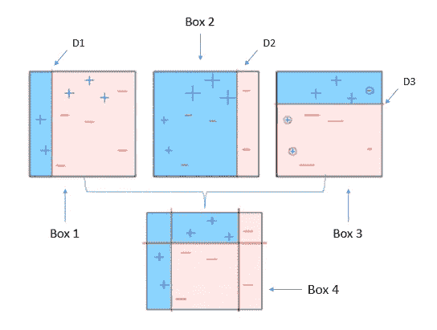

图 5:标准升压示意图([来源](https://www.google.com/url?sa=i&url=https%3A%2F%2Ftowardsdatascience.com%2Funderstanding-adaboost-2f94f22d5bfe&psig=AOvVaw37bbdyDzWIzF2Wg6s1H507&ust=1618446235316000&source=images&cd=vfe&ved=0CA0QjhxqFwoTCIjP0qm8_O8CFQAAAAAdAAAAABAE)

Boosting 也是一种基于树的集成机器学习算法。有许多不同的算法，每一个都有自己独特的属性，所以我不会深入讨论每一个，但本质上，它们**通过试图改善以前训练的树的弱点来迭代训练每一棵树**。在随机森林中，每棵树都独立于其他树的表现而被训练。然而，在 boosting 中，每棵树都试图修复以前的树所犯的错误。这包括对某些观察值进行不同的加权，最小化特定的损失函数，以及其他细微差别。为了进一步防止过度拟合，这些树通常要么是树桩(一级决策树)，要么是浅决策树(可能类似于 10 个分裂)。

深入的算法不在本文的讨论范围之内，所以本文不会深入讨论它们，但是网上有很多展示它们的资源。一些最常见的升压算法有 AdaBoost、LPBoost、TotalBoost、XGBoost、LogitBoost 和 RUSBoost。

# 数据采集和预处理

在开始之前，重要的是要明白，执行机器学习的很大一部分只是在使用之前收集、清理和处理数据。此过程中使用的步骤是:

*   **收集数据(网页抓取或 API)**
*   **填补缺失数据(或使用代理拆分)**
*   **去除异常值**
*   **标准化或规范化数据**

## 收集数据

首先，我们需要实际获取数据。API 通常更快、更方便，但可能并不总是适合您的特定情况，或者过于昂贵。在这种情况下，web 抓取与 python 中的 BeautifulSoup4 一起使用。

## 填充缺失的数据

填充缺失特征点的一些常见技术是通过使用该特征的平均值、线性插值、保形分段三次样条插值和修改的 Akima 三次 Hermite 插值。然而，一些机器学习算法有绕过缺失值的方法，例如使用**代理分裂**。**代理拆分就是一个** **拆分，当原始值丢失**时使用。例如，假设我们的决策树说高度是分裂某个组的最佳特征，但对于某些观察值却有各种缺失值。可以使用下一个最佳预测值(如体重)进行代理拆分，并且可以在缺少身高值时使用。代理拆分的优点是可以使用所有观察值，而不必猜测缺失数据的值。因此，代理拆分将用于解决这个问题。

## 移除异常值

异常值是指其特征值与其余观察值相差很大的**观察值。**虽然异常值并不常见，但它们可能会严重影响我们模型的性能。幸运的是，离群值不会过多地影响基于树的模型，因为如果离群值包含在训练集中，分割标准不会受到很大影响。然而，我们仍然会删除极端的异常值，以便更好地实践，并有可能消除错误的数据。由于多变量异常值去除是一个相当复杂的课题，我们将使用异常值技术，简单地去除所有包含特征值的数据点，该特征值比相应特征的平均值大**3 个标准偏差。**

## 使正常化或标准化

同样重要的是，对于许多机器学习算法，利用了**规范化**或**标准化**。标准化通常被认为是转换数据，使其平均值为 0，标准偏差为 1，而标准化通常意味着转换数据，使所有数据点位于 0 和 1 之间。幸运的是，基于树的模型不需要这些转换，因为每个分割只依赖于一个特征，而不是与多个特征的交互。

# **特色工程**

在数据被清理和处理之后，我们将使用特征工程来创建要在模型中使用的各种特征。将用于模型的初始数据类型有:

*   **上一年两个队的数据:**这包括上一年每场比赛的结果(如胜率、击球率和得分)，然后对这些结果进行平均。
*   **来自同一年两个队的数据:**这包括和以前一样的结果(胜率、击球率和平均分)，除了它们将从同一年**的以前的比赛中平均。**
*   **游戏的赔率:**这些特征将利用博彩公司对游戏将如何进行的预测。每场比赛，博彩公司都会给出每队获胜的赔率。这些赔率可以转换成隐含概率，以显示一个队获胜的机会。**如果你很好奇想多了解一点赔率，以及为什么赔率不公平，可以参考我之前写的文章** [**这里**](https://nick-amir.medium.com/all-about-betting-odds-what-are-they-and-how-are-they-unfair-4f4d776582c3) 。

## 扔掉

虽然在这个项目中没有使用宁滨，但它是特征工程的一种常用方法。宁滨取连续的随机变量，然后**将它们离散成组**(将它们变成分类特征)。宁滨通常将要素分组，每组中的观测值数量不变，或者每组中的观测值范围不变。宁滨可以**减少训练时间，提高某些车型的性能**。

## 特征的操作

特征工程的另一种形式是**手动操作特征，使新特征看起来具有预测能力**。例如，前一年的数据给出了该年的总击中数 H 以及得分的总跑垒数 R。一个新的特征是将 H 除以 R，从而基本上得到击中效率。此功能将显示平均得分运行需要多少点击。这种形式的特征工程依赖于手头的主题知识，因此棒球专家可能会对其他有用的特征给出更多的见解。

## 移动平均线

另一种将数据聚合到特征中的方法是对最近玩的几个游戏的数据取一个**移动平均值，并使用它们。例如，给出的数据之一是每支球队每场比赛得分的总次数。为了实现这个特性，我将在明天的比赛中为一个特定的球队使用，我可以计算该队在过去 5 场比赛中的平均得分。这是标准平均值，但是也可以使用其他平均值(**指数、加权、平滑**等)。).要平均的先前游戏的数量由用户决定，并且可以对不同数量进行分析以进行优化。该项目使用前 5 场比赛的简单平均值作为所有同年比赛的特征。**

对于所有这些转变，**主队价值观和客队价值观之间的差异就是所用的特征**。例如，如果去年主队的平均得分是 7 分，客场队是 5.6 分，那么使用的特征将是 1.4 分。

# 机器学习基础设施

## 初始设置

现在是时候实际创建模型并应用机器学习了。如上所述，前面的这些步骤通常要花大部分时间，是比较枯燥和单调的部分，但是现在有趣的事情来了。创建模型的步骤如下:

1.  **将数据分成训练/测试片段**
2.  **确定将测试哪些型号**
3.  **用参数**初始化模型

## 1.训练/测试分割

首先，必须将训练数据分成**训练集和**测试集。有时人们也使用验证集，但是我们将使用 **k 倍交叉验证**作为替代。**使用 k-fold 交叉验证，训练数据被** **分割成单独的折叠，其中每个折叠用作一个测试集，其余的折叠用作一个训练集。重复这个过程，直到每个折叠都成为一个测试集。**然后在每个折叠上平均误差。重要的是要注意，在整个模型优化过程中，测试集不应该在测试最后一个模型之前使用，否则我们有过度适应测试集的风险。训练集将占数据的 80%，测试集将占剩余的 20%。

通常，进入训练集和测试集的数据点是随机的，但是我们需要确保数据是分层的。这意味着**目标训练和测试集具有相同的分布**。在我们的数据中，如果主队赢了，目标是 1，如果主队输了，目标是 0。我们目标的平均值是 0.53，这意味着主队大约有 53%的胜率。如果我们对数据进行分层，我们的训练集和测试集的目标应该分别由大约 53%的 1 和 47%的 0 组成。如果我们不对数据进行分层，我们可能会在每个类别中得到不同的分布，这可能会妨碍我们的模型在新观察中的性能。

## **2。确定将使用哪种型号**

我们可以使用许多不同的基于树的机器学习模型，因此选择一个是一项困难的任务。这就是为什么我们将简单地尝试其中的几个，并找到一个最高精度的。我们将使用**随机森林**模型以及**各种助推模型**。我们还将在此过程中实施各种策略来改进我们的模型并分析它们的性能。在我们进行任何优化之前，这些模型都将用基本参数进行测试，以获得它们的性能基线。

## **3。用参数**初始化模型

每个模型使用的参数如表 1 所示。这些只是使用的初始参数，将在以后的步骤中针对每个模型进行优化。

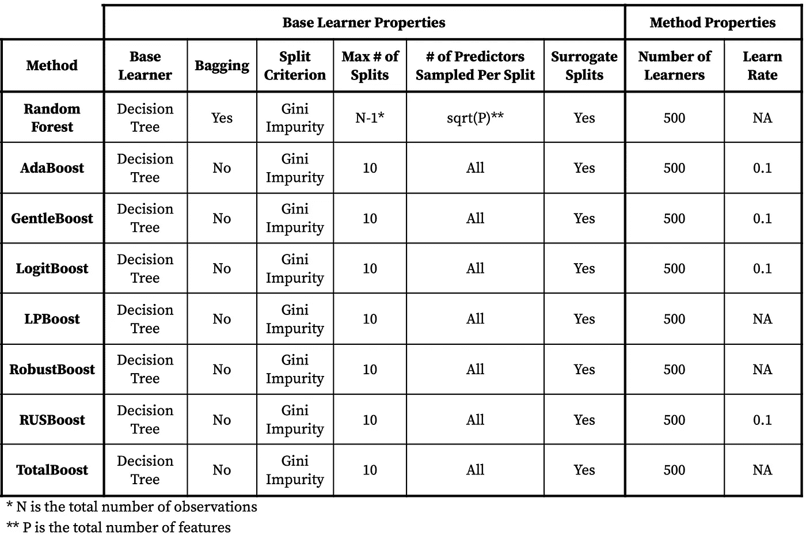

表 1:训练的各种模型的初始属性

# 初步结果和优化

## 混淆矩阵

理解我们模型的第一步是通过使用**混淆矩阵**。一个混淆矩阵**发现模型如何准确地做出猜测，以及它们的错误来自哪里**。对于目标，模型可以做出 4 种不同类型的预测:

*   **真阳性:****模型预测会赢，主队实际上会赢**
*   **真正的否定:该模型预测主队会输掉比赛**
*   ****误报(I 型错误):**模型预测主队会赢，但他们实际上输了**
*   ****假阴性(第二类错误):**模型预测主队会输，但他们实际上赢了**

**每个模型都有自己的混淆矩阵，包含上面列出的 4 种预测类型的分布。对于每个矩阵，使用了**交叉验证结果。**图 6 显示了其中一个模型的混淆矩阵，即随机森林模型。结果表明，该模型能够在数据中找到某种模式，因为它不仅仅是猜测。如果我们只在模型预测一个队会赢的时候下注，我们有 57.9%的几率是正确的。**

**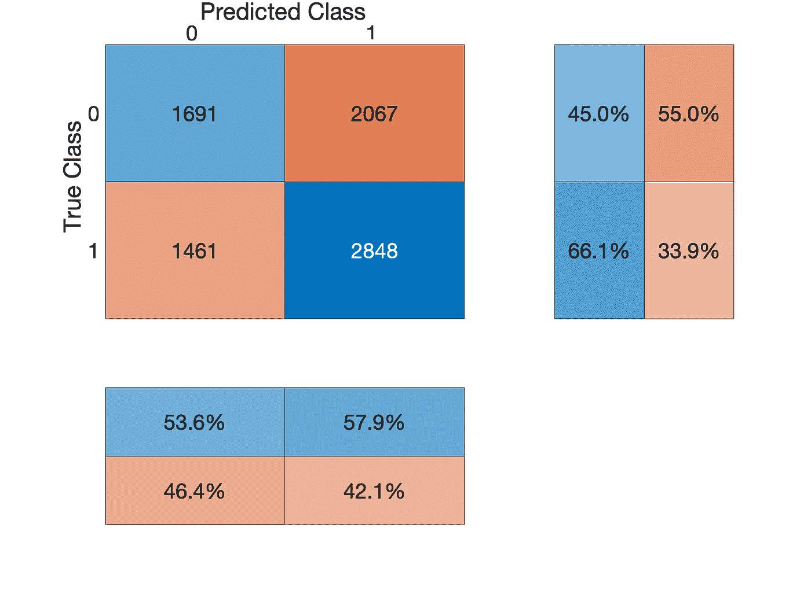**

**图 6:初始随机森林模型的混淆矩阵**

## **实施成本矩阵**

**对于我们的特定项目，一种策略可以是，只有当我们的模型预测主队会赢时，才在主队身上下注。在这个策略中，我们希望**尽量减少误报**的数量，因为这将是以赔钱告终的赌注。换句话说，我们希望最大化模型对主队获胜的预测是正确的概率。该值将被称为**阳性预测值(PPV)** 。PPV 是**一个正面预测产生正面结果的可能性**。为了提高我们的 PPV，我们可以实施**成本矩阵。****

**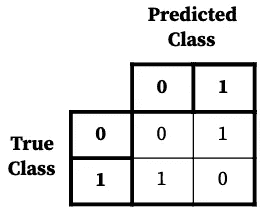**

**表 2:默认成本矩阵**

**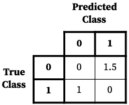**

**表 3:调整后的成本矩阵**

**标准成本矩阵如表 2 所示，主要显示了每种类型的预测将产生的成本**。如果模型猜测正确，成本显然应该为零。但是，如果模型猜测不正确，各种成本可能会不同，这取决于矩阵的配置方式。因为我们希望尽可能地减少误报，所以当模型预测成功但实际结果是失败时，我们希望将成本设置得更高，如表 3 所示。准确地知道该成本的设置需要反复试验，甚至因型号而异。通常，我使用大约 1.1-1.5 的成本，并在此基础上进行调整，直到我获得足够高的 PPV，而不会牺牲预测的阳性数量。****

## **错误分类率**

**优化我们的模型的下一步是绘制每个集合的准确度与学习者数量的关系图。我们可以**根据学习者数量查看损失，并找到每个模型的最佳学习者数量**。所有的比较只使用交叉验证的观察，除了随机森林模型也能够使用袋外观察。图 7 和图 8 显示了这些图的例子。**

**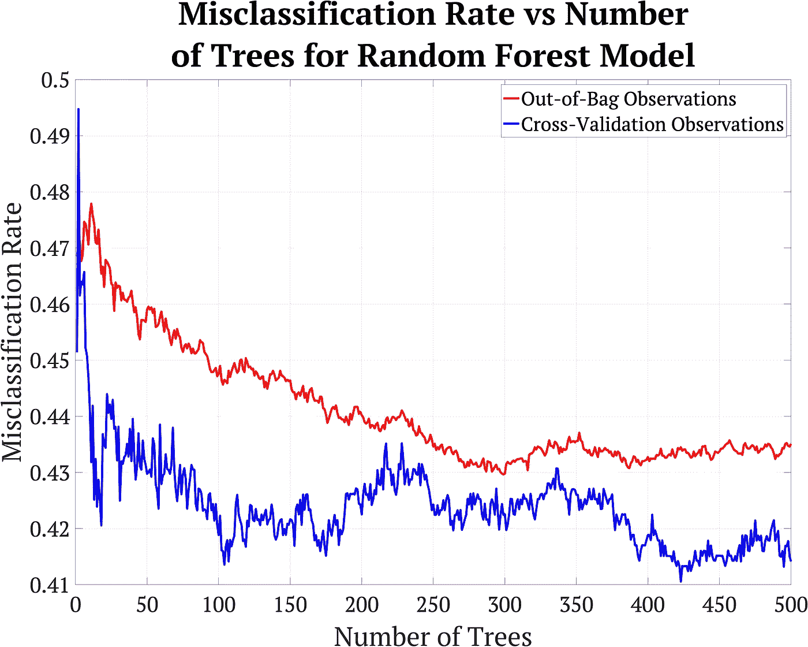**

**图 7:随机森林模型的错误分类率与学习者数量的关系图**

**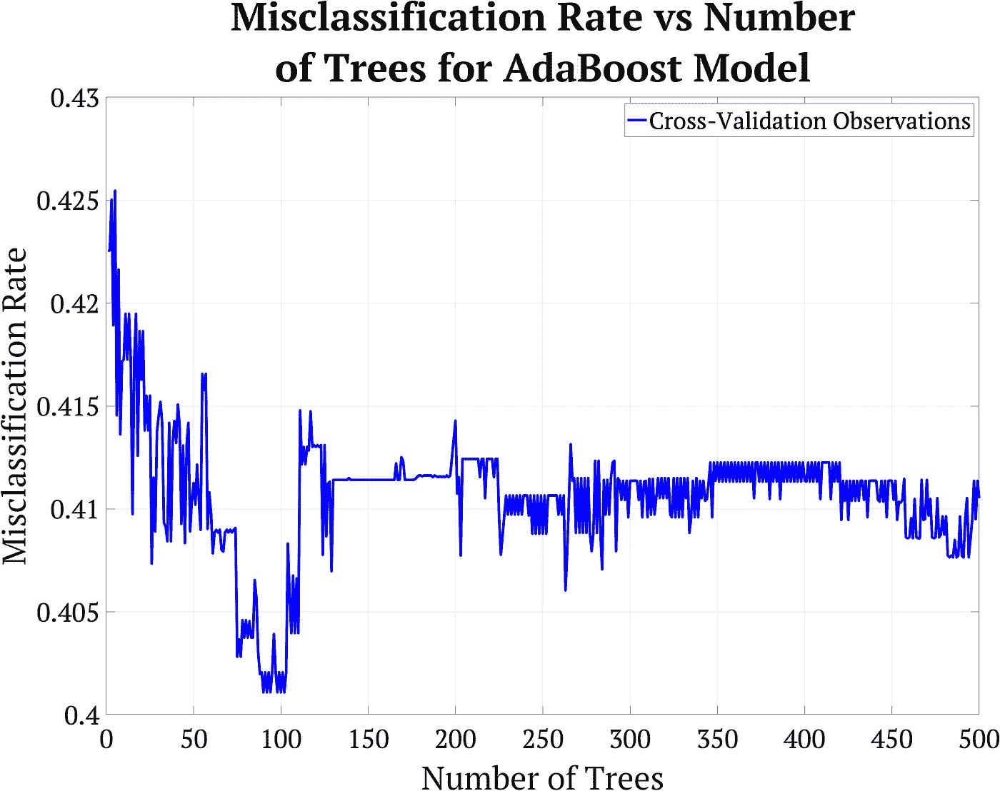**

**图 AdaBoost 模型的错误分类率与学习者数量的关系图**

## **特征重要性**

**最后，我们可以检查哪些特性对模型有用。**过多的特征会导致过度拟合**，从而降低模型的性能。将使用两种方法，即通过节点杂质的排列和改变的**出袋预测器重要性**。第一种方法**对一个特征的观测值进行置换，然后使用随机样本对每棵树的误差进行求和。**如果特征是重要的，那么置换观察值应该对决策树的性能有很大的负面影响，因为它的值是随机的。因为这种方法需要袋装样本，所以它只能用于袋装观测值的模型，在这种情况下只是随机森林模型。第二种方法查看使用特定功能的每个分割，并测量该功能在改善分割方面的平均表现。由于这些算法使用的是基尼系数，因此这些算法会确定每个特征在分割时将基尼系数最小化的程度。这种方法不需要装袋，因此用于其余的模型。**

**图 9 和图 10 显示了每种特征重要性的例子。首先，我们画出每个模型的重要性。然后，我们**找到一个阈值，一个特性必须达到该阈值才能在优化版本**中使用。对于随机森林模型，使用阈值 0.2，对于 AdaBoost 模型，使用阈值 5E-5。**

**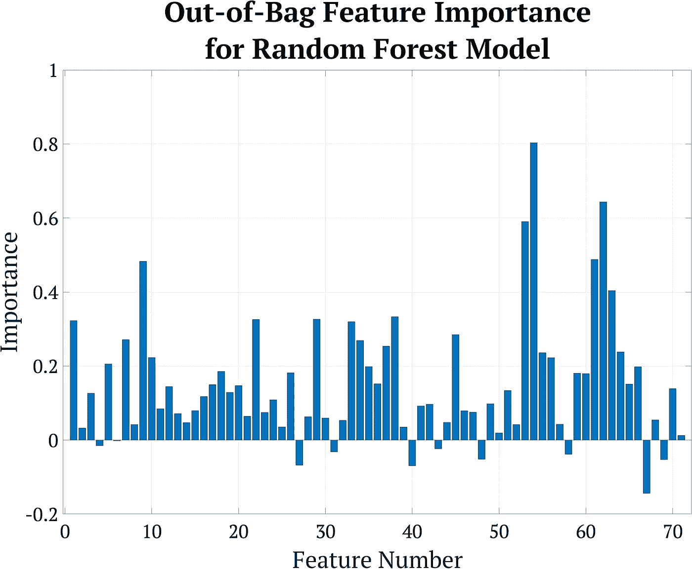**

**图 9:使用 OOB 预测器排列的随机森林模型的特征重要性**

**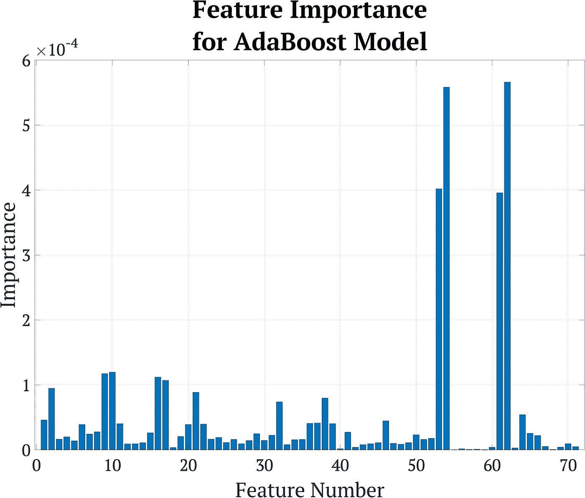**

**图 AdaBoost 模型的特征重要性**

# **最终结果和测试投注策略**

**现在我们已经对模型进行了调整，我们可以重新训练我们所有的模型，并不断重复这个过程，直到我们得到一个我们喜欢的模型。在优化我们的模型并观察其结果后， **RUSBoost 模型具有最高的性能**。这个模型的混淆矩阵如图 11 所示。尽管结果并不完美，但它们提供了对原始模型的改进。**

**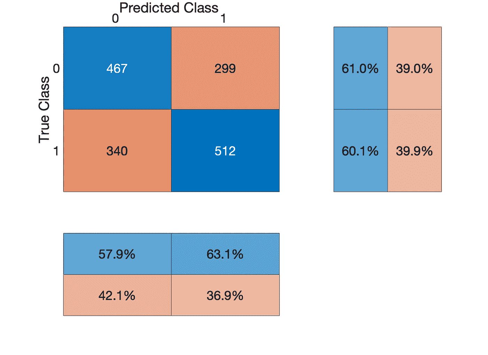**

**图 RUSBoost 模型的混淆矩阵**

## **最后一个特征**

**还有最后一个特性将被添加到模型中。我们的模型大约 40%的时候是错误的，但是如果我们可以**制作另一个模型来预测当前的模型什么时候是错误的**会怎么样？那么，我们可以把它作为我们模型中的另一个特征，它可能非常有用。这个想法是使用上面显示的相同的分割和优化策略来实现的。这是一个有用的策略，可以应用于许多不同的问题。用于创建此模型的步骤与前面步骤中显示的步骤相同。**

## **测试下注策略**

**现在我们有了一个看起来效果不错的模型，但是我们如何实际测试这个模型，看看我们是否可以用它创建一个交易策略？一个潜在的策略是，当庄家说某个团队将会赢**以及**我们的模型分数必须满足的置信度阈值时，只对该团队获胜下注。请注意，模型的分数是指我们的模型对其预测的置信度；该值的范围取决于型号。例如，如果博彩公司说一个团队有 60%的概率获胜，我们可能只在我们的模型得分高于 0.65 时才下注。我们可以**在我们的训练集上测试哪些分数阈值优化了博彩公司**给出的每个隐含概率的准确性，并在我们的测试集上测试这些结果。该方法的结果如图 12 所示。总体而言，除了隐含概率为 72%-75%时，得分阈值**以 9.2%** 的平均增幅提高了博彩公司模型的准确性。**

**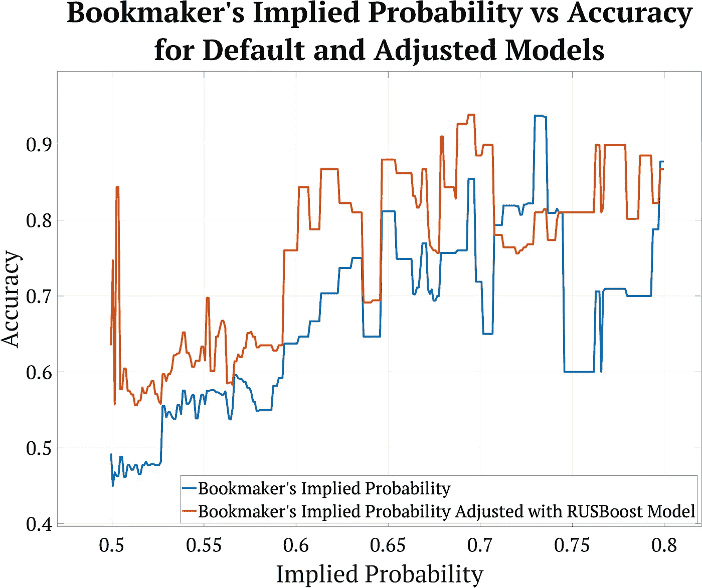**

**图 12:用 RUSBoost 模型调整后博彩公司模型的准确性变化**

# **结论**

**尽管 RUSBoost 模型的结果并非完美无缺，但它能够在博彩公司模型的基础上有所改进。该模型没有专门针对盈利能力进行测试，但准确度提高 9%几乎肯定足以优化策略以获得一致的回报。如果花更多的时间在**创造有趣的功能和收集更多的数据**，结果可能会更好。也可以通过使用**不同的 boosting 算法，如 XGBoost** ，甚至不同的机器学习算法来改善结果。**

**让机器学习变得美好的是，世界上最先进的公司正在使用的最先进的算法可以通过建模中的一点点独创性和创造力进行**改进，在我们的办公椅上免费。****

**感谢阅读这篇文章！我希望你学到了一些东西，并确保关注未来的文章——谢谢！**