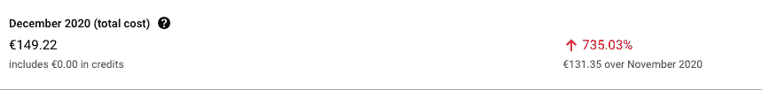
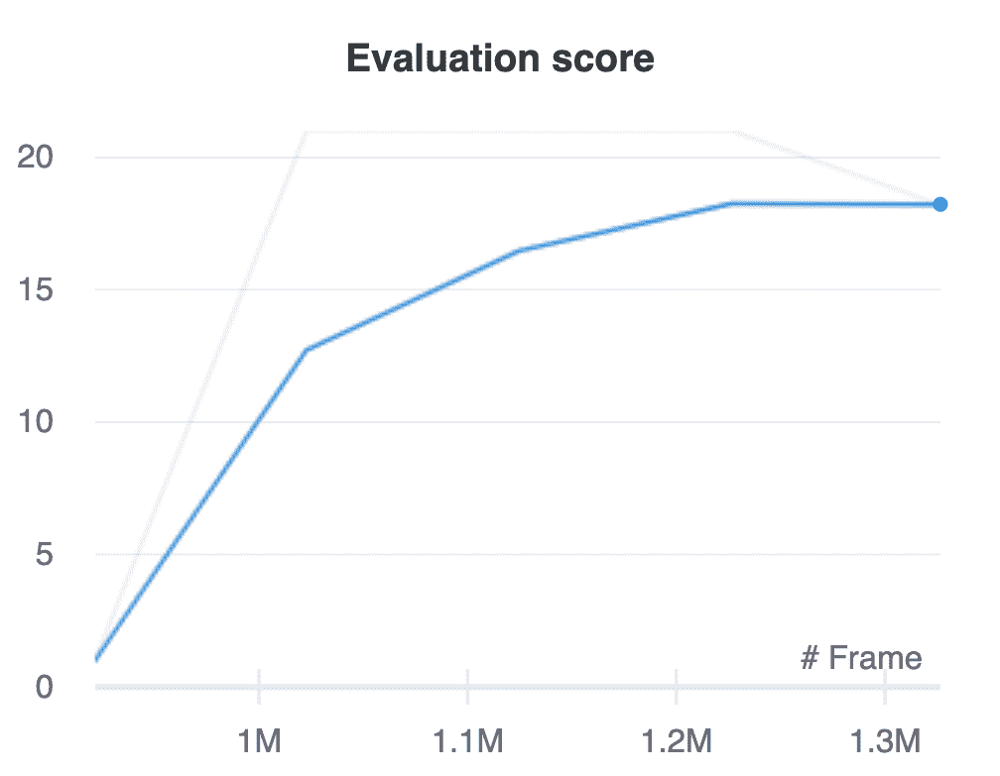
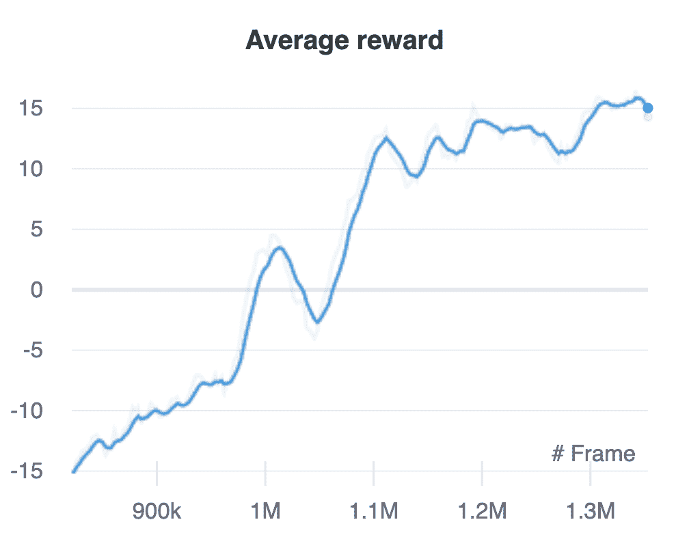

# 使用强化学习击败 Pong 第 1 部分 DDDQN

> 原文：<https://medium.com/analytics-vidhya/beating-pong-using-reinforcement-learning-part-1-dddqn-f7fbf5ad7768?source=collection_archive---------15----------------------->

*我强化学习之旅的开始*


*作者安东尼奥·李斯*

# 介绍

大家好，这是我在这个博客上的第一篇技术文章。我希望你会喜欢它。

今天我们讨论强化学习。在过去的几个月里，由于封锁等原因，我多年来第一次有了一些空闲时间，所以我决定学习强化学习(RL)。博弈论是我在大学最喜欢的科目之一，但同时，我一直认为它不能像现在这样应用到现实生活中。你不能计算所有可能行为的期望值，除非你有像囚徒困境这样的简单场景。

RL 从同样的概念出发，但是方法却大不相同。你定义并训练一个神经网络来近似每个动作/状态的值(这就是所谓的基于值的方法)。

理论的细节我就不赘述了，但是我推荐[这本书](https://www.perlego.com/book/771717/deep-reinforcement-learning-handson-apply-modern-rl-methods-with-deep-qnetworks-value-iteration-policy-gradients-trpo-alphago-zero-and-more-pdf?utm_source=google&utm_medium=cpc&utm_campaign=1-EU%20%7C%20en%20%7C%20DSA%20Test%2018.12.20&utm_source=google&utm_medium=cpc&utm_campaign=11871053709&utm_term=&utm_content=487151523099&gclid=Cj0KCQiA6Or_BRC_ARIsAPzuer9g8uK3V8w7olmvOtR4S61TShe5U8MeV-S3-ZeyaNZvNbXHt3JjiLAaAiuJEALw_wcB)。因为加入了 [Ray summit conference](https://events.linuxfoundation.org/ray-summit/) ，所以收到了免费的副本(这是一个非常有趣的构建分布式应用的库，你可以在这里[查看](https://github.com/ray-project/ray))。

如果你喜欢学术论文，我最近读了一篇论文[深度强化学习:最先进的演练](https://www.jair.org/index.php/jair/article/view/12412/26638)。这是一个很好的阅读，在高层次上学习在这个领域已经开发的算法。

下面使用的大部分代码都是从这本[笔记本](https://github.com/fg91/Deep-Q-Learning/blob/master/DQN.ipynb)中获得灵感的，所以非常感谢法比奥·m·格雷茨。

所以事不宜迟，我将与你分享我第一次尝试解决 pong 的实验。

P.s .最初的计划是写两种不同的方法，DDDQN 和 A2C，但这篇文章太长了，所以我将在这里讨论 DDDQN，在下一篇文章中讨论 A2C。

# 五金器具

在深入代码之前，我想先说一下使用的硬件。为了训练第一个算法(DDDQN)，我在我的 mac 上开发了它，然后在谷歌云虚拟机上用特斯拉 K80 启动了训练。结果是这样的(我有将近 200 美元的信用额度，所以我没有支付):



所以我需要一个替代品，幸运的是，在我家里，我有一台 GTX 1050 TI 的旧电脑，我用它来进行图像识别，最近还用来玩轻度游戏。所以我决定格式化它，安装 ubuntu 20.04，安装 Nvidia 驱动，CUDA 等等，我就可以启动 PyTorch 和 Jax 了。但问题是，我想用 Tensorflow，但我的 CPU 对 TF2 来说太老了；它需要从源头开始构建。这是一个非常令人沮丧的过程的开始。我开始设置 docker(我需要一个隔离的环境来避免灾难)，下载 Tensorflow 的最后一个 docker 映像，安装 Bazel，安装 NVIDIA Container Toolkit，并按照糟糕的文档从源代码构建 Tensorflow(该死的 google！).经过 20 个小时的编译和多次祈祷，我能够导入 TensorFlow 并看到 GPU，这是 2020 年最令人满意的时刻之一。

# 开放的健身房环境

第一步是选择要解决的环境，你可以在这里找到open ai 提供的所有环境的列表。我选择解决 pong，是因为它相对来说比较容易解决，也比较快。通过这种方式，我可以专注于算法的实现，并很快看到它们是否收敛，但同时，它并不是那么简单(例如 CartPole ),你不能欣赏所用算法的变化。

# 效用函数和环境

我们开始查看 OpenAI 给出的环境，为了查看我们将在 jupyter 笔记本中生成的 mp4，我们将使用以下函数(您还需要使用命令 xvfb-run -s "-screen 0 1400x900x24 运行 jupyter 笔记本/lab):

```
import base64
import IPython*def* embed_mp4(filename):
  """Embeds an mp4 file in the notebook."""
  video = *open*(filename,'rb').read()
  b64 = base64.b64encode(video)
  tag = '''
  <video width="640" height="480" controls>
    <source src="data:video/mp4;base64,{0}" type="video/mp4">
  Your browser does not support the video tag.
  </video>'''.*format*(b64.decode()) return IPython.display.HTML(tag)
```

为了使 jupyter 笔记本的开发更容易，我还使用了下面的特别插件，它可以创建文本文件并向其中添加代码:

```
from IPython.core.magic import register_cell_magic@register_cell_magic
*def* write_and_run(line, cell):
    argz = line.split()
    *file* = argz[-1]
    mode = 'w'
    if *len*(argz) == 2 and argz[0] == '-a':
        mode = 'a'
    with *open*(*file*, mode) as f:
        f.write(cell)
    get_ipython().run_cell(cell)
```

现在我们可以开始与环境互动了:

```
import gym
import os
import matplotlib.pyplot as plt
from PIL import Image
import imageio
import random
import numpy as np
import cv2
import base64
import IPython
from config import ENV_NAME
from utilities import embed_mp4# Create environment
env = gym.make(ENV_NAME)
print("The environment has the following {} actions: {}".\
      *format*(env.action_space.n, env.unwrapped.get_action_meanings()))with imageio.get_writer("../video/random_agent.mp4", fps=60) as video:
    terminal = True
    for frame in *range*(10000):
        if terminal:
            env.reset()
            terminal = False # Breakout require a "fire" action (action #1) to start the
        # game each time a life is lost.
        # Otherwise, the agent would sit around doing nothing.
        action = random.choice(*range*(env.action_space.n)) # Step action
        _, reward, terminal, info = env.step(action) video.append_data(env.render(mode='rgb_array'))
```

如你所见，我们的随机代理，右边的那个，表现不太好:

# 过程图象

环境的输入是具有形状(210，160，3)的图像，我们不能直接处理这些图像，原因有两个:

*   这在计算上太昂贵了
*   Conv2D 的 GPU Tensorflow 2 实现需要方形输入

因此，我们使用以下函数来消除颜色，裁剪和调整图像大小:

```
# This function can resize to any shape but was built to resize to 84x84
*def* process_image(image, shape=(84, 84)):
    """Preprocesses a 210x160x3 frame to 84x84x1 grayscale Arguments:
        frame: The frame to process.  Must have values ranging from 0-255 Returns:
        The processed frame
    """
    image = image.astype(np.uint8)  # cv2 requires np.uint8 image = cv2.cvtColor(image, cv2.COLOR_RGB2GRAY)
    image = image[34:34+160, :160]  # crop image
    image = cv2.resize(image, shape, interpolation=cv2.INTER_NEAREST)
    image = image.reshape((*shape, 1)) return image
```

我们使用 OpenCV 删除表示颜色的最后一个维度(函数 COLOR_RGB2GRAY)，我们裁剪图像(我们不需要记分牌)，然后因为我们需要一个正方形图像作为 GPU 的输入，我们将图像大小调整为 84x84x1(这是 Atari 游戏的[最佳实践](https://arxiv.org/pdf/1312.5602.pdf)):

# 游戏包装

我们定义了 OpenAi 健身房的包装器，最大的改进是:

*   我们应用 process_image 函数来获得 84×84×1 的图像；
*   我们将输入定义为四个图像的连接，这给了代理基本上看到球的动态的能力；
*   当评估代理时，它将在每集开始时采取动作 1(“开火”)，在范围[1，no_op_steps]内随机次数。这将确保每次都有不同的初始随机条件( [Mnih et al. 2015](https://www.datascienceassn.org/sites/default/files/Human-level%20Control%20Through%20Deep%20Reinforcement%20Learning.pdf) )。

```
import random
import gym
import numpy as np
from process_image import process_image*class* PongWrapper(*object*):
    """
    Wrapper for the environment provided by Openai Gym
    """ *def* __init__(self, env_name: *str*, no_op_steps: *int* = 10, history_length: *int* = 4):
        self.env = gym.make(env_name)
        self.no_op_steps = no_op_steps
        self.history_length = 4 # number of frames to put together (we need dynamic to see where the ball is going) self.state = None

    *def* reset(self, evaluation: *bool* = False):
        """Resets the environment
        Arguments:
            evaluation: Set to True when we are in evaluation mode, in this case the agent takes a random number of no-op steps if True.
        """ self.frame = self.env.reset()

        # If in evaluation model, take a random number of no-op steps
        if evaluation:
            for _ in *range*(random.randint(0, self.no_op_steps)):
                self.env.step(1) # For the initial state, we stack the first frame four times
        self.state = np.repeat(process_image(self.frame), self.history_length, axis=2) *def* step(self, action: *int*, render_mode=None):
        """
        Arguments:
            action: An integer describe action to take
            render_mode: None doesn't render anything, 'human' renders the screen in a new window, 'rgb_array' returns also an np.array with rgb values
        Returns:
            processed_image: The processed new frame as a result of that action
            reward: The reward for taking that action
            terminal: Whether the game has ended
        """
        new_frame, reward, terminal, info = self.env.step(action) processed_image = process_image(new_frame) self.state = np.append(self.state[:, :, 1:], processed_image, axis=2) # replace the first observation of the previous state with the last one if render_mode == 'rgb_array':
            return processed_image, reward, terminal, self.env.render(render_mode)
        elif render_mode == 'human':
            self.env.render(render_mode) return processed_image, reward, terminal
```

# 重放缓冲器

我们想要使用的算法(DDDQN)是一种脱离策略的方法，因为更新的策略不同于行为策略。当我们建立网络时，这一点会变得更清楚，现在，这基本上意味着我们的网络可以从过去的事件中学习以前的政策。

我们将用于训练网络的 SGD 优化的一个基本要求是，训练数据是独立且同分布的(i.i.d .)。但是，如果代理与环境相互作用，输入序列可能是高度相关的。这就是为什么我们需要一个重放缓冲区来记录代理收集的经验，然后我们从这个集合中获取一批训练数据来更新权重。最简单的实现是一个固定大小的缓冲区，将新数据添加到缓冲区的末尾，以便将最老的体验推出。

```
import os
import random
import numpy as np*class* ReplayBuffer(*object*):
    """
    Replay Memory that stores the last size transitions
    """
    *def* __init__(self, size: *int*=1000000, input_shape: *tuple*=(84, 84), history_length: *int*=4, reward_type: *str* = "integer"):
        """
        Arguments:
            size: Number of stored transitions
            input_shape: Shape of the preprocessed frame
            history_length: Number of frames stacked together that the agent can see
        """
        self.size = size
        self.input_shape = input_shape
        self.history_length = history_length
        self.count = 0  # total index of memory written to, always less than self.size
        self.current = 0  # index to write to
        self.reward_type = reward_type # Pre-allocate memory
        self.actions = np.empty(self.size, dtype=np.int32)
        self.rewards = np.empty(self.size, dtype=np.float32)
        self.frames = np.empty((self.size, self.input_shape[0], self.input_shape[1]), dtype=np.uint8)
        self.terminal_flags = np.empty(self.size, dtype=np.*bool*)
        self.priorities = np.zeros(self.size, dtype=np.float32) *def* add_experience(self, action, frame, reward, terminal, clip_reward=True, reward_type="integer"):
        """Saves a transition to the replay buffer
        Arguments:
            action: An integer between 0 and env.action_space.n - 1 
                determining the action the agent perfomed
            frame: A (84, 84, 1) frame of the game in grayscale
            reward: A float determining the reward the agend received for performing an action
            terminal: A bool stating whether the episode terminated
        """
        if frame.shape != self.input_shape:
            raise ValueError('Dimension of frame is wrong!') if clip_reward:
            if reward_type == "integer":
                reward = np.sign(reward)
            else:
                reward = np.clip(reward, -1.0, 1.0)
        # Write memory
        self.actions[self.current] = action
        self.frames[self.current, ...] = frame
        self.rewards[self.current] = reward
        self.terminal_flags[self.current] = terminal
        self.priorities[self.current] = *max*(self.priorities.*max*(), 1)  # make the most recent experience important
        self.count = *max*(self.count, self.current+1)
        self.current = (self.current + 1) % self.size # when a < b then a % b = a *def* get_minibatch(self, batch_size: *int* = 32):
        """
        Returns a minibatch of size batch_size
        Arguments:
            batch_size: How many samples to return
        Returns:
            A tuple of states, actions, rewards, new_states, and terminals
        """ if self.count < self.history_length:
            raise ValueError('Not enough memories to get a minibatch') indices = []
        for i in *range*(batch_size):
            while True:
                # Get a random number from history_length to maximum frame
                index = random.randint(self.history_length, self.count - 1) # We check that all frames are from same episode with the two following if statements.
                if index >= self.current and index - self.history_length <= self.current:
                    continue
                if self.terminal_flags[index - self.history_length:index].*any*():
                    continue
                break
            indices.append(index) # Retrieve states from memory
        states = []
        new_states = []
        for idx in indices:
            states.append(self.frames[idx-self.history_length:idx, ...])
            new_states.append(self.frames[idx-self.history_length+1:idx+1, ...]) states = np.transpose(np.asarray(states), axes=(0, 2, 3, 1))
        new_states = np.transpose(np.asarray(new_states), axes=(0, 2, 3, 1)) return states, self.actions[indices], self.rewards[indices], new_states, self.terminal_flags[indices] *def* save(self, folder_name):
        """
        Save the replay buffer
        """ if not os.path.isdir(folder_name):
            os.mkdir(folder_name) np.save(folder_name + '/actions.npy', self.actions)
        np.save(folder_name + '/frames.npy', self.frames)
        np.save(folder_name + '/rewards.npy', self.rewards)
        np.save(folder_name + '/terminal_flags.npy', self.terminal_flags) *def* load(self, folder_name):
        """
        Load the replay buffer
        """
        self.actions = np.load(folder_name + '/actions.npy')
        self.frames = np.load(folder_name + '/frames.npy')
        self.rewards = np.load(folder_name + '/rewards.npy')
        self.terminal_flags = np.load(folder_name + '/terminal_flags.npy')
```

重放缓冲器存储来自代理与环境的动作、奖励、输入(帧)、终端标志(如果情节结束)、交互的全局计数和当前索引的交互。请注意，引用论文[通过深度强化学习进行人类级控制](https://storage.googleapis.com/deepmind-media/dqn/DQNNaturePaper.pdf)“由于不同游戏之间的分数差异很大，我们将所有积极奖励削减为 1，将所有消极奖励削减为-1，保持 0 奖励不变。以这种方式削减奖励限制了误差导数的规模，并且使得在多个游戏中使用相同的学习率变得更容易”

get_minibatch 函数遍历重放缓冲区，并从相同事件的输入和输出状态、动作、奖励和终端标志中返回数组。然后我们有保存和加载函数，这些函数将重放缓冲区的 NumPy 数组保存到磁盘上或从磁盘上加载。

# 网络

[DQN(深度 Q-网络)算法](https://storage.googleapis.com/deepmind-media/dqn/DQNNaturePaper.pdf)是 DeepMind 在 2015 年通过用深度神经网络增强一种名为 Q-Learning 的经典 RL 算法开发的。

Q-Learning 算法基于 Q(a，s)函数的概念，该函数返回在该状态下该行为的预期未来回报。传统的 DQN 只是试图用神经网络来逼近 Q 函数。DQN 是基于价值方法的一个例子，因为它试图逼近 Q 函数。另一种方法是政策梯度，我将在下一篇文章中介绍。

我们将使用 DQN 的一个变体，称为 DDDQN，代表决斗双深度 Q 网络。双部分来自名为 [*用双 Q 学习*](https://arxiv.org/pdf/1509.06461.pdf) 进行深度强化学习的论文。作者证明了基本 DQN 倾向于高估 *Q* 的值，因此他们建议引入两个神经网络，目标网络和训练网络。经训练的网络用于为下一状态选择动作，目标网络用于估计 *Q* 的值，以使用贝尔曼方程更新网络的权重。目标网络将使用来自已训练网络的权重每 n 步更新一次。

决斗网络体系结构在[深度强化学习决斗网络体系结构](https://arxiv.org/pdf/1511.06581.pdf)中介绍，作者
证明了网络试图逼近的 Q 值可以划分为多个量:

*   状态的值，V(s)
*   在这种状态下行动的优势，A(s，A)。

将估计 Q 值的任务分成两个量产生了更好的训练稳定性、更快的收敛和更好的结果。

好了，现在我们可以看到实现了，没什么特别的，正如你在下面看到的，它使用了一组 2d 卷积，然后将所有东西展平，并将神经网络分成两部分，以估计状态值和动作的优点:

```
import tensorflow as tf
from tensorflow.keras.initializers import VarianceScaling
from tensorflow.keras.layers import (Add, Conv2D, Dense, Flatten, Input,
                                     Lambda, Subtract)
from tensorflow.keras.models import Model
from tensorflow.keras.optimizers import Adam, RMSprop # we'll use Adam instead of RMSprop*def* build_q_network(n_actions, learning_rate=0.00001, input_shape=(84, 84), history_length=4, hidden=1024):
    """
    Builds a dueling DQN as a Keras model
    Arguments:
        n_actions: Number of possible actions
        learning_rate: Learning rate
        input_shape: Shape of the preprocessed image
        history_length: Number of historical frames to stack togheter
        hidden: Integer, Number of filters in the final convolutional layer. 
    Returns:
        A compiled Keras model
    """
    model_input = Input(shape=(input_shape[0], input_shape[1], history_length))
    x = Lambda(lambda layer: layer / 255)(model_input)  # normalize by 255 x = Conv2D(32, (8, 8), strides=4, kernel_initializer=VarianceScaling(scale=2.), activation='relu', use_bias=False)(x)
    x = Conv2D(64, (4, 4), strides=2, kernel_initializer=VarianceScaling(scale=2.), activation='relu', use_bias=False)(x)
    x = Conv2D(64, (3, 3), strides=1, kernel_initializer=VarianceScaling(scale=2.), activation='relu', use_bias=False)(x)
    x = Conv2D(hidden, (7, 7), strides=1, kernel_initializer=VarianceScaling(scale=2.), activation='relu', use_bias=False)(x) # Split into value and advantage streams
    val_stream, adv_stream = Lambda(lambda w: tf.split(w, 2, 3))(x)  # custom splitting layer val_stream = Flatten()(val_stream)
    val = Dense(1, kernel_initializer=VarianceScaling(scale=2.))(val_stream) adv_stream = Flatten()(adv_stream)
    adv = Dense(n_actions, kernel_initializer=VarianceScaling(scale=2.))(adv_stream) # Combine streams into Q-Values
    reduce_mean = Lambda(lambda w: tf.reduce_mean(w, axis=1, keepdims=True))  # custom layer to reduce mean q_vals = Add()([val, Subtract()([adv, reduce_mean(adv)])]) # Build model
    model = Model(model_input, q_vals)
    model.*compile*(Adam(learning_rate), loss=tf.keras.losses.Huber()) return model
```

# 代理人

最后，我们实现了代理的逻辑。

为了克服开发与探索的权衡，我们使用ε贪婪策略，因此对于概率ε，我们的代理将采取随机行动(ε在训练开始时会很高，后来会降低)。

我们也有两个神经网络，训练和目标网络，如前所述。

在学习功能中，我们可以看到用于计算梯度和更新训练网络权重的贝尔曼方程，然后我们有保存和加载功能，只保存两个网络和重放缓冲区，这样您就可以从离开的地方重新开始训练会话。

```
import json
import os
import numpy as np
import tensorflow as tf*class* DDDQN_AGENT(*object*):
    *def* __init__(self,
                 dqn,
                 target_dqn,
                 replay_buffer,
                 n_actions,
                 input_shape=(84, 84),
                 batch_size=32,
                 history_length=4,
                 eps_initial=1,
                 eps_final=0.1,
                 eps_final_frame=0.01,
                 eps_evaluation=0.0,
                 eps_annealing_frames=1000000,
                 replay_buffer_start_size=50000,
                 max_frames=25000000): self.n_actions = n_actions
        self.input_shape = input_shape
        self.history_length = history_length # Memory information
        self.replay_buffer_start_size = replay_buffer_start_size
        self.max_frames = max_frames
        self.batch_size = batch_size self.replay_buffer = replay_buffer # Epsilon information
        self.eps_initial = eps_initial
        self.eps_final = eps_final
        self.eps_final_frame = eps_final_frame
        self.eps_evaluation = eps_evaluation
        self.eps_annealing_frames = eps_annealing_frames # Slopes and intercepts for exploration decrease
        # Calculating epsilon based on frame number
        self.slope = -(self.eps_initial - self.eps_final) / self.eps_annealing_frames
        self.intercept = self.eps_initial - self.slope*self.replay_buffer_start_size
        self.slope_2 = -(self.eps_final - self.eps_final_frame) / (self.max_frames - self.eps_annealing_frames - self.replay_buffer_start_size)
        self.intercept_2 = self.eps_final_frame - self.slope_2*self.max_frames # DQN
        self.DQN = dqn
        self.target_dqn = target_dqn *def* get_action(self, frame_number, state, evaluation=False):
        """
        Get the appropriate epsilon value from a given frame number and return the action to take (ExplorationExploitationScheduler)
        """
        # Calculate epsilon based on the frame number

        if evaluation:
            eps = self.eps_evaluation
        elif frame_number < self.replay_buffer_start_size:
            eps = self.eps_initial
        elif frame_number >= self.replay_buffer_start_size and frame_number < self.replay_buffer_start_size + self.eps_annealing_frames:
            eps = self.slope*frame_number + self.intercept
        elif frame_number >= self.replay_buffer_start_size + self.eps_annealing_frames:
            eps = self.slope_2*frame_number + self.intercept_2 # With chance epsilon, take a random action
        if np.random.rand(1) < eps:
            return np.random.randint(0, self.n_actions) # Otherwise, query the DQN for an action
        q_vals = self.DQN.predict(state.reshape((-1, self.input_shape[0], self.input_shape[1], self.history_length)))[0]
        return q_vals.argmax() *def* update_target_network(self):
        """
        Update the target Q network
        """
        self.target_dqn.set_weights(self.DQN.get_weights()) *def* add_experience(self, action, frame, reward, terminal, clip_reward=True):
        """
        Just to simplify the add experience recall function
        """
        self.replay_buffer.add_experience(action, frame, reward, terminal, clip_reward) *def* learn(self, batch_size, gamma):
        """
        Sample a batch and use it to improve the DQN
        """ states, actions, rewards, new_states, terminal_flags = self.replay_buffer.get_minibatch(batch_size=self.batch_size) # Main DQN estimates best action in new states
        arg_q_max = self.DQN.predict(new_states).argmax(axis=1) # Target DQN estimates q-vals for new states
        future_q_vals = self.target_dqn.predict(new_states)
        double_q = future_q_vals[*range*(batch_size), arg_q_max] # Calculate targets (bellman equation)
        target_q = rewards + (gamma*double_q * (1-terminal_flags)) # Use targets to calculate loss (and use loss to calculate gradients)
        with tf.GradientTape() as tape:
            q_values = self.DQN(states) one_hot_actions = tf.keras.utils.to_categorical(actions, self.n_actions, dtype=np.float32)
            Q = tf.reduce_sum(tf.multiply(q_values, one_hot_actions), axis=1) error = Q - target_q
            loss = tf.keras.losses.Huber()(target_q, Q) model_gradients = tape.gradient(loss, self.DQN.trainable_variables)
        self.DQN.optimizer.apply_gradients(*zip*(model_gradients, self.DQN.trainable_variables)) return *float*(loss.numpy()), error *def* save(self, folder_name, **kwargs):
        """
        """ # Create the folder for saving the agent
        if not os.path.isdir(folder_name):
            os.makedirs(folder_name) # Save DQN and target DQN
        self.DQN.save(folder_name + '/dqn.h5')
        self.target_dqn.save(folder_name + '/target_dqn.h5') # Save replay buffer
        self.replay_buffer.save(folder_name + '/replay-buffer') # Save info
        with *open*(folder_name + '/info.json', 'w+') as f:
            f.write(json.dumps({**{'buff_count': self.replay_buffer.count, 'buff_curr': self.replay_buffer.current}, **kwargs}))  # save replay_buffer information and any other information *def* load(self, folder_name, load_replay_buffer=True):
        """
        """ if not os.path.isdir(folder_name):
            raise ValueError(f'{folder_name} is not a valid directory') # Load DQNs
        self.DQN = tf.keras.models.load_model(folder_name + '/dqn.h5')
        self.target_dqn = tf.keras.models.load_model(folder_name + '/target_dqn.h5')
        self.optimizer = self.DQN.optimizer # Load replay buffer
        if load_replay_buffer:
            self.replay_buffer.load(folder_name + '/replay-buffer') # Load info
        with *open*(folder_name + '/info.json', 'r') as f:
            info = json.load(f) if load_replay_buffer:
            self.replay_buffer.count = info['buff_count']
            self.replay_buffer.current = info['buff_curr'] del info['buff_count'], info['buff_curr']  # just needed for the replay_buffer
        return info
```

# 培训和结果

在进入训练细节之前，我们需要使用一些东西来跟踪我们的进展，许多人使用 tensorboard，我更喜欢 [wandb](https://wandb.ai/site) 。它非常容易使用，而且运行在云中，所以你可以从任何一台电脑上查看进度。所以我们开始配置 wandb:

```
config = *dict* (
  learning_rate = 0.00025,
  batch_size = 32,
  architecture = "DDDQN",
  infra = "Ubuntu"
)wandb.init(
  project="tensorflow2_pong",
  tags=["DDDQN", "CNN", "RL"],
  config=config,
)
```

然后，我们定义环境，初始化目标和训练网络、重放缓冲区和代理:

```
pong_wrapper = PongWrapper(ENV_NAME, NO_OP_STEPS)
print("The environment has the following {} actions: {}".*format*(pong_wrapper.env.action_space.n, pong_wrapper.env.unwrapped.get_action_meanings()))MAIN_DQN = build_q_network(pong_wrapper.env.action_space.n, LEARNING_RATE, input_shape=INPUT_SHAPE)
TARGET_DQN = build_q_network(pong_wrapper.env.action_space.n, input_shape=INPUT_SHAPE)replay_buffer = ReplayBuffer(size=MEMORY_SIZE, input_shape=INPUT_SHAPE)
dddqn_agent = DDDQN_AGENT(MAIN_DQN, TARGET_DQN, replay_buffer, pong_wrapper.env.action_space.n, 
                    input_shape=INPUT_SHAPE, batch_size=BATCH_SIZE, 
                   replay_buffer_start_size=REPLAY_MEMORY_START_SIZE,
                   max_frames=MAX_FRAMES)
```

然后我们有 main()函数，它将在包含训练循环的脚本中被调用，算法的评估与 wandb:

```
*def* main():
    global frame_number, rewards, loss_list
    while frame_number < MAX_FRAMES:
        epoch_frame = 0
        while epoch_frame < EVAL_FREQUENCY:
            start_time = time.time()
            pong_wrapper.reset()
            episode_reward_sum = 0
            for _ in *range*(MAX_EPISODE_LENGTH):
                action = dddqn_agent.get_action(frame_number, pong_wrapper.state)
                processed_frame, reward, terminal = pong_wrapper.step(action)
                frame_number += 1
                epoch_frame += 1
                episode_reward_sum += reward # Add experience to replay memory
                dddqn_agent.add_experience(action=action,
                                     frame=processed_frame[:, :, 0], # shape 84x84, remove last dimension
                                     reward=reward, clip_reward=CLIP_REWARD,
                                     terminal=terminal) # Update agent
                if frame_number % UPDATE_FREQ == 0 and dddqn_agent.replay_buffer.count > REPLAY_MEMORY_START_SIZE:
                    loss, _ = dddqn_agent.learn(BATCH_SIZE, gamma=DISCOUNT_FACTOR)
                    loss_list.append(loss) # Update target network
                if frame_number % NETW_UPDATE_FREQ == 0 and frame_number > REPLAY_MEMORY_START_SIZE:
                    dddqn_agent.update_target_network() # Break the loop when the game is over
                if terminal:
                    terminal = False
                    break rewards.append(episode_reward_sum) wandb.log({'Game number': *len*(rewards), '# Frame': frame_number, '% Frame': *round*(frame_number / MAX_FRAMES, 2), "Average reward": *round*(np.mean(rewards[-10:]), 2), \
                      "Time taken": *round*(time.time() - start_time, 2)})
        # Evaluation
        terminal = True
        eval_rewards = []
        evaluate_frame_number = 0 for _ in *range*(EVAL_STEPS):
            if terminal:
                pong_wrapper.reset(evaluation=True)
                life_lost = True
                episode_reward_sum = 0
                terminal = False action = dddqn_agent.get_action(frame_number, pong_wrapper.state, evaluation=True) # Step action
            _, reward, terminal = pong_wrapper.step(action)
            evaluate_frame_number += 1
            episode_reward_sum += reward # On game-over
            if terminal:
                eval_rewards.append(episode_reward_sum) if *len*(eval_rewards) > 0:
            final_score = np.mean(eval_rewards)
        else:
            # In case the first game is longer than EVAL_STEPS
            final_score = episode_reward_sum
        # Log evaluation score
        wandb.log({'# Frame': frame_number, '% Frame': *round*(frame_number / MAX_FRAMES, 2), 'Evaluation score': final_score}) # Save the networks, frame number, rewards and losses. 
        if *len*(rewards) > 500 and PATH_SAVE_MODEL is not None:
            dddqn_agent.save(f'{PATH_SAVE_MODEL}/save_agent_{time.strftime("%Y%m%d%H%M") + "_" + *str*(frame_number).zfill(8)}', \
                             frame_number=frame_number, rewards=rewards, loss_list=loss_list)
```

因此，我们总结了调用主函数的脚本:

```
if __name__ == "__main__":
    try:
        main()
    except KeyboardInterrupt:
        # Save the model, I need this to save the networks, frame number, rewards and losses. 
        # if I want to stop the script and restart without training from the beginning
        if PATH_SAVE_MODEL is None:
            print("Setting path to ../model")
            PATH_SAVE_MODEL = "../model"
        print('Saving the model...')
        dddqn_agent.save(f'{PATH_SAVE_MODEL}/save_agent_{time.strftime("%Y%m%d%H%M") + "_" + *str*(frame_number).zfill(8)}', \
                             frame_number=frame_number, rewards=rewards, loss_list=loss_list)
        print('Saved.')
```

正如你所看到的，如果我们因为某种原因需要停止运行，脚本将建模和重放缓冲区，这样我们可以在多个会话中训练，这是非常重要的，因为要获得好的结果，它需要运行几天。

下面您可以看到培训奖励和评估分数，因为您可以看到代理在大约 100 万帧后变得非常优秀:



现在我们可以看到代理是如何玩这个游戏的:

你可以在这里找到[的原文](https://antonai.blog/?p=137)以及我的 [Github](https://github.com/antonai91/reinforcement_learning/tree/master/dddqn) 上的所有代码。有任何问题，可以通过 [Linkedin](https://www.linkedin.com/in/lisiantonio/) 联系我。

如果你喜欢这篇文章，分享给你的朋友和同事吧！我将在下一篇文章中看到你，同时保重，保持安全，并记住*不要成为另一块墙上的砖*。

Anton.ai