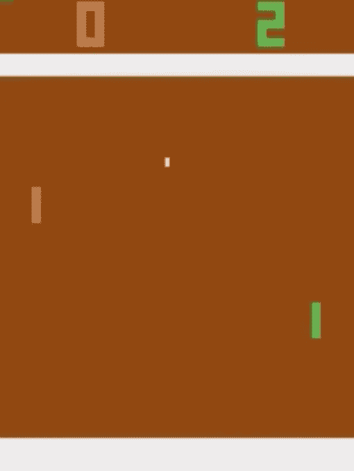
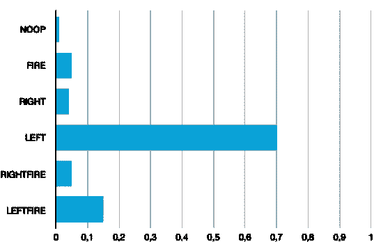
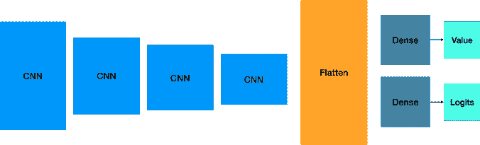
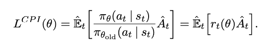
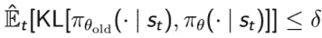
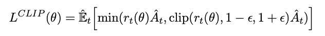
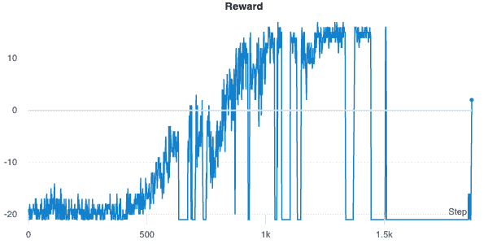
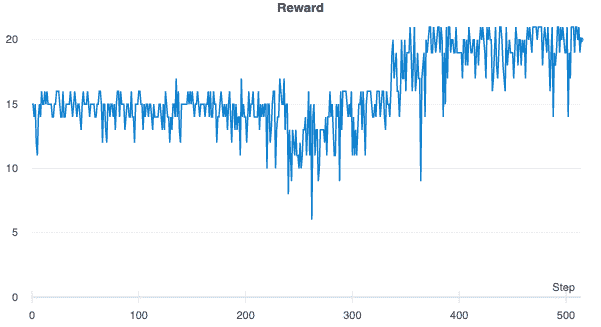
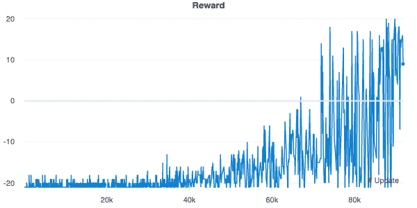

# 用强化学习打败乒乓——第二部分 A2C 和 PPO

> 原文：<https://medium.com/analytics-vidhya/beating-pong-using-reinforcement-learning-part-2-a2c-and-ppo-b83391dd3657?source=collection_archive---------12----------------------->

# *继续我的强化学习之旅*



*作者安东尼奥·李斯*

# 介绍

大家好，这是我关于媒介的第二篇文章，是[上一篇](/analytics-vidhya/beating-pong-using-reinforcement-learning-part-1-dddqn-f7fbf5ad7768)的续篇。我们将使用第一部分中开发的大量代码。所以如果你没有读过，我建议你先读一读。

在这篇文章中，我们将从头开始实现 A2C 和 PPO 来击败 atari pong 游戏，就像我们在第一部分中用 DDDQN 所做的那样。

# 激励 A2C 和 PPO

在继续之前，我们需要讨论一下为什么我们关注这两个算法。首先，两者都属于策略梯度算法家族。当 DQN 学习 q 值函数并从中导出策略时，策略梯度算法直接改进策略。这意味着网络的权重将更新，以增加具有良好总回报的行动的概率，并减少不良结果。作为一个说明性的例子，策略输出将是 n 个动作中的每一个的概率向量:



一个显著的区别是政策梯度算法是随机的，而 q 值方法是确定性的。确定性方法将给出相同的输入，给出相同的输出，因此我们需要一些ε贪婪的政策来探索环境；这是典型的开发与勘探的权衡。给定相同的输入，梯度策略方法可以给出不同的输出。动作是从网络输出的分布中采样的。所以我们不需要任何贪婪的策略来探索环境，就像我们在 DQN 做的那样。

另一个关键的区别是，DQN 方法是非策略的，这意味着它们评估和改进的策略不同于用来选择行动的策略。脱离策略的算法可以使用由单独的策略生成的观察来学习，基本上是上一篇文章中的缓冲类。

策略梯度方法是基于策略的，这意味着它们评估和改进选择动作的相同策略。基于策略的方法不能使用由不同策略产生的过去的经验，因此它们在使用观察值时效率较低。

这是选择要使用的算法的关键点。如果环境很快，所以很容易获得观察值，那么政策上的方法是最佳选择。但是，如果很难获得观察结果，那么政策外的方法应该是首选。

所有这些可能看起来有点神秘，但当我们深入研究代码时，就会变得更加清晰。所以事不宜迟，就这么办吧。

# 环境包装

我们将使用相同的包装器和所有技巧来处理图像，并将它们堆叠起来，这在上一篇文章中已经讨论过。所以这没什么新鲜的。我们去有趣的地方吧。

# 网络

我们将利用 DDDQN 算法中使用的相同架构来处理输入图像，但我们需要对网络头进行一些更改。演员-评论家方法背后的思想是，我们有一个演员，用来选择行动，还有一个评论家，批评演员的行动。演员将输出动作空间中的概率分布，而评论家将输出估计值函数。

一开始，演员不知道怎么玩，所以它会随机尝试一些动作。评论家观察所采取的行动，并根据估计值给出反馈。参与者将从其反馈中学习更新策略，并更好地玩那个游戏；同时，批评家也将更新其提供反馈的方式。

我们可以看到，演员-评论家的想法是有两个神经网络，演员和评论家。实际上，这两个网络部分重叠，主要是出于效率和融合的考虑。在我们的例子中，演员和评论家被实现为来自同一个公共主体的不同头部。

它们将接受相同的输入，但是参与者将返回一个具有 n 个逻辑值的张量，其中 n 是动作的数量，而批评家将返回一个具有一个值的张量，该值表示状态的值:



A2C 和 PPO 在构建网络时使用相同的逻辑，因此这部分代码没有区别:

```
import numpy as np
import tensorflow as tf
import tensorflow.keras.layers as kl
from tensorflow.keras.initializers import VarianceScaling*class* ProbabilityDistribution(tf.keras.Model):
    *def* call(self, logits, **kwargs):
        # Random distribution
        return tf.squeeze(tf.random.categorical(logits, 1), axis=-1) *class* Model(tf.keras.Model):
    *def* __init__(self, num_actions, hidden):
        # Note: no tf.get_variable(), just simple Keras API!
        *super*().__init__('mlp_policy')
        self.normalize = kl.Lambda(lambda layer: layer / 255)    # normalize by 255
        self.conv1 = kl.Conv2D(32, (8, 8), strides=4, kernel_initializer=VarianceScaling(scale=2.), activation='relu', use_bias=False)
        self.conv2 = kl.Conv2D(64, (4, 4), strides=2, kernel_initializer=VarianceScaling(scale=2.), activation='relu', use_bias=False)
        self.conv3 = kl.Conv2D(64, (3, 3), strides=1, kernel_initializer=VarianceScaling(scale=2.), activation='relu', use_bias=False)
        self.conv4 = kl.Conv2D(hidden, (7, 7), strides=1, kernel_initializer=VarianceScaling(scale=2.), activation='relu', use_bias=False)

        self.flatten = kl.Flatten()
        self.value = kl.Dense(1, kernel_initializer=VarianceScaling(scale=2.), name="value")
        self.logits = kl.Dense(num_actions, kernel_initializer=VarianceScaling(scale=2.), name='policy_logits')

        self.dist = ProbabilityDistribution() *def* call(self, inputs, **kwargs):
        # Inputs is a numpy array, convert to a tensor.
        x = tf.convert_to_tensor(inputs)
        # Separate hidden layers from the same input tensor. x = self.normalize(x)
        x = self.conv1(x)
        x = self.conv2(x)
        x = self.conv3(x)
        x = self.conv4(x)
        x = self.flatten(x)
        return self.logits(x), self.value(x)
```

# 代理人

我们现在可以实现代理的逻辑了。这里我们没有任何缓冲重放，因此我们可以从环境中获取观察值，并将它们馈送到神经网络以更新权重:

```
*class* Agent:
    *def* __init__(self, model, save_path=PATH_SAVE_MODEL, load_path=PATH_LOAD_MODEL, lr=LR, gamma=GAMMA, value_c=VALUE_C,
                 entropy_c=ENTROPY_C, clip_ratio=CLIP_RATIO, std_adv=STD_ADV, agent=AGENT, input_shape=INPUT_SHAPE,
                 batch_size = BATCH_SIZE, updates=N_UPDATES):
        # Coefficients are used for the loss terms.
        self.value_c = value_c
        self.entropy_c = entropy_c
        # `gamma` is the discount factor
        self.gamma = gamma
        self.save_path = save_path
        self.load_path = load_path
        self.clip_ratio = clip_ratio
        self.std_adv = std_adv
        self.agent = agent
        self.input_shape = input_shape
        self.batch_size = batch_size
        self.updates = updates
        self.opt = opt.RMSprop(lr=lr)

        self.model = model if load_path is not None:
            print("loading model in {}".*format*(load_path))
            self.load_model(load_path)
            print("model loaded")

    *def* train(self, wrapper):
        # Storage helpers for a single batch of data.
        actions = np.empty((self.batch_size), dtype=np.int32)
        rewards, dones, values = np.empty((3, self.batch_size))
        observations = np.empty((self.batch_size,) + self.input_shape)
        old_logits = np.empty((self.batch_size, wrapper.env.action_space.n), dtype=np.float32) # Training loop: collect samples, send to optimizer, repeat updates times.
        ep_rewards = [0.0]
        next_obs = wrapper.reset()
        for update in tqdm(*range*(self.updates)):
            start_time = time.time()
            for step in *range*(self.batch_size):
                observations[step] = next_obs.copy()
                old_logits[step], actions[step], values[step] = self.logits_action_value(next_obs[None, :])
                next_obs, rewards[step], dones[step] = wrapper.step(actions[step])
                next_obs = wrapper.state
                ep_rewards[-1] += rewards[step]
                if dones[step]:
                    ep_rewards.append(0.0)
                    next_obs = wrapper.reset()
                    wandb.log({'Game number': *len*(ep_rewards) - 1, '# Update': update, '% Update': *round*(update / self.updates, 2),
                                "Reward": *round*(ep_rewards[-2], 2), "Time taken": *round*(time.time() - start_time, 2)}) _, _, next_value = self.logits_action_value(next_obs[None, :]) returns, advs = self._returns_advantages(rewards, dones, values, next_value, self.std_adv) # Performs a full training step on the collected batch.
            # Note: no need to mess around with gradients, Keras API handles it.
            with tf.GradientTape() as tape:
                logits, v = self.model(observations, training=True)
                if self.agent == "A2C":
                    logit_loss = self._logits_loss_a2c(actions, advs, logits)
                elif self.agent == "PPO":
                    logit_loss = self._logits_loss_ppo(old_logits, logits, actions, advs, wrapper.env.action_space.n)
                else:
                    raise Exception("Sorry agent can be just A2C or PPO")
                value_loss = self._value_loss(returns, v)
                loss = logit_loss + value_loss
            grads = tape.gradient(loss, self.model.trainable_variables)
            self.opt.apply_gradients(*zip*(grads, self.model.trainable_variables)) if update % 5000 == 0 and self.save_path is not None:
                print("Saving model in {}".*format*(self.save_path))
                self.save_model(f'{self.save_path}/save_agent_{time.strftime("%Y%m%d%H%M") + "_" + *str*(update).zfill(8)}/model.tf')
                print("model saved")        return ep_rewards
```

这里有几件事需要注意:

*   我们使用优势的概念。
*   我们正在存储旧的逻辑值。当我们看到损失函数时，你就会明白为什么了。
*   A2C 和 PPO 的唯一区别在于损失函数。

# 回报和优势

要减少梯度的方差并提高策略梯度方法的稳定性，一个好主意是使用 DDDQN 算法中使用的相同概念，并将总回报视为状态值加上行动优势:

Q(s，a) = V(s) + A(s，A)

因此，评论家将使用 DQN 方法中使用的相同训练过程来估计状态值，该训练过程携带贝尔曼步骤并最小化均方误差以改进 V(s)近似。

稳定模型的另一个有用的东西是标准化优点，但它并不总是有效，所以会有一个布尔变量来启用/禁用它。

为了获得优势，我们需要首先使用贴现因子 gamma 计算每一步的贴现总回报。

```
*def* _returns_advantages(self, rewards, dones, values, next_value, standardize_adv):
        returns = np.append(np.zeros_like(rewards), next_value, axis=-1) # Returns are calculated as discounted sum of future rewards.
        for t in *reversed*(*range*(rewards.shape[0])):
            returns[t] = rewards[t] + self.gamma * returns[t + 1] * (1 - dones[t])
        returns = returns[:-1] # Advantages are equal to returns - baseline (value estimates in our case).
        advantages = returns - values

        if standardize_adv:
            advantages = (advantages - np.mean(advantages)) / (np.std(advantages) + 1e-10) return returns, advantages
```

# 损失函数

我们从 A2C 和 PPO 的价值损失开始。这是价值头的输出和收集的回报之间的经典均方误差:

```
*def* _value_loss(self, returns, value):
        # Value loss is typically MSE between value estimates and returns.
        return self.value_c * kloss.mean_squared_error(returns, value)
```

然后我们来看看政策损失，这是 A2C 和 PPO 之间的真正区别。我们从 A2C 开始:

```
*def* _logits_loss_a2c(self, actions, advantages, logits): # Sparse categorical CE loss obj that supports sample_weight arg on `call()`.
        # `from_logits` argument ensures transformation into normalized probabilities.
        weighted_sparse_ce = kloss.SparseCategoricalCrossentropy(from_logits=True) # Policy loss is defined by policy gradients, weighted by advantages.
        # Note: we only calculate the loss on the actions we've actually taken.
        actions = tf.cast(actions, tf.int32)
        policy_loss = weighted_sparse_ce(actions, logits, sample_weight=advantages) # Entropy loss can be calculated as cross-entropy over itself.
        probs = tf.nn.softmax(logits)
        entropy_loss = kloss.categorical_crossentropy(probs, probs) # We want to minimize policy and maximize entropy losses.
        # Here signs are flipped because the optimizer minimizes.
        return policy_loss - self.entropy_c * entropy_loss
```

首先，我们采取输入动作(从 0 到 5 的整数值)、优势和 logits(策略的输出之一)。正如 Keras 模型类所期望的，我们将动作转换为 int32。然后，我们将政策损失定义为采取行动的概率与利益加权的交叉熵。在底层，它接受动作向量并将其转换为分类或矢量化格式，如[0，0，0，1，0，0]。然后获取 logits 向量，使用 softmax 函数对其进行转换，获得概率向量。最后，它将概率向量的对数与行动和优势向量相乘。

正如我们所看到的，还有另一个最终损失，那就是熵损失。我们减去熵损失，以鼓励对模型的进一步探索，使极端分布，即概率值接近 1 的分布，不那么吸引人。

OpenAI 团队于 2017 年在 John Schulman 等人名为[proximity Policy Optimization Algorithms](https://arxiv.org/pdf/1707.06347.pdf)的论文中介绍了 PPO 方法。铝..对经典 A2C 方法的核心改进是改变了它估计政策梯度的方式。PPO 方法使用新旧保单之间的比率，按优势进行调整，而不是使用新保单的对数:



这是通过 [TRPO](https://arxiv.org/pdf/1502.05477.pdf) 算法实现的目标最大化(我们在这里不做介绍)，其约束条件是新旧策略之间的 kull back-lei bler 差异小于一个定义的 delta。



这个约束是必要的，因为没有它，L 的最大化将导致巨大的政策更新。

PPO 算法使用相同的逻辑，但方法更简单。它没有定义一个约束，只是裁剪了概率比。这样，新政策与旧政策不会有太大的不同:



让我们看看这在代码中是如何翻译的:

```
*def* _logits_loss_ppo(self, old_logits, logits, actions, advs, n_actions):
        actions_oh = tf.one_hot(actions, n_actions)
        actions_oh = tf.reshape(actions_oh, [-1, n_actions])
        actions_oh = tf.cast(actions_oh, tf.float32)
        actions_oh = tf.stop_gradient(actions_oh)

        new_policy = tf.nn.log_softmax(logits)
        old_policy = tf.nn.log_softmax(old_logits)
        old_policy = tf.stop_gradient(old_policy)

        old_log_p = tf.reduce_sum(old_policy * actions_oh, axis=1)
        log_p = tf.reduce_sum(new_policy * actions_oh, axis=1)
        ratio = tf.exp(log_p - old_log_p)
        clipped_ratio = tf.clip_by_value(
            ratio, 1 - self.clip_ratio, 1 + self.clip_ratio)
        advs = tf.stop_gradient(advs)
        advs = tf.cast(advs, tf.float32)
        surrogate = tf.minimum(ratio * advs, clipped_ratio * advs)
        return -tf.reduce_mean(surrogate) - self.entropy_c * kloss.categorical_crossentropy(new_policy, new_policy)
```

在这里，我们将把动作转换成它们的矢量化格式，然后我们获取所采取的动作的旧的和新的逻辑，并将旧的和新的策略定义为逻辑的 softmax。更准确地说，我们通过将比率定义为对数差，然后取指数值，从而使 log softmax 具有更多的数值稳定性。根据对数的商法则，数学上是等价的。最后，我们对比率进行裁剪，并取裁剪后的比率和标准比率之间的最小值作为优势权重。

我们现在可以启动这两个算法来查看结果。

# 培训和结果

和往常一样，我们使用 wandb 来记录结果:

```
wandb.init(
  project="tensorflow2_pong_{}".*format*(AGENT.lower()),
  tags=[AGENT.lower(), "CNN", "RL", "atari_pong"],
  config=CONFIG_WANDB,
)
```

我们定义环境，初始化网络和代理:

```
pw = PongWrapper(ENV_NAME, history_length=4)
model = Model(num_actions=pw.env.action_space.n, hidden=HIDDEN)
agent = Agent(model)
```

最后，我们有 main()函数，它将调用 agent.train 方法。与往常一样，在中断培训时，有一个保存模型的 try/except 块，以便我们可以在另一个时间重新开始培训:

```
*def* main():
    rewards_history = agent.train(pw)if __name__ == "__main__":
    try:
        main()
    except KeyboardInterrupt:
        # Save the model, I need this in order to save the networks, frame number, rewards and losses. 
        # if I want to stop the script and restart without training from the beginning
        if PATH_SAVE_MODEL is None:
            print("Setting path to ../model/{}".*format*(AGENT.lower()))
            PATH_SAVE_MODEL = "../model/{}".*format*(AGENT.lower())
        print('Saving the model in ' + f'{PATH_SAVE_MODEL}/save_agent_{time.strftime("%Y%m%d%H%M")}')
        agent.save_model(f'{PATH_SAVE_MODEL}/save_agent_{time.strftime("%Y%m%d%H%M")}/model.tf')
        print('Saved.')
```

我们现在可以使用 wandb 的图来查看结果。

让我们从 A2C 开始:



如您所见，由于没有对策略梯度的限制，策略更新中存在很高的可变性，并且算法在获得满意的结果后表现不佳。因此，我决定采用保存了大约 1k 步的模型，并使用低得多的学习速率再次开始训练，以避免在模型表现良好后进行大量的策略更新。让我们看看第二轮测试的结果:



如您所见，结果非常好，可变性非常低。有人可以从训练开始就想着把学习率定的低一点，但是适得其反，因为需要太多的时间去收敛。

开始时设定一个高的学习率，然后随着训练过程的推进而降低，这样更有意义。我们在 DDDQN 中用 epsilon greedy 策略做了一些类似的事情，在培训开始时有一个大的 epsilon，在培训结束时有一个小的 epsilon(以激励最初的探索和最后的开发)。这里我们采用了一种基本的方法来解决这个问题。一个更好的方法是将学习速度设定为步数的函数。但是训练需要一段时间，我需要训练 PPO 代理的时间，所以我决定用这种方式完成训练。

让我们看看 PPO 的结果:



我们使用了与 A2C 算法相同的起始学习速率，但是由于损失函数的削波机制，我们不需要在学习速率上做任何手脚。

你可以在我的[博客](https://antonai.blog/?p=229#more-229)上找到原文，我的 [Github](https://github.com/antonai91/reinforcement_learning/tree/master/a2c_ppo) 上的所有代码。有任何问题，你可以通过 [Linkedin](https://www.linkedin.com/in/lisiantonio/) 联系我。

如果你喜欢这篇文章，分享给你的朋友和同事吧！我会在下一篇文章中看到你。与此同时，要小心，保持安全，记住*不要成为另一块墙砖*。

Anton.ai