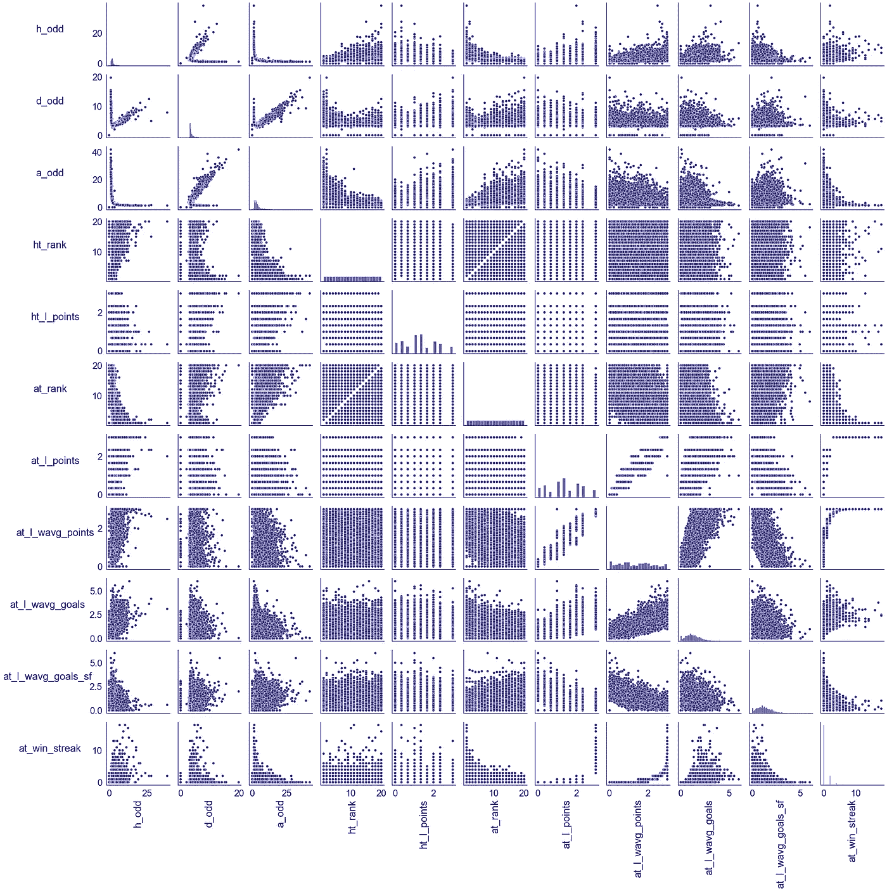

# 使用机器学习击败足球赔率——项目演练

> 原文：<https://medium.com/analytics-vidhya/beating-soccer-odds-using-machine-learning-project-walkthrough-a1c3445b285a?source=collection_archive---------1----------------------->

托马斯·塞勒在 [Unsplash](https://unsplash.com/) 上的照片

预测足球比赛是一项艰巨的任务，这对任何人来说都不是新闻。毕竟，你怎么能预测像足球这样不可预测的事情呢？基于这一挑战，我决定利用我的数据科学知识创建一个项目，以便不仅有令人满意的预测结果，而且还能击败庄家从我的预测中获利。

# 网页抓取

首先，我必须从足球比赛中获取尽可能多的数据。幸运的是，[赔率门户](https://www.oddsportal.com/)有近 16 年英超联赛赛季的比赛信息。

来源: [Oddsportal](https://www.oddsportal.com/soccer/england/premier-league-2020-2021/results/)

我是用两个 Python 库进行网页抓取从网站上得到数据的， [**BeautifulSoup**](https://www.crummy.com/software/BeautifulSoup/bs4/doc/) 和 [**Selenium**](https://www.selenium.dev/docs/) 。基本上，我在 BeautifulSoup 中完成了整个抓取结构，并使用 Selenium 点击下一页，因为这个库允许您像人一样在网页上执行操作。

经过搜集，我获得了从 2005/2006 赛季到 2020/2021 赛季的 6077 场英超联赛的数据，共有 7 列信息:

来源:[我的 Github 代码](https://github.com/Caldass/pl-matches-predictor)

*   **赛季**:比赛的赛季。
*   日期:比赛日期。
*   **match_name** :“主队 vs 客场”字符串。
*   **结果**:匹配结果。
*   **h_odd** :主队的胜奇。
*   **d_odd** :画奇数。
*   **a_odd** :客场球队的赢球奇数。

# 数据清理

我已经有了一个非常干净的数据集，所以我只需要为下一步执行更加健壮的特征工程准备数据。在这一步中，我:

*   已将日期转换为日期时间。
*   改变奇数列浮动。
*   获得一个季节的开始年份。
*   将比赛名称分为主队和客场队。
*   将分数分为主客场分数。
*   使用匹配结果创建了特征。

经过这些转换后，数据集看起来是这样的:

来源:[我的 Github 代码](https://github.com/Caldass/pl-matches-predictor)

# 特征工程

这是项目中最有影响力的部分之一。人们可以创建尽可能最好、最复杂的机器学习算法，随心所欲地堆叠和调整模型，但归根结底，一个简单的模型，其功能能够充分解释因变量和自变量之间的关系，将会更加高效。

因为只有在比赛后才能获得比赛统计数据，所以要创建的特征必须基于比赛前获得的信息。

首先，我创建了常规的统计数据，比如在各个赛季的各个比赛日之前的胜场、输球、进球和球队排名。我还创建了一些功能，如最近 3 场比赛的平均进球和得分以及球队目前的胜败和平局。我最想尝试的功能是加权指数平均，根据这篇文章的说法，这可能很适合足球预测。

以下是特征工程过程后的数据集列信息:

请注意，有些列包含空值。我将在稍后的模型构建阶段讨论它们。

所有的特性描述都在项目的 [Github repo](https://github.com/Caldass/pl-matches-predictor/blob/master/model_building/model.py) 中一个名为 *"features.txt"* 的文件中。

# 电子设计自动化(Electronic Design Automation)

这里的目标是执行一个简短的数据探索，以便更好地理解因变量和自变量之间的关系。

数据集在目标变量中包含 3 个可能的类别，主队获胜、客场获胜和平局。这些班级的比例如下:

来源:[我的 Github 回购](https://github.com/Caldass/pl-matches-predictor)

有可能看到主导阶层是主队获胜，这是有道理的，因为众所周知，在足球比赛中，主队通常更有优势。

由此可以假设，预测平局比预测两支球队中的一支获胜更困难，因为 75.45%的数据集包含两支球队中的一支获胜的比赛。

来源:[我的 Github 回购](https://github.com/Caldass/pl-matches-predictor)

在上图中，可以在单独的数据框架中看到与每个类相关的最高 5 个特征。我们可以通过假设如果一个变量上升，那么与它正相关的类发生的概率也上升来解释这些正相关。

我们可以看到，在 *winner_h* 和 *winner_a* 数据帧(主场胜利和客场胜利)中，似乎影响班级发生的是另一个队的表现有多差。比如对方球队的赔率和排名就是相关度最高的。

同时，在与其他两个数据帧相比相关性非常低的 *winner_d* 数据帧(平局)中，可以看到与平局结果相关性更高的特征是表明主队表现如何的特征。

在建模阶段，我使用了一个特征选择工具，稍后我会谈到它，并对该工具选择的 13 个特征的分布和散点图进行了简要分析。

来源:[我的 Github 回购](https://github.com/Caldass/pl-matches-predictor)

在上面显示的直方图中，我们可以看到这些特征并不是正态分布的，而且比例也不同。这就是为什么我在建模阶段对它们应用了 MinMaxScaler 变换。

还可以通过配对图来查看特征之间的关系:

来源:[我的 Github 回购](https://github.com/Caldass/pl-matches-predictor)

我们可以从这个图中观察到一些线性关系:

*   w.e.a .分数与 w.e.a .目标度量呈正相关，与 w.e.a .目标遭受度量呈负相关，这非常合理。如果一支球队得分多，它就会进更多的球，遭受更少的球。
*   主队的赔率随着 w.e.a .的积分而上升，客场队的 w.e.a .进球也随之上升。也就是说客队得分越多，主队获胜的几率就越小。
*   平局赔率也与两个队的赔率相关，可能是因为每场比赛都会有一个队的赔率更高，而平局赔率往往接近这个更高的赔率。
*   我们还可以看到一些明显的线性关系，比如主队 odd 随着客队排名的上升而下降。也就是说，客队在积分榜上的位置越低，主队获胜的几率就越高。

# 模型结构

首先，我删除了所有在比赛前不可用的功能，这些功能只是用来创建其他功能。

对于具有空值的列，我用“-33”值填充它们，以帮助我们的模型解释它们。这样，我允许模型理解这些值为空是有原因的。例如，在“_rank”列中，如果一支球队没有最后一个排名，这要么是因为该比赛属于数据集中出现的第一个赛季，要么是因为该特定球队在上一个赛季中不在英超联赛中。

使用的型号:

*   **逻辑回归** —由于特征之间的线性关系，线性模型预期有效。
*   **随机森林分类器** —由于数据的稀疏性，基于树的集成模型预期工作良好。
*   **梯度推进分类器** —就像随机森林一样，由于数据的稀疏性，基于树的集成模型预计会工作得很好。
*   **K-最近邻分类器** —非监督学习算法，通过对象的 K 个最近邻的多个投票对其进行分类。

在训练模型之前，我将数据分为训练集和测试集，测试规模为 20%，为“ls_winner”列创建虚拟列，并使用 [sklearn MinMaxScaler](https://scikit-learn.org/stable/modules/generated/sklearn.preprocessing.MinMaxScaler.html) 缩放所有功能。

为了评估这些模型，我选择了准确性度量，因为模型的工作是预测精确的匹配结果，不管它属于哪个类。

准确度是正确预测的总数除以总预测数。它是我们模型中正确预测的比例。

以下是经过训练的模型及其训练结果:

来源:[我的 Github 回购](https://github.com/Caldass/pl-matches-predictor)

尽管准确性水平不是太高，但重要的是要注意到，最好的模型比随机预测或“*主队总是赢*”预测表现得更好，这意味着我们的模型能够解释一些数据。

来源:[我的 Github 回购](https://github.com/Caldass/pl-matches-predictor)

鉴于逻辑回归具有最佳的训练结果，它是建模阶段的重点模型。

由于总共有 40 多个特征，我使用[递归特征消除(RFE)](https://scikit-learn.org/stable/modules/generated/sklearn.feature_selection.RFE.html) 方法进行了特征选择。

功能选择对以下方面很重要:

*   增加模型的可解释性。
*   减少训练时间。
*   避免[维数灾难](https://en.wikipedia.org/wiki/Curse_of_dimensionality)。
*   减少过度拟合。

所使用的方法通过递归地考虑越来越小的特征集来选择特征。在该图中，可以看到所使用的特征数量与逻辑回归的准确度之间的关系:

[来源:我的 Github 回购](https://github.com/Caldass/pl-matches-predictor)

不仅有可能将准确度保持在令人满意的水平，而且甚至有可能提高某些特征的准确度。我选择了 13 个作为理想的特征数，这样我们可以有更多的可解释性，并且与使用所有特征相比，精确度差异最小。

这些是选择的功能:

*   h _ 奇数
*   d _ 奇数
*   奇怪的
*   ht_rank
*   排名
*   高温点
*   在 l 点
*   at_l_wavg_points
*   at _ l _ wavg _ 目标
*   at_l_wavg_goals_sf
*   连胜
*   ls_winner_-33
*   ls _ 赢家 _ 主场 _ 球队

我们可以观察到所有的赔率特征都被选择了。这凸显了它们的重要性。这是可以理解的，因为博彩公司在创造赔率和预测比赛方面做得很好。我们还可以注意到，在最近 3 场比赛的平均分数旁边，显示了带有排名信息的特征。

加权指数平均特性也进入了前 13 名，但只是在客场球队方面。

请注意,“ls_winner_-33”意味着两支球队之间没有最后一场比赛，这显然对陈述比赛结果也很重要。

# **模拟投资**

在这里，我使用测试数据，通过模型的预测和比赛的赔率来模拟对博彩市场的投资。

该模拟包含 1216 个匹配的测试数据。我达成了每场比赛 100 美元的虚构投资，总投资为 121，600 美元。

下面是模型的执行方式:

来源:[我的 Github 回购](https://github.com/Caldass/pl-matches-predictor)

值得注意的是，KNN 算法也有收益，尽管它在训练阶段的准确性是 4 种算法中最差的。

为了理解为什么 KNN 模型有利润而其他两个模型没有，我们需要澄清什么是精度、召回和 F1 分数:

*   **精度**:在所有预测的阳性中，有多少是实际阳性？
*   **回忆**:在所有的阳性结果中，模型说它是阳性的有多少？
*   **F1-score** :精度和召回率的调和平均值。

请注意，这些度量是为每个类计算的，因此度量考虑了引用的类 1(正类)和其他两个类 0(负类)。

以下是各型号的[分类报告](http://scikit-learn.org/stable/modules/generated/sklearn.metrics.classification_report.html):

来源:[我的 Github 回购](https://github.com/Caldass/pl-matches-predictor)

0 类是平局，1 类是客队获胜，2 类是主队获胜。

可以看出，尽管 KNN 模型的准确性最低，但在所有模型中，它在绘图类中的 F1 得分最高。除此之外，它几乎有 50%的准确性，在获奖类别中的 F1 分数与其他型号相差不远。这就是为什么这个模型在预测中仍然有利润。

逻辑回归没有正确预测任何平局类的出现，可能是因为没有太多的线性关系指出平局结果。但是它仍然有利润，因为它很好地预测了获胜的类。

# 生产化

这里，我构建了一个 Flask API 端点，并将其部署到一个 Heroku 应用程序中。

该应用可在[https://pl-matches-predictor.herokuapp.com/predict](https://pl-matches-predictor.herokuapp.com/predict)获得并托管。输入应该如下所示:

*   **h_odd** —代表主队中奖奇数的浮点数。
*   **a_odd** —代表客队中奖奇数的浮点数。
*   **d_odd** —代表抽签奇数的浮点数。
*   **ht_rank** —代表主队当前排名的整数。
*   **at_rank** —代表客队当前排名的整数。
*   **ht_l_points** —最近 3 场比赛主队平均积分。
*   **at_l_points** —最近 3 场比赛的平均客场球队积分。
*   **at_l_wavg_points** —加权指数平均客场球队最近 3 场比赛的积分。
*   **at_l_wavg_goals** —近 3 场比赛加权指数平均客场进球。
*   **at_l_wavg_goals_sf** —加权指数平均近 3 场比赛客场进球。
*   **at_win_streak** —代表客场球队当前连胜的整数。
*   **ls_winner** —两队之间最后一场比赛的胜者(“主队”、“客场队”、“平局”)。如果没有最后一个匹配，请不要填写此输入。

请求的输出是包含“预测”列的数据帧，该列具有匹配的预测结果。

下面是请求的 Python 示例:

# 丰富

在未来，如果我试图在利润和准确性水平上实现改进，我可能不会使用逻辑回归。尽管这个项目中的其他模型没有 L.R .的利润，但它们显示出预测所有 3 类结果的更大潜力。

此外，创建新的功能和添加外部数据，如有多少球迷在场，以及游戏统计，如投篮命中率和犯规，可能有助于提高准确性和利润水平。

# 结论

尽管预测足球比赛不是一件容易的事情，但我发现这个项目的结果非常令人满意，因为它不仅有可能比随机预测或“*主队总是赢*”预测更好的准确度。但也有可能战胜困难，根据模型预测，投资模拟的利润率约为 4.81%。

如果你想看到更多关于这个项目的细节或者为它做贡献，请查看它的 [Github repo！](https://github.com/Caldass/pl-matches-predictor)