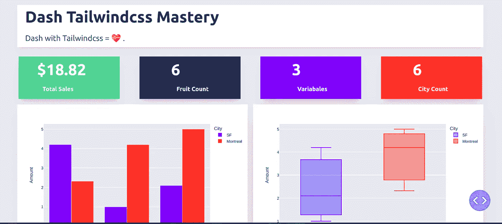
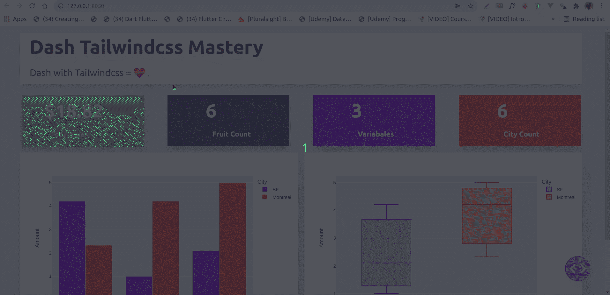

# 带仪表板和尾翼的漂亮仪表板

> 原文：<https://medium.com/analytics-vidhya/beautiful-dashboards-with-dash-and-tailwindcss-bf0f8d5c67e?source=collection_archive---------0----------------------->



分享数据见解的最佳方式之一是使用仪表板来展示它们。这也是 Tableau、Data Studio 等仪表板工具继续流行的原因之一。这些工具为数据提供了漂亮的图形解释。

这些工具的唯一缺点是它们不够灵活，无法让您创建自己的设计。有些有这类作品的主题，但很有限。

我们都爱[Tailwindcss](http://tailwindcss.com/)；一个实用的 CSS 框架，我们喜欢用它做任何事情，包括创建漂亮的仪表板。

Dash 是来自 [Plotly](http://plotly.com/) 的 dashboarding 框架，支持 Python、R 和 Julia。使用 Dash，您可以创建一个定制的响应式仪表板，并使用 Tailwindcss 对其进行样式化。在本文中，我们将使用 Dash 的 Python 版本。

# 包装管理的诗意

我们将使用诗歌我们的这个项目的包装经理。

```
poetry init
```

然后使用以下命令安装依赖项:

```
poetry add dash pandas
```

现在，在您的目录中创建一个`app.py`文件。这将是我们应用程序的入口。

我们将从导入我们的库开始:

```
import dash
import pandas as pd
import plotly.express as px
from dash import dcc, html
```

注意，现在您可以从`dash`导入`dcc` : Dash 的核心和`html`组件。这使得它比以前更容易，我们对此心存感激。

# 添加 Tailwindcss

要将 Tailwindcss 添加到 app 中，我们需要做的就是将 Tailwindcss 的 CDN 作为 external_script，传递给我们的 app 实例。

```
app = dash.Dash(
    __name__,
    external_scripts=external_script,
)
app.scripts.config.serve_locally = True
```

因为，我们想在本文中关注 Tailwindcss 和 Dash，所以我们将使用 Dash 网站上的一个玩具数据。我们将使用熊猫来处理数据。当然你可以用你自己的数据来代替。

```
df = pd.DataFrame(
    {
        "Fruit": ["Apples", "Oranges", "Bananas", "Apples", "Oranges", "Bananas"],
        "Amount": [4.2, 1.0, 2.1, 2.32, 4.20, 5.0],
        "City": ["SF", "SF", "SF", "Montreal", "Montreal", "Montreal"],
    }
)
​
​
fruit_count = df.Fruit.count()
total_amt = df.Amount.sum()
city_count = df.City.count()
variables = df.shape[1]
​
```

接下来，我们将创建一些图形，并使用 Tailwindcss 来设置仪表板的样式:

```
fig = px.bar(df, x="Fruit", y="Amount", color="City", barmode="group")
​
fig1 = px.box(df, x="City", y="Amount", color="City")
​
app.layout = html.Div(
    html.Div(
        children=[
            html.Div(
                children=[
                    html.H1(children="Dash Tailwindcss Mastery", className=" py-3 text-5xl font-bold text-gray-800"),
                    html.Div(
                        children="""
        Dash with Tailwindcss = 💝 .
    """,
                        className="text-left prose prose-lg text-2xl  py-3 text-gray-600",
                    ),
                ],
                className="w-full mx-14 px-16 shadow-lg bg-white -mt-14 px-6 container my-3 ",
            ),
            html.Div(
                html.Div(
                    children=[
                        html.Div(
                            children=[
                                f"${total_amt}",
                                html.Br(),
                                html.Span("Total Sales", className="text-lg font-bold ml-4"),
                            ],
                            className=" shadow-xl py-4 px-14 text-5xl bg-[#76c893] text-white  font-bold text-gray-800",
                        ),
                        html.Div(
                            children=[
                                fruit_count,
                                html.Br(),
                                html.Span("Fruit Count", className="text-lg font-bold ml-4"),
                            ],
                            className=" shadow-xl py-4 px-24 text-5xl bg-[#1d3557] text-white  font-bold text-gray-800",
                        ),
                        html.Div(
                            children=[
                                variables,
                                html.Br(),
                                html.Span("Variabales", className="inline-flex items-center text-lg font-bold ml-4"),
                            ],
                            className=" shadow-xl py-4 px-24 text-5xl bg-[#646ffa] text-white  font-bold text-gray-800",
                        ),
                        html.Div(
                            children=[
                                city_count,
                                html.Br(),
                                html.Span("City Count", className="text-lg font-bold ml-4"),
                            ],
                            className="w-full shadow-xl py-4 px-24 text-5xl bg-[#ef553b] text-white  font-bold text-gray-800",
                        ),
                    ],
                    className="my-4 w-full grid grid-flow-rows grid-cols-1 lg:grid-cols-4 gap-y-4 lg:gap-[60px]",
                ),
                className="flex max-w-full justify-between items-center ",
            ),
            html.Div(
                children=[
                    html.Div(
                        children=[
                            dcc.Graph(id="example-graph", figure=fig),
                        ],
                        className="shadow-xl w-full border-3 rounded-sm",
                    ),
                    html.Div(
                        children=[
                            dcc.Graph(id="example-graph1", figure=fig1),
                        ],
                        className="w-full shadow-2xl rounded-sm",
                    ),
                ],
                className="grid grid-cols-1 lg:grid-cols-2 gap-4",
            ),
        ],
        className="bg-[#ebeaee]  flex py-14 flex-col items-center justify-center ",
    ),
    className="bg-[#ebeaee] container mx-auto px-14 py-4",
)
```

最后，我们将运行我们的代码并在浏览器中检查输出。

```
​
if __name__ == "__main__":
    app.run_server(debug=True)
```

# 运行应用程序

要运行该应用程序，请在终端中键入以下命令:

```
poetry run python app.py
```

导航到`http://127.0.0.1:8050/`，瞧，你的定制仪表板会微笑着迎接你。



app 的完整代码如下所示:

```
# Run this app with `python app.py` and
# visit [http://127.0.0.1:8050/](http://127.0.0.1:8050/) in your web browser.
​
# Run this app with `python app.py` and
# visit [http://127.0.0.1:8050/](http://127.0.0.1:8050/) in your web browser.
​
import dash
import pandas as pd
import plotly.express as px
from dash import dcc, html
​
external_script = ["https://tailwindcss.com/", {"src": "https://cdn.tailwindcss.com"}]
​
app = dash.Dash(
    __name__,
    external_scripts=external_script,
)
app.scripts.config.serve_locally = True
​
# assume you have a "long-form" data frame
# see [https://plotly.com/python/px-arguments/](https://plotly.com/python/px-arguments/) for more options
df = pd.DataFrame(
    {
        "Fruit": ["Apples", "Oranges", "Bananas", "Apples", "Oranges", "Bananas"],
        "Amount": [4.2, 1.0, 2.1, 2.32, 4.20, 5.0],
        "City": ["SF", "SF", "SF", "Montreal", "Montreal", "Montreal"],
    }
)
​
​
fruit_count = df.Fruit.count()
total_amt = df.Amount.sum()
city_count = df.City.count()
variables = df.shape[1]
​
fig = px.bar(df, x="Fruit", y="Amount", color="City", barmode="group")
​
fig1 = px.box(df, x="City", y="Amount", color="City")
​
app.layout = html.Div(
    html.Div(
        children=[
            html.Div(
                children=[
                    html.H1(children="Dash Tailwindcss Mastery", className=" py-3 text-5xl font-bold text-gray-800"),
                    html.Div(
                        children="""
        Dash with Tailwindcss = 💝 .
    """,
                        className="text-left prose prose-lg text-2xl  py-3 text-gray-600",
                    ),
                ],
                className="w-full mx-14 px-16 shadow-lg bg-white -mt-14 px-6 container my-3 ",
            ),
            html.Div(
                html.Div(
                    children=[
                        html.Div(
                            children=[
                                f"${total_amt}",
                                html.Br(),
                                html.Span("Total Sales", className="text-lg font-bold ml-4"),
                            ],
                            className=" shadow-xl py-4 px-14 text-5xl bg-[#76c893] text-white  font-bold text-gray-800",
                        ),
                        html.Div(
                            children=[
                                fruit_count,
                                html.Br(),
                                html.Span("Fruit Count", className="text-lg font-bold ml-4"),
                            ],
                            className=" shadow-xl py-4 px-24 text-5xl bg-[#1d3557] text-white  font-bold text-gray-800",
                        ),
                        html.Div(
                            children=[
                                variables,
                                html.Br(),
                                html.Span("Variabales", className="inline-flex items-center text-lg font-bold ml-4"),
                            ],
                            className=" shadow-xl py-4 px-24 text-5xl bg-[#646ffa] text-white  font-bold text-gray-800",
                        ),
                        html.Div(
                            children=[
                                city_count,
                                html.Br(),
                                html.Span("City Count", className="text-lg font-bold ml-4"),
                            ],
                            className="w-full shadow-xl py-4 px-24 text-5xl bg-[#ef553b] text-white  font-bold text-gray-800",
                        ),
                    ],
                    className="my-4 w-full grid grid-flow-rows grid-cols-1 lg:grid-cols-4 gap-y-4 lg:gap-[60px]",
                ),
                className="flex max-w-full justify-between items-center ",
            ),
            html.Div(
                children=[
                    html.Div(
                        children=[
                            dcc.Graph(id="example-graph", figure=fig),
                        ],
                        className="shadow-xl w-full border-3 rounded-sm",
                    ),
                    html.Div(
                        children=[
                            dcc.Graph(id="example-graph1", figure=fig1),
                        ],
                        className="w-full shadow-2xl rounded-sm",
                    ),
                ],
                className="grid grid-cols-1 lg:grid-cols-2 gap-4",
            ),
        ],
        className="bg-[#ebeaee]  flex py-14 flex-col items-center justify-center ",
    ),
    className="bg-[#ebeaee] container mx-auto px-14 py-4",
)
​
if __name__ == "__main__":
    app.run_server(debug=True)
​
```

# 总结想法

结合 Dash 的强大功能和 Tailwindcss 的便捷性，可以帮助您轻松创建漂亮的定制仪表板，用于与他人分享您的分析见解。只需很少或没有设计技能，你就可以创建仪表板，让你得到聘用或晋升。